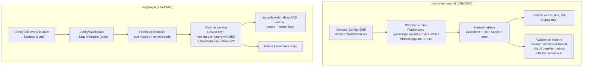

# The watchman branch against v2@origin

## What this is for

The watchman line was last freshened onto `43d09b9d` on 2026-09-01. In the four
days since, two things happened at once: **this branch built the root-scoped
Watchman backend and its acquisition/recovery stack on top of that base, and
upstream `v2` rewrote the exact same seam** — the watcher substrate and the
config watch owner — from underneath it. Neither side knew about the other.
Today both lines have moved far enough that the question "how do we get back
together with v2" needs a map before it needs a decision.

This document is that map. It records:

1. the divergence geometry (base, tips, counts, and how the conflict was
   measured),
2. the concrete three-way merge conflict, file by file and hunk by hunk, with
   an interpretation of what each side is *saying*,
3. the two architectures the conflict exposes — where they independently
   converged on the same fix in different idioms, and where they genuinely
   diverge,
4. what has moved since [`upstream-delta0`](/.design/watchman/upstream-delta0.glm53h.md)
   was written, and
5. the realistic paths forward, with per-file resolution rules for a freshen.

It is an orientation resource, not a decision record. Nothing here supersedes
the recorded human decisions in
[`vision0`](/.design/watchman/vision0.gpt56s.md) or the current execution
authority in
[`static-selection-handoff`](/.design/watchman/static-selection-handoff.unknown.md).

## The geometry

| | Commit | Date | Position |
| --- | --- | --- | --- |
| Fork base | [`43d09b9d`](https://github.com/anomalyco/opencode/commit/43d09b9d75ad) "fix(server): await plugin activation when checking updates" | 2026-09-01 11:16 -0400 | Last common ancestor of both lines |
| Ours (watchman) | `b46a60bd` (`umvulzmw`, "docs(watchman): document acquisition limit plumbing") + working copy `ytqsxltr` (adds [`contract0`](/.design/watchman/contract0.glm53max.md)) | 2026-09-04 09:20 → 09-05 | **94 commits** past the base; 71 files, +26,694/−316 (most of it this design corpus) |
| Theirs (v2@origin) | [`21adcb49`](https://github.com/anomalyco/opencode/commit/21adcb4969f3) (#47437 "fix(console): route enterprise forms to Chatwoot") | 2026-09-05 00:05 -0400 | **253 commits** past the base; 1189 files, +49,554/−25,127 repo-wide |

Both sides rewrote the watcher substrate **from the same starting point**. The
base's shape, for reference: `WatchInput` had only `file` and `directory`
kinds; `Watcher.Options` was `{ enabled }` only; `NativeInterface.subscribe`
took `{type, target, ignore, publish}` and returned
`Effect<Subscription | undefined>` with no error channel; Config owned a
monolithic `discover()` plus an entry-derived **watch-once** reconcile loop (a
`Set<string>` of JSON keys, no removal).

### How the conflict was measured

A scratch jj workspace (`wm-merge-probe`) was created from the working-copy
tip, a throwaway merge `jj new <ours-described-tip> v2@origin` was made there,
and `jj resolve --list` plus the materialized conflict hunks were read. Every
conflict is 2-sided (ours vs theirs). The probe was abandoned afterward; no
commit on either real line was touched. To reproduce:

```sh
jj workspace add <scratch> -r @
cd <scratch> && jj new umvulzmwxkwv v2@origin && jj resolve --list
```

### The overlap

Ten files were modified on both sides. **Five conflict outright**; five merge
textually clean but still need semantic review (below).

| File | Conflict | Character |
| --- | --- | --- |
| `packages/core/src/filesystem/watcher.ts` | 8 hunks | The watcher contract itself |
| `packages/core/src/config.ts` | 7 hunks | Two desired-state architectures |
| `packages/core/src/config/plugin/skill.ts` | 1 hunk | Watch-owner idiom (interests vs FiberMap) |
| `packages/core/test/location-layer.test.ts` | 2 hunks | Both sides added different tests in one region — keep both |
| `AGENTS.md` | 1 hunk | We deleted it (190 lines, contamination flagged by [`review-ownership0`](/.design/watchman/review-ownership0.gpt56s.md)); upstream edited 2 lines — keep the deletion |

Textually clean, semantically loaded: `packages/core/test/filesystem/watcher.test.ts`
(upstream +249 lines pinning `onReady`/`entries` behavior, ours reworked for
the error channel — two test suites encoding **contradictory API contracts**),
`packages/core/test/config/config.test.ts`, `packages/server/src/routes.ts`
(our watchman options wiring vs their handler rework), `packages/cli/src/server-process.ts`
(our env plumbing survived), `packages/core/package.json` + `bun.lock` (our
`@superbfowle/fb-watchman-esm` dependency).

## Where each side moved

### Ours: the backend-contract line

The 94 commits fall into two strata. The design corpus (this `.design/watchman/`
tree, ~20k lines) is one. The code strata, in order:

- **Ignore widening** — `filesystem/ignore.ts` `PATTERNS`: `.jj`, vcs dirs,
  venvs, build outputs, logs, and both forms of Watchman cookie files
  (`**/.watchman-cookie-*`, root-level), wired into the watch owners.
- **The watchman backend** — `watcher/watchman/`: `client.ts` (raw client
  factory, binary override), `root.ts` (per-root registry), `schema.ts`
  (typed `WatchmanError`), `acquisition.ts` (admission-controlled coordinator:
  concurrency limit default 4, retry backoff, a circuit breaker with
  closed/open/half-open epochs, acquisition observations), `route.ts`
  (project-root vs exact routing), `metrics.ts` (channel metrics).
- **The watcher substrate extension** — `NativeInterface.subscribe` grew
  `placement` (project-root vs exact), a `fail` callback, a `Scope`
  requirement, and an error channel; the service stream became
  `Stream<Update, Error>`; `nativeLayer` parameterized by timeout; per-file
  `node:fs.watch` with error propagation into `fail`.
- **Source-owned interests** — `watcher/interests.ts` (`WatchInterests`:
  `ensure`/`reconcile`/`changes`, keyed by normalized input, with a typed
  failure change) and `watcher/internal.ts` (`WatcherInternal.attach/read`:
  symbol-keyed `ready` callback + `placement` metadata smuggled through
  `WatchInput`; `normalize`).
- **Process-global sharing** — one hoisted Watcher slice for all location
  graphs, pinned by a counting test in `location-layer.test.ts`.
- **Static selection + recovery** (the current execution authority) — strict
  `backend: watchman | parcel` selection, shared acquisition state, capability
  connection-loss classification, cursor recovery, acquisition-limit exposure
  through server options, routes, and CLI env plumbing.

### Theirs: the plan-reconciliation line

Of the 253 upstream commits, everything away from the seam (TUI, desktop, plugins
dialog, worktree UX, providers, i18n, docs) does not intersect us. Seven
commits do, all landing 09-01→09-03 — **after our fork point, during our
build window**:

| Date | Commit | What it did |
| --- | --- | --- |
| 09-01 | #46639 refactor(core): decouple plugins from config loading | Plugins read Config snapshots; shapes `skill.ts`'s surroundings |
| 09-02 | #46841 fix(core): discover project config once under symlinked paths | Discovery resolves symlinks once |
| 09-02 | #46874 fix(core): subscribe before debouncing config plugin updates | Ordering fix in plugin update path |
| 09-02 | #46840 test(core): route test watcher updates to matching watches | Test-layer routing |
| 09-02 | #46949 refactor(core): reconcile current watcher policy | LocationWatcher reads `policy.current()` per reconcile |
| 09-03 | #46925 fix(core): watch new config files and directories | **The big one**: new `config/discovery.ts` + `config/watch.ts`, rewritten `config.ts` reconcile, reworked `watcher.ts` (`entries` kind, `onReady`) |
| 09-03 | #47026 fix(core): detect new ecosystem config roots | Follow-up: `.claude`/`.agents` roots in the walk |

Since then — through the 82 commits from `43bd2a51` (#46963, the tip
[`upstream-delta0`](/.design/watchman/upstream-delta0.glm53h.md) assessed) to
today's `21adcb49` — **the seam is quiet**: `watcher.ts`, `config.ts`,
`config/discovery.ts`, `config/watch.ts`, and `skill.ts` are untouched. The
nearby movement is `config/plugin/worktree.ts` (new), `config/normalize.ts`,
`config.test.ts`, and `server/routes.ts` — two of which are in our overlap
set. The heat has moved to plugins/worktrees/TUI.

## The conflict, hunk by hunk

### `filesystem/watcher.ts` — the contract fight (8 hunks)

Four hunks are import/spelling noise. Four are load-bearing:

1. **`NativeInterface.subscribe` input.** Ours:
   `{type, target, ignore, placement, publish, fail}` returning
   `Effect<Subscription | undefined, Error, Scope>`. Theirs:
   `Target & {publish}` (Target now carries `names` for `entries` watches)
   returning `Effect<Subscription | undefined>`. These compose: the union
   input is `{type, target, ignore, names, placement, publish, fail}` and the
   union effect is `Effect<Sub | undefined, Error, Scope>`. The hunk *reads*
   like a signature fight but is really two orthogonal extensions colliding:
   ours adds a **failure/backend-contract axis**, theirs adds an **entries
   axis**.
2. **`Interface.subscribe`.** Ours: `(input) => Effect<Stream<Update, Error>>`
   — readiness travels hidden inside the input via `WatcherInternal.attach`
   metadata. Theirs: `(input, onReady?) => Effect<Stream<Update>>` — readiness
   is a public second parameter, run after `RcMap` acquisition resolves *and*
   after `PubSub.subscribe` attaches, before the stream is returned. Two
   idioms for the same scan-to-subscribe gap (see convergence table below).
3. **RcMap key.** Ours: `{type, target, ignore, placement}`. Theirs:
   `{type, target, ignore, names}`. Union key is trivially
   `{type, target, ignore, names, placement}` — but note the semantics differ:
   ours' `placement` routes directory watches onto Watchman root acquisition;
   theirs' `names` dedupes entries watches per name-set.
4. **`nativeLayer` routing.** Theirs now routes **both** `file` *and* `entries`
   to one non-recursive `node:fs.watch` on the parent directory, filtered by
   name set — which makes file watches natively survive deletion/recreation of
   the target. Ours routes `file` to `fs.watch(dirname)` with **error
   propagation** (`input.fail` on watcher `error` events) and keeps
   directories on the (Watchman-or-Parcel) `subscribeDirectory` path with
   timeout and interrupt-cleanup. Merging means adopting their entries
   routing *and* keeping the `fail` propagation through it.

Ours also carries `Options` (`backend`, `subscribeTimeoutMs`, the `watchman`
sub-struct) which upstream never touched — that survives any merge untouched.

### `config.ts` — two desired-state architectures (7 hunks)

This is the deepest conflict, and it is **architectural**, not textual.

**Ours** kept the base's monolithic `discover()` and layered source-owned
interests on top: mutable `fileTargets`/`directoryTargets` sets maintained
during discovery; a `primary()` computation that resolves each directory via
`realPath` (a symlink becomes a directory watch on the resolved target *plus*
a file watch on the link itself); reload runs `ensure(base) → discover →
ensure(desired) → reconcile`; and the update loop is the `interests.changes`
stream with a failure-recovery circuit (`catch → log → reload → resubscribe`).

**Theirs** split discovery from loading and made the watch plan **pure**:
`ConfigDiscovery.discover(options)` returns a `Sources` record
(`global`, `explicit`, `direct`, `project` with presence flags, `claude`,
`agents` — including roots that do not exist yet); `load(sources)` assembles
entries; `ConfigWatch.plan(sources)` derives the complete desired watch set —
present directories as directory watches, plus **parent-directory `entries`
watches for every watched file** "so deletion/recreation is observable";
reconcile diffs plan against a `FiberMap` (removes stale keys — the base's
watch-once set never removed), subscribes new targets with
`onReady = requestReload`; updates publish to the change feed and request a
reload through an eagerly-subscribed `PubSub.sliding(1)`, debounced 100 ms.

In one sentence: **ours made the owners declarative and the substrate smart;
theirs made discovery/plan pure and the substrate stayed dumb.** Our
`WatchInterests` is a generic desired-state executor owned by each source;
their `ConfigWatch.plan` is a per-owner pure function driving a generic
FiberMap executor. These are the same shape pointed at different owners —
which is exactly the `WatchSet` generalization
[`upstream-delta0`](/.design/watchman/upstream-delta0.glm53h.md) recommended
(adaptation 2).

### `config/plugin/skill.ts` — one hunk, two idioms

Ours: `watch(desired, directory, type)` pushes normalized inputs into a
`desired` array and calls `interests.ensure`, with snapshots keyed by
`WatchInterests.Input[]`. Theirs: `watch(directory, type)` (narrower type —
no `entries` in the plugin) calls `watcher.subscribe` directly and parks the
stream in a `FiberMap` keyed `` `${type}:${target}` `` with `onlyIfMissing`,
keeping the `firstMissing` ancestor-sentinel and symlink double-watch. Same
convergence, different executor.

### `location-layer.test.ts` — no real conflict

We added the "one Watcher service across distinct location graphs" counting
test (pins the hoisted global slice); upstream added repair/retry tests for
failed location initialization in the same import block and describe region.
Keep both suites; the import hunk resolves by union.

### `AGENTS.md`

Deletion (ours) vs 2-line edit (theirs). Keep the deletion — it was a
deliberate contamination fix, and the edit is cosmetic.

## The two architectures, side by side



| Concern | watchman branch | v2@origin |
| --- | --- | --- |
| Watch kinds | `file`, `directory` | `file`, `entries`, `directory` |
| File routing | `fs.watch(dirname)` per file, errors propagated | one `fs.watch(parent)` filtered by names; survives target recreation |
| Readiness | hidden metadata `ready` callback, fires after acquisition per subscriber; synthetic update into the owner's queue | public `onReady` param, runs after acquisition **and** subscriber attach; triggers a rescan of truth |
| Failure model | `Stream<Update, Error>`, `fail` callback, `Deferred` interruption, acquisition circuit breaker, capability-loss classification, cursor recovery | log-and-continue; unsupported backends end silently as `Stream.empty` |
| Desired state | owner-declared `WatchInterests.ensure/reconcile` + mutable target sets + `primary()` | pure `ConfigWatch.plan(Sources)` + `FiberMap` add/remove |
| Discovery | monolithic `discover()` in the Config layer (extended) | split `ConfigDiscovery.discover → Sources`; `load(sources)` |
| Deletion/recreation | realPath double-watch (dir + symlink file), ancestor sentinels in Skill | parent `entries` watches derived by the plan |
| Sharing | RcMap + **one hoisted Watcher per process** across location graphs | RcMap per location graph; per-subscriber `PubSub.subscribe` streams |
| Backend | static selection `watchman \| parcel`, options + env + server route surface | Parcel only; `Options = { enabled }` |
| Ignores | widened `Ignore.PATTERNS` (vcs dirs, venvs, logs, watchman cookies) | `["node_modules", ".git", "**/{node_modules,.git}/**"]` |
| Watchman | the whole point: root supervisor, admission limits, metrics, recovery | none (UI icon assets only) |

### Where we independently converged

Same problem, two idioms — this is the encouraging half of the conflict,
because it means the merge is translation, not reinvention:

| Problem | Our idiom | Their idiom |
| --- | --- | --- |
| Writes lost between scan and subscribe | `WatcherInternal.attach({ready})` metadata → synthetic update | `onReady` param → `requestReload` rescan |
| Watching files that may not exist yet | ancestor sentinels (`firstMissing`), per-file watches | parent `entries` watch covers absent siblings |
| Deletion/recreation of roots | symlink realPath double-watch | plan-derived parent watches |
| One OS watch per equivalent logical watch | RcMap structural keys + `placement` | RcMap structural keys + `names` |
| Stale watches after config changes | `interests.reconcile(desired)` removes | FiberMap diff removes stale keys |
| Reload storms | debounce on `interests.changes` | `PubSub.sliding(1)` + 100 ms debounce, eagerly subscribed |

The pre-attach drop window analysis in
[`upstream-delta0`](/.design/watchman/upstream-delta0.glm53h.md) still holds:
their callback fires per-subscriber after attach (multi-subscriber safe by
construction); our synthetic update goes straight into the owner's queue
(stream-native, and the seam [`typed-watcher0`](/.design/watchman/typed-watcher0.glm53.md)
wants to formalize). Neither is wrong; only one can be the merge result.

### What only one side has

**Only ours:** the failure channel end-to-end, Watchman itself (registry,
admission control, circuit breaker, metrics, cursor recovery, binary
override), backend selection with an options surface (server routes + CLI
env), process-global watcher sharing across locations, and the widened ignore
vocabulary (including daemon cookie files — which matter the moment a
Watchman daemon touches watched roots).

**Only theirs:** the `entries` kind and parent-watch sentinels, the
discovery/plan split (`ConfigDiscovery` + `ConfigWatch.plan`), FiberMap
reconciliation with removal, per-subscriber stream buffering
(`Stream.fromSubscription`), the plugin/config decoupling (#46639), and a
large freshly-pinned test surface (`watch.test.ts`, `reload.test.ts`,
`watcher.test.ts` scenarios) that any merge must keep green.

## What changed since upstream-delta0

[`upstream-delta0`](/.design/watchman/upstream-delta0.glm53h.md) assessed
through `43bd2a51` (09-03, #46963). Since then: +82 upstream commits, **zero**
touching `watcher.ts` / `config.ts` / `config/discovery.ts` /
`config/watch.ts` / `skill.ts`. Its per-seam findings and its adaptations 2–4
(generalize `ConfigWatch` into `WatchSet`; replace `onReady` with typed
invalidation while preserving pinned outcomes; model `entries`) remain the
correct merge doctrine, now with the added fact that the seam has been stable
for two days — the cheapest freshen window since the branch diverged. The
near-sean churn is plugins/worktrees (`worktree.ts` plugin, `routes.ts`), and
both `routes.ts` and `config.test.ts` (overlap files) moved again, so the
textual-clean/semantic-broken risk concentrates there.

## Paths forward

Three strategies, not mutually exclusive. They differ in *when* the 5-file
collision is paid down and *who* absorbs whose idiom.

### A. Freshen now: rebase onto `v2@origin`, resolve deliberately

The classic move here (the corpus's refresh history — `watchman-20260901`
through `watchman-20260903` — shows the workflow is routine). The conflict is
5 files, ~2 days of careful work, concentrated in `watcher.ts` + `config.ts`.
Per-file resolution rules that respect both the corpus's doctrine and
upstream's pinned tests:

| File | Rule |
| --- | --- |
| `watcher.ts` | Adopt upstream's `entries` kind, `names` in the RcMap key, and parent-directory routing for files+entries **with our `fail` propagation threaded through it**. Keep our `placement` in the key, our `Scope`/error channel on `NativeInterface`, our `Options`. Union contract: `{type, target, ignore, names, placement, publish, fail}` → `Effect<Sub \| undefined, Error, Scope>`. |
| `config.ts` | Adopt upstream's `ConfigDiscovery` + `ConfigWatch.plan` + FiberMap reconcile as the substrate. Re-express `WatchInterests` as the generic plan executor (the `WatchSet` step): Config keeps a plan function, interests become the shared executor, our failure-recovery loop wraps theirs' sliding reloads. Keep our widened ignores inside the plan's directory targets. Decide `onReady` vs metadata-`ready` once, at the substrate level, for all owners. |
| `skill.ts` | Take upstream's narrower shape; port our `desired`/snapshot bookkeeping onto whichever executor `config.ts` chose. Keep `firstMissing`. |
| `location-layer.test.ts` | Keep both suites (union imports). |
| `AGENTS.md` | Keep our deletion. |
| tests / routes / lockfile | Adopt upstream's pinned scenarios as the keep-green floor; re-point our tests at the union contract; verify `fb-watchman-esm` survives the `bun.lock` merge. |

Pay particular attention to the two readiness idioms meeting in one substrate:
if `onReady` survives as the public parameter, our synthetic-update path and
the Watchman recovery invalidations need to route through it; if metadata
survives, upstream's `requestReload` outcome must stay observable. Either way
the pinned behavior is "a write made before attachment is recovered" —
[`upstream-delta0`](/.design/watchman/upstream-delta0.glm53h.md) adaptation 3
already specifies this as convergence-scenario seeds.

### B. Finish the static-selection line first, freshen once at the end

The recorded execution authority
([`static-selection-handoff`](/.design/watchman/static-selection-handoff.unknown.md))
is completing acquisition convergence and deleting both Watchman→Parcel
fallbacks on the current base. Option B finishes that, then pays the merge
once. Rationale: the seam has been quiet for two days; our remaining work is
inside `watcher/` (no overlap with upstream). Risk: every day grows the
test-surface that must be re-pointed, `routes.ts`/`config.test.ts` are actively
moving, and the merge will then interrupt a *just-completed* line rather than
a mid-flight one — the same total conflict, later, against a possibly-hotter
seam.

### C. Split the branch: upstreamable substrate vs downstream backend

The corpus has repeatedly recommended upstreaming the generic pieces
(carrier1's stated freedom; `upstream-delta0` adaptation 2; the nav0 route).
Concretely: peel off (i) entries-adoption + the union Native contract, (ii)
the `WatchSet` generalization of `ConfigWatch.plan`, and (iii) the readiness
unification — as small upstreamable proposals against current `v2` — while the
Watchman registry, supervisor, metrics, and backend selection stay downstream.
This shrinks every future freshen to near-zero and matches where upstream is
already investing. Cost: it front-loads the hardest design decision (the
readiness/failure contract) into upstream-reviewable form, and it is slower to
a runnable merged tree than A.

### The recommendation this doc leans toward

A and C compose: freshen onto `v2@origin` now (A) **using C's shapes** — adopt
upstream's discovery/plan/entries substrate, keep the Watchman backend and
failure channel downstream, and leave the merged `config.ts`/`watcher.ts` in a
state where the `WatchSet` extraction and the typed-invalidation replacement
of `onReady` are the next two upstreamable slices. B's remaining work
(fallback deletion) is orthogonal to the merge and can proceed on either side
of it. Whatever is chosen, record it as a decision against
[`vision0`](/.design/watchman/vision0.gpt56s.md) — this document intentionally
does not decide.

## Open questions the merge forces

1. **Readiness contract.** Public `onReady` parameter, hidden metadata
   callback, or the typed invalidation member
   ([`typed-watcher0`](/.design/watchman/typed-watcher0.glm53.md)) as the
   end-state with one of the former as bridge?
2. **Desired-state ownership.** Does `WatchInterests` become the generic
   executor of upstream-style plans (owner keeps a pure `plan` function), or
   do owners keep declaring inputs directly? This decides whether
   `ConfigWatch.plan` survives as Config-specific sugar or dissolves.
3. **`entries` vs per-file watches for owners other than Config.** Upstream
   already routes Skill/entrypoint files through parent entries watches in
   the plan; our Skill idiom still declares file interests.
4. **Placement in a post-merge key.** `placement` currently feeds Watchman
   root routing; with upstream's `names` in the same key, does placement
   belong in the RcMap key at all, or in the backend's routing table?
5. **Ignore vocabulary.** Whose list wins for directory watches — upstream's
   minimal pair or our `Ignore.PATTERNS`? (Ours exists partly *because* of
   daemon cookie files; Parcel-only users do not need them, but they do not
   hurt.)

## Cross-references

- [`upstream-delta0.glm53h.md`](/.design/watchman/upstream-delta0.glm53h.md) —
  the direct predecessor: what the seam rewrite means for the carrier
  architecture, with the per-seam verdicts this doc's merge rules implement.
  Its assessed tip (`43bd2a51`) and this doc's (`21adcb49`) bracket a quiet
  seam.
- [`static-selection-handoff.unknown.md`](/.design/watchman/static-selection-handoff.unknown.md) —
  current execution authority; option B is "finish this, then merge".
- [`rebuild-assessment0.gpt56solxh.md`](/.design/watchman/rebuild-assessment0.gpt56solxh.md) —
  the scope-parking recommendation that keeps this merge narrow (substrate +
  backend) rather than a carrier rebuild.
- [`carrier1.gpt56s.md`](/.design/watchman/carrier1.gpt56s.md) and
  [`carrier1-review0.gpt56sol.md`](/.design/watchman/carrier1-review0.gpt56sol.md) —
  the remake architecture whose CB1–CB7 blockers still gate any deeper
  unification than this doc contemplates.
- [`typed-watcher0.glm53.md`](/.design/watchman/typed-watcher0.glm53.md) —
  the deferred end-state for the readiness/invalidation question the merge
  forces at bridge level.
- [`review-ownership0.gpt56s.md`](/.design/watchman/review-ownership0.gpt56s.md) —
  the ownership audit; its hotspot inventory needs this doc's additions
  (`config/discovery.ts`, `config/watch.ts`, the FiberMap owners) regardless
  of which path is chosen.
- [`README.md`](/.design/watchman/README.md) — corpus index; this file should
  be slotted next to `upstream-delta0` in the chronology (2026-09-05).
- Upstream commits:
  [`43d09b9d`](https://github.com/anomalyco/opencode/commit/43d09b9d75ad)
  (fork base) ·
  [`24f6cb51c8`](https://github.com/anomalyco/opencode/commit/24f6cb51c85139378f3f39688c8596c003da60d4)
  (#46925, the seam rewrite) ·
  [`43bd2a51`](https://github.com/anomalyco/opencode/commit/43bd2a516ba16ccea6c867cf533718bd57288ec6)
  (prior assessed tip) ·
  [`21adcb49`](https://github.com/anomalyco/opencode/commit/21adcb4969f3)
  (current v2@origin).
