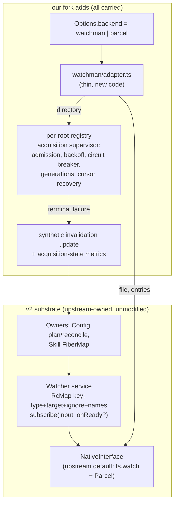

# Re-adding Watchman as a backend on the v2 substrate

## What this is for

[`v2-readd0`](/.design/watchman/v2-readd/v2-readd0.glm53max.md) recommended the
merge-based freshen (Position 1: preserve our substrate contract, pay a
standing fork tax). The human direction is **Position 2**: re-add Watchman
*on* upstream's substrate — a new line off `v2@origin`, ambitious in shape,
carrying every proven behavior across. This document supersedes readd0's
strategy; its Phase 0 pre-flight, verification ladder, and risk thinking are
inherited.

The sizing that justifies the ambition, from this morning's measurement:

| Surface | Size | Upstream conflict |
| --- | --- | --- |
| Our Watchman backend (`watcher/watchman/*`, interests, internal) | 1,659 lines, ~10 files | **zero** — all-new files |
| Our backend tests | 1,308 lines | **zero** |
| The contested substrate (`watcher.ts`, `config.ts`, `skill.ts`) | 962 lines ours vs ~733 theirs | total — both sides rewrote |

Eighty-five percent of what we built never conflicts. Upstream's rewrite
delivered the *generic* half of our architecture — pure plans, generic
reconcile with removal, `entries` parent watches, public `onReady` — in a
shape they maintain and test. Position 2 says: stop competing with that, and
become the thing upstream's substrate is missing: **a serious backend.**

The end state this plan aims at:

> Our fork of OpenCode differs from `v2` by exactly: one backend module
> (`watcher/watchman/`), its options surface, its ignore vocabulary, and its
> tests. Every future freshen is a plain pull. Three named proposals
> (`typed invalidation`, `WatchSet` executor, ignore plumbing) graduate
> upstream from this proving ground.

This is also the corpus's own doctrine applied early:
[`vision0`](/.design/watchman/vision0.gpt56s.md)'s correction model says
**one failure owner** — the supervisor, not every owner. Position 2 realizes
it cleanly: upstream owns desired state; the Watchman supervisor owns
failure; owners see updates. And the handoff's clean-carrier rule — "preserve
upstream `ConfigWatch.plan`, `entries`, and readiness outcomes; re-author
from behavior proven on the current line, not the patch sequence" — is
exactly this plan, executed now instead of after a merge.

## Architecture

Four pillars:

1. **One adapter is the only new substrate-level code.**
   `watcher/watchman/adapter.ts` — an evolution of today's `backend.ts` to
   upstream's contract — implements `NativeInterface.subscribe(input,
   publish)` exactly as upstream spells it: no `Scope`, no `fail` parameter,
   no error channel. `file` and `entries` inputs delegate to upstream's Node
   native layer unchanged; `directory` inputs map to a root intent
   (project-root vs exact — carried routing) and go to the registry. If the
   adapter is correct, upstream cannot tell it apart from a very good
   filesystem.
2. **Failure loudness lives inside the backend, not the contract.** Detailed
   below — this is the design answer to the question that gated Position 2.
3. **Upstream's ownership machinery is adopted whole.** `ConfigDiscovery`,
   `ConfigWatch.plan`, FiberMap reconcile, the sliding debounced reload, the
   Skill plugin's shape — all run unmodified. Our `WatchInterests` and
   hidden-metadata readiness **retire** (kept on the bookmarked old line).
   The owner-side recovery loop we built (`catch → log → reload →
   resubscribe`) **dissolves**: invalidation flows through upstream's
   ordinary reload path, which is strictly simpler and is precisely the
   B2-compatible move — invalidation as an ordinary update, no new substrate
   member. B3 (typed invalidation) stays deferred, exactly as recorded.
4. **Readiness is `onReady`, embraced.** The adapter's directory subscription
   completes acquisition before returning its `Subscription`, so upstream's
   `onReady` (which runs after RcMap acquisition *and* subscriber attach)
   means "the Watchman clock is live." Post-outage recovery publishes the
   same synthetic invalidation, so the pinned outcome — *a write made before
   attach or during an outage is recovered* — holds on both the Node path
   (upstream's pinned tests) and the Watchman path (our carried tests).

## The failure-loudness design

Upstream's substrate is log-and-continue: an unsupported backend returns
`undefined` and subscriber streams end silently. Our review corpus classified
silent staleness as *the* defect; static selection exists to prevent it. The
crucial observation about upstream's architecture:

> **Ending a stream is silent in their reconcile.** A completed fiber leaves
> the FiberMap quietly; nothing respawns it until the next plan diff. So
> "end the stream on terminal failure" — the loud-looking move — is the
> *quiet* move in their world. The loud move is the opposite: **publish an
> invalidation and persist.**

Concretely, every terminal path in the backend produces:

1. **A synthetic update on the watched target** — owners treat it as "the
   watched thing changed," trigger their ordinary reload, and rescan truth
   from the filesystem. State converges even with a dead event stream:
   correctness is preserved, only efficiency degrades. This is the same move
   as our old metadata-`ready` synthetic update, repurposed from readiness
   to invalidation.
2. **Persistent subscription through outages** — the acquisition supervisor
   (carried unchanged) holds and retries retained interests with bounded
   jittered backoff and the circuit breaker; interests are reattached on
   generation recovery, each reattach publishing the invalidation. We never
   end subscriber streams due to backend trouble.
3. **Observable acquisition state** — the carried metrics channel (epochs,
   admission counts, breaker state) and logs keep operators seeing what
   owners are compensating for.

Terminal-path matrix the spike must demonstrate (each row: ≥1 invalidation
published + observable state, stream still alive, Parcel never invoked):

| Terminal path | Loudness mechanism |
| --- | --- |
| Adapter construction failure at startup (backend = watchman) | Layer construction `orDie`s — startup fails visibly; never falls back |
| Initial acquisition exhausts terminal classification | Interest stays pending under retry; invalidation on each terminal epoch |
| Established generation lost | Shared root retry (carried); invalidation on loss and on reattach |
| Subscription-local invalid target | That interest fails visibly; siblings unaffected (carried isolation) |
| Owner removes demand during outage | Retry demand stops; no resurrection (carried) |

## The carry table

Nothing we proved is silently dropped. Every capability from the old line
maps to a home on the new line:

| From our line | Position-2 home |
| --- | --- |
| Per-root registry, connection controller, generations, command serialization (`root.ts`) | Carried verbatim — zero upstream contact |
| Acquisition coordinator: admission limit (default 4), retry backoff, circuit breaker (`acquisition.ts`) | Carried verbatim |
| Cursor recovery, capability connection-loss classification | Carried verbatim; surfaced via invalidation + metrics instead of the retired error channel |
| Client factory, binary override, typed `WatchmanError` (`client.ts`, `schema.ts`) | Carried verbatim |
| Project-root vs exact routing (`route.ts`) | Carried; `placement` becomes adapter-internal routing metadata (see retire list) |
| Channel metrics (`metrics.ts`, [`metrics0`](/.design/watchman/metrics0.glm53.md) guide) | Carried verbatim |
| Static selection `watchman \| parcel`, both fallbacks deleted | Carried — selection chooses which native composition the Watcher layer builds; the parcel path *is* upstream's default, untouched |
| Options surface: `backend`, `watchman.{commandTimeoutMs, maxConcurrentAcquisitions, retryBaseMs, retryCapMs, binary, metricsIntervalMs, metricsMode}` | Carried as an additive key under upstream's `Options` |
| Server routes + CLI env plumbing for acquisition limits | Carried; re-verified against upstream's reworked `routes.ts` handlers |
| Widened `Ignore.PATTERNS` (vcs dirs, venvs, build outputs, logs, **daemon cookie files**) | Carried; fed to directory watches. Upstream's plan hardcodes its minimal pair in `config/watch.ts` — our list overrides there (small carried diff) until the ignore-plumbing proposal lands |
| Process-global sharing (one Watcher/registry across location graphs) | Carried — the adapter+registry layer is constructed once per process (hoisted), every location-graph Watcher composes it; the counting test pins it |
| `subscribeTimeoutMs` (parcel acquisition deadline) | Carried where it still applies to the wrapped Node/Parcel native |
| Strict-selection, outage, isolation, removal test suites | Carried — they target the registry/adapter directly and survive the contract change nearly unchanged |
| `watchman-live.test.ts` | Carried unchanged |
| `@superbfowle/fb-watchman-esm` dependency | Carried (lockfile regenerated under Bun 1.4.2) |
| `AGENTS.md` deletion | Carried (trivial) |
| RealPath/symlink double-watch in Config | **Superseded** by upstream's discovery-resolves-symlinks-once (#46841) + `entries` parent watches — the outcome is preserved by their mechanism |
| Ancestor sentinels in Skill (`firstMissing`) | **Superseded** by plan-derived parent `entries` watches |
| Substrate error channel (`Stream<Update, Error>`, `fail`, `Scope`) | **Retired** — replaced by the loudness design above; lives on as the upstreamable typed-invalidation proposal (B3 end-state per [`typed-watcher0`](/.design/watchman/typed-watcher0.glm53.md)) |
| `WatchInterests` / `WatcherInternal` metadata | **Retired** from this fork (bookmarked on `watchman-20260905`); returns as the upstreamable `WatchSet` proposal if a second owner ever needs complete-plan lifecycle |
| Owner-side recovery loop in Config | **Dissolved** into upstream's reload path + invalidation |
| Docs corpus (`.design/watchman/`) | Travels with the branch regardless |

## Execution

### Gate 0 — the loudness spike (do this first, decide nothing else until it passes)

Scratch workspace off `v2@origin` (`.test-agent/` or a throwaway `jj
workspace`): copy `watcher/watchman/*` across, write the adapter skeleton
against upstream's contract, and demonstrate the terminal-path matrix's
first three rows with real tests. **Exit criterion:** a selected-watchman
directory whose acquisition terminally fails produces an invalidation the
owner's ordinary reload observes, the stream survives, Parcel is never
invoked, and upstream's `watcher.test.ts` still passes unmodified next to
it. If the spike fails, Position 2's premise fails — fall back to readd0's
merge with the evidence in hand.

### The commit ladder (new line, `jj new v2@origin`, bookmark `watchman-v2`)

Each commit independently green (`bun typecheck` + named suites from
`packages/core`; never the repo-root `test` script):

1. `feat(core): carry Watchman backend onto v2 substrate` — copy the module
   verbatim, add `adapter.ts` (evolved `backend.ts`: delegate file/entries to
   the wrapped native, directories to the registry, upstream's input/return
   contract, placement as adapter-internal routing). Registry tests green.
2. `feat(core): select the Watchman backend statically` — `Options.backend`
   wiring: `watchman` composes adapter-over-native and `orDie`s on
   construction; absent/`parcel` is upstream's layer untouched;
   `enabled: false` preserved. Loudness stub in place (invalidation on
   terminal epochs).
3. `feat(core): gate readiness and recovery through onReady` —
   acquisition-before-Subscription, invalidation on generation loss and
   reattach; the "write during outage is recovered" test carried and green.
4. `feat(core): expose Watchman acquisition surface` — options sub-struct,
   server routes against upstream's reworked handlers, CLI env plumbing;
   carried route/env tests green.
5. `test(core): pin Watchman adapter loudness and selection` — the full
   terminal-path matrix; strict-selection assertions ("Parcel never called")
   re-pointed at the adapter; the process-global sharing counting test
   re-pinned.
6. `docs(watchman): record the backend re-add` — maintenance update, this
   plan's acceptance recorded against [`vision0`](/.design/watchman/vision0.gpt56s.md),
   README index.

### Verification ladder

1. `bun typecheck` (core).
2. **Upstream's suites, unmodified** — `watcher.test.ts`, the config/reload
   suites, `location-layer.test.ts`. This is the floor and the point: their
   tests are now *our* substrate tests.
3. Our carried suites — registry, acquisition, metrics, live (daemon
   optional: `OPENCODE_WATCHMAN_LIVE=1`).
4. Server + CLI wiring tests.
5. Behavior acceptance (mostly covered by 2+3, checked explicitly):
   write-before-attach recovered; root deletion/recreation observed
   (Node-parent and Watchman paths); stale watches removed after config
   change (their FiberMap); reload storms stay debounced; one registry per
   process across location graphs.

### After green — the ambitious part

The new line is the proving ground for three upstream proposals, each
shrinking the fork further. In priority order:

1. **Typed invalidation member** on `Watcher.Update` (the B3 end-state,
   [`typed-watcher0`](/.design/watchman/typed-watcher0.glm53.md)) — replaces
   the synthetic-update convention with a first-class member; our B2
   synthetic update is deliberately shaped so migration deletes one
   classification site.
2. **`WatchSet` executor generalization** of their FiberMap reconcile —
   carries our failure-attribution and sibling-isolation semantics to every
   owner ([`upstream-delta0`](/.design/watchman/upstream-delta0.glm53h.md)
   adaptation 2).
3. **Ignore vocabulary plumbing** — plan-level ignore injection instead of
   the hardcoded minimal pair, which also carries our cookie-file needs
   upstream.

Then resume the authority sequence's remaining steps (fresh-clock recovery
with explicit invalidation; metrics/option trimming) on the new line — they
are unchanged in substance and now live entirely inside the backend.

## Guardrails

- Do not push; the human pushes.
- Do not modify upstream's `watcher.ts`, `config.ts`, `discovery.ts`,
  `watch.ts`, `skill.ts` beyond the carried diffs named in the carry table
  (ignores in the plan; additive Options key). If a change feels necessary,
  it is a proposal, not a fork edit — record it here first.
- The old line stays bookmarked (`watchman-20260905`); retire nothing by
  deletion, only by supersession.
- `contract0.glm53max.md` stays uncommitted in the working copy unless the
  human says otherwise.
- B2 boundary holds: no typed invalidation member in-fork; B3 moves only
  through upstream acceptance.
- No carrier/VCS/Profile R/G5 imports; no new design wave — this plan is
  the recorded strategy, amendments go through the human.

## Definition of done

- A line off `v2@origin` (current tip at execution time, re-probed) where
  `backend: watchman` end-to-end works: strict selection, files/entries on
  Node, directories through the per-root supervisor with admission, breaker,
  and cursor recovery; construction failures kill startup visibly.
- Upstream's substrate tests pass **unmodified**.
- The terminal-path matrix is pinned green; no path reaches Parcel under
  watchman selection; no path ends a subscriber stream silently.
- Options/routes/CLI surface live; `fb-watchman-esm` in the regenerated
  lockfile; process-global registry pinned by test; ignores (incl. cookie
  files) in effect.
- `jj diff v2@origin..@` touches only: `watcher/watchman/**`, the adapter,
  ignore patterns, the Options key, routes/CLI wiring, tests, docs —
  *the fork-surface audit is the acceptance*.
- Acceptance recorded against [`vision0`](/.design/watchman/vision0.gpt56s.md).

## Risks

| Risk | Mitigation |
| --- | --- |
| Synthetic invalidation misses a terminal path → silent staleness regress | The matrix is the spike's exit criterion and commit 5's test suite; every registry terminal state maps to a named row |
| Upstream changes the native contract again | The adapter is one thin file against a small surface; spike is re-runnable; their pinned tests fail loudly if semantics shift |
| `routes.ts` rework collides with our wiring | Read the merged handlers, run server route tests at commit 4, not after |
| Per-location-graph construction spawns N registries/daemons | Hoisted layer construction, pinned by the carried counting test |
| Losing owner-side failure handling feels like a regression | The dissolve is deliberate (one-failure-owner doctrine); the reload-path invalidation is the compensation — pinned by acceptance seeds |
| Bun 1.4.2 / lockfile regeneration drops our dependency | Regenerate, verify `fb-watchman-esm` resolves, run live suite |
| Ambition creep into upstream-fork edits | The fork-surface audit in the DoD names every allowed touch point |

## Open questions (small, non-blocking)

1. Ignore override: patch the plan's hardcoded pair in-fork (one carried
   diff) vs. make it options-driven immediately (small upstreamable
   proposal). Recommend the carried diff first.
2. `metricsMode`/interval options naming under the new additive Options key
   — keep current names to minimize carried churn.
3. Adapter file name: `adapter.ts` vs keeping `backend.ts` for history
   continuity. Recommend `backend.ts` — it *is* the same component, evolved.

## Cross-references

- [`v2-readd0.glm53max.md`](/.design/watchman/v2-readd/v2-readd0.glm53max.md) — the
  Position-1 plan this supersedes; its pre-flight, probe recipe, and
  verification discipline are inherited; its five forced decisions are
  resolved here by adoption-instead-of-merge.
- [`v2-conflict0.glm53h.md`](/.design/watchman/v2-readd/v2-conflict0.glm53h.md) —
  the conflict map; Position 2 makes most of its hunk-by-hunk resolution
  moot by taking the substrate whole, which is the point.
- [`static-selection-handoff.unknown.md`](/.design/watchman/static-selection-handoff.unknown.md)
  — execution authority; this plan carries its target state verbatim and
  executes its clean-carrier doctrine early, with the human's direction
  recorded here as the authorizing decision.
- [`vision0.gpt56s.md`](/.design/watchman/vision0.gpt56s.md) — the B2 and
  one-failure-owner decisions this architecture operationalizes; B3 remains
  deferred and moves only through upstream.
- [`upstream-delta0.glm53h.md`](/.design/watchman/upstream-delta0.glm53h.md)
  — adaptations 2–4 become the post-green proposal ladder above.
- [`typed-watcher0.glm53.md`](/.design/watchman/typed-watcher0.glm53.md) —
  the end-state the synthetic-update bridge deliberately matches.
- [`maintenance.glm53.md`](/.design/watchman/maintenance.glm53.md) — the
  implemented-line record; its follow-ups (subscribe-response publication,
  OTEL export) carry unchanged.
- [`README.md`](/.design/watchman/README.md) — corpus index; this file is
  slotted as the active plan, superseding readd0's recommendation.
- Upstream commits:
  [`43d09b9d`](https://github.com/anomalyco/opencode/commit/43d09b9d75ad)
  (fork base) ·
  [`24f6cb51`](https://github.com/anomalyco/opencode/commit/24f6cb51c85139378f3f39688c8596c003da60d4)
  (#46925 seam rewrite) ·
  [`4306c07b`](https://github.com/anomalyco/opencode/commit/4306c07b340b)
  (v2@origin assessed).
