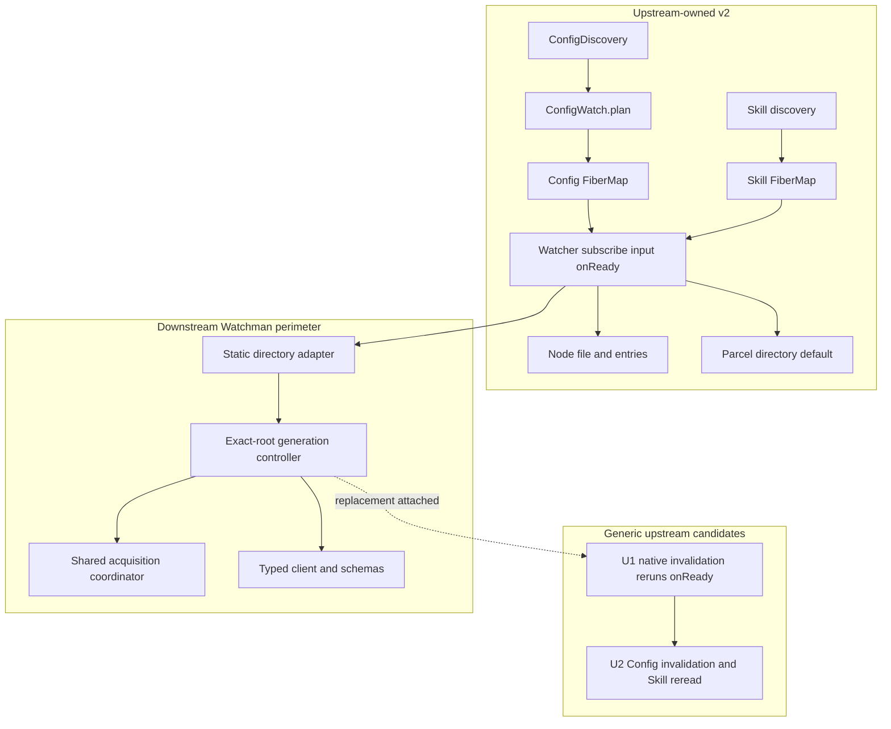
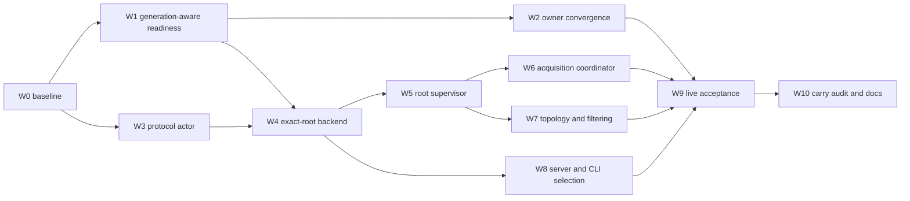

# Watchman v2 carry-first build work plan

## Directive

Build now. There is **no spike, prototype, or strategy fallback gate** in this
revision. The first implementation commit makes upstream readiness
generation-aware and proves it in the real watcher suite; the second closes
owner convergence; the remaining commits build the Watchman backend directly.

This work plan supersedes the “corrected spike” in
[`v2-readd2`](/.design/watchman/v2-readd/v2-readd2.gpt56solxh.md#corrected-spike), while
retaining that revision's carrier architecture:

1. adopt upstream's public `subscribe(input, onReady?)` API;
2. preserve upstream `WatchInput`, `entries`, `ConfigDiscovery`,
   `ConfigWatch.plan`, and owner `FiberMap`s;
3. make two generic upstream-candidate changes in isolated commits;
4. freshly author an exact-root Watchman directory backend;
5. use fresh-clock recovery and owner rereads;
6. keep Node on `file` and `entries`, Parcel as the default, and backend
   selection static; and
7. measure project-root consolidation later rather than smuggling placement
   through the current API.

The old feature branch remains a donor for behavior and tests. No implementation
commit is cherry-picked or merged from it. This follows the user's Position-2
direction from
[`v2-readd1`, lines 45-84](/.design/watchman/v2-readd/v2-readd1.glm53max.md#L45-L84),
but rejects that plan's synthetic-update and verbatim-carry mechanisms for the
reasons established in
[`v2-readd2`, lines 134-182](/.design/watchman/v2-readd/v2-readd2.gpt56solxh.md#L134-L182).

## Starting point and fixed scope

The assessed upstream is
[`4306c07b`](https://github.com/anomalyco/opencode/commit/4306c07b340b9a0504e65785f366d2793cd1b169).
Before implementation, refresh `v2@origin` and substitute the new exact commit
throughout the implementation record. The watcher/config seam has not changed
since upstream's `#46925` rewrite; the current relevant history remains the
discovery and `entries` work listed in
[`v2-conflict0`, lines 153-176](/.design/watchman/v2-readd/v2-conflict0.glm53h.md#L153-L176).

### Product delivered

> An opt-in Watchman-compatible backend for recursive directory observation,
> with root-local failure, bounded daemon acquisition, fresh-clock recovery,
> and authoritative owner convergence on the current upstream v2 substrate.

### Explicitly outside this build

- project-root consolidation or a root-hint API;
- public watcher-level invalidation/B3;
- generic `WatchSet` extraction;
- reactive Git/Hg/jj features;
- Watchwoman protocol, filtering, lifecycle, or deployment work;
- automatic backend fallback or promotion;
- custom console metrics and metrics-mode options;
- Watchman as the default; and
- daemon-root pruning or `watch-del`.

The scope separation follows
[`rebuild-assessment0`, lines 69-87](/.design/watchman/rebuild-assessment0.gpt56solxh.md#L69-L87):
the reliable backend is a product in its own right, while VCS, daemon expansion,
Profile R, and the clean assurance program are separate decisions.

## Upstream contract we build against

The implementation must preserve these upstream-owned facts.

### Logical watch vocabulary

Upstream defines `file`, `entries`, and `directory` in one stable union
([`watcher.ts`, lines 35-38](https://github.com/anomalyco/opencode/blob/4306c07b340b9a0504e65785f366d2793cd1b169/packages/core/src/filesystem/watcher.ts#L35-L38)).
The backend matrix is fixed:

| Input | Default selection | Watchman selection |
| --- | --- | --- |
| `file` | Node | Node |
| `entries` | Node | Node |
| `directory` | Parcel | Watchman |

Upstream already implements both non-recursive kinds through one parent
`node:fs.watch`, including named-entry filtering
([`watcher.ts`, lines 205-224](https://github.com/anomalyco/opencode/blob/4306c07b340b9a0504e65785f366d2793cd1b169/packages/core/src/filesystem/watcher.ts#L205-L224)).
Do not route either kind through Watchman.

### Readiness ordering

The physical `RcMap` acquires Native before a logical subscriber is installed
([`watcher.ts`, lines 93-126](https://github.com/anomalyco/opencode/blob/4306c07b340b9a0504e65785f366d2793cd1b169/packages/core/src/filesystem/watcher.ts#L93-L126)).
The logical path then subscribes to the physical PubSub and only afterward runs
`onReady`
([`watcher.ts`, lines 129-145](https://github.com/anomalyco/opencode/blob/4306c07b340b9a0504e65785f366d2793cd1b169/packages/core/src/filesystem/watcher.ts#L129-L145)).
Upstream's test proves an update emitted by `onReady` is observed rather than
dropped
([`watcher.test.ts`, lines 55-95](https://github.com/anomalyco/opencode/blob/4306c07b340b9a0504e65785f366d2793cd1b169/packages/core/test/filesystem/watcher.test.ts#L55-L95)).

We extend this ordering to every replacement generation; we do not replace it.

### Config desired state

`ConfigWatch.plan` already derives recursive roots and groups absent files/roots
into parent `entries` watches
([`config/watch.ts`, lines 8-38](https://github.com/anomalyco/opencode/blob/4306c07b340b9a0504e65785f366d2793cd1b169/packages/core/src/config/watch.ts#L8-L38)).
Config reconciles that map through a `FiberMap`, removes stale keys, and passes
its reload request as `onReady`
([`config.ts`, lines 236-258](https://github.com/anomalyco/opencode/blob/4306c07b340b9a0504e65785f366d2793cd1b169/packages/core/src/config.ts#L236-L258)).
Its eager sliding reload feed closes the synchronous readiness window
([`config.ts`, lines 260-280](https://github.com/anomalyco/opencode/blob/4306c07b340b9a0504e65785f366d2793cd1b169/packages/core/src/config.ts#L260-L280)).

Do not modify `config/discovery.ts` or `config/watch.ts`. Do not insert
`WatchInterests` beneath the planner. The owner remains upstream's Config
executor.

### Skill desired state

Skill already owns its `FiberMap`, resolves canonical source directories,
watches symlink spellings separately, and follows the first missing ancestor
([`skill.ts`, lines 25-75](https://github.com/anomalyco/opencode/blob/4306c07b340b9a0504e65785f366d2793cd1b169/packages/core/src/config/plugin/skill.ts#L25-L75)).
Its refresh queue is already eagerly subscribed and debounced
([`skill.ts`, lines 154-182](https://github.com/anomalyco/opencode/blob/4306c07b340b9a0504e65785f366d2793cd1b169/packages/core/src/config/plugin/skill.ts#L154-L182)).
The existing tests pin both canonical directory observation and symlink
retargeting
([`skill.test.ts`, lines 318-384](https://github.com/anomalyco/opencode/blob/4306c07b340b9a0504e65785f366d2793cd1b169/packages/core/test/config/skill.test.ts#L318-L384)).

The Watchman work adds a readiness-triggered refresh; it does not replace this
topology logic.

## Final architecture



The public interface remains upstream's current
`subscribe(input, onReady?) -> Effect<Stream<Update>>`
([`watcher.ts`, lines 63-66](https://github.com/anomalyco/opencode/blob/4306c07b340b9a0504e65785f366d2793cd1b169/packages/core/src/filesystem/watcher.ts#L63-L66)).
`Watcher.Update` remains exact. Internal invalidation is a private control item
that causes each attached subscriber's existing `onReady` effect to run.

## Work graph



W1 and W2 remain distinct upstream-candidate commits. W3-W8 are implementation,
not experiments. A red test is fixed on this route; it does not reopen the merge
strategy.

## W0 — establish the fresh carrier

### Work

1. Refresh `v2@origin`.
2. Create a new jj workspace/change directly from that revision.
3. Record the exact upstream commit in an implementation log copied from this
   plan—not the whole historical corpus.
4. Run the unchanged upstream watcher, Config, reload, Skill, and location
   suites before editing.
5. Preserve the current branch and bookmarks as read-only donor evidence.

The old line is 94 commits beyond its base and conflicts in the owner/substrate
files mapped by
[`v2-conflict0`, lines 99-119](/.design/watchman/v2-readd/v2-conflict0.glm53h.md#L99-L119).
Starting clean prevents those historical ownership choices from entering the
new carrier.

### Acceptance

- Working copy parent is the recorded `v2@origin` commit.
- Baseline suites pass before Watchman changes.
- The new line contains no old implementation ancestry or copied policy files.

No commit beyond the implementation log is required for W0.

## W1 — make existing readiness generation-aware

**Commit:** `refactor(core): make watcher readiness generation-aware`

### Files

- `packages/core/src/filesystem/watcher.ts`
- `packages/core/test/filesystem/watcher.test.ts`

### Work

Add an optional `invalidate?()` callback to the internal Native subscription
input beside upstream's existing `publish()` callback
([`watcher.ts`, lines 46-58](https://github.com/anomalyco/opencode/blob/4306c07b340b9a0504e65785f366d2793cd1b169/packages/core/src/filesystem/watcher.ts#L46-L58)).
Back the physical entry with one ordered private signal channel:

```ts
type NativeSignal =
  | { readonly type: "update"; readonly update: Update }
  | { readonly type: "invalidation" }
```

For each logical subscriber:

- exact updates remain stream values;
- invalidation runs that subscriber's `onReady` and emits no update;
- the initial direct `onReady` remains after logical attachment; and
- default Node/Parcel never call `invalidate`, preserving their behavior.

The Watcher service always supplies the callback to acquired Natives. It stays
optional in the exported Native input so direct Native callers—including
upstream's named-entries test at
[`watcher.test.ts`, lines 112-150](https://github.com/anomalyco/opencode/blob/4306c07b340b9a0504e65785f366d2793cd1b169/packages/core/test/filesystem/watcher.test.ts#L112-L150)—do
not need unrelated edits.

This directly fixes the pre-attachment limitation verified by the failure audit:
publishing ordinary values during `native.subscribe` loses them because Effect
PubSub is not replay storage
([`review-failure-paths0`, lines 180-200](/.design/watchman/review-failure-paths0.gpt56s.md#L180-L200)).

### Tests

Extend the existing readiness suite—not a scratch fixture—to prove:

1. two logical subscribers share one physical Native;
2. each gets one initial readiness after attachment;
3. one native invalidation runs both readiness effects;
4. both readiness effects complete before a later exact update reaches their
   stream;
5. invalidation itself is absent from `Watcher.Update`; and
6. final release still unsubscribes the Native exactly once, preserving the
   sharing/release behavior already pinned at
   [`watcher.test.ts`, lines 183-223](https://github.com/anomalyco/opencode/blob/4306c07b340b9a0504e65785f366d2793cd1b169/packages/core/test/filesystem/watcher.test.ts#L183-L223).

### Acceptance

- Public `WatchInput`, `Watcher.Update`, and `subscribe(input, onReady?)` types
  are unchanged.
- Existing upstream watcher tests stay green.
- The commit contains no Watchman imports, names, or options.

## W2 — make owners converge after reacquisition

**Commit:** `fix(core): invalidate config sources after watch reacquisition`

### Files

- `packages/core/src/config.ts`
- `packages/core/src/config/plugin/agent.ts`
- `packages/core/src/config/plugin/command.ts`
- `packages/core/src/config/plugin/source.ts`
- `packages/core/src/config/plugin/skill.ts`
- focused Config/plugin tests

### Work

Widen Config's change feed from raw `Watcher.Update`
([`config.ts`, lines 35-44](https://github.com/anomalyco/opencode/blob/4306c07b340b9a0504e65785f366d2793cd1b169/packages/core/src/config.ts#L35-L44))
to a Config-owned union:

```ts
export type Change =
  | Watcher.Update
  | { readonly type: "invalidation"; readonly path: string }
```

For each Config plan entry, `onReady` publishes the invalidation and requests
the existing debounced reload. This implements the recorded B2 boundary
([`vision0`, lines 888-905](/.design/watchman/vision0.gpt56s.md#L888-L905))
without promoting the control item into `Watcher.Update`.

Agent and Command currently apply exact path predicates immediately
([`agent.ts`, lines 67-72](https://github.com/anomalyco/opencode/blob/4306c07b340b9a0504e65785f366d2793cd1b169/packages/core/src/config/plugin/agent.ts#L67-L72),
[`command.ts`, lines 53-58](https://github.com/anomalyco/opencode/blob/4306c07b340b9a0504e65785f366d2793cd1b169/packages/core/src/config/plugin/command.ts#L53-L58)).
Plugin Source does the same
([`source.ts`, lines 81-89](https://github.com/anomalyco/opencode/blob/4306c07b340b9a0504e65785f366d2793cd1b169/packages/core/src/config/plugin/source.ts#L81-L89)).
Each must branch on `invalidation` first and bypass path filtering.

Skill passes its existing refresh-queue publication as `onReady`; its current
watch helper omits that callback
([`skill.ts`, lines 32-44](https://github.com/anomalyco/opencode/blob/4306c07b340b9a0504e65785f366d2793cd1b169/packages/core/src/config/plugin/skill.ts#L32-L44)).
Configured Plugin Source directories outside Config roots also pass their
`configuredChanges` notification as `onReady`; that direct watcher can select
`directory` today
([`source.ts`, lines 45-70](https://github.com/anomalyco/opencode/blob/4306c07b340b9a0504e65785f366d2793cd1b169/packages/core/src/config/plugin/source.ts#L45-L70)).

### Tests

- Emit Config invalidation at a root path that would fail each exact source
  predicate; Agent, Command, and Plugin Source still reload once.
- Trigger repeated readiness; existing sliding/debounce queues coalesce the
  burst rather than multiplying work.
- Force Skill readiness with no exact path event; the authoritative scan updates
  loaded skills.
- Force direct configured-plugin directory readiness; its change stream fires.
- Preserve upstream's write-during-startup and new-root behavior pinned in the
  reload suite and `ConfigWatch.plan` tests
  ([`config/watch.test.ts`, lines 16-42](https://github.com/anomalyco/opencode/blob/4306c07b340b9a0504e65785f366d2793cd1b169/packages/core/test/config/watch.test.ts#L16-L42)).

### Acceptance

- `config/discovery.ts` and `config/watch.ts` are byte-identical to upstream.
- Config's invalidation is owner-local; `Watcher.Update` remains exact.
- No owner implements reconnect, retry, backend selection, or physical watch
  state.

## W3 — add the deterministic Watchman protocol actor

**Commit:** `test(core): add scripted Watchman protocol actor`

### Files

- `packages/core/test/filesystem/fixture/watchman/client.ts`
- actor self-tests if useful

### Work

Create one raw-client test actor with named controls for:

- client construction;
- event-listener registration;
- command arrival and ordered replies;
- capability response;
- unilateral subscription PDU;
- callback error;
- socket `error` and `end`;
- held response and timeout;
- late response after generation close; and
- client termination.

The donor tests cover many scenarios but use several live/fixed-delay
boundaries; the durable requirement is deterministic synchronization, as called
out by the donor assessment
([`rebuild-assessment0`, lines 314-329](/.design/watchman/rebuild-assessment0.gpt56solxh.md#L314-L329)).
Use `Deferred`, `TestClock`, and explicit command queues rather than sleeps.

### Acceptance

- Tests can stop execution before and after each protocol command.
- Every expected command is asserted with its complete payload.
- Unexpected, duplicate, or missing commands fail with useful diagnostics.
- No production module is copied in this commit.

## W4 — add exact-root Watchman directory observation

**Commit:** `feat(core): add exact-root Watchman directory backend`

### Files

- `packages/core/src/filesystem/watcher/watchman/schema.ts`
- `packages/core/src/filesystem/watcher/watchman/client.ts`
- `packages/core/src/filesystem/watcher/watchman/directory.ts`
- `packages/core/src/filesystem/watcher/watchman/backend.ts`
- `packages/core/test/filesystem/watchman-directory.test.ts`
- `packages/core/package.json`
- `bun.lock`

### Work

Add the ESM Watchman transport through the repository package manager. Use the
donor's factory validation and command-admission mechanics as references
([`client.ts`, lines 38-65](/packages/core/src/filesystem/watcher/watchman/client.ts#L38-L65),
[`client.ts`, lines 68-149](/packages/core/src/filesystem/watcher/watchman/client.ts#L68-L149));
do not copy cursor or metrics coupling.

Implement one controller per exact recursive target:

```text
construct client
→ negotiate only expression capabilities actually used
→ plain watch canonical target
→ fresh clock
→ install subscription route
→ subscribe since clock
→ return Native Subscription
```

Plain `watch` asks the daemon to observe exactly the supplied root
([Watchman `watch`](https://facebook.github.io/watchman/docs/cmd/watch)).
Although stock Watchman recommends `watch-project`, the donor's live Watchwoman
evidence found marker climbing could select and crawl `$HOME`
([`watchwoman0`, lines 203-232](/.design/watchman/watchwoman0.unknown.md#L203-L232)).
The carrier therefore never asks the daemon to discover a root.
Because it subscribes at the exact watched root, it does not require the
`relative_root` capability used by the donor's project-root routing. Do not
retain that requirement after deleting placement.

Watchman `subscribe` is connection-scoped and may send initial results
unilaterally
([Watchman `subscribe`](https://facebook.github.io/watchman/docs/cmd/subscribe)).
Treat everything before upstream's initial `onReady` as covered by the owner's
authoritative reread. Exact delivery begins after readiness.

The adapter delegates `file` and `entries` to the inherited upstream Native and
routes only `directory` to this controller. This preserves the settled
directory/file boundary from
[`files-too0`, lines 401-425](/.design/watchman/files-too0.glm53.md#L401-L425).

### Tests

- Complete command sequence and payload for one exact root.
- Correct logical paths for create, update, and delete PDUs.
- Directory rows do not masquerade as file updates.
- Ignore input reaches expression/filter construction.
- Unsubscribe removes local routing before best-effort daemon cleanup.
- `file` and `entries` instantiate only the inherited Node Native.
- A selected Watchman directory never invokes Parcel.

### Acceptance

- Happy-path directory observation works through the current Native contract.
- No `watch-project`, `watch-del`, placement metadata, cursor state, or
  synthetic update exists.
- Default watcher behavior is unchanged because selection is not yet wired to
  user options.

## W5 — supervise delivery generations with fresh clocks

**Commit:** `fix(core): supervise Watchman delivery generations`

### Files

- `packages/core/src/filesystem/watcher/watchman/client.ts`
- `packages/core/src/filesystem/watcher/watchman/directory.ts`
- `packages/core/test/filesystem/watchman-directory.test.ts`

### Work

Implement one explicit state machine:

```text
Idle → Acquiring → Attached
         ↑           |
         └───────────┘ reported loss
Released is final
```

Initial and replacement attachment call the same function. This is the key
simplification recommended by
[`review-simplification0`, lines 98-136](/.design/watchman/review-simplification0.gpt56s.md#L98-L136):
acknowledgement is a delivery milestone, not a policy boundary.

On socket error/end, submitted command timeout, malformed response/PDU, or
cancellation:

1. close the current generation once;
2. fence its late callbacks and PDUs;
3. retain demand;
4. acquire a replacement;
5. issue a **new** clock;
6. attach the replacement subscription;
7. call Native `invalidate()`; and
8. resume exact delivery.

This implements the recorded fresh-clock/cursor-deletion decision
([`vision0`, lines 907-929](/.design/watchman/vision0.gpt56s.md#L907-L929)).
It also avoids the donor defect where every subscribe response's clock and rows
were stripped
([`review-failure-paths0`, lines 76-91](/.design/watchman/review-failure-paths0.gpt56s.md#L76-L91)).
When a replacement subscribe response contains compatible rows, process them
after invalidation; the owner reread remains authoritative.

With no stable structured daemon error code, remote/protocol errors retry under
bounded backoff rather than selecting permanent policy from prose. Transport
module construction failure remains a visible layer-construction defect.

### Tests

- Initial acquisition and recovery execute the same command path.
- Socket `error` and `end` coalesce into one close/replacement.
- Replacement uses a new clock and never sends an old cursor.
- Native invalidation occurs after replacement subscribe acknowledgement and
  before later exact updates.
- Subscribe response rows and queued unilateral PDUs cannot precede
  invalidation on recovery.
- A canceled subscription replaces only its exact target.
- A submitted timeout retires its generation; permit waiting does not consume
  the response deadline. The donor command code's post-admission timeout is the
  behavior reference
  ([`client.ts`, lines 102-149](/packages/core/src/filesystem/watcher/watchman/client.ts#L102-L149)).
- Releasing demand during any held step prevents late work from resurrecting
  the controller.

### Acceptance

- No cursor field or compatibility branch exists.
- No backend failure reaches Parcel.
- Recoverable loss keeps the logical stream alive and eventually re-runs owner
  readiness.
- Final release leaves no active client, command callback, or recovery fiber.

## W6 — bound process-wide root acquisition

**Commit:** `fix(core): bound Watchman root acquisition`

### Files

- `packages/core/src/filesystem/watcher/watchman/acquisition.ts`
- `packages/core/src/filesystem/watcher/watchman/backend.ts`
- `packages/core/src/filesystem/watcher/watchman/directory.ts`
- `packages/core/test/filesystem/watchman-acquisition.test.ts`

### Work

Create one acquisition coordinator when the Watchman backend layer is built and
share it across exact-root controllers. Its one operation admits client
construction, capability negotiation, and `watch`; callers do not manipulate
permits or circuit state. This is the deep interface specified at
[`shared-acquisition-spec0`, lines 67-91](/.design/watchman/shared-acquisition-spec0.gpt56solxh.md#L67-L91).

Retain the proven invariants:

- at most `maxConcurrentAcquisitions` roots execute expensive acquisition;
- waiting is interruptible and consumes no command timeout;
- a typed connection failure opens one shared circuit;
- one waiter becomes the half-open probe;
- successful probe wake-up still drains through admission;
- root/watch rejection and subscription errors do not open the global circuit;
  and
- final demand cancellation cannot cause a later probe.

These rules and their stale-epoch protection are detailed at
[`shared-acquisition-spec0`, lines 93-146](/.design/watchman/shared-acquisition-spec0.gpt56solxh.md#L93-L146).

### Tests

- Concurrency never exceeds the configured limit.
- One shared half-open probe runs during a daemon outage.
- Probe failure reopens the circuit; success drains waiters through permits.
- Stale admitted success/failure cannot overwrite a newer circuit epoch.
- Canceling a queued root removes it from admission.
- Canceling the final open-circuit waiter does not manufacture a probe.
- A root-specific `watch` rejection leaves unrelated roots and the shared
  availability circuit usable.

Use `TestClock` and the actor's named barriers. The donor's existing scenario
inventory is visible in
[`watchman-root.test.ts`, lines 184-514](/packages/core/test/filesystem/watchman-root.test.ts#L184-L514),
but re-author the tests around exact roots and the new module names.

### Acceptance

- Default acquisition limit is 4.
- No circuit-specific public timing knobs are added.
- Coordinator shutdown leaves no timer/probe capable of creating a client.

## W7 — finish topology, path mapping, and artifact filtering

**Commit:** `fix(core): harden Watchman root topology and filtering`

### Files

- `packages/core/src/filesystem/watcher/watchman/directory.ts`
- expression/filter helper as a domain-grouped Watchman module if needed
- `packages/core/test/filesystem/watchman-directory.test.ts`
- `packages/core/test/config/skill.test.ts`

### Work

Keep the logical watch target as the path namespace while `watch` uses its
canonical directory. Map daemon-relative names back beneath the logical target,
so Config and Skill consumers see paths in the vocabulary they requested.

When the recursive target itself is a symlink, retain one Node parent-entry
sentinel for its logical basename. On canonical-target change:

1. retire the old generation;
2. acquire/watch the new canonical target;
3. attach from a fresh clock; and
4. invalidate after attachment.

This backend-owned sentinel complements rather than replaces upstream Skill's
existing symlink file watch and canonical directory plan
([`skill.ts`, lines 53-74](https://github.com/anomalyco/opencode/blob/4306c07b340b9a0504e65785f366d2793cd1b169/packages/core/src/config/plugin/skill.ts#L53-L74)).

Translate upstream ignore inputs conservatively. Always exclude
`.watchman-cookie-*` by basename in the Watchman expression and again in the
client-side filter. Watchman documents that synchronization cookies are created
inside watched roots or VCS directories
([Watchman query synchronization](https://facebook.github.io/watchman/docs/cookies)).
The donor measured three cookie pathnames causing 74 Skill refreshes
([`cookie-clash0`, lines 59-70](/.design/watchman/cookie-clash0.gpt56s.md#L59-L70));
client-only suppression would prevent owner reloads but not protocol traffic.

Do not replace the Config plan's current ignore list
([`config/watch.ts`, lines 25-37](https://github.com/anomalyco/opencode/blob/4306c07b340b9a0504e65785f366d2793cd1b169/packages/core/src/config/watch.ts#L25-L37)).
Other `.jj`, venv, log, and build-output policy remains a separate upstream
owner decision.

### Tests

- Logical paths remain stable across canonical roots.
- Symlink retarget creates one replacement and one invalidation.
- Retarget during acquisition cannot publish the abandoned target.
- Releasing during retarget leaves no sentinel or controller.
- Root-level and nested Watchman cookies produce no PDU-derived owner update.
- Literal and glob ignores preserve expected Config/Skill filtering.
- Existing upstream Skill symlink/missing-root tests remain unchanged and green
  ([`skill.test.ts`, lines 345-407](https://github.com/anomalyco/opencode/blob/4306c07b340b9a0504e65785f366d2793cd1b169/packages/core/test/config/skill.test.ts#L345-L407)).

### Acceptance

- Topology handling is fully backend-owned.
- `config/discovery.ts`, `config/watch.ts`, and logical plan keys remain
  upstream's.
- No daemon project discovery or broad root adoption exists.

## W8 — expose static backend selection

**Commit:** `feat(server): expose the Watchman directory backend`

### Files

- `packages/core/src/filesystem/watcher.ts`
- `packages/server/src/options.ts`
- `packages/server/src/routes.ts`
- `packages/server/test/options.test.ts`
- `packages/cli/src/server-process.ts`
- focused CLI tests

### Work

Extend upstream's current `{ enabled }` watcher options
([`watcher.ts`, lines 68-71](https://github.com/anomalyco/opencode/blob/4306c07b340b9a0504e65785f366d2793cd1b169/packages/core/src/filesystem/watcher.ts#L68-L71))
with a static directory backend and a minimal Watchman sub-structure:

| Environment | `ServerOptions` | Default |
| --- | --- | --- |
| `OPENCODE_WATCHER_BACKEND` | `fs.watcherBackend: "parcel" | "watchman"` | Parcel |
| `OPENCODE_WATCHMAN_BINARY` | `fs.watchman.binary` | Transport/`WATCHMAN_SOCK` discovery |
| `OPENCODE_WATCHMAN_COMMAND_TIMEOUT_MS` | `fs.watchman.commandTimeoutMs` | 60000 ms |
| `OPENCODE_WATCHMAN_MAX_CONCURRENT_ACQUISITIONS` | `fs.watchman.maxConcurrentAcquisitions` | 4 |

Upstream currently exposes only `filewatcher` and `fff` under server `fs`
([`server/options.ts`, lines 40-45](https://github.com/anomalyco/opencode/blob/4306c07b340b9a0504e65785f366d2793cd1b169/packages/server/src/options.ts#L40-L45))
and forwards only `enabled` into `Watcher.configured`
([`server/routes.ts`, lines 111-124](https://github.com/anomalyco/opencode/blob/4306c07b340b9a0504e65785f366d2793cd1b169/packages/server/src/routes.ts#L111-L124)).
Keep the additive mapping localized there. CLI environment construction has the
same narrow `fs` block
([`server-process.ts`, lines 121-127](https://github.com/anomalyco/opencode/blob/4306c07b340b9a0504e65785f366d2793cd1b169/packages/cli/src/server-process.ts#L121-L127)).

When Watchman is absent, retain upstream `nativeLayer` exactly. When selected,
dynamically construct the backend composite: Node handles `file`/`entries`,
Watchman handles `directory`. Selected module-construction failure fails startup;
daemon socket absence is handled asynchronously by W5/W6.

Do not expose retry timing, metrics interval/mode, or Parcel acquisition timeout
in this carrier. The donor's broader configuration is recorded at
[`maintenance`, lines 104-121](/.design/watchman/maintenance.glm53.md#L104-L121),
but only command timeout and acquisition pressure survive the rebuild.

### Tests

- Missing backend value selects the exact upstream Parcel layer.
- `parcel` explicitly selects the same behavior.
- `watchman` creates the composite and never routes a directory to Parcel.
- `enabled: false` prevents both backends.
- Invalid backend and non-positive numeric environment values fail startup
  validation.
- Binary override reaches transport construction.
- Server route composition forwards all and only the declared fields.

### Acceptance

- Default behavior and startup cost remain upstream's.
- Watchman transport is dynamically loaded only when selected.
- The configuration surface matches the table exactly.

## W9 — prove the built carrier

**Commit:** `test(core): validate Watchman-compatible directory observation`

### Work

Run the built line against:

1. the deterministic actor;
2. stock Watchman when available; and
3. the intended Watchwoman revision.

The live test remains explicit opt-in, following the donor's
[`watchman-live.test.ts`](/packages/core/test/filesystem/watchman-live.test.ts).
Record daemon identity instead of treating “compatible” as a universal claim.

For each live run retain:

- OpenCode commit;
- binary path and version;
- socket selection;
- OS/backend;
- root list before and after;
- exact command transcript or structured summary;
- watched logical and canonical roots;
- acquisition and recovery transitions;
- create/update/delete events;
- forced connection loss and post-recovery owner state;
- bounded negative window for cookies and unrelated paths; and
- final release/cleanup assertions.

Do not `watch-del` a pre-existing root. The client owns subscriptions; daemon
root retention remains daemon policy, matching the donor's settled lifecycle
([`draft2`, lines 515-530](/.design/watchman/draft2.gpt56t.md#L515-L530)).

### Acceptance

- All deterministic suites are green.
- At least the intended deployment daemon passes live create/update/delete,
  reconnect, fresh-clock invalidation, and release.
- Exact-root count and overlap are recorded for the later root-hint decision;
  they do not block this carrier.
- No test success depends on fixed sleeps where a named condition is available.

## W10 — perform the carry audit and document operation

**Commit:** `docs(watchman): record the upstream-shaped carrier`

### Work

Classify every changed path in `jj diff v2@origin..@`:

| Class | Allowed content |
| --- | --- |
| U1 | Generic Native invalidation and generation-aware existing `onReady`; watcher tests |
| U2 | Config-local invalidation, indirect consumers, Skill/direct-source reread; focused tests |
| Backend | `filesystem/watcher/watchman/**`, fixtures, and tests |
| Perimeter | dependency/lockfile, static options, server/CLI wiring, user docs |
| Generated | lockfile changes attributable to the transport dependency |

The audit fails on unexplained edits or any modification to
`config/discovery.ts` or `config/watch.ts`. It also fails if it finds hidden
`WatchInput` metadata, cursor state, synthetic root updates, Watchman→Parcel
edges, `watch-project`, `watch-del`, copied owner reconciliation, or
Watchman-specific types in U1/U2. These are the carry hazards summarized in
[`v2-readd2`, lines 412-444](/.design/watchman/v2-readd/v2-readd2.gpt56solxh.md#L412-L444).

Write user-facing documentation for selection, daemon discovery, availability
semantics, command timeout, acquisition limit, exact-root cost, logs, and live
diagnostics. Record U1/U2 as separate upstream proposal candidates and keep
their commits below backend commits so an upstream landing deletes them cleanly.

### Acceptance

- Every diff path has one owner class.
- U1 and U2 contain no Watchman terminology or dependency.
- The backend imports upstream watcher types but upstream owner/planner modules
  do not import the backend.
- Documentation claims only behavior proved against the named daemon revisions.

## Commit stack summary

| Order | Commit | Depends on | Primary proof |
| --- | --- | --- | --- |
| 1 | `refactor(core): make watcher readiness generation-aware` | W0 | Existing + new watcher lifecycle tests |
| 2 | `fix(core): invalidate config sources after watch reacquisition` | 1 | Config/Agent/Command/Source/Skill tests |
| 3 | `test(core): add scripted Watchman protocol actor` | W0 | Actor self-tests and exact command assertions |
| 4 | `feat(core): add exact-root Watchman directory backend` | 1, 3 | Happy-path adapter/protocol tests |
| 5 | `fix(core): supervise Watchman delivery generations` | 4 | Loss, fresh-clock, ordering, release tests |
| 6 | `fix(core): bound Watchman root acquisition` | 5 | Admission/circuit/TestClock suite |
| 7 | `fix(core): harden Watchman root topology and filtering` | 5 | Symlink, mapping, ignore, cookie tests |
| 8 | `feat(server): expose the Watchman directory backend` | 4 | Core/server/CLI option tests |
| 9 | `test(core): validate Watchman-compatible directory observation` | 2, 6, 7, 8 | Deterministic aggregate + live evidence |
| 10 | `docs(watchman): record the upstream-shaped carrier` | 9 | Fork audit and operational docs |

Commits 2 and 3 may proceed independently after commit 1/W0 respectively, but
the reviewed stack retains the order above so the two upstream candidates stay
adjacent and removable.

## Verification commands

Run tests from package directories; the repository-root `test` script
deliberately fails. The current Core scripts are recorded in
[`packages/core/package.json`, lines 18-27](/packages/core/package.json#L18-L27).

```sh
cd packages/core
bun typecheck
bun test test/filesystem/watcher.test.ts \
  test/filesystem/watchman-directory.test.ts \
  test/filesystem/watchman-acquisition.test.ts \
  test/config/watch.test.ts \
  test/config/reload.test.ts \
  test/config/skill.test.ts \
  test/location-layer.test.ts
OPENCODE_WATCHMAN_LIVE=1 bun test test/filesystem/watchman-live.test.ts

cd ../server
bun typecheck
bun test test/options.test.ts

cd ../cli
bun typecheck
```

Before W10, run the repository lint and Effect-pattern checks over the changed
packages and the full Core config/filesystem suites. Upstream preservation is
not established by new Watchman tests alone.

## Definition of done

1. The carrier descends directly from the refreshed, recorded `v2@origin`.
2. Upstream's public watcher API, logical input/update types, discovery, plan,
   and owner reconciliation survive.
3. U1 and U2 are generic, independently green, and independently upstreamable.
4. Watchman is a dynamically loaded, opt-in recursive directory backend.
5. Node always handles `file` and `entries`; Parcel remains the unchanged
   default.
6. Initial and replacement acquisition use one exact-root state machine.
7. Every replacement uses a fresh clock and triggers owner readiness only after
   attachment.
8. Config indirect consumers, Skill, and direct configured-plugin directories
   converge after forced loss.
9. Acquisition pressure is globally bounded while failures remain root-local.
10. Release cannot resurrect demand or leave clients, sentinels, probes, or
    retry fibers.
11. No cursor, synthetic path invalidation, fallback, daemon root discovery,
    or automatic pruning exists.
12. Deterministic, aggregate, server/CLI, and intended-daemon live checks pass.
13. The fork audit explains every changed path and the docs identify exact
    upstream and daemon revisions.

## Carry-forward protocol

For every later upstream refresh:

1. update the upstream revision record;
2. rebase/re-author U1 and U2 to the new upstream idiom first;
3. run their focused upstream suites before applying backend changes;
4. keep backend commits above them;
5. delete a candidate commit when upstream lands equivalent behavior;
6. rerun the complete carry audit; and
7. prefer upstream naming and structure over preserving downstream spelling.

This operationalizes the corpus's “chase, do not pin” convention
([`position0`, lines 39-61](/.design/watchman/position0.glm53max.md#L39-L61)):
citations record what was read, while the implementation follows current
upstream rather than freezing an old API.

## Cross-references

- [`v2-readd2.gpt56solxh.md`](/.design/watchman/v2-readd/v2-readd2.gpt56solxh.md) is the
  architecture decision this work plan executes. This revision removes its
  spike and conditional route-selection language.
- [`v2-readd1.glm53max.md`](/.design/watchman/v2-readd/v2-readd1.glm53max.md) contributes
  Position 2, the thin adapter, upstream test floor, carry table, and fork audit;
  its verbatim/synthetic mechanism remains superseded.
- [`review-failure-paths0.gpt56s.md`](/.design/watchman/review-failure-paths0.gpt56s.md)
  supplies the pre-attachment loss proof and deterministic failure matrix.
- [`review-simplification0.gpt56s.md`](/.design/watchman/review-simplification0.gpt56s.md)
  supplies static selection, retry-owned availability, and one acquisition
  state machine.
- [`shared-acquisition-spec0.gpt56solxh.md`](/.design/watchman/shared-acquisition-spec0.gpt56solxh.md)
  supplies the admission/circuit invariants reused in W6.
- [`vision0.gpt56s.md`](/.design/watchman/vision0.gpt56s.md) records B2,
  fresh-clock recovery, cursor deletion, and metrics/knob trimming.
- [`maintenance.glm53.md`](/.design/watchman/maintenance.glm53.md) remains the
  donor behavior and operational record, not the carrier's source layout.
