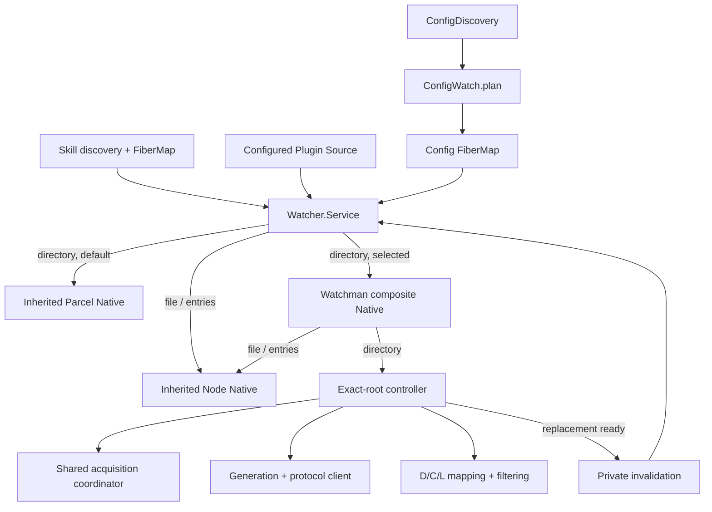
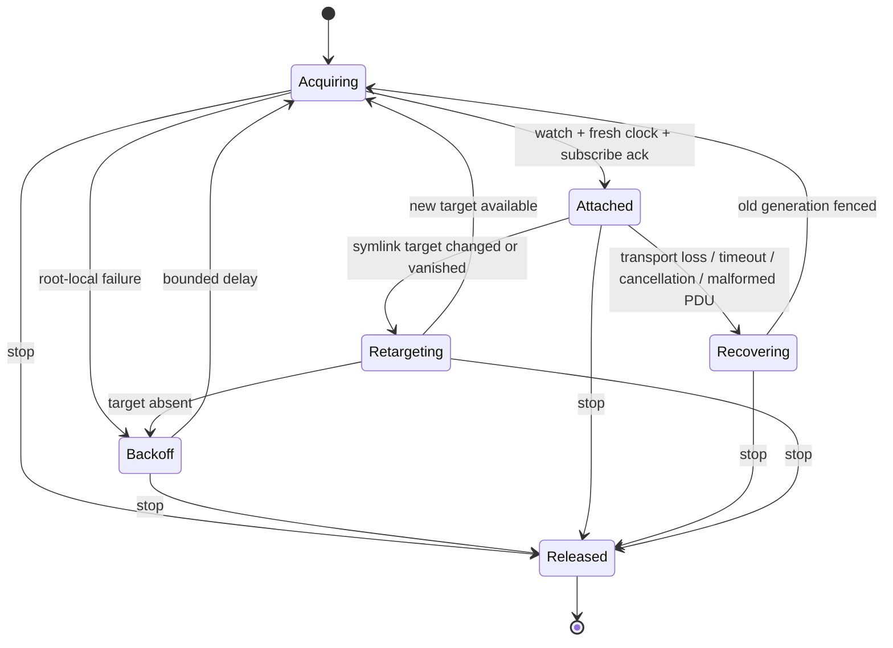

# Watchman v2 re-add dirty architecture

## Purpose

This is the decisive counterpart to the evidence-ranked
[`v2-readd4`](/.design/watchman/v2-readd/v2-readd4.gpt56solxh.md). That document
correctly distinguishes known facts from open evidence, but it intentionally
leaves the central concurrent-system decisions unresolved. This dirty design
closes them so the whole feature can be assessed as one architecture before
implementation resumes.

“Decided” does not mean “already proved.” Every policy below has an executable
verification obligation. If evidence falsifies a decision, the design is
revised explicitly; implementation does not improvise another policy.

## Decision

Add Watchman as an opt-in implementation of recursive `directory` watches
behind OpenCode v2's existing `Watcher.Native` boundary.

- Node continues to own `file` and `entries`.
- Parcel remains the default recursive backend.
- Backend selection is static for the server lifetime.
- A selected Watchman directory never falls back to Parcel.
- One controller owns each exact physical directory-watch key.
- Every replacement controller generation starts from a fresh daemon clock.
- Recovery is communicated through private watcher invalidation followed by
  exact file events, never by a synthetic path update.
- Process-wide acquisition is bounded and protected by one availability
  circuit, while root/protocol failures remain local.

The architecture preserves upstream's watcher service and owner topology. It
adds a backend; it does not introduce a second desired-state system.

## Delivered product

The product includes:

- exact-root Watchman `watch`, `clock`, `subscribe`, and `unsubscribe`;
- create, update, and delete delivery for files;
- complete decoding of subscribe response batches and unilateral PDUs;
- daemon-root containment and logical-path preservation;
- literal, glob, and `.watchman-cookie-*` filtering;
- fresh-clock recovery from socket loss, timeout, malformed protocol, and
  canceled subscriptions;
- in-place owner invalidation for fresh daemon instances;
- symlink target retargeting;
- bounded daemon acquisition and outage suppression;
- Config, Agent, Command, Plugin Source, and Skill convergence;
- static Core/server/CLI options; and
- deterministic and intended-daemon live assurance.

The product excludes:

- `watch-project`, `relative_root`, and daemon-selected project placement;
- root hints, `WatchInterests`, and hidden `WatchInput` metadata;
- cursors persisted across generations;
- Watchman-to-Parcel fallback or promotion;
- `watch-del` and automatic root pruning;
- VCS observation;
- custom metrics infrastructure; and
- public retry timing or metrics knobs.

## Preserved upstream contract

These upstream facts do not change:

1. `WatchInput` is the `file | entries | directory` union.
2. `Watcher.Update` contains exact file events only.
3. `subscribe(input, onReady?) -> Effect<Stream<Update>>` remains public.
4. equivalent physical watches share one `RcMap` entry.
5. Node and Parcel remain the inherited Native implementation.
6. `ConfigDiscovery`, `ConfigWatch.plan`, and owner `FiberMap`s remain the
   desired-state authorities.
7. `config/discovery.ts` and `config/watch.ts` remain byte-identical to
   upstream.

The generic watcher carries one private extension:

```ts
type NativeSignal =
  | { readonly type: "update"; readonly update: Update }
  | { readonly type: "invalidation" }
```

A Native receives optional `invalidate()`. The Watcher broadcasts invalidation
through the same ordered physical channel as updates. Each logical subscriber
runs its own existing `onReady` effect for invalidation and receives no stream
value. Per-subscriber sequential processing guarantees readiness completes
before a later exact update reaches that subscriber.

Initial `onReady` runs when the returned stream is consumed, after physical
acquisition and logical PubSub attachment—not when the outer `subscribe` Effect
returns. Owner code must respect this ordering.

## Runtime architecture



Ownership is strict:

- **Watcher** owns physical sharing and logical readiness.
- **Watchman backend** owns transport, topology, event mapping, and recovery.
- **Config/plugin owners** own authoritative rereads and desired state.

The backend never imports Config or plugin modules. Owners never import
Watchman modules.

## Root vocabulary

Every controller carries three path namespaces:

| Symbol | Meaning | Definition |
| --- | --- | --- |
| `L` | logical root | `path.resolve(input.target)`; stable RcMap and consumer namespace |
| `C` | canonical root | current `realpath(L)`; exact directory requested from Watchman |
| `D` | daemon root | `WatchResponse.watch`; namespace of PDU row names |

The daemon may return an already-watched ancestor, so `D` may contain `C`.
Every row follows this pipeline:

```text
name relative to D
  -> absolute daemon path
  -> containment beneath C
  -> canonical filtering
  -> map C suffix beneath L
  -> logical glob filtering
  -> file type/event mapping
  -> exact Watcher.Update
```

Client-side containment is mandatory correctness. Daemon expressions only
reduce traffic.

## Production modules

New code is grouped under
`packages/core/src/filesystem/watcher/watchman/`:

| Module | Owns | Does not own |
| --- | --- | --- |
| `schema.ts` | command/PDU codecs and typed failure data | retry, roots, owner signals |
| `client.ts` | transport loading, generations, listeners, command admission, timeout, callback fencing | path policy, fallback, cursor state |
| `filter.ts` | daemon expression and decoded-batch `D -> C -> L` mapping | protocol lifecycle |
| `acquisition.ts` | global permit and availability-circuit state | root retry, routes, owner state |
| `directory.ts` | exact-root controller, serialized state transitions, PDU gating, sentinel, recovery, release | Config plans, backend selection |
| `backend.ts` | inherited-Native composition and shared coordinator construction | protocol details |

The deep backend seam is:

```ts
backend.make(fallbackNative, options, rawClientFactory?)
  -> Effect<Watcher.NativeInterface, WatchmanStartupError>
```

The optional factory is deterministic test injection, not a server option.
`backend.make` creates one acquisition coordinator shared by every directory
controller made by that Native.

The composite routes:

```text
file      -> fallback Native (Node)
entries   -> fallback Native (Node)
directory -> Watchman controller
```

## Transport boundary

Use `@superbfowle/fb-watchman-esm@3.0.0`, loaded only after static Watchman
selection. Validate the imported constructor and client shape once. Invalid
module construction is a startup failure. A missing daemon is not: the
transport connects lazily on its first command and availability is handled by
the controller/coordinator.

The structural transport API is:

```ts
type RawClient = {
  readonly command: (args: readonly unknown[], callback: ResponseCallback) => void
  readonly capabilityCheck: (request: CapabilityRequest, callback: ResponseCallback) => void
  readonly on: (event: string, listener: (value?: unknown) => void) => unknown
  readonly end: () => void
}
```

Validate unknown data exactly once with Effect Schema. Schemas cover:

- capability/version response;
- watch response, with optional `relative_path` retained for diagnosis;
- clock response;
- subscribe response, retaining optional `root`, `clock`,
  `is_fresh_instance`, and `files` fields returned by Watchwoman;
- unsubscribe response;
- subscription change PDU; and
- subscription-canceled PDU.

The subscribe schema must not strip the response batch. Watchwoman may return
changes from the clock-to-subscribe window in the command response.

### Failure data

Failures separate location from policy:

```ts
type WatchmanOperation =
  | "connect"
  | "version"
  | "watch"
  | "clock"
  | "subscribe"
  | "unsubscribe"
  | "pdu"

type WatchmanFailureKind =
  | "transport"
  | "rejection"
  | "timeout"
  | "decode"
  | "released"
```

The operation controls diagnostics. The kind controls disposition.

- A raw callback error carrying `watchmanResponse` is a daemon rejection.
- Generation closure or a callback error without `watchmanResponse` is
  transport loss.
- A command deadline is timeout, even though it closes that generation.
- Schema failure is decode.
- Final demand removal is released.

Only a transport failure during version/watch acquisition mutates the shared
circuit. Rejection, timeout, decode, clock, subscribe, and PDU failures remain
root-local. No permanent policy is inferred from daemon error prose.

## Client generations and commands

Each controller generation owns one raw client:

```ts
type Generation = {
  readonly id: number
  readonly client: RawClient
  readonly commandPermit: Semaphore
  readonly closed: Deferred<WatchmanFailure>
  readonly subscriptions: Map<string, SubscriptionRoute>
}
```

Register `subscription`, `log`, `connect`, `error`, and `end` listeners before
the first command. Both `error` and `end` close the generation through one
idempotent operation, clear routes, and end the client. The normal error/end
pair creates one closure and therefore one replacement.

Although the transport serializes commands, the wrapper also uses one explicit
permit so admission and timeout are testable. The timeout starts after permit
acquisition. Once submitted, a command remains uninterruptible until callback,
generation closure, or deadline, preserving wire FIFO. Every command races the
generation's `closed` Deferred because daemon discovery and socket-error paths
may never invoke the callback.

Timeout closes the generation. When generation closure wins, Effect callback
resumption is already fenced, so a late callback is a no-op. Clearing the route
map independently fences late PDUs. Neither fence substitutes for the other.

## Protocol transcript

Every initial and replacement attachment uses the same sequence:

```text
1. register all listeners
2. ["version", { optional: [], required: [] }]
3. ["watch", C]
4. ["clock", D]
5. ["subscribe", D, "opencode-<controller>-<generation>", {
     since: freshClock,
     expression,
     fields: ["name", "exists", "new", "type"]
   }]
```

The version round trip stays visible for daemon identity. Current expression
terms require no negotiated capability, so `required` is empty. If a future
term requires a capability, derive the requirement from the built expression;
never restore a hard-coded `relative_root` requirement.

Install the subscription route before submitting `subscribe`, because
unilateral results may arrive before its acknowledgement. Names are unique per
generation so zombie daemon subscriptions cannot collide with replacements.

Normal release removes the local route first, then sends best-effort:

```text
["unsubscribe", D, subscriptionName]
```

Never send `watch-project`, `relative_root`, `watch-del`, or an old clock.

## Exact-root controller

One controller exists per physical `(directory, L, ignore)` RcMap key and owns
one active generation/subscription at a time.



One supervisor fiber serializes all transitions. Raw listeners and the Node
sentinel enqueue controller signals; they never race state mutations directly.
A target epoch accompanies acquisition, so an attachment completed after a
retarget signal is abandoned before it can publish or acknowledge readiness.
`Released` is absorbing.

### Initial attachment

1. Install a sentinel if `lstat(L)` identifies the target itself as a symlink.
2. Resolve `C` and capture the target epoch.
3. Under shared acquisition, construct a generation, run version, and issue
   `watch C`.
4. Ask for a fresh `clock D`.
5. Install the generation-stamped subscription route.
6. Submit `subscribe` and withhold response rows plus interleaved PDUs.
7. After acknowledgement, recheck target epoch and `realpath(L)`.
8. If current, mark Attached and resolve the first-attachment barrier.
9. Allow `Native.subscribe` to return its `Subscription`, then drain accepted
   rows and PDUs.

`Native.subscribe` does not return before attachment. Daemon absence therefore
leaves the logical stream pending, not ended, until attachment succeeds or
demand is removed.

Rows published before the Watcher attaches a logical PubSub subscriber may be
dropped. This is intentional on first attachment: the immediately following
owner `onReady` reread is authoritative over the initial interval.

### Recovery attachment

Any replacement closes and fences the previous generation but retains demand.
It then executes the same attachment operation with a fresh generation and
clock. After subscribe acknowledgement and target revalidation:

1. call `input.invalidate()`;
2. drain withheld subscribe-response rows and PDUs; and
3. enter live exact delivery.

The Watcher's ordered signal channel ensures every logical subscriber finishes
its readiness effect before a later exact update is observed. No cursor or
compatibility flag survives the old generation.

### In-band daemon state

- `canceled: true` for the active name means the subscription no longer
  exists. Fence the generation and perform a full fresh replacement.
- `is_fresh_instance: true` means a recrawl reset the daemon's state while the
  subscription remains valid. Do not reconnect. Invoke `invalidate()` before
  processing that batch's rows. If it arrives during recovery attachment,
  coalesce it with the mandatory replacement invalidation.
- A malformed PDU cannot be trusted for routing. Close the generation and
  recover from a fresh clock.
- PDUs for unknown or retired names are dropped.

### Release and resource ownership

Release performs this order:

1. mark Released and resolve the controller stop barrier;
2. remove the local subscription route;
3. unsubscribe or close the active generation;
4. stop the sentinel;
5. interrupt root backoff, circuit waiting, or pending initial attach; and
6. join the supervisor.

A submitted uninterruptible command may delay join up to
`commandTimeoutMs`. This is the explicit release-latency bound.

The Native interface remains Scope-free. The controller starts one
backend-owned fiber, installs an interruption finalizer while initial attach is
pending, and returns a Promise-based `Subscription.unsubscribe()` that resolves
stop and joins the fiber. Timers belonging to the shared circuit are scoped to
the backend layer; per-root delays belong to and die with the controller.

No callback, PDU, sentinel signal, retry wake, or half-open probe may create a
client after Released/backend shutdown.

## Shared acquisition coordinator

One coordinator per backend layer admits this expensive prefix:

```text
construct client -> version -> watch C
```

Clock and subscribe are controller-local and cannot open the global circuit.

```ts
interface Acquisition {
  readonly acquire: <A, R>(
    work: Effect<A, WatchmanFailure, R>,
  ) => Effect<A, WatchmanFailure, R>
}
```

The coordinator owns a default four-permit semaphore and an epoch-fenced state:

```text
Closed(epoch)
Open(epoch, attempt, ready)
HalfOpen(epoch, attempt, changed)
```

Its invariants are:

1. No more than `maxConcurrentAcquisitions` work effects run.
2. Circuit and permit waiting are interruptible and consume no command timeout.
3. Only acquisition `kind: transport` opens the circuit.
4. Exactly one waiter becomes a half-open probe.
5. Probe transport failure reopens with an incremented attempt.
6. Probe success closes the circuit and wakes all waiters.
7. Woken waiters still earn ordinary permits.
8. A candidate revalidates its epoch after permit acquisition.
9. Stale admitted success/failure cannot mutate a newer epoch.
10. Root rejection, timeout, decode, clock, subscribe, and PDU failures never
    touch the circuit.
11. Canceling demand removes its wait; final backend shutdown cancels wake
    timers and cannot promote a probe.

Circuit delay starts at 100 ms and doubles to a 2 s cap. Root-local attachment
retry uses the same fixed schedule in the controller. These are internal
constants, not options. There is no jitter: permits and the single probe bound
synchronized outage pressure while keeping TestClock behavior exact.

## Filtering and row mapping

Use `is-glob@4.0.3` and `micromatch@4.0.8`, plus their type packages. Add them
and `@superbfowle/fb-watchman-esm@3.0.0` through the repository package manager;
do not hand-edit dependency manifests. Do not substitute a partial custom glob
matcher.

### Daemon expression

Build the expression only after both `C` and `D` are known:

- always exclude `.watchman-cookie-*` with an explicit basename `name` term;
- for each non-glob literal, resolve its logical path under `L`, map the
  contained suffix under `C`, and then express that canonical path relative to
  `D` with `name` and `dirname` terms; and
- leave general globs to the client.

The expression is a negated `anyof` of exclusions or `true`. Terms must be
relative to `D`; using a `C`-relative wholename is wrong when `D` is an
ancestor.

### Authoritative client filter

For every decoded file row:

1. Compute `abs = path.resolve(D, row.name)`.
2. Drop unless `abs` is contained by `C`.
3. Drop if `path.basename(abs)` starts with `.watchman-cookie-`.
4. Resolve literal ignores in `L`, map their contained suffixes into `C`, and
   drop matching canonical prefixes. Use best-effort realpath for existing
   ignored paths, but retain lexical `L -> C` mapping for missing paths.
5. Compute `logicalAbs = path.join(L, path.relative(C, abs))`.
6. Convert `path.relative(L, logicalAbs)` to POSIX separators and drop if
   `micromatch.isMatch(relative, globIgnores, { dot: true })`.
7. Drop all rows whose `type === "d"`, whether present or deleted.
8. Map existing+new to `create`, existing+not-new to `update`, and non-existing
   non-directory rows to `delete`.
9. Publish the logical absolute path.

This client pipeline is authoritative even when daemon-side filtering appears
to work. Root and nested cookies are suppressed twice. Directory deletion rows
never masquerade as file deletion.

## Symlink topology

When the recursive target itself is a symlink, install one sentinel through the
inherited Node Native before resolving `C`:

```ts
{ type: "entries", target: path.dirname(L), names: [path.basename(L)], ignore: [] }
```

The sentinel's callback enters the serialized controller mailbox.

- `realpath(L) === C`: ignore.
- new `realpath(L)`: increment target epoch, fence the old generation, attach
  the new target from a fresh clock, then invalidate.
- unresolved `L`: increment epoch, fence, invalidate so owners see absence,
  retain the sentinel, and retry until it resolves.
- Released: ignore.

Retarget during acquisition cannot expose the abandoned target because target
epoch and realpath are rechecked after subscribe acknowledgement. The RcMap key
stays on `L`; retarget changes only controller internals.

This sentinel complements upstream Skill's separate file watch on the symlink
spelling. It does not move topology policy out of Skill.

## Owner convergence

The backend reports uncertainty; owners reread their authoritative sources.

### Config and indirect consumers

Config widens its private/public-Core feed to:

```ts
type Change =
  | Watcher.Update
  | { readonly type: "invalidation"; readonly path: string }
```

For each Config plan entry, `onReady` publishes the root invalidation and then
requests the existing debounced reload. Agent, Command, and Plugin Source test
the invalidation discriminant before their exact-path predicates, because a
root control item intentionally matches no source file. Their existing sliding
feeds and debounce stages coalesce bursts.

Configured Plugin Source directory watches use their existing
`configuredChanges` notification as `onReady`. Their retained `watched` set
prevents activation from recreating the watch, so initial readiness can cause
at most one extra coalesced activation and cannot loop.

### Skill first-readiness gate

Skill unconditionally clears and recreates all watch fibers during refresh. A
bare readiness publication therefore loops forever. Suppress exactly the first
`onReady` invocation of each constructed watch:

```ts
let initial = true
const onReady = Effect.suspend(() => {
  if (!initial) return PubSub.publish(changes, target).pipe(Effect.asVoid)
  return Effect.sync(() => {
    initial = false
  })
})

const updates = yield* watcher.subscribe({ path: target, type }, onReady)
```

Do not use the owner journal's proposed `attached` flag set after
`watcher.subscribe`: the returned `Stream.unwrap` has not yet been consumed at
that point, so that flag would already be true during initial readiness and
would preserve the loop. The first-call gate follows the actual Watcher
ordering.

Later invalidations queue the existing debounced Skill refresh and
`ctx.skill.reload()`. Upstream clear/rebuild topology remains unchanged.

`Watcher.Test` gains one generic invalidation control that invokes active Native
invalidation callbacks. It exists only to drive real readiness behavior in
owner tests; invalidation remains absent from `Watcher.Update`.

## Static configuration

Core options are:

```ts
type WatcherOptions = {
  readonly enabled?: boolean
  readonly backend?: "parcel" | "watchman"
  readonly watchman?: {
    readonly binary?: string
    readonly commandTimeoutMs?: number
    readonly maxConcurrentAcquisitions?: number
  }
}
```

| Setting | Default |
| --- | --- |
| backend | `parcel` |
| binary | transport discovery / `WATCHMAN_SOCK` |
| command timeout | `60000` ms |
| max concurrent acquisitions | `4` |

Server options expose `fs.watcherBackend` and `fs.watchman`. The CLI process
maps:

- `OPENCODE_WATCHER_BACKEND`;
- `OPENCODE_WATCHMAN_BINARY`;
- `OPENCODE_WATCHMAN_COMMAND_TIMEOUT_MS`; and
- `OPENCODE_WATCHMAN_MAX_CONCURRENT_ACQUISITIONS`.

Backend is a closed literal. Numeric values are positive integers. Binary is
non-empty after trimming. Invalid input fails startup validation rather than
silently defaulting.

Loading order is fixed:

1. `enabled === false` returns the disabled service before loading a backend;
2. absent or explicit `parcel` uses the inherited Native byte-for-byte; and
3. only `watchman` dynamically imports `watchman/backend.ts`, loads and
   validates the transport, constructs the composite, and incurs Watchman
   startup cost.

Daemon unavailability after valid module construction is asynchronous and
retry-owned; it does not fail server startup or select Parcel.

## Deterministic actor

The actor at `packages/core/test/filesystem/fixture/watchman/client.ts` is the
test double for the structural RawClient boundary. Its contract includes:

- strict plans per client construction, including construction failure;
- one-in-flight FIFO command dispatch;
- complete payload snapshots and mismatch diagnostics;
- capability/version through the ordinary command queue;
- Deferred barriers for construction, listeners, commands, holds, replies,
  and termination;
- unilateral subscription, log, connect, error, and end events;
- local/remote cancellation behavior; and
- deliberate late callback injection for Effect-level fencing tests.

It does not emulate BSER, binary spawning, socket discovery, or old-server
capability synthesis. Those are transport-library and live-test concerns.

When production `RawClient` lands, make the actor structurally satisfy that
type. Keep the actor's fault controls test-only.

## Verification architecture

### Watcher and owners

- equivalent subscribers share one Native and release once;
- invalidation runs every readiness effect before later exact events and emits
  no public update;
- Config invalidation bypasses Agent, Command, and Source path filters;
- Config and indirect consumer bursts coalesce;
- configured Plugin Source readiness reactivates changed content;
- Skill invalidation discovers an un-signaled change; and
- the Skill reload count stabilizes afterward, proving no readiness loop.

### Protocol and mapping

- listener registration precedes a full version/watch/clock/subscribe
  transcript;
- subscribe response fields and rows survive schema decoding;
- create/update/delete file rows map to logical paths;
- every directory row is dropped;
- `D != C` contained rows map and sibling rows disappear;
- literal and general glob ignores preserve caller semantics;
- root and nested cookies disappear;
- file/entries use only Node; and
- selected directories never invoke Parcel.

### Recovery and release

- initial and replacement attachments execute one operation;
- every replacement uses a new client, route name, and clock;
- socket error/end coalesce to one replacement;
- command timeout starts after permit admission and retires one generation;
- replacement invalidation precedes response rows, queued PDUs, and exact
  events;
- fresh-instance invalidates without reconnecting;
- canceled subscription replaces only its exact controller;
- malformed protocol stays root-local and retries;
- late callbacks and PDUs cannot resurrect a generation; and
- release at every named barrier leaves no client, route, sentinel, wait,
  timer, retry, or probe.

### Acquisition and topology

- concurrent acquisition never exceeds the limit;
- exactly one half-open probe runs;
- failed probes reopen and successful probes drain through permits;
- stale epochs cannot mutate current circuit state;
- rejections/timeouts/decode do not open the circuit;
- canceled waiters disappear and final shutdown creates no probe;
- symlink change performs one replacement and post-attach invalidation;
- retarget during attach cannot expose the old target; and
- deletion/recreation retains only the sentinel until a fresh target attaches.

### Perimeter and live evidence

- absent/explicit Parcel are equivalent to upstream;
- Watchman loading is directory-only and lazy;
- disabled watching loads neither recursive backend;
- invalid backend/numeric/binary values fail validation;
- server routes forward only declared fields;
- binary override reaches transport construction; and
- the named intended Watchwoman build passes opt-in live create/update/delete,
  loss, fresh-clock recovery, owner convergence, filtering, and release.

The live record includes OpenCode commit, daemon repository/version/binary,
socket, OS, full protocol transcript, L/C/D roots, root list before/after,
recovery transitions, negative cookie/ignore/sibling observations, and cleanup.
It never deletes a pre-existing daemon root. Stock Watchman is an additional
compatibility run, not the release gate.

## Build sequence after acceptance

This is implementation decomposition, not design-by-implementation:

1. private generic Native invalidation and readiness ordering;
2. deterministic RawClient actor;
3. schema/client/filter/exact-root backend with complete response decoding and
   `D -> C -> L` correctness;
4. generation recovery, fresh-instance/cancellation handling, and release
   fencing;
5. shared acquisition coordinator;
6. symlink topology;
7. generic owner convergence with the Skill first-call gate;
8. static Core/server/CLI selection;
9. deterministic aggregate and intended-daemon live acceptance; and
10. operational documentation and carry audit.

Generic readiness and owner convergence remain separate Watchman-free commits.

## Carry audit

| Class | Allowed content |
| --- | --- |
| U1 | private Native invalidation, readiness replay, generic watcher tests |
| U2 | Config-local invalidation, owner readiness, generic test invalidation and owner tests |
| Backend | `filesystem/watcher/watchman/**` and Watchman fixtures/tests |
| Perimeter | dependencies, lockfile, Core/server/CLI options, user documentation |

Reject any unexplained edit or production occurrence of:

```text
watch-project
watch-del
relative_root
cursor
WatchInterests
placement
synthetic update
metrics
Watchman -> Parcel fallback
```

Also reject modifications to `config/discovery.ts` or `config/watch.ts`, backend
imports in owner modules, or owner reconciliation copied into the backend.

## Decisions closed by this dirty design

This design deliberately answers the evidence brief's central open questions:

| Evidence gate | Decision |
| --- | --- |
| E03 | Withhold around subscribe ack; initial rows rely on initial owner reread; replacement rows follow invalidation; fresh-instance invalidates in place; cancellation reattaches. |
| E04 | One serialized controller supervisor, idempotent generation close, target epochs, dual callback/PDU fences, and absorbing Released state. |
| E05 | Valid Watchman selection remains pending and retries under bounded backoff for all daemon/protocol failures; it never ends the logical stream or falls back. |
| E11 | One raw client per exact controller generation plus one shared, transport-only, epoch-fenced acquisition circuit and four-permit default. |
| E12 | Scope-free Native backed by an explicitly stopped/joined controller fiber; backend-scoped circuit timers; release latency bounded by command timeout. |
| E06 | No required expression capability; explicit cookie basename term; globs remain authoritative client-side. |
| E08 | Literal paths originate in L, map through C, and are named relative to D; missing paths retain lexical mapping. |
| E09 | All `type === "d"` rows are dropped, including deletion; file/symlink rows map by exists/new. |
| E10 | Sentinel only when the recursive target itself is a symlink; it persists through target absence and stops at release. |
| E14 | Skill uses a first-`onReady`-call gate, not a post-subscribe attached latch. |
| E17 | Selection is accepted wherever the transport package loads; unsupported daemon/runtime availability follows ordinary retry and diagnostics, not silent fallback. |
| E18 | ServerOptions composition is internal server startup data; regenerate clients only if implementation inspection finds an actual public HttpApi change. |

These are candidate decisions with tests, not claims of observed daemon behavior.
Evidence may revise them, but implementation must not silently choose something
else.

## Cross-references

- [`v2-readd4.gpt56solxh.md`](/.design/watchman/v2-readd/v2-readd4.gpt56solxh.md)
  is the parallel evidence brief. It preserves uncertainty and enumerates
  targeted evidence asks; this dirty design supplies one coherent answer set.
- [`v2-readd3.gpt56solxh.md`](/.design/watchman/v2-readd/v2-readd3.gpt56solxh.md)
  supplies the carrier direction and work graph. This design corrects ancestor
  roots, response-batch loss, in-band loss, filtering, and Skill readiness.
- [`research0.glm53max.md`](/.design/watchman/v2-readd/v2-research0.glm53max.md)
  validates current upstream seams, donor boundaries, acquisition, topology,
  options, and full-glob policy.
- [`protocol0.glm53max.md`](/.design/watchman/v2-readd/v2-protocol0.glm53max.md)
  records transport behavior, command admission, callback fencing, protocol
  ordering, and actor requirements.
- [`owners0.glm53max.md`](/.design/watchman/v2-readd/v2-owners0.glm53max.md)
  validates Config/Source convergence and discovers the Skill loop. Its
  attached-latch remedy is corrected here against actual Stream consumption.
- [`actor0.gpt56solmax.md`](/.design/watchman/v2-readd/v2-actor0.gpt56solmax.md)
  records the uncommitted scripted actor and focused checks.
- [`shared-acquisition-spec0.gpt56solxh.md`](file:///home/rektide/src/opencode-watchman-old/.design/watchman/shared-acquisition-spec0.gpt56solxh.md)
  supplies the circuit invariants retained here.
- [`review-failure-paths0.gpt56s.md`](file:///home/rektide/src/opencode-watchman-old/.design/watchman/review-failure-paths0.gpt56s.md)
  proves subscribe-response stripping and the first-attachment PubSub boundary.
