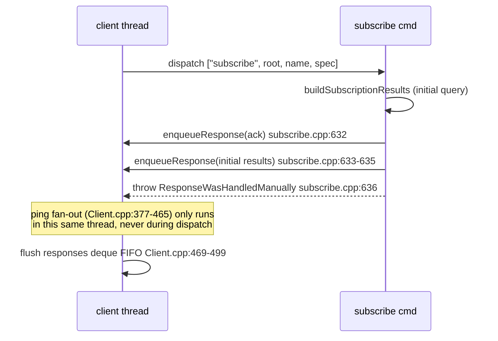
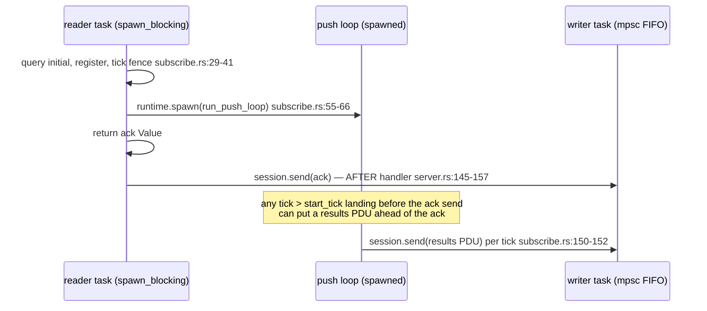

# E03 — protocol ordering and shapes: subscribe ack, initial results, unilateral PDUs, `is_fresh_instance`, cancellation

Scope guard: research only. Every signal below is tagged **preserves** or **terminates** the subscription.
No OpenCode reaction is chosen anywhere in this document.

## One-sentence answer

In stock Watchman, a successful `subscribe` returns a small ack PDU (`subscribe`, `clock`, `asserted-states`, optional `warning`/`saved-state-info`) immediately followed by a separate initial-results unilateral PDU (`subscription`+`unilateral:true`+`is_fresh_instance`+`clock`+`files`+`root`, optional `since`), later settle-driven PDUs reuse exactly that shape, `is_fresh_instance:true` only marks a full-set result and preserves the subscription, and subscriptions end either via the `unsubscribe` command response (`unsubscribe`/`deleted`, silent server-side removal, no further PDUs) or via a terminal `canceled:true` unilateral PDU when the root is cancelled — whereas Watchwoman merges the initial results into the single subscribe ack (no separate initial PDU), pushes per-5ms-batch unilateral result PDUs with `is_fresh_instance` hardcoded `false`, has no `canceled` or state PDUs at all, and its `unsubscribe` removes only a registry entry so delivery keeps flowing (and same-name resubscribe produces duplicate PDUs from two live push loops) until the session or root goes away.

## Source/revision matrix

| Source | Path | Revision | Role |
| --- | --- | --- | --- |
| stock Watchman | `/home/rektide/a/facebook/watchman` | `923b0935155590be54c0fc052fdca0201f8ebc4b` (`v2026.08.31.00-2-g923b09351`) | server source + first-party integration tests |
| Watchwoman | `/home/rektide/a/radiosilence/watchwoman` | `a1e16cbf35b6bb1e4b429af53d65e738f955c32b` (`v0.7.0-5-ga1e16cb`) | server source + tests + `docs/PROTOCOL.md` |
| Running daemon | `watchman.service`/`watchman.socket` → `~/.local/state/watchman/rektide-state/sock` | binary symlinked to `/usr/local/src/watchwoman-git/repo` @ `a1e16cbf` (git-verified, empty diff vs archive) | live-observation target; `/usr/local/bin/watchman` is watchwoman 0.7.0 — **no stock binary exists on this host** |
| JS client fork | `/home/rektide/src/watchman-esm` (`watchman/node/`) | jj `kqrmnntsqmlm` (commit `8ed9bbf44fec`), `@superbfowle/fb-watchman-esm` 3.0.0 | client-side PDU classification (planned integration client) |
| v4 design context | `/home/rektide/src/opencode-watchman-v2-readd/.design/watchman/v2-readd/v2-readd4.gpt56solxh.md` | as-of 2026-09-05 | E03 paragraphs only (see final section) |

## Command-response schemas (request → one response PDU)

### Stock Watchman

Every stock response object is an `UntypedResponse`, whose default constructor injects `version` (`watchman/CommandRegistry.cpp:38-40`).

| Command | Response shape | Source |
| --- | --- | --- |
| `subscribe` | `{version, subscribe: <name>, clock: <clock-string>, asserted-states: [name…], warning?: <string>, saved-state-info?: <obj>}` | `cmds/subscribe.cpp:603-627`, `listener-user.cpp:37-57` |
| `unsubscribe` | `{version, unsubscribe: <name-string>, deleted: <bool>}` — `deleted:false` for an unknown name (not an error) | `cmds/subscribe.cpp:450-476` |
| `state-enter`/`state-leave` | `{version, root, state-enter\|state-leave: <name>}` | `cmds/state.cpp:90-100`, `Client.cpp:515-532` |
| `flush-subscriptions` | `{version, synced: […], no_sync_needed: […], dropped: […]}` (and it *does* force result PDUs, see below) | `cmds/subscribe.cpp:323-441` |

The stock subscribe ack is enqueued manually and the dispatcher is told the response was already handled
(`subscribe.cpp:632-636`, `throw ResponseWasHandledManually{}`; caught at `Client.cpp:170-171`).

### Watchwoman

`dispatch` injects a leading `version` into every response if absent (`commands.rs:45-62`; observed value `2026.03.30.00`).

| Command | Response shape | Source |
| --- | --- | --- |
| `watch` | `{version, watch, watcher}` (observed: `"watcher":"inotify"`) | transcript; `docs/PROTOCOL.md:102` |
| `subscribe` | `{version, subscribe: <name>, clock, is_fresh_instance: <bool>, root, files: […]}` — **initial results merged into the ack; no separate initial PDU, no `subscription`/`unilateral` keys** | `commands/subscribe.rs:68-84`; observed |
| `unsubscribe` | `{version, unsubscribed: <bool>, subscription: <name>}` — note key names differ from stock (`unsubscribed` vs `deleted`) **and the ack carries a `subscription` key** | `commands/subscribe.rs:161-180`; observed |
| `flush-subscriptions` | `{version, synced: [all names]}` — stub: lists subscriptions, forces nothing | `commands/subscribe.rs:182-197` |
| `state-enter`/`state-leave` | `{version, state-enter\|state-leave: <name>}` — registry op only, **no broadcast** | `commands/state.rs:9-19` |

## Unilateral-PDU schemas (server → client, unsolicited)

### Stock Watchman — four shapes

All are appended to the same FIFO `responses` deque as command acks (`Client.cpp:73-79`, `Client.h:67`) and flushed in order by the client thread (`Client.cpp:469-499`).

1. **Subscription results** (initial and later): `{version, subscription: <name>, unilateral: true, is_fresh_instance: <bool>, clock: <clock-string>, files: […], root: <path>, since?: <clock-string>, saved-state-info?: <obj>}` — `cmds/subscribe.cpp:290-299`; `since` echoed only when the current since-spec is a clock (`:283-287`; absent on a first subscribe without `since`, present on later PDUs after `updateSubscriptionTicks`); `saved-state-info` optional (`:297-299`). Later PDUs additionally get root-recrawl `warning` via `add_root_warnings_to_response` (`:317`, `listener-user.cpp:37-57`); the initial-results PDU does **not** get warnings (enqueued raw at `:633-635`). **Preserves.**
2. **Cancellation**: `{version, unilateral: true, canceled: true, subscription: <name>, root: <path>}` — `Client.cpp:406-427`, payload origin `root/threading.cpp:49-71` (`Root::cancel`). **Terminates** the subscription server-side; `unsubByName` runs after the fan-out loop (`Client.cpp:462-464`).
3. **State transition fan-out**: `{version, root, clock, state-enter|state-leave: <state-name>, metadata?, abandoned?, unilateral: true, subscription: <sub-name>}` — `Client.cpp:429-449`; enter payload built in `cmds/state.cpp:113-130` (after cookie sync), leave payload in `Client.cpp:515-532` (with `abandoned:true` when the asserting client disconnected). **Preserves.**
4. **Log/debug** (only when the client subscribed to logs): `{unilateral: true, log: …}` / error variant — `Logging.h:61,90`. Orthogonal to file subscriptions. **Preserves.**

Emission trigger for shape 1: the root's io thread enqueues `{settled: true}` to the root publisher when the tree goes quiet (`root/iothread.cpp:104-116`); the publisher wakes each subscribed client's ping event (`subscribe.cpp:587-598`), the client thread drains pending publisher items and calls `processSubscription()` for every subscription that saw a settle (`Client.cpp:377-465`, dispatch at `:451-459`). Empty results are suppressed unless fresh-instance or merge-base changed (`subscribe.cpp:269-277`); `defer`/`drop` state policies and `defer_vcs` can skip or fast-forward a cycle (`subscribe.cpp:61-117, 154-184`).

### Watchwoman — exactly one shape

`rg '"unilateral"'` over watchwoman `src` finds a single emitter (`commands/subscribe.rs:144`):

- **Subscription results (later only)**: `{version, subscription: <name>, clock, is_fresh_instance: false, unilateral: true, root, files: […]}` — `subscribe.rs:136-149`. No `since` key, ever. `is_fresh_instance` is **hardcoded `false`** at `:143` even though the suppression check two lines above uses the real value (`:132-134`). **Preserves.**

Emission trigger: watcher coalesces events into a ≤5 ms / ≤1024-entry batch (`daemon/watcher.rs:16-18, 80-110`), `Root::apply_changes` bumps one tick and broadcasts one `TickEvent` (`daemon/root.rs:300-342`), each per-session push loop re-runs the query with `since = clock(last_tick)` injected (`subscribe.rs:96-130`) and sends the PDU into the session's unbounded mpsc (`session.rs:43-51`), drained FIFO by the writer task (`server.rs:159-170`).

There is **no** `canceled` PDU, **no** state-enter/state-leave fan-out, and **no** log PDUs in Watchwoman.

## Ordering evidence (exact control flow)

### Stock Watchman: ack → initial results → later PDUs, strictly

- Both PDUs are enqueued synchronously inside the command, which executes on the client's own thread (`Client.cpp:373`, `dispatchCommand`); the ping-driven unilateral fan-out (`Client.cpp:377-465`) runs in the *same* loop, so nothing can interleave between ack and initial results. The `responses` deque is single-thread-owned and FIFO (`Client.cpp:73-79`, `Client.h:67`, flush at `:469-499`).
- First-party confirmation: `integration/test_subscribe.py:360-406` — `watchmanCommand("subscribe", …)` returns the ack, then `waitForSub("myname")` receives the initial PDU with `is_fresh_instance: true` and the full file list, and later deltas with `is_fresh_instance: false`; identical flow in `test/async/test_subscribe_async.py:24-55`.
- `flush-subscriptions` emits its ack and the forced result PDUs on the same deque in the same dispatch (`subscribe.cpp:424-428`, `435-440`); the dict-exactness assert at `integration/test_subscribe.py:546-570` pins the unilateral results shape (`since`, `files`, `clock` + `{version, is_fresh_instance, subscription, root, unilateral}`).
- Cancellation ordering: the `canceled` fan-out enqueues one PDU per subscription *before* removing them (`Client.cpp:406-427` then `:462-464`), so the `canceled` PDU is the last PDU that subscription can ever produce; proven for 32 subs on one socket in `test_multi_cancel` (`integration/test_subscribe.py:322-358` after `watch-del`).

### Watchwoman: ack first in practice, but a real pre-ack race exists

- Commands on one connection are strictly sequential (`server.rs:122-137`), and both acks and push PDUs share one unbounded mpsc drained FIFO (`server.rs:159-170`), so ordering *within* the channel is FIFO.
- But the push loop is spawned *before* the ack is sent (`subscribe.rs:55-66` vs `server.rs:156`): a tick strictly greater than `start_tick` (`subscribe.rs:40-41, 110-112`) processed in that window would enqueue a results PDU ahead of the ack. Narrow, code-proven race; **not observed** in either transcript (ack always arrived first). Flagged for consumers that assume ack-first.
- Observed batching: two files written back-to-back arrived in one PDU (5 ms settle batch — `watcher.rs:16-18`), and the daemon-lifetime tick counter advanced monotonically across connections (`c:…:916:2` → `:7`).

## `is_fresh_instance` semantics

### Stock Watchman

- Computed per query from the since-spec (`Clock.cpp:130-185`, surfaced at `query/eval.cpp:176-179, 204-210`): fresh when (a) **no since spec at all** — the default `QuerySince` is `Clock{is_fresh_instance=true, ticks=0}` (`Clock.h:35`; comment at `eval.cpp:510-516` "By default new instances are fresh instance"), (b) the clock names a **different server incarnation** (pid/start-time/root-number mismatch), (c) ticks are older than the **age-out watermark** (`lastAgeOutTick`), or (d) an unknown named cursor.
- Meaning: results are a **complete set, not a delta**. Fresh queries use the all-files generator instead of the since-time generator (`eval.cpp:139-152`) and drop files that no longer exist (`eval.cpp:73-88`; `since` term returns `file->exists()` when fresh, `query/since.cpp:70-74`). `empty_on_fresh_instance` suppresses files but keeps the flag (`Query.h:47`, `eval.cpp:182`).
- **Preserves the subscription.** It is informational: the sub's cursor advances, later PDUs are deltas with `is_fresh_instance: false` (observed `test_subscribe.py:379-406`). Eden can set fresh mid-stream (mount-generation change / journal truncation, `eval.cpp:204-210`) — the subscription still survives. This closes the v4 question "is fresh a loss trigger?": source says no.

### Watchwoman

- `is_fresh_instance = since_tick.is_none()` — fresh **iff the query carried no usable since** (`query/run.rs:104-106`).
- Divergences: no age-out and no incarnation semantics in the flag — a well-formed foreign clock (`c:` string with mismatched start/pid/root) resolves to tick 0 (`daemon/clock.rs:139-153`), yielding `since_tick = Some(0)` → **flag false but file content is the full set** (stock would flag true). Subscribe ack: fresh true only when the spec had no `since`; push-loop PDUs: hardcoded `false` (`subscribe.rs:143`) with a `since` always injected (`:118-120`).
- **Preserves the subscription** in both daemons; nothing in either server keys termination off this flag.

## Cancellation shapes and post-cancel delivery guarantees

| # | Trigger | Daemon | Wire signal | Server action | Post-cancel guarantee |
| --- | --- | --- | --- | --- | --- |
| 1 | `unsubscribe` cmd, known name | stock | ack `{version, unsubscribe: <name>, deleted: true}` | `unsubByName`: erased from `subscriptions` + `unilateralSub`, weakClient reset (`subscribe.cpp:46-59`) | **Terminates.** No further PDUs for that name (fan-out membership gone). Already-enqueued PDUs still flush. Proven by `test_subscription_cleanup` (`test_subscribe.py:657-705`: `debug-get-subscriptions` drops the name). |
| 2 | `unsubscribe` cmd, unknown name | stock | `{version, unsubscribe: <name>, deleted: false}` | none | No-op, not an error (`subscribe.cpp:464-470`). |
| 3 | Root cancelled (`watch-del`, fatal recrawl, stale Eden handle, …) | stock | unilateral `{version, unilateral: true, canceled: true, subscription, root}` per sub | sub removed after fan-out (`Client.cpp:406-427, 462-464`; `Root::cancel` `threading.cpp:49-71`) | **Terminates.** Exactly one `canceled` PDU per subscription; it is the final PDU for that sub (`test_multi_cancel`, 32 subs, `test_subscribe.py:322-358`). |
| 4 | Client disconnect | stock | (socket EOF; no PDU) | `~UserClient` clears subscriptions; each `~ClientSubscription` → `unsubByName` (`Client.cpp:255-262`, `subscribe.cpp:39-44`) | **Terminates**, silent; asserted states vacated with `abandoned:true` broadcast to *other* clients (`Client.cpp:298-320, 529-531`). |
| 5 | Same-name resubscribe, `enforce_unique_subscription_names=false` (default) | stock | ack carries `warning: "subscription name '…' is not unique"`; error thrown instead when the config is true (`subscribe.cpp:519-535`) | map overwrite at `:601` | See Unknown U1 — code-reading suggests the old sub survives via its `unilateralSub` key reference; untested upstream. |
| 6 | `unsubscribe` cmd | watchwoman | ack `{version, unsubscribed: true, subscription: <name>}` | registry `remove_subscription` only (`subscribe.rs:161-180`, `root.rs:378-380`) — **the push loop never consults the registry** | **Does NOT terminate delivery.** PDUs continue until session close or root drop. **Live-proven:** `d.txt` results PDU arrived 7 ms *after* the unsubscribe ack (transcript `1511ms` vs ack `1504ms`). |
| 7 | Same-name resubscribe after unsubscribe | watchwoman | normal merged ack | new push loop spawns; old loop still alive | **Duplicate delivery:** two identical PDUs per tick. **Live-proven:** two byte-identical `e.txt` PDUs at `3512ms` (same clock `:916:7`). |
| 8 | `watch-del` / GC reap / root unregister | watchwoman | **none** — no `canceled` PDU exists | Root dropped → `tick_tx` closed → push loop `RecvError::Closed` or `Weak` upgrade fails; loop removes registry entry (`subscribe.rs:99-109, 155-158`; `watch.rs:57-70`) | **Terminates silently.** A parked subscriber cannot distinguish cancellation from quiet. |
| 9 | Client disconnect | watchwoman | (socket EOF; no PDU) | session mpsc closes; `send` fails / `is_closed` → loop exits (`session.rs:43-51`, `subscribe.rs:107-109, 150-152`) | **Terminates, silent.** |

Client-side classification (fork, `watchman/node/index.js`): a PDU is unilateral iff it contains a `subscription` or `log` key (`:17`, `:119-147`); the `unilateral` flag itself is ignored; commands are strictly one-at-a-time via `currentCommand` (`:73-93`). Consequences, observed live with a JS client using this exact rule:

- stock ack (`subscribe` key) resolves the pending command; stock initial/canceled/state PDUs (`subscription` key) route to the `'subscription'` event — correct;
- watchwoman ack (no `subscription` key) resolves the command; push PDUs route correctly;
- **watchwoman `unsubscribe` ack carries a `subscription` key and no `unilateral` flag → misclassified as a unilateral PDU: the pending `unsubscribe` command never resolves and the pipeline stalls.** Live-proven: run 1 of the transcript hung until killed (45 s) on exactly this path.

## Stock-vs-Watchwoman differences (summary table)

| Aspect | stock Watchman @ 923b093 | Watchwoman @ a1e16cb |
| --- | --- | --- |
| Initial results | separate unilateral PDU right after ack | merged into the ack (`files` in ack; no initial PDU) |
| Ack fields | `subscribe, clock, asserted-states, warning?, saved-state-info?` | `subscribe, clock, is_fresh_instance, root, files` |
| Results PDU | `since?` echoed; `is_fresh_instance` real; warnings on later PDUs | no `since` ever; `is_fresh_instance` hardcoded `false`; no warnings |
| Emission cadence | settle-driven (root quiet, `iothread.cpp:104-116`) | per ≤5 ms watcher batch (`watcher.rs:16-18`) |
| Ack/PDU ordering | strictly ack-first (single client thread, FIFO deque) | FIFO mpsc, but code-proven race can put a PDU before the ack |
| `is_fresh_instance` truth | no-since / foreign incarnation / aged-out cursor | no-since only; foreign clock → false-flag-with-full-files |
| `canceled` PDU | yes; terminal; last PDU per sub | **absent** |
| state-enter/leave fan-out | yes (with clock, metadata, abandoned) | **absent** (ack-only registry ops) |
| `unsubscribe` ack | `{unsubscribe: name, deleted: bool}` | `{unsubscribed: bool, subscription: name}` — breaks fb-watchman-style classifiers |
| `unsubscribe` effect | terminates delivery | registry-only; **delivery continues**; resubscribe → duplicate PDUs |
| defer/drop/defer_vcs | implemented | parsed/documented but inert for delivery (`docs/PROTOCOL.md:124-126` lists them; push loop ignores) |
| `flush-subscriptions` | syncs and forces result PDUs | stub listing names |
| Clock format | `c:<start>:<pid>:<root>:<ticks>` (`Clock.cpp:200-211`) | identical format (`daemon/clock.rs:42-51`), verified live |

## Transcripts

Live capture against the running socket-activated Watchwoman (`a1e16cbf`), isolated scratch dir, JSON-line transport, commands used: `watch`, `subscribe`, `unsubscribe` only. No `watch-project`/`watch-del`/`watch-del-all`/`shutdown-server` was sent; no service was started/stopped/reconfigured; the scratch root (916) was left to idle-GC reaping.

- `/home/rektide/tmp-opencode/e03-protocol-ordering/watchwoman-live/run.log` — run 1: `watch` ack; merged subscribe ack (`is_fresh_instance: true`, `files: ["base.txt"]`); per-batch results PDU (`a.txt`, then `b.txt`+`c.txt` coalesced); **unsubscribe ack misrouted by the fb-watchman key-presence rule → client hung** (killed at timeout). (The `.transcript.txt` for run 1 was never written because the script hung — `run.log` is the record.)
- `/home/rektide/tmp-opencode/e03-protocol-ordering/watchwoman-live/watchwoman-live2.transcript.txt` (+ `run2.log`, `client.js`, `client2.js`, `scratch/`) — run 2, complete: merged ack; post-unsubscribe delivery (`1511ms` PDU after `1504ms` ack); same-name resubscribe duplicate delivery (two identical `3512ms` PDUs); final unsubscribe ack shape.
- **Stock Watchman live transcript: explicitly absent.** No stock binary exists on this host (`/usr/local/bin/watchman` is the watchwoman 0.7.0 shim; the archive `build/` tree is an incomplete getdeps scaffold with no watchman binary). Building stock from source (folly/fbthrift chain) was out of scope for non-destructive capture. Stock behavior in this document rests on pinned source lines plus the first-party integration tests quoted above, which assert the same shapes and orderings.

## Known / Unknown

| ID | Claim | Status |
| --- | --- | --- |
| K1 | Stock ack → initial-results → later-PDU ordering and all field sets | Known (source + `test_subscribe.py`, `test_subscribe_async.py`) |
| K2 | Stock `canceled` PDU terminal, one per sub, last PDU | Known (source + `test_multi_cancel`) |
| K3 | Stock unsubscribe terminates delivery; `deleted:false` on unknown name | Known (source + `test_subscription_cleanup`) |
| K4 | Stock `is_fresh_instance` rules and preserve-verdict | Known (source: `Clock.cpp`, `Clock.h:35`, `eval.cpp`; tests assert flag transitions) |
| K5 | Watchwoman merged ack, single unilateral shape, hardcoded false, no canceled/state PDUs | Known (source + live transcript) |
| K6 | Watchwoman unsubscribe does not stop delivery; resubscribe duplicates | Known (**live-proven**, `watchwoman-live2.transcript.txt`) |
| K7 | Watchwoman unsubscribe ack breaks fb-watchman-style unilateral classification → client stall | Known (**live-proven**, `run.log`) |
| U1 | Stock same-name clobber (no prior unsubscribe): the old `ClientSubscription` appears to stay live via the `unilateralSub` key's owning reference, so old+new may both deliver under one name | Unknown — code-reading only; no upstream test exercises delivery after clobber; no stock binary to probe |
| U2 | Stock subscribe ack when the initial query throws `QueryExecError`: `resp.set("clock", position.toJson())` on a default (`Timestamp{0}`) spec reaches `position()`'s `w_check` (`Clock.h:121-125`) — likely fatal/throwing edge | Unknown — code-reading edge, unexercised by tests read |
| U3 | Watchwoman PDU-before-ack race actually firing | Unknown — code-proven possible (`subscribe.rs:55-66` vs `server.rs:156`), not observed in two runs |
| U4 | Watchwoman foreign-clock false-flag-full-files behavior | Known-by-code (`clock.rs:139-153`, `run.rs:104-106`), not live-tested |
| U5 | Eden-specific mid-stream fresh-instance triggers | Out of scope (no Eden host here) |
| U6 | Watchwoman `WATCHMAN_COMPAT_VERSION` constant definition site | Observed value `2026.03.30.00` in all PDUs; definition not pinned to a line |

## Confidence and caveats

- **High** for everything sourced from pinned lines in both servers, corroborated by first-party tests (stock) and by live transcripts (watchwoman, including the two behavioral surprises K6/K7 — both reproduced deterministically in run 2).
- The live daemon is Watchwoman only; stock observations are source- and test-derived, not wire-observed on this host (see transcript section). Stock integration tests are the project's own executable specification, which narrows but does not eliminate that gap.
- Line numbers refer to the pinned revisions in the source matrix; `a1e16cbf` is byte-identical to the running daemon, so transcript and source cannot drift for these claims.
- Watchwoman's `docs/PROTOCOL.md:112-124` documents the merged ack and PDU shape consistent with code and transcript; its mention of `settle_period`/`settle_timeout` as subscription options matches the fixed 5 ms watcher batch, not a client knob.

## Cross-references

- [`v2-readd4.gpt56solxh.md`](file:///home/rektide/src/opencode-watchman-v2-readd/.design/watchman/v2-readd/v2-readd4.gpt56solxh.md) — E03 paragraphs only: design-gate row (line 687), provisional pre-ack-row discard (lines 424-427), replacement-attachment buffering (429-435), loss/control input table including the `is_fresh_instance` and cancellation rows and the "E03 must close this question" note (437-459), and the protocol0 fresh-instance disagreement sent back to E03 (850). This document supplies that evidence; it does not adopt any of the proposed reactions.
- Transcript artifact directory: `/home/rektide/tmp-opencode/e03-protocol-ordering/` (see Transcripts).
