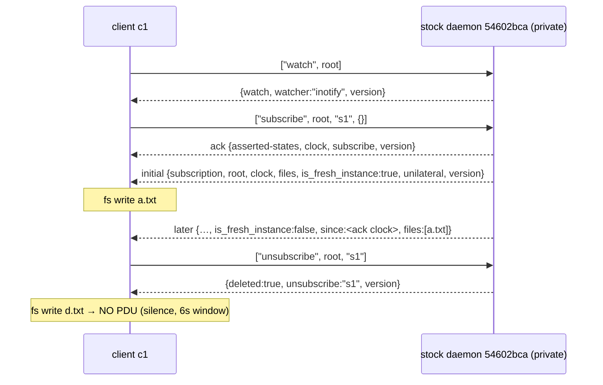

# N6 / E03 follow-up — stock fallback as an isolated private daemon: live ordering and PDU shapes

Scope guard: research only. This report presents controlled live evidence from the
installed stock fallback binary. It does not select architecture, patch source, edit
shared v4 documents, or commit anything.

## One-sentence answer

Yes — the installed stock fallback runs perfectly as a completely isolated private
daemon (explicit `--unix-listener-path`/`--statefile`/`--logfile`/`--pidfile` plus a
private HOME/XDG/env block; the daemon never touched the ambient filesystem, the
active Watchwoman socket, or any default stock path), and that exact binary
(`20260708.093114.0`, buildinfo `54602bca…`, ~2 months older than E03's pinned source
`923b0935`) live-reproduces every E03 stock claim tested — small subscribe ack then a
separate initial-results unilateral PDU in the same millisecond, real
`is_fresh_instance` semantics including cross-incarnation freshness after restart,
silent post-unsubscribe termination, and `abandoned:true` state-leave fan-out on
abrupt connection loss — while adding three live findings E03 could not reach from
source alone: a same-name clobber leaves a duplicate delivery path that **survives a
single unsubscribe**, SIGTERM kills the daemon as an ungraceful signal death that
leaves stale socket and pidfile behind (self-healed on next bind), and a legacy
object-form `{"command":…}` PDU throws out of `Command::parse` at `Client.cpp:373`
and **aborts the entire daemon** (SIGABRT), making the array-form wire protocol a
hard requirement on this build.

## Binary identity and provenance (installed ≠ source — preserved distinction)

| Property | Value | Evidence |
| --- | --- | --- |
| Path | `/usr/local/bin/watchman-facebook` → `/usr/local/src/watchman-git/watchman/bin/watchman` (symlink chain) | `ls -la`, `file` |
| sha256 | `044c9625e80a943b3741507afdc6486aeb4cc47a86badaf3cdaa86cc7ebbb6e4` | `sha256sum` |
| Size | 403,623,000 B (getdeps/debug-style fbcode build) | `stat` |
| Client `--version` | `20260708.093114.0` (client-side flag; no server contact) | CLI |
| Wire `version` ack | `{"buildinfo":"54602bcad27e0887fd26f77c6747a38f0d701fc7","version":"20260708.093114.0"}` | transcript A, first PDU |
| Built-from revision | `54602bcad27e0887fd26f77c6747a38f0d701fc7` — **self-reported by the binary** (startup banner + `buildinfo` field); version timestamp `2026-07-08 09:31:14` equals that commit's author/committer date (`2026-07-08T09:31:14-07:00`, "Updating hashes", Meta OS Bot) | my daemon log banner; `git log` in archive checkout |
| Build machinery | compfuzor deployment `/usr/local/src/watchman-git` (env files name `REPO_DIR=/home/rektide/archive/facebook/watchman`, `BUILD_DIR=…/build`); getdeps scratch with folly/fbthrift/edencommon/… checkouts; stack traces resolve into `scratch/repos/…-folly.git` and `/home/rektide/archive/facebook/watchman` | deployment `env`, `scratch/`, crash stacks |
| E03's pinned source | `923b0935…` (`v2026.08.31.00-2-g923b09351`, 2026-09-01) — **newer than and different from the installed binary**; every comparison below is against the binary first, with the source cited only where its lines coincide | E03; `git describe` |

The distinction matters: E03's stock claims were source-pinned at `923b0935`; the
installed fallback is the July `54602bca` build. All E03 stock claims tested live
below **agreed with the binary's observed behavior**, and the one fatal code path
exercised (`Command.cpp:26` throw from `Client.cpp:373`) has identical line numbers
in the pinned source, so agreement is corroborated — but every binary observation is
labeled `54602bca`, and none of it upgrades E03's `923b0935` source claims to
binary-verified on that exact revision.

Environmental note: a sibling task briefly ran this same binary via its **default**
paths (`/usr/local/src/watchman-git/watchman/var/run/watchman/rektide-state/`,
mtime 06:33, before my session) and its leftovers (sock/pid/log, SIGTERM stack trace)
remain there; none of that is my evidence and my run never touched that tree (its
mtime was unchanged across my whole experiment).

## Isolation design and verification

Everything under `/home/rektide/tmp-opencode/v4-n6-stock-live/`:

| Concern | Private value |
| --- | --- |
| socket | `--unix-listener-path=$BASE/run/sock` (+ `WATCHMAN_SOCK` same) |
| state | `--statefile=$BASE/state/watchman.state` + `WATCHMAN_STATE_FILE` (and `--no-save-state`) |
| log | `--logfile=$BASE/log/server.log` |
| pidfile | `--pidfile=$BASE/pid/server.pid` |
| config | `WATCHMAN_CONFIG_FILE=$BASE/conf/watchman.json` (content `{}`; no `/usr/local/etc/watchman*` exists) |
| HOME / XDG | `$BASE/home`, `$BASE/xdg/{runtime,state,config,cache,data,tmp}` |
| watched root | `$BASE/root` only |
| daemon mode | `--foreground` (no daemonize, no systemd, no site spawner involvement) |

Verification results (transcript `Z-final-verification.log` + `bin/n6_verify.py`):

- Both banners in `server.log` say `starting up … by command /usr/bin/python3 bin/n6_run.py` — my orchestrator spawned both daemons.
- `Want to watch` appears for exactly one root: `$BASE/root`.
- Zero mentions of the active Watchwoman socket path; its mtime is unchanged (2026-09-01).
- `$BASE/home` and all `$BASE/xdg/*` trees are **empty** — the daemon kept everything on the explicit flag paths.
- No `watch-project`, `watch-del`, `watch-del-all` was ever sent; no systemd unit was started or stopped; the only processes created/stopped were my two daemons (owned PIDs, SIGTERM for the graceful case; see end observations).
- Post-run: both daemon PIDs verified dead via `/proc/<pid>/exe` readlink; no stock watchman process remains on the host.

## Exact invocation and environment

```
/usr/local/bin/watchman-facebook \
  --foreground --no-save-state \
  --unix-listener-path=/home/rektide/tmp-opencode/v4-n6-stock-live/run/sock \
  --statefile=/home/rektide/tmp-opencode/v4-n6-stock-live/state/watchman.state \
  --logfile=/home/rektide/tmp-opencode/v4-n6-stock-live/log/server.log \
  --pidfile=/home/rektide/tmp-opencode/v4-n6-stock-live/pid/server.pid \
  --log-level=2
```

Env (complete daemon environment): `PATH=/usr/bin:/bin`, `HOME`, `TMPDIR`,
`XDG_RUNTIME_DIR`, `XDG_STATE_HOME`, `XDG_CONFIG_HOME`, `XDG_CACHE_HOME`,
`XDG_DATA_HOME` (all under `$BASE`), `WATCHMAN_SOCK`, `WATCHMAN_STATE_FILE`,
`WATCHMAN_CONFIG_FILE` (all `$BASE` paths; exact values in transcript
`0-header.log`). Clients are raw AF_UNIX JSON-line sockets to `$BASE/run/sock` only
— no CLI socket resolution can occur.

**Wire form (load-bearing)**: commands are JSON **arrays** (`["watch", root]`,
`["subscribe", root, name, spec]`) over newline-delimited JSON; the server
auto-detects JSON vs BSER per PDU (`PDU.cpp::detectPdu`). The classic object form
`{"command":…}` is not merely rejected — see "Fatal wire-form edge" below.

## Transcript index

All under `/home/rektide/tmp-opencode/v4-n6-stock-live/transcript/` (sha256 prefixes
in `bin/n6_verify.py` output): `0-header.log` (invocation/env/banner), `A-main-lifecycle.log`
+ `A.serverlog.snapshot`, `B-since-and-clobber.log` + snapshot, `C-disconnect-loss.log`
+ snapshot, `D-restart-incarnation-errors.log`, `daemon1-final.serverlog.snapshot`,
`Z-final-verification.log`. Full server log at `log/server.log` (653 lines, verbose
level 2, includes both startup banners and both death stacks). Orchestrator:
`bin/n6_run.py`; verifier: `bin/n6_verify.py`. Run window 2026-09-05 ~10:48–10:49 EDT.

## Observed PDU field tables (verbatim wire key order)

All responses/unilateral PDUs below are quoted exactly as received (single JSON
line each; root abbreviated `<root>` = `$BASE/root`; version key elided from prose
but present in every PDU as `"version":"20260708.093114.0"`).

### Command responses

| Command | Response shape (key order as on wire) | Verbatim |
| --- | --- | --- |
| `["version"]` | `buildinfo, version` | `{"buildinfo":"54602bcad27e0887fd26f77c6747a38f0d701fc7","version":"20260708.093114.0"}` |
| `["watch", root]` | `watch, watcher, version` | `{"watch":"<root>","watcher":"inotify","version":…}` |
| `["subscribe", root, name, spec]` | `asserted-states, clock, subscribe, version` (+ `warning` before `version` on same-name clobber) | `{"asserted-states":[],"clock":"c:1788605321:1440881:1:2","subscribe":"s1","version":…}` |
| `["unsubscribe", root, name]` | `deleted, unsubscribe, version` — known name: `deleted:true`; unknown name: `deleted:false` (not an error) | `{"deleted":true,"unsubscribe":"s1","version":…}` |
| `["clock", root]` | `clock, version` (does not advance ticks) | `{"clock":"c:1788605321:1440881:1:6","version":…}` |
| `["state-enter", root, name]` | `state-enter, root, version` | `{"state-enter":"mystate","root":"<root>","version":…}` |
| `["state-leave", root, name]` on non-asserted state | `error, version` | `{"error":"state mystate is not asserted","version":…}` |
| `["debug-get-subscriptions", root]` | `subscriptions, next_serial, subscribers, items, version` — `subscriptions:[{client_id,last_responses,name}]`, `subscribers:[{info:{name,client,stm,is_owner,query,pid},serial}]`, `items:[{payload:{settled:true},serial}]` | see transcript C |
| `["watch-list"]` | `roots, version` | `{"roots":["<root>"],"version":…}` |
| unknown command | `error, version` | `{"error":"watchman::CommandValidationError: failed to validate command: unknown command bogus-command","version":…}` |
| subscribe to nonexistent root | `error, version` | `{"error":"watchman::RootResolveError: failed to resolve root: … realpath(/nonexistent-n6-dir) -> No such file or directory","version":…}` |

### Unilateral PDUs

| PDU | Shape (key order) | Verbatim essentials |
| --- | --- | --- |
| initial results (fresh) | `subscription, root, clock, files, is_fresh_instance, unilateral, version` — **no `since`** | `{"subscription":"s1","root":"<root>","clock":"c:…:2","files":[{"mode":33204,"new":true,"exists":true,"size":8,"name":"base.txt"}],"is_fresh_instance":true,"unilateral":true,"version":…}` |
| later results | `subscription, root, clock, files, is_fresh_instance, unilateral, since, version` | same with `"is_fresh_instance":false,"since":"c:…:2"` and per-change `files` |
| fresh via foreign/old clock | same as initial but **with** `since` re-stamped to local incarnation | sent `"c:1:1:1:1"` → PDU `"since":"c:1788605321:1440881:1:1"`, `is_fresh_instance:true`, full file set; sent daemon-1 clock `c:1788605321:1440881:1:13` on daemon-2 → `"since":"c:1788605348:1444681:1:13"` (local start/pid, ticks preserved), `is_fresh_instance:true`, full set |
| state-enter fan-out | `subscription, root, state-enter, clock, unilateral, version` | `{"subscription":"s4","root":"<root>","state-enter":"mystate","clock":"c:…:12","unilateral":true,"version":…}` |
| state-leave (abandoned) | `subscription, state-leave, clock, root, unilateral, abandoned, version` | `{"subscription":"s4","state-leave":"mystate","clock":"c:…:13","root":"<root>","unilateral":true,"abandoned":true,"version":…}` |

Default per-file fields inside `files`: `{"mode":33204,"new":true,"exists":true,"size":8,"name":"a.txt"}` — i.e. `mode, new, exists, size, name` (row-shape depth belongs to E09/N8; recorded here only as observed defaults).

## Ordering evidence



- **Ack → initial-results adjacency**: ack and initial PDU arrive in the *same
  millisecond* (transcript A: both at +146.4 ms after connect; same in B/C/D) —
  consistent with E03's single-threaded enqueue of both inside the subscribe command
  (`subscribe.cpp:632-636` at the pinned revision; observed here on the binary).
- **Settle cadence**: `a.txt` written +646.7 ms → later PDU +667.0 ms (~20 ms);
  `b.txt` and `c.txt` 50 ms apart produced **two separate PDUs** (one file each,
  sequential clocks `:5`,`:6`). The iothread log shows inotify poll backoff
  20 ms → 40 ms. Emission is settle-driven and quiet-period-batched, not fixed-interval.
- **Empty initial results are suppressed**: `subscribe` with `since` = a current
  clock produced an ack and **no initial PDU at all** (6 s window); the first PDU
  arrived only after the next file change. (Matches E03's suppression claim,
  previously unobserved live on stock.)
- **Clock ticks**: `clock` command does not advance ticks; writes advance ticks and
  the later-PDU `clock` reflects the post-settle tick with `since` echoing the
  previous cursor.

## `is_fresh_instance` — all four live observations

| Case | Result |
| --- | --- |
| subscribe with no `since` | initial PDU `is_fresh_instance:true`, full file set, no `since` key |
| subscribe with `since` = current clock | **no initial PDU**; later PDU `is_fresh_instance:false` with `since` echo |
| subscribe with foreign clock `c:1:1:1:1` | `is_fresh_instance:true`, full file set, `since` re-stamped `c:<local start>:<local pid>:1:1` |
| after daemon SIGTERM + restart, `since` = previous daemon's clock | `is_fresh_instance:true`, full file set, `since` re-stamped to new incarnation with ticks preserved (daemon log: `Since spec eval resulted in fresh instance`) |

In every case the subscription survived: later deltas flowed with
`is_fresh_instance:false`. This live-confirms E03 K4's preserve-verdict and the
incarnation rule (b) on the binary.

## Same-name clobber (resolves E03 U1 — live, on `54602bca`)

E03 U1 predicted from code-reading that a same-name resubscribe (default
`enforce_unique_subscription_names=false`) leaves the old `ClientSubscription`
delivering alongside the new one, untested upstream. Live result:

1. ack carries `warning":"subscription name 's2' is not unique"` (key order
   `asserted-states, clock, subscribe, warning, version`);
2. the clobbered subscribe emits its own fresh initial PDU (no `since`);
3. a single file change (`f.txt`) produced **two byte-identical result PDUs** on one
   connection (duplicate delivery, one clock `:9`, both `since :8`);
4. **one** `unsubscribe` returned `deleted:true` — and delivery **did not stop**:
   `g.txt` still produced a result PDU (`clock :11`, `since :9`), i.e. the surviving
   registration kept delivering after the name was unsubscribed once.

So on this binary: same-name clobber duplicates delivery, and a single unsubscribe
after a clobber only removes one of the two live delivery paths. (Untested: whether
a second same-name unsubscribe clears the survivor — see gaps.)

## Disconnect, induced connection loss, and delivery on both ends

- **Abrupt loss (RST)**: client c3 (subscribed `s5`, asserting state `mystate`)
  closed with `SO_LINGER=0`. c3 received nothing (it is gone). The daemon survived.
  Subscribed peer c4 received the unilateral `state-leave` for `mystate` with
  `abandoned:true` ~1.5 s later — live-proving E03's disconnect row (asserted states
  vacated, abandoned broadcast to *other* clients).
- **Silent subscription teardown on loss**: `debug-get-subscriptions` right after the
  RST listed only the surviving clients' subs (`s6`, `s4`) — c3's `s5` was gone with
  no PDU to anyone about it. After c5's **clean FIN** close, its `s6` was likewise
  gone. Both loss modes end subscriptions silently; only asserted-state vacate has a
  wire-visible cross-client effect.
- **Daemon death while a client is connected** (observed once, via the fatal
  wire-form probe): the connected client sees plain EOF — no PDU, no error frame.

## Clean and error end observations

- **SIGTERM (owned handle)**: daemon1 exited `rc=-15` within ~63 ms. The log shows
  folly's `*** Signal 15 … stack trace ***` (through `w_start_listener` →
  `std::thread::join`), i.e. a **signal death, not a graceful drain**: no shutdown
  PDU to clients, socket file and pidfile **left in place**, no state written
  (`--no-save-state` honored; `state/` stayed empty). The sibling's default-path log
  shows the same SIGTERM signature.
- **Stale socket self-heals**: daemon2 bound the identical `--unix-listener-path`
  successfully despite daemon1's lingering socket file.
- **Fatal wire-form edge (SIGABRT)**: sending the legacy object form
  `{"command":"version"}` as a JSON line caused the server to close the connection,
  then `terminate called after throwing an instance of
  'watchman::CommandValidationError' … invalid command (expected an array with some
  elements!)` → SIGABRT → **entire daemon died**. The logged stack pins
  `watchman::Command::parse(json_ref const&) Command.cpp:26` thrown from
  `watchman::UserClient::clientThread() Client.cpp:373` — exactly the unguarded
  `Command::parse` call at line 373 in the pinned `923b0935` source, outside
  `dispatchCommand`'s try/catch. One malformed PDU from any client kills the whole
  stock daemon on this build. (Contrast: Watchwoman's dispatch accepts object-form
  requests per E03's transcripts — a first-order wire-compatibility delta for any
  shared client.)
- Post-mortem leftovers from the SIGABRT death: stale `run/sock` and
  `pid/server.pid` (daemon2's) remain in the sandbox as evidence; no processes
  remain (`/proc` readlink verified for both owned PIDs).

## Comparison against E03 stock claims (different stock revision — labeled)

| E03 claim (source-pinned at `923b0935`) | Live result on installed binary `54602bca` |
| --- | --- |
| K1 ack → separate initial-results PDU → later PDUs, strict order; ack fields `subscribe, clock, asserted-states` (+optional `warning`, `saved-state-info`) | **Confirmed** (same-millisecond adjacency; `warning` observed only on clobber; `saved-state-info` not applicable) |
| K1 results PDU `subscription, unilateral, is_fresh_instance, clock, files, root` + `since` only on later PDUs | **Confirmed**, incl. `since` absent on fresh initials and present on later/foreign-clock fresh PDUs (with local-incarnation re-stamping) |
| K2 `canceled` PDU terminal (root cancellation) | Not exercised — `watch-del` was forbidden; remains source/test-derived only |
| K3 unsubscribe terminates delivery; unknown name `deleted:false`, not an error | **Confirmed** (6 s post-unsubscribe silence; `deleted:false` verbatim) — **qualified by the clobber finding**: after a same-name clobber, one unsubscribe does not terminate the surviving delivery path |
| K4 `is_fresh_instance` rules (no-since / foreign incarnation / aged-out) and preserve-verdict | **Confirmed** live for no-since, since=current (no initial PDU), foreign clock, and cross-incarnation restart; age-out watermark not isolated (foreign-clock test overlaps it) |
| E03 "No stock binary exists on this host" (corrected by validation0) | Superseded as validation0 states: the fallback exists at `/usr/local/bin/watchman-facebook`; this report is that binary's missing live baseline |
| Unsubscribe ack key names vs Watchwoman (`deleted` vs `unsubscribed`+`subscription`) | **Confirmed**: stock `{deleted, unsubscribe, version}`; no `subscription` key in the ack, so fb-watchman-style key-presence classifiers are safe here (the E03 K7 stall is Watchwoman-specific) |
| — (new, not in E03) | Array-only wire protocol: object-form PDU **kills the daemon** (SIGABRT, `Client.cpp:373` unguarded `Command::parse`) |
| — (new) | SIGTERM = ungraceful signal death; stale sock/pidfile linger; next bind self-heals; no state saved with `--no-save-state` |
| — (new) | Same-name clobber: duplicate delivery that survives a single unsubscribe (resolves U1 affirmatively on this revision) |
| — (new) | Empty initial results suppressed (no initial PDU when `since` ≥ current clock) |

## Confidence and gaps

**High confidence** on everything quoted above: every PDU is a verbatim transcript
line from the exact installed binary on private paths, with the server's own log
(banners, dispatch lines, `Since spec eval resulted in fresh instance`, both death
stacks) corroborating; isolation was verified post-hoc (empty HOME/XDG trees,
single root, zero ambient-path mentions, unchanged active-socket mtime).

Gaps and caveats:

1. **Revision label**: the binary is `54602bca`, not E03's pinned `923b0935`. All
   agreements observed are between the *binary's behavior* and E03's
   source-derived claims; the fatal-path line numbers coincide, but ~2 months of
   commits between the revisions are otherwise un-diffed.
2. **Un-exercised surfaces**: `canceled` PDU (would need `watch-del` — forbidden),
   recrawl-warning placement, `flush-subscriptions`, defer/drop state policies,
   age-out watermark in isolation, delete/rename/mkdir row shapes (E09/N8), Eden
   watcher (build attempts eden first, btrfs refuses: `"btrfs is not a FUSE file
   system"` → inotify).
3. **Single-run timing**: settle latency (~20 ms) and the 50 ms b/c split reflect
   one idle host run; no load variance explored.
4. **Clobber survivor cleanup**: whether a second same-name unsubscribe (or
   connection close — expected from the disconnect row) clears the surviving
   registration was not probed; the connection-close case is covered indirectly by
   the silent-teardown observations on other clients.
5. The orchestrator's in-run "STILL ALIVE (BAD)" lines are a verification-script
   artifact (`os.path.realpath` on dead `/proc` paths); the corrected readlink
   check in `bin/n6_verify.py` is authoritative — both daemons are dead.

## Cross-references

- [`v2-readd4-e03-protocol-ordering0.glm53max.md`](v2-readd4-e03-protocol-ordering0.glm53max.md) — the source-pinned stock claims this run validates/extends (K1–K4 confirmed; U1 resolved live; stock transcript gap closed with revision caveat).
- [`v2-readd4-e01-daemon0.glm53max.md`](v2-readd4-e01-daemon0.glm53max.md) — fallback binary provenance (installed-vs-source divergence established there; wire `buildinfo` here now pins the built revision as `54602bca`).
- [`v2-readd4-validation0.gpt56solxh.md`](v2-readd4-validation0.gpt56solxh.md) — assigned N6 and corrected the "no stock binary" record; this file is that assignment's output.
- Transcript artifact directory: [`/home/rektide/tmp-opencode/v4-n6-stock-live/`](file:///home/rektide/tmp-opencode/v4-n6-stock-live) — sandbox README, `bin/n6_run.py`, `bin/n6_verify.py`, all transcripts and server-log snapshots.
- Downstream relevance (noted, not acted on): the array-only wire requirement and the object-form daemon kill bear directly on N1/E07 transport conformance (a JSON-object client cannot talk to this stock build safely), and the SIGTERM no-cleanup behavior bears on any supervision/restart policy for the fallback.
