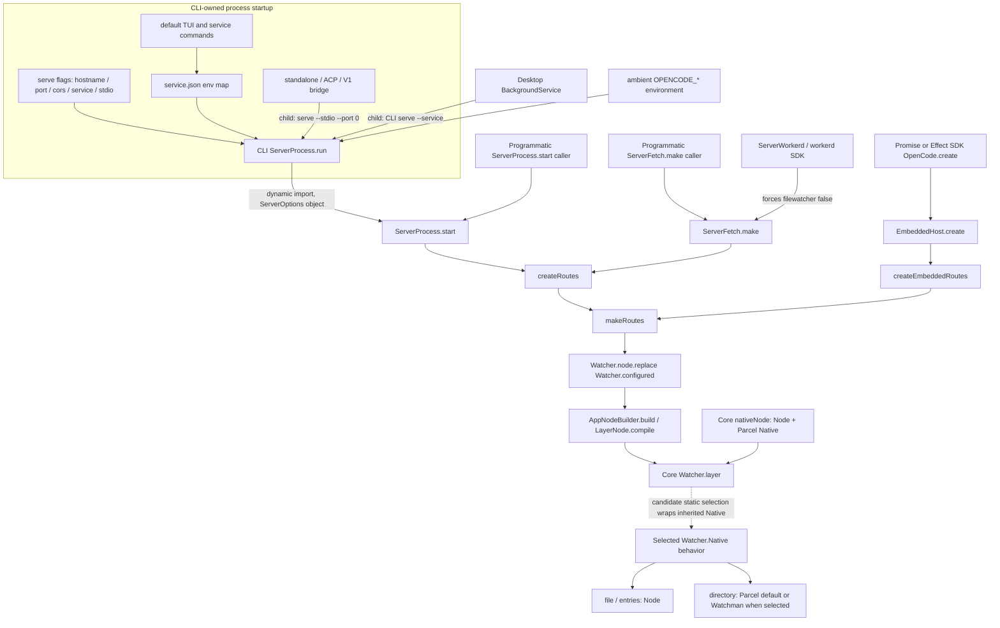

# Watchman static server-option and generated-client ownership trace

## One-sentence answer

**The smallest static path is CLI-owned environment decoding or a programmatic `ServerOptions.fs` value → `ServerProcess.start`/`ServerFetch.make`/SDK embedding → `createRoutes`/`createEmbeddedRoutes` → the existing `Watcher.node.replace(Watcher.configured(...))` seam → Core's `Watcher.layer` and fallback `Watcher.Native`; it requires no Protocol, Server `HttpApi`, OpenAPI, or generated-client change, although expanding `ServerOptions` also expands public programmatic Server and SDK option types and is therefore not literally “internal only.”**

## Scope and source state

All canonical claims below are pinned to
[`4306c07b340b9a0504e65785f366d2793cd1b169`](https://github.com/anomalyco/opencode/commit/4306c07b340b9a0504e65785f366d2793cd1b169).
The checkout's working-copy parent is that commit, but the checkout also contains
three unrelated added files; every canonical query was therefore revision
qualified. The complete command/output record is in the
[`O3/E18 scratch README`](file:///home/rektide/tmp-opencode/v4-o3-server-options/README.md).

This report traces integration ownership only. It does not select an API shape,
implement a backend, edit generated files, or run a mutating generator or test.
The v4 and dirty-v4 documents are candidate intent, not accepted source truth.

## End-to-end call graph

Solid edges exist at the source pin. The dashed final selection edge is the
smallest missing integration link implied by the candidate; no production
Watchman backend exists at the pin.

### Current versus missing link

At the pin, `ServerOptions.fs.filewatcher` reaches
`Watcher.configured({ enabled })`; no backend selector or Watchman option exists.
Core `Watcher.layer` short-circuits when disabled, otherwise obtains
`Watcher.Native` from its Effect context. The only production Native is
`nativeLayer`: Node `fs.watch` handles `file` and `entries`, while Parcel handles
`directory`. The prospective change therefore ends at an existing deep seam;
it does not need a route or protocol endpoint.

## Canonical option ownership

| Surface | Pinned definition | Current ownership fact | Consequence for the candidate path |
| --- | --- | --- | --- |
| Core watcher construction | [`packages/core/src/filesystem/watcher.ts:68-72`](https://github.com/anomalyco/opencode/blob/4306c07b340b9a0504e65785f366d2793cd1b169/packages/core/src/filesystem/watcher.ts#L68-L72) | `Watcher.Options` contains only optional `enabled`. | Backend/binary/limit values do not exist yet; Core is the runtime owner if they are added here. |
| Server host options | [`packages/server/src/options.ts:6-47`](https://github.com/anomalyco/opencode/blob/4306c07b340b9a0504e65785f366d2793cd1b169/packages/server/src/options.ts#L6-L47) | Exported `ServerOptions` has `fs.filewatcher` and `fs.fff`; it imports other option schemas from Core. | A nested startup selector fits the existing host-option channel without entering Protocol. |
| CLI process options | [`packages/cli/src/server-process.ts:19-29`](https://github.com/anomalyco/opencode/blob/4306c07b340b9a0504e65785f366d2793cd1b169/packages/cli/src/server-process.ts#L19-L29) | Internal `Options` contains mode, hostname, port, and CORS only. | Environment-only Watchman controls do not require this type or the command spec to grow. |
| CLI `serve` flags | [`packages/cli/src/commands/commands.ts:407-419`](https://github.com/anomalyco/opencode/blob/4306c07b340b9a0504e65785f366d2793cd1b169/packages/cli/src/commands/commands.ts#L407-L419), [`handlers/serve.ts:6-15`](https://github.com/anomalyco/opencode/blob/4306c07b340b9a0504e65785f366d2793cd1b169/packages/cli/src/commands/handlers/serve.ts#L6-L15) | Only hostname, port, CORS, service, and stdio are exposed. | There is no Watchman CLI flag at the pin; adding one would be extra CLI surface, not necessary for an environment-owned path. |
| CLI filesystem environment | [`packages/cli/src/server-process.ts:83-128`](https://github.com/anomalyco/opencode/blob/4306c07b340b9a0504e65785f366d2793cd1b169/packages/cli/src/server-process.ts#L83-L128) | The CLI constructs the full `ServerOptions`; `OPENCODE_*FILEWATCHER*` currently maps to `fs.filewatcher` at lines 121-127. | This is the existing owner and insertion point for static process environment mapping. |
| Managed-service configuration | [`packages/cli/src/services/service-config.ts:14-24`](https://github.com/anomalyco/opencode/blob/4306c07b340b9a0504e65785f366d2793cd1b169/packages/cli/src/services/service-config.ts#L14-L24), [`:103-115`](https://github.com/anomalyco/opencode/blob/4306c07b340b9a0504e65785f366d2793cd1b169/packages/cli/src/services/service-config.ts#L103-L115), [`:175-217`](https://github.com/anomalyco/opencode/blob/4306c07b340b9a0504e65785f366d2793cd1b169/packages/cli/src/services/service-config.ts#L175-L217) | `service.json` owns hostname/port/password/CORS plus an arbitrary string-to-string `env` map; `ServiceConfig.options()` passes that map to the child. | Proposed environment names can already be persisted through `opencode service set env NAME VALUE`; dedicated service-config fields are not required. |
| Public project config | [`packages/schema/src/config/watcher.ts:1-8`](https://github.com/anomalyco/opencode/blob/4306c07b340b9a0504e65785f366d2793cd1b169/packages/schema/src/config/watcher.ts#L1-L8), [`packages/schema/src/config.ts:63-65`](https://github.com/anomalyco/opencode/blob/4306c07b340b9a0504e65785f366d2793cd1b169/packages/schema/src/config.ts#L63-L65) | `opencode.json(c)` has only `watcher.ignore`; it is location/config data, not server startup selection. | The smallest static process path does not touch this public Schema contract. |

The candidate names—`OPENCODE_WATCHER_BACKEND`,
`OPENCODE_WATCHMAN_BINARY`,
`OPENCODE_WATCHMAN_COMMAND_TIMEOUT_MS`, and
`OPENCODE_WATCHMAN_MAX_CONCURRENT_ACQUISITIONS`, mapping to candidate
`ServerOptions.fs.watcherBackend`/`fs.watchman` and then Core options—appear only
in the candidate documents, not production source. Their naming and defaults
remain unaccepted.

### Runtime validation boundary

`ServerOptions` is an Effect `Schema.Struct`, but production startup accepts its
Type directly. The only pinned `Schema.decodeUnknown*(ServerOptions)` call is in
[`packages/server/test/options.test.ts:1-35`](https://github.com/anomalyco/opencode/blob/4306c07b340b9a0504e65785f366d2793cd1b169/packages/server/test/options.test.ts#L1-L35).
Neither `ServerProcess.start`, `ServerFetch.make`, routes, nor SDK embedding
decodes the schema. Therefore:

- adding positive-integer or non-empty-string checks to `ServerOptions` or
  `Watcher.Options` does not by itself validate CLI environment strings or
  arbitrary JavaScript callers at startup;
- the CLI currently parses its boolean filesystem environment with local
  `truthy(...)` logic at
  [`server-process.ts:204-206`](https://github.com/anomalyco/opencode/blob/4306c07b340b9a0504e65785f366d2793cd1b169/packages/cli/src/server-process.ts#L204-L206); and
- a claim that invalid Watchman environment values fail startup needs a concrete
  decode in the CLI/startup path, not merely a schema declaration.

## Startup and layer call sites

### Server package

| Entry/call site | Exact lines | Option flow |
| --- | --- | --- |
| `ServerProcess.start(options)` | [`packages/server/src/process.ts:51-62`](https://github.com/anomalyco/opencode/blob/4306c07b340b9a0504e65785f366d2793cd1b169/packages/server/src/process.ts#L51-L62), [`:90-105`](https://github.com/anomalyco/opencode/blob/4306c07b340b9a0504e65785f366d2793cd1b169/packages/server/src/process.ts#L90-L105) | Node listener startup forwards the complete object to `createRoutes`. |
| `ServerFetch.make(options)` | [`packages/server/src/fetch.ts:19-53`](https://github.com/anomalyco/opencode/blob/4306c07b340b9a0504e65785f366d2793cd1b169/packages/server/src/fetch.ts#L19-L53) | Listenerless/programmatic startup forwards the complete object to `createRoutes`. |
| `createRoutes` | [`packages/server/src/routes.ts:76-89`](https://github.com/anomalyco/opencode/blob/4306c07b340b9a0504e65785f366d2793cd1b169/packages/server/src/routes.ts#L76-L89) | Network host path; changes auth layer only, then calls shared `makeRoutes`. |
| `createEmbeddedRoutes` | [`packages/server/src/routes.ts:91-101`](https://github.com/anomalyco/opencode/blob/4306c07b340b9a0504e65785f366d2793cd1b169/packages/server/src/routes.ts#L91-L101) | SDK/in-process path; calls the same `makeRoutes`. |
| Core replacement list | [`packages/server/src/routes.ts:103-145`](https://github.com/anomalyco/opencode/blob/4306c07b340b9a0504e65785f366d2793cd1b169/packages/server/src/routes.ts#L103-L145) | Line 117 replaces `Watcher.node` with `Watcher.configured({ enabled: options.fs?.filewatcher })`; this is the precise existing handoff. |
| Application-layer build | [`packages/server/src/routes.ts:138-183`](https://github.com/anomalyco/opencode/blob/4306c07b340b9a0504e65785f366d2793cd1b169/packages/server/src/routes.ts#L138-L183), [`packages/core/src/effect/app-node-builder.ts:22-27`](https://github.com/anomalyco/opencode/blob/4306c07b340b9a0504e65785f366d2793cd1b169/packages/core/src/effect/app-node-builder.ts#L22-L27) | `AppNodeBuilder.build`/`LayerNode.compile` applies the replacement graph before handlers and `HttpApi` are layered. |
| Workerd profile | [`packages/server/src/workerd.ts:38-72`](https://github.com/anomalyco/opencode/blob/4306c07b340b9a0504e65785f366d2793cd1b169/packages/server/src/workerd.ts#L38-L72) | Its restricted options map hard-codes `fs: { filewatcher: false, fff: false }`, so local watcher selection is disabled for this runtime profile. |

### Core watcher seam

| Seam | Exact lines | Pinned behavior |
| --- | --- | --- |
| `NativeInterface` and `Native` service | [`packages/core/src/filesystem/watcher.ts:46-62`](https://github.com/anomalyco/opencode/blob/4306c07b340b9a0504e65785f366d2793cd1b169/packages/core/src/filesystem/watcher.ts#L46-L62) | Public Core module contract for physical subscriptions. |
| `Watcher.layer(options)` | [`packages/core/src/filesystem/watcher.ts:84-152`](https://github.com/anomalyco/opencode/blob/4306c07b340b9a0504e65785f366d2793cd1b169/packages/core/src/filesystem/watcher.ts#L84-L152) | Checks `enabled === false`, otherwise captures `Native`, shares physical watches through `RcMap`, and exposes logical streams. |
| Built-in `nativeLayer` | [`packages/core/src/filesystem/watcher.ts:204-228`](https://github.com/anomalyco/opencode/blob/4306c07b340b9a0504e65785f366d2793cd1b169/packages/core/src/filesystem/watcher.ts#L204-L228) | Node handles file/entries; `subscribeDirectory(...)` delegates directories to Parcel. |
| Node declarations | [`packages/core/src/filesystem/watcher.ts:229-236`](https://github.com/anomalyco/opencode/blob/4306c07b340b9a0504e65785f366d2793cd1b169/packages/core/src/filesystem/watcher.ts#L229-L236) | `nativeNode` provides `Native`; `configured(options)` builds `Service` with that dependency; `node` is the default. |

No option currently alters `Native`. Passing a richer Core option object through
the already-present `Watcher.configured(...)` call and consuming it while Core
composes the inherited Native is the smallest missing link in this call chain.
A Server import inside Core is not required.

### CLI, TUI, and desktop callers

| Caller | Exact lines | How it reaches the same path |
| --- | --- | --- |
| Direct `opencode serve` | [`packages/cli/src/commands/handlers/serve.ts:6-15`](https://github.com/anomalyco/opencode/blob/4306c07b340b9a0504e65785f366d2793cd1b169/packages/cli/src/commands/handlers/serve.ts#L6-L15), [`packages/cli/src/server-process.ts:57-128`](https://github.com/anomalyco/opencode/blob/4306c07b340b9a0504e65785f366d2793cd1b169/packages/cli/src/server-process.ts#L57-L128) | Handler calls CLI `ServerProcess.run`; that dynamically imports Server `start` and constructs `ServerOptions`. |
| Default TUI managed service | [`packages/cli/src/services/server-connection.ts:21-50`](https://github.com/anomalyco/opencode/blob/4306c07b340b9a0504e65785f366d2793cd1b169/packages/cli/src/services/server-connection.ts#L21-L50), [`service-config.ts:103-115`](https://github.com/anomalyco/opencode/blob/4306c07b340b9a0504e65785f366d2793cd1b169/packages/cli/src/services/service-config.ts#L103-L115) | `Service.ensure` spawns `serve --service`, with configured `env`. |
| `service start`/`restart` | [`handlers/service/start.ts:8-13`](https://github.com/anomalyco/opencode/blob/4306c07b340b9a0504e65785f366d2793cd1b169/packages/cli/src/commands/handlers/service/start.ts#L8-L13), [`handlers/service/restart.ts:9-17`](https://github.com/anomalyco/opencode/blob/4306c07b340b9a0504e65785f366d2793cd1b169/packages/cli/src/commands/handlers/service/restart.ts#L9-L17) | Both use `ServiceConfig.options()` and therefore its environment map. |
| Standalone/private server | [`packages/cli/src/services/standalone.ts:18-33`](https://github.com/anomalyco/opencode/blob/4306c07b340b9a0504e65785f366d2793cd1b169/packages/cli/src/services/standalone.ts#L18-L33), [`:36-62`](https://github.com/anomalyco/opencode/blob/4306c07b340b9a0504e65785f366d2793cd1b169/packages/cli/src/services/standalone.ts#L36-L62) | Spawns the same executable as `serve --stdio --port 0` and extends inherited environment. Default TUI `--standalone`, ACP, and the V1 bridge all call it. |
| ACP | [`packages/cli/src/commands/handlers/acp.ts:10-15`](https://github.com/anomalyco/opencode/blob/4306c07b340b9a0504e65785f366d2793cd1b169/packages/cli/src/commands/handlers/acp.ts#L10-L15) | Uses `Standalone.start()`. |
| V1 run bridge | [`packages/cli/src/run/v1.ts:27-44`](https://github.com/anomalyco/opencode/blob/4306c07b340b9a0504e65785f366d2793cd1b169/packages/cli/src/run/v1.ts#L27-L44) | Uses `Standalone.start(...)` unless attached to an explicit server. |
| Desktop local service | [`packages/desktop/src/main/service/background-service.ts:29-62`](https://github.com/anomalyco/opencode/blob/4306c07b340b9a0504e65785f366d2793cd1b169/packages/desktop/src/main/service/background-service.ts#L29-L62) | Spawns its bundled/development CLI as `serve --service`; desktop never imports Server options directly. |
| Desktop ambient environment | [`packages/desktop/src/main/lifecycle/environment.ts:60-71`](https://github.com/anomalyco/opencode/blob/4306c07b340b9a0504e65785f366d2793cd1b169/packages/desktop/src/main/lifecycle/environment.ts#L60-L71), [`packages/client/src/service-contender.ts:13-22`](https://github.com/anomalyco/opencode/blob/4306c07b340b9a0504e65785f366d2793cd1b169/packages/client/src/service-contender.ts#L13-L22) | Desktop imports shell environment into `process.env`; the service contender merges `process.env` into the child. |

One desktop caveat is source-visible: Desktop calls `client.Service.ensure` with
`file`, `version`, and `command`, but no `env`; therefore the CLI-owned persisted
`service.json.env` overlay is not supplied by this desktop spawn call. Ambient
desktop/shell environment still propagates. If Desktop adopts an already-running
service, that process's prior static selection remains authoritative.

### SDK and other programmatic callers

| Caller | Exact lines | Public option effect |
| --- | --- | --- |
| SDK embedded host | [`packages/sdk/src/internal/host.ts:16-44`](https://github.com/anomalyco/opencode/blob/4306c07b340b9a0504e65785f366d2793cd1b169/packages/sdk/src/internal/host.ts#L16-L44) | `CreateOptions` extends `Omit<ServerOptions, hostname | port | password>`; all remaining server options are forwarded to `createEmbeddedRoutes`. |
| Effect SDK | [`packages/sdk/src/effect/opencode.ts:13-16`](https://github.com/anomalyco/opencode/blob/4306c07b340b9a0504e65785f366d2793cd1b169/packages/sdk/src/effect/opencode.ts#L13-L16), [`:31-44`](https://github.com/anomalyco/opencode/blob/4306c07b340b9a0504e65785f366d2793cd1b169/packages/sdk/src/effect/opencode.ts#L31-L44) | Public `CreateOptions` aliases embedded-host options and reaches the in-process routes. |
| Promise SDK | [`packages/sdk/src/promise.ts:20-23`](https://github.com/anomalyco/opencode/blob/4306c07b340b9a0504e65785f366d2793cd1b169/packages/sdk/src/promise.ts#L20-L23), [`:33-54`](https://github.com/anomalyco/opencode/blob/4306c07b340b9a0504e65785f366d2793cd1b169/packages/sdk/src/promise.ts#L33-L54) | Public options inherit embedded-host options and reach the same routes. |
| Workerd SDK | [`packages/sdk/src/internal/workerd.ts:6-20`](https://github.com/anomalyco/opencode/blob/4306c07b340b9a0504e65785f366d2793cd1b169/packages/sdk/src/internal/workerd.ts#L6-L20), [`packages/sdk/src/effect/workerd.ts:10-21`](https://github.com/anomalyco/opencode/blob/4306c07b340b9a0504e65785f366d2793cd1b169/packages/sdk/src/effect/workerd.ts#L10-L21) | Uses the restricted `ServerWorkerd.Options`, not general `ServerOptions`; its generated profile disables watchers. |
| Direct Server API users | [`packages/server/src/process.ts:51-55`](https://github.com/anomalyco/opencode/blob/4306c07b340b9a0504e65785f366d2793cd1b169/packages/server/src/process.ts#L51-L55), [`packages/server/src/fetch.ts:41-53`](https://github.com/anomalyco/opencode/blob/4306c07b340b9a0504e65785f366d2793cd1b169/packages/server/src/fetch.ts#L41-L53), [`packages/server/src/routes.ts:76-100`](https://github.com/anomalyco/opencode/blob/4306c07b340b9a0504e65785f366d2793cd1b169/packages/server/src/routes.ts#L76-L100) | Exported package entrypoints accept `ServerOptions` directly. |

The exhaustive direct-call search also found the expected Server tests:
`ServerProcess.start` in `test/fixture/server.ts`, `persistent-pty.test.ts`, and
`process.test.ts`; `ServerFetch.make` in `fetch.test.ts`, `generate.test.ts`,
`session-import.test.ts`, `session-message-update.test.ts`, and `vcs.test.ts`;
`createRoutes` in `plugin-activation.test.ts` and `provider.test.ts`; and
`createEmbeddedRoutes` in `rpc-handler-errors.test.ts` and
`session-instances.test.ts`. Exact lines are preserved in
[`23-all-direct-call-sites.txt`](file:///home/rektide/tmp-opencode/v4-o3-server-options/23-all-direct-call-sites.txt).

## Internal versus public verdict

| Surface | Would the minimal startup path change it? | Verdict |
| --- | --- | --- |
| Core runtime implementation | Yes | Internal runtime behavior changes behind `Watcher.Native`, though `Watcher.Options` and `NativeInterface` are exported Core package symbols. |
| Server startup object | Yes | `ServerOptions` is host/process configuration, not wire data, but it is a public npm export because Server exports `./*`; see [`packages/server/package.json:18-20`](https://github.com/anomalyco/opencode/blob/4306c07b340b9a0504e65785f366d2793cd1b169/packages/server/package.json#L18-L20). |
| SDK create options | Yes, transitively | Public Promise and Effect SDK option types inherit `ServerOptions`; no separate wire schema is involved. |
| CLI environment/configuration | Yes | Public process configuration, but neither HTTP request nor response data. No dedicated CLI flag is required by the candidate path. |
| Protocol `HttpApi` | No | `ServerOptions` is never imported by Protocol and no endpoint accepts or returns it. |
| Server concrete `Api` | No | It is still the Protocol `makeDefaultApi(...)` instantiated with Server middleware identities. |
| `/openapi.json` | No | `HttpApiBuilder.layer(Api, { openapiPath: "/openapi.json" })` reflects the unchanged API at [`packages/server/src/routes.ts:171-181`](https://github.com/anomalyco/opencode/blob/4306c07b340b9a0504e65785f366d2793cd1b169/packages/server/src/routes.ts#L171-L181). |
| Generated client | No | Its input is Protocol `ClientApi`, not `ServerOptions`, routes, handlers, or Core layers. |

Therefore the dirty candidate's E18 sentence—“`ServerOptions` composition is
internal server startup data”—is correct only with respect to the network
contract. It is false if “internal” includes published programmatic APIs.

## Endpoint exposure audit

No endpoint at the pin exposes `filewatcher`, `fff`, a backend name, Watchman
binary/timeout/acquisition values, or `ServerOptions`:

1. The Server protocol group has one endpoint,
   [`GET /api/server`](https://github.com/anomalyco/opencode/blob/4306c07b340b9a0504e65785f366d2793cd1b169/packages/protocol/src/groups/server.ts#L4-L16),
   whose success schema is exactly `{ urls: string[] }`.
2. Its handler returns only `info.urls()` at
   [`packages/server/src/handlers/server.ts:6-13`](https://github.com/anomalyco/opencode/blob/4306c07b340b9a0504e65785f366d2793cd1b169/packages/server/src/handlers/server.ts#L6-L13).
3. `ServerInfo.Service` stores connection URLs and `options.app`, not filesystem
   options; see
   [`packages/server/src/server-info.ts:5-12`](https://github.com/anomalyco/opencode/blob/4306c07b340b9a0504e65785f366d2793cd1b169/packages/server/src/server-info.ts#L5-L12).
4. [`GET /api/config`](https://github.com/anomalyco/opencode/blob/4306c07b340b9a0504e65785f366d2793cd1b169/packages/protocol/src/groups/config.ts#L6-L21)
   returns discovered location-scoped `Config.Entry` values. That includes
   public `watcher.ignore`, but it is not the Server startup object.
5. A pinned search across Protocol and generated clients found no occurrence of
   `filewatcher`, `fff`, `watcherBackend`, `watchman`, or `ServerOptions`; see
   [`21-endpoint-exposure-search.txt`](file:///home/rektide/tmp-opencode/v4-o3-server-options/21-endpoint-exposure-search.txt).

## Generator input and current generated surface

The concrete Server API is
[`packages/server/src/api.ts:1-12`](https://github.com/anomalyco/opencode/blob/4306c07b340b9a0504e65785f366d2793cd1b169/packages/server/src/api.ts#L1-L12):
`makeDefaultApi(...)` with concrete middleware identities. The generated-client
input is separately instantiated in
[`packages/protocol/src/client.ts:17-33`](https://github.com/anomalyco/opencode/blob/4306c07b340b9a0504e65785f366d2793cd1b169/packages/protocol/src/client.ts#L17-L33)
as `ClientApi`; group `server.server` maps to the public `server` property at
[`packages/protocol/src/client.ts:35-68`](https://github.com/anomalyco/opencode/blob/4306c07b340b9a0504e65785f366d2793cd1b169/packages/protocol/src/client.ts#L35-L68).

`packages/client`'s `generate` script runs
[`script/build.ts`](https://github.com/anomalyco/opencode/blob/4306c07b340b9a0504e65785f366d2793cd1b169/packages/client/script/build.ts#L1-L4),
compiles `ClientApi` at lines
[`42-43`](https://github.com/anomalyco/opencode/blob/4306c07b340b9a0504e65785f366d2793cd1b169/packages/client/script/build.ts#L42-L43),
and emits Promise, Effect client, and Effect shape outputs at lines
[`87-119`](https://github.com/anomalyco/opencode/blob/4306c07b340b9a0504e65785f366d2793cd1b169/packages/client/script/build.ts#L87-L119).

The current generated `/api/server` surface is:

| Client | Generated surface |
| --- | --- |
| Effect types | `ServerGetOutput = { readonly urls: ReadonlyArray<string> }` and `ServerApi.get` in [`packages/client/src/effect/api/api.ts:50-55`](https://github.com/anomalyco/opencode/blob/4306c07b340b9a0504e65785f366d2793cd1b169/packages/client/src/effect/api/api.ts#L50-L55). |
| Effect adapter | `raw["server.get"]({})` and root `server` assembly in [`packages/client/src/effect/generated/client.ts:297-300`](https://github.com/anomalyco/opencode/blob/4306c07b340b9a0504e65785f366d2793cd1b169/packages/client/src/effect/generated/client.ts#L297-L300) and [`:1590-1593`](https://github.com/anomalyco/opencode/blob/4306c07b340b9a0504e65785f366d2793cd1b169/packages/client/src/effect/generated/client.ts#L1590-L1593). |
| Promise type | `ServerGetOutput = { urls: Array<string> }` in [`packages/client/src/promise/generated/types.ts:2543`](https://github.com/anomalyco/opencode/blob/4306c07b340b9a0504e65785f366d2793cd1b169/packages/client/src/promise/generated/types.ts#L2543). |
| Promise method | `client.server.get()` issues `GET /api/server` in [`packages/client/src/promise/generated/client.ts:407-421`](https://github.com/anomalyco/opencode/blob/4306c07b340b9a0504e65785f366d2793cd1b169/packages/client/src/promise/generated/client.ts#L407-L421). |

No generated type represents `ServerOptions` or SDK embedding options.

## Generation trigger matrix

The repository rule is: after changing public Protocol or Server `HttpApi`, run
`bun run generate` from `packages/client` and never edit generated client files
directly. Applied to this feature:

| Precise edit class | Changes generator input? | Client generation required? | Why |
| --- | --- | --- | --- |
| Expand Core `Watcher.Options`, add Core Watchman modules, or change `Watcher.Native` composition | No | No | `ClientApi` does not import Core. |
| Add nested filesystem fields to `packages/server/src/options.ts` | No | No | Public programmatic Server/SDK types change, but `ServerOptions` is not in any `HttpApi`. |
| Forward the fields in `packages/server/src/routes.ts` to `Watcher.configured(...)` | No | No | This changes service-layer composition only. |
| Parse new environment variables in `packages/cli/src/server-process.ts` or use existing service `env` | No | No | Process startup configuration is outside the API contract. |
| Add a dedicated CLI flag or service-config key | No | No | This changes CLI surface only. |
| Change a Server handler implementation while preserving its Protocol endpoint schema | No | No | Codegen reflects the endpoint contract, not handler internals. |
| Add selected backend/options to `packages/protocol/src/groups/server.ts` success schema, query, or payload, or add an endpoint there | Yes | **Yes** | `ServerGroup` is included in both concrete Server `Api` and Protocol `ClientApi`; generated `server.get` types/methods change. |
| Change `packages/protocol/src/api.ts` group composition or `packages/protocol/src/client.ts` `ClientApi`, names, or omission policy | Yes | **Yes** | These objects directly determine generated operations. |
| Add backend selection to public `packages/schema/src/config/watcher.ts` | Transitively yes | **Yes** | `/api/config` returns `Config.Entry`, so changing that reachable public config schema changes the wire contract even without editing the group file. |
| Change the public concrete `HttpApi` in `packages/server/src/api.ts` | By repository rule | **Yes** | The project instruction explicitly requires regeneration for public Server `HttpApi` changes; a corresponding `ClientApi` change is needed for generated output to differ. |
| Expose options by widening `GET /api/server` | Yes | **Yes** | The precise trigger would be editing the Protocol success schema plus handler return; generated Effect/Promise `ServerGetOutput` would then change. |

The Protocol package also has a separate static OpenAPI generator:
[`packages/protocol/script/generate-openapi.ts:1-21`](https://github.com/anomalyco/opencode/blob/4306c07b340b9a0504e65785f366d2793cd1b169/packages/protocol/script/generate-openapi.ts#L1-L21).
It reads the same `ClientApi`. This is distinct from the mandatory client
generation command and from the live Server `/openapi.json` route.

## Runtime dependency audit

| Package | Pinned runtime dependencies | Effect of the minimal path |
| --- | --- | --- |
| Schema | Effect/standard-schema only; [`packages/schema/package.json:26-29`](https://github.com/anomalyco/opencode/blob/4306c07b340b9a0504e65785f366d2793cd1b169/packages/schema/package.json#L26-L29) | Unchanged. Host-local backend options need not enter Schema. |
| Core | Depends on Schema, not Server/Protocol; [`packages/core/package.json:101-150`](https://github.com/anomalyco/opencode/blob/4306c07b340b9a0504e65785f366d2793cd1b169/packages/core/package.json#L101-L150) | Core can own Watchman transport/backend and option decoding without importing Server. |
| Protocol | Depends on Schema only; [`packages/protocol/package.json:28-31`](https://github.com/anomalyco/opencode/blob/4306c07b340b9a0504e65785f366d2793cd1b169/packages/protocol/package.json#L28-L31) | Unchanged when startup controls stay off wire. |
| Server | Depends on Core, Protocol, and Schema; [`packages/server/package.json:27-37`](https://github.com/anomalyco/opencode/blob/4306c07b340b9a0504e65785f366d2793cd1b169/packages/server/package.json#L27-L37) | Existing direction permits Server to import/forward Core watcher options. |
| Client | Runtime dependencies are Schema and Protocol only; [`packages/client/package.json:35-39`](https://github.com/anomalyco/opencode/blob/4306c07b340b9a0504e65785f366d2793cd1b169/packages/client/package.json#L35-L39) | Unchanged; no Core or Server dependency is introduced. |
| SDK | Depends on Client, Core, Schema, and Server; [`packages/sdk/package.json:30-38`](https://github.com/anomalyco/opencode/blob/4306c07b340b9a0504e65785f366d2793cd1b169/packages/sdk/package.json#L30-L38) | Existing composition already forwards Server options into embedded routes. |

The dependency direction can therefore be preserved exactly: Schema remains
browser-safe; Core owns runtime watcher behavior; Server maps host options into
Core; Protocol remains independent; Client remains Protocol/Schema-only; SDK
continues to compose Client/Core/Server. A Core import of Server, a Protocol
import of Core, or a Client import of Core/Server would be unnecessary and would
reverse the documented direction.

## Dirty carrier evidence, not acceptance

The candidate carrier has no production Watchman option path:

- committed W1 `620fc620` changes only Core watcher readiness/invalidation and
  its test; it adds an optional Native `invalidate` callback and ordered private
  signal handling, not backend selection;
- the working copy's only additional watcher hunk adds test-layer invalidation
  control;
- targeted diffs show no changes in Server options/routes, CLI startup, SDK,
  Protocol, or generated Client; and
- the only `watchman` source hits are the uncommitted scripted actor fixture and
  its test.

See
[`13-dirty-carrier.txt`](file:///home/rektide/tmp-opencode/v4-o3-server-options/13-dirty-carrier.txt)
and
[`14-committed-carrier-plumbing.txt`](file:///home/rektide/tmp-opencode/v4-o3-server-options/14-committed-carrier-plumbing.txt).
These artifacts establish that the Native seam can carry private invalidation;
they do not establish any Server option, CLI environment parser, layer selector,
or generated-surface behavior.

## Factual constraints for later design or implementation

1. `ServerOptions.fs.filewatcher` already owns global watcher enablement; public
   project `watcher.ignore` is a different, location-scoped contract.
2. CLI, Node listener, listenerless fetch, embedded SDK, and workerd all converge
   on `makeRoutes`; one Server-to-Core forwarding edit covers those paths, while
   their outer option owners remain distinct.
3. Workerd explicitly disables the watcher and has a restricted SDK option
   surface; general SDK inheritance does not apply to workerd options.
4. Desktop launches the CLI and inherits ambient environment, but its direct
   `Service.ensure` call does not inject the CLI service config's `env` map.
5. Static environment changes do not alter an already-running service; a new
   process/restart is the point at which CLI mapping is reevaluated.
6. `Watcher.Native` is process-global and `Watcher.layer` physically shares
   equivalent targets through one `RcMap`; selection at this seam is not
   per-request or per-location configuration.
7. Merely extending Effect schemas does not create a runtime validation boundary
   in the present startup path.
8. Keeping selection in Core/Server startup avoids every public wire and client
   generation surface. Adding it to public config or an endpoint crosses that
   boundary and requires generation.
9. Published package APIs still change even when the wire does not:
   `@opencode-ai/core/filesystem/watcher`, `@opencode-ai/server/options`, and SDK
   `CreateOptions` are externally reachable.
10. Generated Client files are outputs. The authoritative input is Protocol
    `ClientApi`; no implementation may edit those outputs directly.

## Unknowns and confidence

| Item | State |
| --- | --- |
| Current ownership/call graph | **High confidence.** Exhaustive pinned symbol and direct-call searches agree with line-by-line source inspection. |
| No current endpoint/generated exposure | **High confidence.** Protocol and generated trees contain none of the startup option names, and `/api/server`/`/api/config` were inspected directly. |
| Dependency preservation | **High confidence.** Package manifests and import sites show the complete relevant direction. |
| Exact future Core selection function/layer | **Unknown.** No production Watchman backend exists, so there is no implementation to trace below the existing Native seam. |
| Candidate option names/defaults | **Unaccepted.** They exist only in candidate documents. |
| Exact runtime validator for numeric/binary environment values | **Unknown.** The current path has no `ServerOptions` decode; the eventual owning decode point has not been implemented. |
| Exact generated diff if options are later exposed | **Edit-dependent.** The trigger and current surfaces are certain; which generated files differ depends on whether a response shape, operation, or group changes. |
| Desktop persisted-service-env parity | **Source-proven gap, operational effect untested.** The direct desktop ensure call omits `env`; no live desktop process was started. |

## Cross-references

- [`v2-readd4-validation2.gpt56solxh.md`](v2-readd4-validation2.gpt56solxh.md)
  defines O3/E18 and keeps public/generated ownership open pending this trace.
- [`v2-readd4.gpt56solxh.md`](file:///home/rektide/src/opencode-watchman-v2-readd/.design/watchman/v2-readd/v2-readd4.gpt56solxh.md)
  supplies the candidate field/environment names and asks whether they cross the
  `HttpApi`; this report confirms they need not.
- [`v2-readd4-dirty.gpt56solxh.md`](file:///home/rektide/src/opencode-watchman-v2-readd/.design/watchman/v2-readd/v2-readd4-dirty.gpt56solxh.md)
  claims E18 is internal; this report narrows that statement to “off-wire” and
  records the public Server/Core/SDK type consequences.
- [`O3/E18 scratch README`](file:///home/rektide/tmp-opencode/v4-o3-server-options/README.md)
  indexes the revision-qualified source snapshots, exhaustive call-site search,
  dirty-carrier audit, and generated-surface evidence used here.
