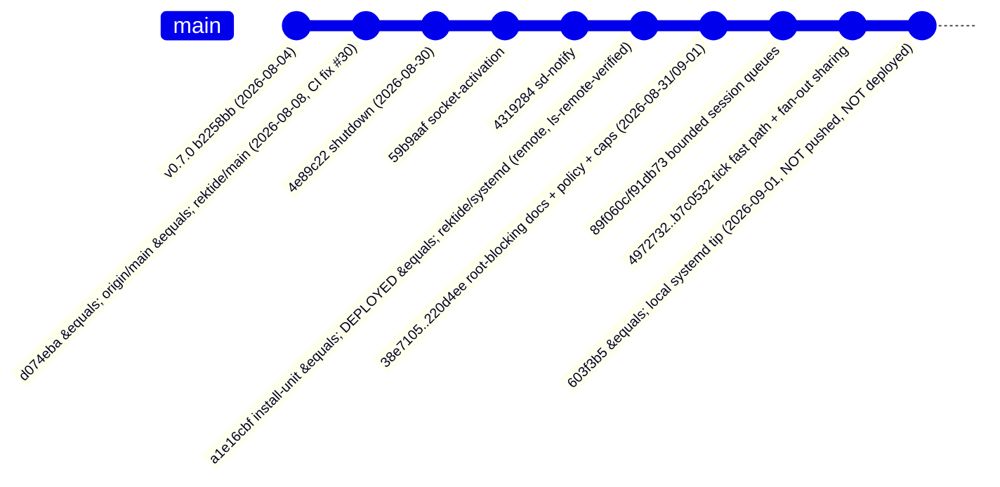

# N2 — Watchwoman revision delta: deployed `a1e16cbf` vs local `systemd` tip, tags, remotes

Scope guard: research only. No Watchwoman code was patched, no OpenCode
behavior designed, no shared doc edited, nothing committed, and the active
service was not built, redeployed, or restarted. This report states facts
about what changed and what is tested; it recommends nothing.

## One-sentence answer

Of the seven E03 behavioral surfaces, only **cancellation signaling** and
**session-queue transport behavior** changed in the 26 unpushed local
`systemd` commits (a root-retire/drop `canceled` PDU and bounded
poison-on-overrun write queues, both tested), while subscribe-ack ordering,
unsubscribe push-loop ownership, same-name bookkeeping, and foreign-clock
fresh-instance semantics are **byte-for-byte unchanged and completely
untested** at the tip, and the unsubscribe ack shape that stalls the
selected JS transport is still present there.

## Revision graph and ref freshness

All facts from `/home/rektide/a/radiosilence/watchwoman` (clean tree, HEAD
detached at the deployed pin). Read-only `git ls-remote` confirmed remote
tips; **no fetch was performed**.

| Ref | Commit | Date | Relationship to deployed `a1e16cbf` |
| --- | --- | --- | --- |
| `a1e16cbf` (HEAD, `install-unit`) | `a1e16cbf35b6bb1e4b429af53d65e738f955c32b` | 2026-08-30 | deployed pin; tip of remote `rektide/systemd` (GitHub, ls-remote-verified) |
| local `systemd` | `603f3b57fe8dbbce8d3925fb4bf03959c507cb5f` | 2026-09-01 15:04 | **26 commits ahead**, all rektide-authored, exist only locally (remote `rektide/systemd` still at `a1e16cbf`) |
| `origin/main` = `rektide/main` | `d074eba` | 2026-08-08 | deployed is 4 commits ahead (the systemd line: shutdown, socket-activation, sd-notify, install-unit); none merged upstream |
| tag `v0.7.0` | `b2258bb` | 2026-08-04 | newest tag; deployed is `v0.7.0-5-ga1e16cb`; **no newer tag exists** |
| `origin/fix/macos-memory-reclaim` | `a02ab1c` | 2026-08-04 | dangling duplicate: its fix ("root teardown leaked the entire file index") landed as PR #23 `88a5c5f`, already in deployed ancestry; not an ancestor of `a1e16cbf` itself but content-merged |
| `origin/docs/parity-gaps` | `931573d` | 2026-08-04 | README-only tweak ("drop two parity gaps that already shipped", linking issues #26/#27) on a 2026-05-15 base; never merged; no code |
| other `origin/*` (`chore/*`, `ci/*`, `release/0.7.0`) | various | ≤2026-08-04 | CI/dependency chores on old bases; none contain the 26-commit delta; none touch the seven areas |
| `tngl` remote | — | — | **dead**: `git ls-remote tngl` → "repository not found" (atproto transport repo gone) |

Freshness verdict: local remote-tracking refs are **current** as of
2026-09-05 — the 26-commit delta has never been pushed anywhere, so
"newer Watchwoman" exists only on this machine's local `systemd` branch.

## Feature-by-feature code/test delta table

| # | E03 surface (finding at deployed `a1e16cbf`) | Code at local `systemd` tip `603f3b5` | Introducing commit(s) | First-party test coverage at tip |
| --- | --- | --- | --- | --- |
| 1 | **Subscribe ack ordering**: merged ack (`files` in ack); push loop spawned before ack send → code-proven PDU-before-ack race | **Unchanged.** Handler still spawns the push loop (`subscribe.rs:58`) before building/returning the ack (`:71-86`); same single FIFO mpsc; same `start_tick` fence | none (structure identical) | **None.** No test pins ack-first ordering or exercises the race |
| 2 | **Unsubscribe push-loop ownership**: `remove_subscription` is registry-only; the loop never consults it → delivery continues after ack | **Unchanged.** `unsubscribe` (`subscribe.rs:329-348`) still only calls `root.remove_subscription` (`root.rs:450-452`); the loop self-removes only on its own exit paths (`:116`, `:255`) | none | **None.** Zero occurrences of `unsubscribe` in the entire test suite at tip |
| 3 | **Same-name subscription bookkeeping**: resubscribe spawns a second push loop; registry `insert` overwrites; duplicate PDUs | **Unchanged.** `add_subscription` is still a plain map insert (`root.rs:446-448`); untouched by the delta | none | **None.** No same-name/resubscribe/duplicate-delivery test |
| 4 | **Foreign-clock fresh-instance**: well-formed foreign clock → `tick_against` = 0 → `is_fresh_instance:false` with full file set; push PDUs hardcode `false` | **Unchanged.** `daemon/clock.rs` has an empty diff; `run.rs:106` still `is_fresh_instance = since_tick.is_none()`; hardcoded `false` at `subscribe.rs:241` and in the spliced envelope `:299` | none | **None.** No foreign-clock or fresh-instance-semantics test (only `empty_on_fresh_instance` used as a spec knob) |
| 5 | **Root-registration races**: DashMap get→scan→insert; concurrent same-path register last-insert-wins; no policy layer | **Core pattern unchanged** (get→scan→`roots.insert`, `state.rs:201-263`). **New around it**: policy gate runs *before* the idempotent existing-root lookup (`:202`), `watch`/`watch-project` pre-check (`watch.rs:19-22, 45-48`), mid-walk `max_files_per_root` abort, SIGHUP swap-then-retire ordering, `retire_root` 250 ms cancel-flush grace (`state.rs:275-284`) | `220d4ee` (policy+retire), `dc21db5` (cap), `dace6c9` (warn threshold) | **Partial, different axis.** `root_policy.rs` (6 tests) covers refusal-without-registering, subtree deny, cap refusal, broken-config fail-closed, debug-policy, SIGHUP retire — all single-registration sequencing. **No concurrent-registration test**; no test of deny-meets-already-registered-root re-watch refusal |
| 6 | **Cancellation signaling**: no `canceled` PDU; GC reap / root drop end silently | **Changed.** Push loop `select! { biased; cancel.changed() }` emits `{subscription, canceled:true, clock?}` on root retire **or drop** (channel-close lands in the same arm) (`subscribe.rs:131-152`); plumbing `root.request_cancel`/`cancel_subscribe` (`root.rs:214-221`); caller is SIGHUP `retire_root` (`state.rs:277`) via `reload_policy` (`daemon.rs:130`); GC reap reaches it through Root drop | `220d4ee` | **Partial.** `sighup_reload_retires_denied_root_with_canceled_pdu` (`root_policy.rs:237-321`) asserts the PDU (`canceled:true` + `subscription` name) on the **SIGHUP path only** — passed in my run. **Untested**: GC-reap and watch-del cancel PDUs; the shape's missing keys (no `version`, `unilateral`, `root` — vs stock's five-key shape); PDU-vs-ack ordering when retire lands pre-ack |
| 7 | **Transport compatibility**: unsubscribe ack `{unsubscribed, subscription}` misroutes fb-watchman-style key-presence classifiers → command stall; unbounded session queue buffers forever against wedged readers | **Ack shape unchanged** (still `{version, unsubscribed, subscription}`, `subscribe.rs:343-346`) → the stall stands. **Changed around it**: bounded write queue (256 PDUs / 64 MiB default, env `WATCHWOMAN_SESSION_QUEUE_PDUS`/`_BYTES`), `try_send` + poison + EOF teardown of slow readers (`session.rs:50-74, 228-273`; writer abandons mid-write, `server.rs`), head-of-line PDU exempt from the byte budget; spliced fan-out frames proven byte-identical (protocol crate tests + `identical_subscriptions_share_one_render` asserting the full envelope keys `version`/`clock`/`root`/`unilateral:true`) | `89f060c` (bounds+poison), `f91db73` (HoL exemption), `ce4f4e0`+`5d43192`+`b416f77`+`b7c0532` (frames/Arc/memoize/key-once) | **Partial.** Session budget: 5 unit tests in `session.rs` + 2 black-box (`session_queue.rs`: slow reader disconnected, healthy reader survives) — all pass. Splice byte-equality: unit tests in `watchwoman-protocol` (json + bser v1/v2) — pass. **Untested**: unsubscribe-ack classifier interaction (the E03 stall), the new canceled PDU's classification under the JS fork's key-presence rule |

## Per-area notes and exact evidence

### 1. Subscribe ack ordering — unchanged

`subscribe` at tip (`subscribe.rs:31-87`): parse → initial `query::run` →
`add_subscription` → `tick_tx.subscribe()` + `start_tick` fence →
`runtime.spawn(run_push_loop)` at `:58` → ack object built at `:71`
(`version, subscribe, clock, is_fresh_instance, root, files`). The push
loop is still running before the ack is returned to the dispatcher, so any
tick strictly greater than `start_tick` processed in that window can still
enqueue a results PDU ahead of the ack — E03's U3 race is structurally
intact. The 26 commits changed what the loop does per tick (fast path,
fragments) but not the spawn/send ordering discipline.

### 2. Unsubscribe push-loop ownership — unchanged

`unsubscribe` (`subscribe.rs:329-348`) resolves the root, calls
`root.remove_subscription(&name)` (`root.rs:450-452`, plain
`RwLock<HashMap>::remove`), and returns the same ack object. The push loop
still never reads the registry while running; it removes the (already
removed) entry only after it exits (`subscribe.rs:255`). E03's live-proven
K6 (post-unsubscribe delivery) and K7 (ack shape stalls the
fb-watchman-esm classifier) therefore still describe the tip. The new
`canceled` mechanism is **not** wired to `unsubscribe` — only to root
retire/drop.

### 3. Same-name subscription bookkeeping — unchanged

`add_subscription` (`root.rs:446-448`) is an `insert` keyed by name — the
registry clobbers, the live push loop does not. E03's live-proven
duplicate-delivery behavior (two loops, byte-identical PDUs per tick)
stands at tip. The new fragment-sharing machinery makes the duplicate PDUs
cheaper (shared encoded fragment) but does not deduplicate delivery.

### 4. Foreign-clock fresh-instance — unchanged

`daemon/clock.rs` has an empty diff between the two revisions
(`tick_against` at `:130-153`: mismatched start/pid/root → tick 0, by
design, per its own comment). `query/run.rs` was heavily refactored
(`consider` extracted; new `run_since` `:144` and `run_over_candidates`
`:178`) but `run`'s fresh computation is the same line
(`is_fresh_instance = since_tick.is_none()`, `:106`), and both new entry
points hardcode `is_fresh_instance: false` — consistent with the loop,
which always supplies a `since`. E03's U4 (foreign clock → false flag with
full file content) remains true-by-code and untested.

### 5. Root-registration races — core unchanged, new guards around it

- The get→scan→insert sequence (`state.rs:201-263`) is unchanged: two
  concurrent `watch` commands for the same canonical path both scan and
  both insert; the second insert wins and the first `Root`'s watcher task
  is orphaned. No test exercises concurrent registration.
- New: the policy check at `:202` runs **before** the existing-root
  lookup, so at tip a re-`watch` of an already-registered root that the
  (reloaded) policy now denies is refused instead of returning the
  existing root — a behavior change in the idempotent path, not covered by
  any test (the SIGHUP test retires the root first; the deny tests deny
  from the start).
- New: `retire_root` (`state.rs:275-284`) = `request_cancel()` → 250 ms
  sleep → `unregister_root`. `reload_policy` (`daemon.rs:105-131`) swaps
  the policy **then** iterates `list_roots` retiring newly-denied ones, so
  a `watch` racing a reload meets the new policy at `register_root`'s own
  re-check — the double check in `watch` + `register_root` closes the
  TOCTOU between them, by construction (no adversarial test).
- New: `max_files_per_root` aborts the initial scan mid-walk
  (`RegisterError::TooLarge`), surfaced as `CommandError::RootBlocked`
  ("watchwoman: root blocked by policy: …"). Tested
  (`file_cap_refuses_root_without_registering`).

### 6. Cancellation signaling — the one deliberate fix

- Plumbing: `Root.cancel_tx: watch::Sender<bool>` (`root.rs:104, 147`);
  `request_cancel()` (`:214`) / `cancel_subscribe()` (`:220`); the push
  loop takes a receiver at spawn and marks the current value seen
  (`subscribe.rs:124-133`) to avoid a spurious initial fire.
- Wire shape (`subscribe.rs:137-150`): `{subscription: <name>, canceled:
  true, clock?: <clock>}` — `clock` only if the `Weak` upgrade succeeds
  (i.e. retire, not drop). **No `version`, no `unilateral`, no `root`** —
  stock Watchman's terminal PDU carries all five keys
  (`{version, unilateral:true, canceled:true, subscription, root}`, E03
  shape #3). A key-presence classifier (the selected JS transport's rule:
  "unilateral iff `subscription` or `log` key present") still routes it to
  the subscription event; a client filtering on `unilateral === true`
  would not see it.
- Trigger paths: root drop also lands in the cancel arm (the comment at
  `:141-143` says so: "A closed channel (root dropped) lands here too"),
  so GC reap and daemon-side root teardown now emit the PDU — mechanism
  present, no test on those paths.
- Tested: exactly one test, the SIGHUP path
  (`root_policy.rs:237-321`), asserting `canceled:true` + matching
  `subscription` name, then root-list removal and re-watch refusal. It
  does not assert the absent keys or PDU position relative to anything
  else. Passed in my isolated run.

### 7. Transport compatibility — ack stall stands; new slow-reader EOF

- The unsubscribe ack is byte-identical across the delta
  (`{version, unsubscribed: <bool>, subscription: <name>}`) — the
  fb-watchman-esm misclassification and command stall reproduced live in
  E03 (K7) is unchanged and untested at tip.
- Session write queues went unbounded → bounded with poisoning
  (`session.rs`): `try_send` on a full channel (256 PDUs default) or a
  crossed byte budget (64 MiB default, head-of-line PDU exempt) poisons
  the session; the writer abandons its queue and any in-flight write
  (truncated frame → client parse failure), the reader loop stops waiting
  (`server.rs` `writer_done` doorbell). Consequence for transport
  consumers: a client that stops reading now gets EOF/teardown where
  `a1e16cbf` buffered indefinitely (the 2026-08-31 incident shape,
  ~1.6 GB/min against a wedged client, per the in-file comment).
- Fan-out splicing (`OutFrame` segments; `json/bser encode_pdu_spliced`)
  is additive and proven byte-identical to plain encoding by unit tests
  in both protocol encoders plus the end-to-end
  `identical_subscriptions_share_one_render` envelope assertions.
  Framing constants (5 ms settle / 1024 batch, `watcher.rs:18-19`) are
  unchanged.
- Also in the delta (context, not one of the seven): `2a291e9` fixes
  `suffix` expression/generator matching to Watchman's dotted form;
  `836930d`/`b9cadd2` prune VCS metadata dirs and add global
  `ignore_dirs` + cookie-ingest suppression; `docs/PARITY.md` gains an
  "Ignoring" section documenting these as deliberate divergences.

## Commit index (introducing/fixing; no regressions found in the seven areas)

| Commit | Date | Effect on the seven surfaces |
| --- | --- | --- |
| `220d4ee` | 2026-08-31 | root policy blocking; `request_cancel`/`cancel_subscribe`/`retire_root`; canceled-PDU emission in push loop; `RootBlocked` error; policy-before-idempotent-lookup in `register_root` |
| `dc21db5` | 2026-09-01 | `max_files_per_root` mid-walk abort → `RegisterError::TooLarge` → `RootBlocked` |
| `dace6c9` | 2026-09-01 | `warn_files_per_root` soft threshold (logs only) |
| `89f060c` | 2026-09-01 | bounded session write queues + poison (surface 7) |
| `f91db73` | 2026-09-01 | head-of-line PDU exemption from the byte budget |
| `4972732` | 2026-09-01 | tick fast path: `run_over_candidates`/`run_since`, lag/tick-gap repair (per-tick evaluation; no ordering/ownership change) |
| `5d43192`, `ce4f4e0`, `b416f77`, `b7c0532` | 2026-09-01 | `Arc` changed-list, pre-encoded frames, memoized shared fragments, key computed once (transport internals; wire bytes proven identical) |
| `2a291e9` | 2026-09-01 | suffix dotted-form fix (expression semantics) |
| `5bf3ea9`, `d5a1663` | 2026-09-01 | test hardening only (GC flake diagnostics; harness dead-daemon detection, 10 s socket wait) |
| `836930d`, `b9cadd2` | 2026-09-01 | ignore/VCS pruning (crawl content, not the seven surfaces) |
| remaining 14 | 2026-09-01 | docs (`PARITY.md`, `CONFIGURATION.md`, root-blocking design, gentle-restart design) and gitignore |

No commit in the range reverts or alters surfaces 1-4; none regresses the
canceled-PDU or queue-bound behaviors after their introducing commits.

## Deployed-vs-tip compatibility facts

1. The deployed daemon (`a1e16cbf`, per E01: process ≡ binary ≡ checkout)
   and the local tip differ by exactly the 26 local commits; the tip is
   not built, not installed, not running anywhere.
2. Wire-level: subscribe ack, later-PDU envelope, unsubscribe ack,
   flush-subscriptions stub, state-enter/leave acks, clock format, and
  `version` injection are all unchanged; the new canceled PDU and the
   slow-reader EOF are the only client-visible protocol/behavior deltas
   (plus expression `suffix` matching and ignore pruning affecting query
   *content*).
3. The selected JS transport's two E03 incompatibilities at the deployed
   pin — unsubscribe-ack misclassification (stall) and merged-ack initial
   results — are equally present at the tip; nothing in the delta was
   aimed at them.
4. `git ls-remote` (read-only) shows `rektide/systemd` on GitHub still at
   `a1e16cbf`; pushing the 26 commits would make them remotely visible
   but no such push has happened (and none was performed here).
5. Tags stop at `v0.7.0`; there is no release containing any of the
   delta, so "newer tag" is empty as a compatibility target.

## Test-run record (isolated, read-only)

- Method: `git archive systemd` extracted to
  `/home/rektide/tmp-opencode/v4-n2-watchwoman-delta/tip-src` (no working
  tree, no checkout mutation of the source repo; the repo's own
  `target/` — hardlinked into `/usr/local/bin` and the running daemon —
  was never touched), then `cargo test --workspace`.
- Result: **EXIT=0, zero failures** (`cargo-test.log` in the same
  directory). 38.5 s build, ~2 min wall total.
- Notable suites: `tests/subscribe.rs` 5/5 (incl.
  `tick_fast_path_matches_full_since_scan`, `identical_subscriptions_share_one_render`),
  `tests/root_policy.rs` 6/6 (incl.
  `sighup_reload_retires_denied_root_with_canceled_pdu`),
  `tests/gc.rs` 6/6, `tests/session_queue.rs` 2/2, `watchwoman` lib unit
  tests 24/24 (incl. 5 session-budget tests, 3 policy tests), protocol
  crate unit tests (incl. both `spliced_pdu_matches_plain_encoding`
  variants) pass.
- Toolchain caveat: tests built with rustc 1.96.0-nightly (the active
  toolchain); the deployed binary was built with 1.97.0 per E01. The
  suite passes on 1.96-nightly; no compiler-version-sensitive behavior
  was observed, but the deploy-build compiler differs from the
  test-build compiler.

## Test coverage gaps (tip `603f3b5`, verified by grep + run)

1. **Unsubscribe: zero tests.** No test in the suite sends `unsubscribe`;
   post-unsubscribe delivery continuation, ack-shape classifier behavior,
   and unsubscribe-then-quiet are all uncovered (E03 K6/K7 remain
   live-proven only, at the deployed pin).
2. **Same-name resubscribe duplicate delivery**: no test.
3. **Ack/PDU ordering** (PDU-before-ack race, canceled-before-ack): no
   test; not even an ack-first assertion on the happy path beyond
   "response contains `subscribe`".
4. **Foreign-clock / fresh-instance semantics**: no test (neither the
   false-flag-full-files case nor stock-shaped fresh transitions).
5. **Canceled PDU**: covered only on the SIGHUP-retire path; GC-reap and
   watch-del paths untested; shape completeness (missing
   `version`/`unilateral`/`root` vs stock) unasserted.
6. **Concurrent root registration** (same path, parallel `watch`): no
   test; the last-insert-wins orphan-watcher pattern is unexercised.
7. **Policy-denied re-watch of an already-registered root** (deny without
   retire): untested behavior change in the idempotent path.
8. Slow-reader EOF teardown *is* covered (unit + black-box) — the one
   transport behavior with dedicated negative tests.

## Known / Unknown

| ID | Claim | Status |
| --- | --- | --- |
| K1 | Revision graph, ref freshness, remote identities (rektide/systemd = a1e16cbf; tngl dead; no newer tag) | Known — `git` + read-only `ls-remote`, 2026-09-05 |
| K2 | Surfaces 1-4 (ack ordering, unsubscribe ownership, same-name, foreign-clock) unchanged between deployed and tip | Known — file-level diffs + unchanged `clock.rs`/`add_subscription`/`remove_subscription`/handler structure |
| K3 | Canceled PDU added (retire + drop paths) with shape `{subscription, canceled, clock?}`; tested on SIGHUP path only | Known — code + `root_policy.rs` test, passed in isolated run |
| K4 | Session queues bounded with poisoning; slow readers get EOF; splice byte-identical | Known — code + passing unit/black-box/protocol tests |
| K5 | Full tip test suite green in isolation | Known — `cargo-test.log`, EXIT=0 |
| K6 | Coverage gaps 1-8 above | Known — exhaustive grep of test tree at tip |
| U1 | GC-reap/watch-del cancel PDUs actually reaching a live subscriber (mechanism is code-proven via the channel-close arm; never executed by a test) | Unknown — not exercised |
| U2 | Behavior of the tip (vs deployed) against the real JS transport end-to-end (stall persists by shape identity; not re-run live here) | Unknown live; shape identity is Known |
| U3 | Whether the PDU-before-ack race fires more or less often under the fast path (window structure identical; timing differs) | Unknown — not measured |
| U4 | Tests passing under 1.97.0 (deploy compiler) | Unknown — only 1.96-nightly available as active toolchain here |

## Confidence

**High** on all K-rows: every claim was read directly from pinned git
revisions (`a1e16cbf` and `603f3b5` object content, not working-tree
state), cross-checked with read-only `ls-remote`, and where executable,
verified by a full isolated test run whose log is retained. Caveats: the
tip's runtime behaviors were observed only through its own test suite
(spawned private daemons on scratch sockets), never against the deployed
service; compiler version differs from the deploy build (U4); and the
remote listing is a 2026-09-05 snapshot — a push at any later moment
invalidates the "local-only" fact, which is why the exact commit ids are
recorded.

## Cross-references

- [`v2-readd4-validation0.gpt56solxh.md`](v2-readd4-validation0.gpt56solxh.md) — assigned this N2 row; its "moving branch" caveat (E01) is resolved here into exact commit geometry.
- [`v2-readd4-e03-protocol-ordering0.glm53max.md`](v2-readd4-e03-protocol-ordering0.glm53max.md) — source of the seven surfaces; every "unchanged" verdict above is a delta-check against its pinned line references.
- [`v2-readd4-e01-daemon0.glm53max.md`](v2-readd4-e01-daemon0.glm53max.md) — deployed identity facts this report inherits (pin, branch placement, socket/launch mode).
- Watchwoman's own `design/gentle-restart/gentle-restart.unknown.md` (in-tree at `603f3b5`, authored 2026-09-01) — first-party context for the queue-bounding and restart choreography; notes the service was stopped during the 2026-08-31 incident era, consistent with E01's later-verified running process (start 2026-09-01 23:33).
- Artifacts: `/home/rektide/tmp-opencode/v4-n2-watchwoman-delta/` — `cargo-test.log`, `subscribe.diff`, `root.diff`, `session.diff`, `run.diff`, `tests-subscribe.diff`, isolated `tip-src/` tree.
