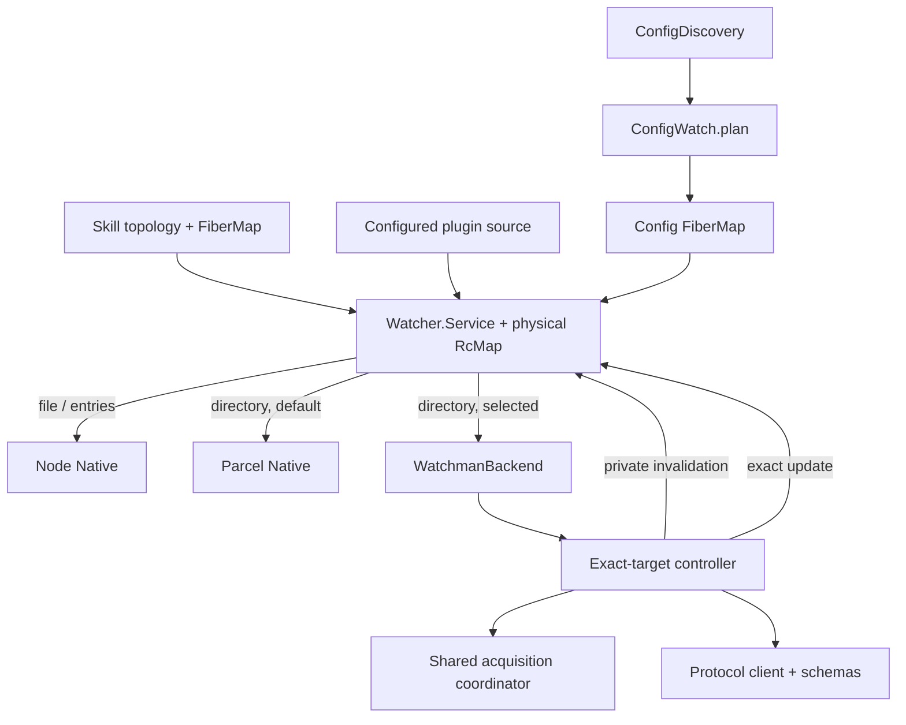

# Watchman v2 re-add architecture and evidence brief

## Status and purpose

This is the candidate successor to
[`v2-readd3`](/.design/watchman/v2-readd/v2-readd3.gpt56solxh.md). It combines
the evidence brief and the proposed v4 architecture in one document so a later
design or implementation session does not have to ingest the whole historical
corpus.

This document is deliberately honest about its assurance level:

- the current upstream seam was checked against `4306c07b`;
- the donor was mined for mechanisms rather than accepted as policy;
- a deterministic protocol actor has been written and reportedly passes its
  focused checks, but is not committed;
- owner-convergence work exists only as an incomplete, failing working-copy
  experiment;
- no production Watchman backend exists on the carrier;
- no complete independent SX architecture review survived; and
- no current live transcript from the intended Watchwoman deployment has been
  supplied.

Accordingly, this is a **draft architecture with explicit evidence gates**, not
a claim that the system has already been proven.

## Executive design

OpenCode will retain its current logical watcher service and desired-state
owners. A statically selected, dynamically loaded backend composite will route
only recursive `directory` watches to Watchman. Node continues to handle
`file` and `entries`; Parcel remains the default directory backend.

Each distinct recursive target shared by the upstream `RcMap` owns one
Watchman controller. The controller preserves three path namespaces:

- **L — logical root:** the path requested by Config, Skill, or another owner;
- **C — canonical root:** `realpath(L)` at the active target epoch; and
- **D — daemon root:** the root returned by Watchman's `watch` command.

Every initial attachment and replacement uses a new client generation and the
same protocol sequence:

```text
register listeners
→ version/capabilities
→ watch C
→ clock D
→ subscribe D since the fresh clock
→ acknowledge attachment
```

No cursor survives a generation. Before publishing a recovery generation's
exact updates, the controller emits the private Native invalidation added by
W1; each owner then performs its existing authoritative reread. The controller
maps daemon-relative rows through `D → C → L`, rejects paths outside `C`, and
applies backend and caller ignore policy before publishing exact file updates.

Process-wide acquisition admission bounds concurrent daemon contact and
suppresses connection storms. Failure remains root-local after admission:
there is no Watchman-to-Parcel fallback, no synthetic update, and no daemon
root pruning.

## Evidence vocabulary

Claims in this document carry one of these strengths:

| Mark | Meaning |
| --- | --- |
| **Known** | Directly established from current source, primary transport source, or a focused passing test. |
| **Supported** | Strongly supported by donor behavior and reviewed source, but not yet proven on the carrier or intended daemon. |
| **Provisional** | The proposed design choice; a named evidence ask remains open. |
| **Unknown** | The available material is absent, contradictory, or insufficient. |

### Complexity and model routing

Evidence asks use a factor from 1 to 5:

| Factor | Shape | Assignment |
| --- | --- | --- |
| **1** | One source lookup or mechanical confirmation | **GX** |
| **2** | Focused code/test inspection or one controlled experiment | **GX** |
| **3** | Multi-source protocol or integration investigation | **GX** |
| **4** | Cross-module reasoning with a bounded state or race question | **GX** |
| **5** | Very complex concurrent architecture or policy reconciliation | **SX** |

Only factor 5 goes to SX. Everything else goes to GX. An evidence agent should
answer one ask, write one concise append-only record under
`.test-agent/watchman-v2-readd/evidence/`, cite primary material, and stop. It
must not redesign adjacent areas or implement production code.

## Current carrier state

### Base and completed generic seam

**Known:** the carrier descends directly from upstream v2 commit
[`4306c07b`](https://github.com/anomalyco/opencode/commit/4306c07b340b9a0504e65785f366d2793cd1b169).
The baseline focused suites passed 63 tests before edits. Commit `620fc620`
adds a private `NativeSignal` invalidation path and one deterministic lifecycle
test; the resulting focused baseline was reported as 64 passing with Core
typechecking clean.

That commit is only generic watcher plumbing. It contains no Watchman client,
protocol, recovery, selection, or owner convergence.

### Uncommitted artifacts

At this document's creation, the carrier working copy has ten changed paths:

- eight incomplete W2 owner/test paths;
- `packages/core/test/filesystem/fixture/watchman/client.ts`; and
- `packages/core/test/filesystem/watchman-actor.test.ts`.

The actor's SX journal reports three passing tests, Core typechecking, formatting,
and linting. This has not been independently rerun by this document's author.

The W2 experiment is not green. Earlier execution reported two failures; the
GX review reproduced at least the new supervisor timeout, found an inverted
assertion, and found the required Skill work absent. It is evidence about the
seam, not an implementation to bless wholesale.

### Dependency state

**Known:** the fresh carrier's Core package currently contains none of:

- `@superbfowle/fb-watchman-esm`;
- `is-glob`;
- `micromatch`;
- `@types/is-glob`; or
- `@types/micromatch`.

Those dependencies appear in the donor. Any carrier dependency and lockfile
change must therefore be deliberate and attributable.

## Fixed product decisions

The following are not open evidence questions unless the requester changes
scope:

1. Watchman is opt-in; Parcel remains the default.
2. Only recursive `directory` watches use Watchman.
3. Node always handles `file` and `entries`.
4. Backend selection is static for the process; there is no automatic fallback
   or promotion.
5. Preserve `WatchInput`, exact `Watcher.Update`, and
   `subscribe(input, onReady?)`.
6. Preserve `ConfigDiscovery`, `ConfigWatch.plan`, and owner `FiberMap`s.
7. Do not add Watchman placement metadata or a root-hint API.
8. Do not add `WatchInterests`, cursor state, synthetic file updates,
   project-root consolidation, metrics infrastructure, or reactive VCS work.
9. Never send `watch-project`, `watch-del`, or automatic prune commands.
10. Every replacement uses a fresh clock and causes owner convergence.
11. Selected Watchman failure never crosses into Parcel.
12. Daemon watch retention is daemon policy.

## Architecture

### Runtime topology



The Watcher service remains the sharing and logical subscription boundary.
Watchman modules do not own Config plans, Skill discovery, or subscriber
reconciliation.

### Module boundary

Production code is grouped under
`packages/core/src/filesystem/watcher/watchman/`:

| Module | Responsibility | Must not own |
| --- | --- | --- |
| `schema.ts` | Decode command responses and subscription PDUs; typed protocol errors | Retry, root policy, owner events |
| `client.ts` | Load/validate transport factory; construct and fence generations; serialize admitted commands; timeout and decode | Root mapping, fallback, cursor persistence |
| `acquisition.ts` | Process-wide bounded admission and connection circuit | Root retry policy, protocol routes, caller permits |
| `directory.ts` | L/C/D mapping, target epochs, attach/recover/release loop, PDU buffering, filtering, symlink sentinel | Config/Skill planning, Parcel fallback |
| `backend.ts` | Composite Native: delegate `file`/`entries`, construct directory controllers | Protocol state, owner reconciliation |

Test support lives under
`packages/core/test/filesystem/fixture/watchman/`; live tests remain explicit
opt-in.

### Public and internal interfaces

The public watcher surface remains unchanged. W1's Native-only extension is:

```ts
type NativeInput = Target & {
  readonly publish: (update: Watcher.Update) => void
  readonly invalidate?: () => void
}
```

The intended internal seams are:

```ts
// client.ts
export type RawClientFactory = (binary?: string) => RawClient

export type Generation = {
  readonly id: number
  readonly client: RawClient
  readonly command: Semaphore.Semaphore
  readonly closed: Deferred.Deferred<GenerationClosed>
  readonly subscriptions: Map<string, (pdu: unknown) => void>
}

export const loadFactory: (binary?: string) => Effect.Effect<RawClientFactory, WatchmanError>
export const makeGeneration: (id: number, client: RawClient) => Generation
export const command: <A>(input: CommandInput<A>) => Effect.Effect<A, WatchmanError | GenerationClosed>
export const capabilities: (
  generation: Generation,
  required: readonly string[],
  options: CommandOptions,
) => Effect.Effect<CapabilityResponse, WatchmanError | GenerationClosed>

// acquisition.ts
export interface Acquisition {
  readonly acquire: <A, R>(
    work: Effect.Effect<A, WatchmanError, R>,
  ) => Effect.Effect<A, WatchmanError, R>
}

// directory.ts
export const subscribe: (
  input: DirectoryInput,
  dependencies: DirectoryDependencies,
) => Effect.Effect<Watcher.Subscription>

// backend.ts
export const make: (
  fallback: Watcher.NativeInterface,
  options: WatchmanOptions,
  factory?: RawClientFactory,
) => Effect.Effect<Watcher.NativeInterface>
```

These signatures are directional, not yet verified declarations. In
particular, `RawClientFactory`'s binary argument and backend construction's
scope requirements remain evidence asks E07 and E12.

### Static backend selection

Core options are proposed as:

```ts
{
  enabled?: boolean
  backend?: "parcel" | "watchman"
  watchman?: {
    binary?: string
    commandTimeoutMs?: number
    maxConcurrentAcquisitions?: number
  }
}
```

Server/CLI mapping is fixed to:

| Environment | Server option | Default |
| --- | --- | --- |
| `OPENCODE_WATCHER_BACKEND` | `fs.watcherBackend` | `parcel` |
| `OPENCODE_WATCHMAN_BINARY` | `fs.watchman.binary` | transport discovery / `WATCHMAN_SOCK` |
| `OPENCODE_WATCHMAN_COMMAND_TIMEOUT_MS` | `fs.watchman.commandTimeoutMs` | `60000` |
| `OPENCODE_WATCHMAN_MAX_CONCURRENT_ACQUISITIONS` | `fs.watchman.maxConcurrentAcquisitions` | `4` |

All numeric values must be positive integers at the owning decode boundary.
When `enabled === false`, selection returns an empty watcher before any dynamic
import. When Watchman is not selected, the Watchman transport is not imported.
Selected transport-module construction failure is a startup defect; daemon
unavailability after valid construction is supervised asynchronously.

### Transport generation

A generation owns one raw client, one Effect-level command permit, one closed
fence, and a map of active subscription routes. Event listeners are registered
synchronously before the first command:

- `subscription` routes a unilateral PDU by subscription name;
- `log` enters structured diagnostic logging;
- `connect` immediately ends a client that connected after its generation was
  retired;
- `error` and `end` converge on one idempotent close operation.

The underlying transport is FIFO with one command in flight. Effect-level
admission mirrors that property. Waiting for a permit does not consume the
command response deadline. Once submitted, a command retains admission until
response, generation close, or timeout, even if its caller is interrupted.
This prevents the Effect caller from observing an impossible reordering of the
raw transport queue.

Every command races its callback against `generation.closed`. Timeout closes
the generation. Closing clears subscription routes before ending the client.
Late callbacks are ignored by the interrupted `Effect.callback` continuation;
late PDUs are ignored because their route no longer exists.

**Supported, not carrier-proven:** these mechanics are donor-derived and were
checked against Effect rc.112 internals. E04 requires an SX concurrency review
of the complete composition rather than another broad architecture essay.

### Protocol transcript

Per attachment:

```text
["version", { optional: [], required: <expression-derived capabilities> }]
["watch", C]
["clock", D]
["subscribe", D, "opencode-<generation>-<sequence>", {
  since: <fresh clock>,
  expression: <traffic-reduction expression>,
  fields: ["name", "exists", "new", "type"]
}]
```

Release removes the local route first, then best-effort sends:

```text
["unsubscribe", D, <subscription name>]
```

The client never sends `watch-project`, `relative_root`, `watch-del`, or an old
cursor. Generation-stamped subscription names prevent collision with a zombie
subscription from a retired connection.

The exact capability list is **unknown** until E06 resolves the Watchman
expression semantics. The protocol should request only capabilities actually
required by the expression it sends.

### Controller state

The controller is one logical demand lifetime with replaceable target and
transport epochs:

```text
                 target changed / generation lost
                ┌─────────────────────────────────┐
                ▼                                 │
Pending → Acquiring → Attaching → Attached ───────┘
   │          │          │           │
   └──────────┴──────────┴───────────┴── release → Released
```

`Released` is absorbing. Every callback, retry wake-up, sentinel event, and
attachment completion checks demand and target epoch before publishing or
installing state.

#### Initial attachment

1. Resolve `L` and determine `C`.
2. Register a Node parent-entry sentinel only when the recursive logical root
   itself is a symlink.
3. Enter shared acquisition admission.
4. Construct and fully attach a fresh generation.
5. Return `Watcher.Subscription` only after subscribe acknowledgement.
6. Discard pre-ack exact rows; the Watcher service attaches the logical
   subscriber and runs its initial authoritative `onReady` afterward.

Step 6 is **provisional**. E03/E05 must confirm the exact subscribe-result and
PDU behavior and review whether discarding or retaining initial rows is the
safest rule.

#### Replacement attachment

1. Retire the previous route/generation once.
2. Re-enter the same fresh attachment sequence; never use prior clock state.
3. Buffer matching PDUs while the replacement subscription is not acknowledged.
4. After acknowledgement, call `input.invalidate()`.
5. Only after invalidation is enqueued, release buffered and later exact rows
   to `input.publish()`.

W1 then serializes each subscriber's authoritative `onReady` ahead of the later
exact update. Both controller-side and Watcher-side ordering are required.

#### Loss and control inputs

| Input | Proposed action | Confidence |
| --- | --- | --- |
| Socket `error` or `end` | Coalesce, close generation, reattach fresh | Supported |
| Submitted command timeout | Close generation, reattach fresh | Supported |
| Matching subscription cancellation | Remove route, close generation, reattach fresh | Supported |
| Malformed command response or matching PDU | Log decode detail, close/retry under backoff | Provisional |
| `is_fresh_instance: true` | Invalidate and retain subscription unless accompanied by loss | Provisional; research text was internally inconsistent |
| User release | Enter `Released`, remove route, best-effort unsubscribe, stop sentinel/retry, join controller | Supported |
| Symlink retarget | Advance target epoch, retire generation, attach new `C`, invalidate | Supported |
| Symlink deletion | Advance target epoch, retire generation, keep sentinel, invalidate owner | Provisional |

`is_fresh_instance` is not silently treated as settled. Some research called it
a loss trigger; the detailed protocol section proposed in-place invalidation
because Watchman subscriptions normally survive a recrawl. E03 must close this
question.

### Path mapping and event publication

For every file row:

```text
abs = resolve(D, row.name)
reject unless abs is contained by C
reject Watchman cookie basename
apply canonical literal ignores
logical = join(L, relative(C, abs))
apply logical-root-relative glob ignores
reject directory rows
map remaining row to create/update/delete
publish { path: logical, type }
```

The containment test is the correctness boundary when `D` is an ancestor of
`C`. A daemon expression may reduce ancestor traffic but cannot replace the
client-side check.

Directory rows must be rejected **before** event-type mapping, including
deletions. The research shorthand mapped every absent row to `delete`, which
could let a deleted directory masquerade as a file deletion if Watchman retains
`type: "d"`. E09 must establish actual row shapes, especially when `type` is
missing on deletion.

#### Ignore policy

The backend always excludes `.watchman-cookie-*` by basename both in the daemon
expression and client filter.

Caller ignores divide into:

- literals: reduce daemon traffic and are enforced against canonical paths;
- globs: enforced authoritatively with `micromatch` against POSIX-normalized,
  logical-root-relative paths using `{ dot: true }`.

`is-glob` separates the two. No hand-written partial glob language or unknown-
pattern fallback is acceptable. The exact literal behavior for symlinks,
missing paths, and paths escaping `L` remains E08.

### Symlink topology

`L` remains the owner-visible namespace while `C` may change. A recursive root
that is itself a symlink retains one inherited Node `entries` subscription on
`dirname(L)` filtered to `basename(L)`.

On a sentinel event:

1. recompute `C`;
2. ignore it when unchanged;
3. otherwise advance the target epoch before retiring old work;
4. attach the new canonical target from a fresh clock; and
5. invalidate after attachment.

On release, mark demand released before stopping the generation or sentinel.
The sentinel complements upstream Skill's own logical file watch; it does not
replace Skill topology. Whether all generic directory consumers need this
sentinel, and exact deletion/recreation behavior, remains E10.

### Acquisition and availability

One acquisition coordinator is created with the selected backend layer and is
shared by all exact-root controllers. It owns one operation:

```ts
acquisition.acquire(work)
```

Callers cannot manipulate permits, circuit epochs, or probes.

The proposed circuit states are:

```text
Closed(epoch)
Open(epoch, attempt, ready)
HalfOpen(epoch, attempt, changed)
```

Required properties:

1. no more than `maxConcurrentAcquisitions` expensive acquisition operations;
2. permit waiting is interruptible and consumes no command response timeout;
3. connection-class failure opens one shared circuit;
4. exactly one waiter becomes the half-open probe;
5. probe success wakes waiters, which still pass through bounded admission;
6. stale admitted results cannot mutate a newer circuit epoch;
7. probe interruption reopens rather than falsely closing the circuit;
8. root-specific watch, subscribe, and decode failures do not open the shared
   circuit; and
9. backend shutdown leaves no timer or probe able to construct a client.

The donor algorithm and
[`shared-acquisition-spec0`](file:///home/rektide/src/opencode-watchman-old/.design/watchman/shared-acquisition-spec0.gpt56solxh.md)
support this shape. It has not received the requested independent SX
concurrency review. Failure classification is also unresolved because raw
transport discovery may signal `error` without completing the command callback,
while capability and watch rejection arrive through callbacks. E04 and E11 are
design gates.

One raw client per exact-root controller is the current proposal. This maximizes
root-local isolation and makes connection storms the acquisition coordinator's
problem. A shared multiplexed process client would reduce connections but
couple unrelated root failure and recovery; it is outside this carrier unless
E11 demonstrates that per-root connections are operationally unacceptable.

Backoff constants are provisionally 100 ms base and 2 seconds cap, without
public retry knobs or jitter. E13 must confirm policy and deterministic-test
compatibility.

### Owner convergence

#### Config

Config widens its private/core change stream to:

```ts
type Change =
  | Watcher.Update
  | { readonly type: "invalidation"; readonly path: string }
```

Each reconciled watch's `onReady` publishes that Config-owned invalidation and
requests the existing debounced reload. Agent, Command, and Plugin Source
branch on invalidation before applying exact source-path predicates. The
invalidation never enters `Watcher.Update`.

Initial Config invalidations may have no subscribers; that is acceptable
because consumers build initial state authoritatively, while the existing
readiness reload closes the startup window. Reconciliation remains idempotent
through `FiberMap.run(..., { onlyIfMissing: true })`, so unchanged plans do not
reattach and loop.

#### Configured plugin directories

The direct configured-source directory watch uses publication to its existing
`configuredChanges` queue as `onReady`. Its never-torn-down `watched` set makes
the extra activation bounded and prevents a reattachment loop.

#### Skill

The literal v3 instruction to publish Skill refresh directly from every
`onReady` is wrong. Skill clears and rebuilds all watches during refresh, so
initial readiness would create a permanent refresh/reattach loop.

The proposed correction is an owner-local readiness phase latch:

1. create the watch with an `onReady` effect that checks whether initial attach
   has completed;
2. suppress publication during the initial call;
3. mark attached before starting stream consumption; and
4. publish to the existing debounced Skill refresh queue only on later
   invalidation-driven calls.

This preserves upstream Skill topology and avoids widening Watcher with a second
callback. The race argument is plausible but not proven. E14 requires a focused
GX state/test audit, including a test that both observes recovery and proves the
reload count becomes stable rather than looping.

### Lifecycle and failure semantics

The selected Watchman backend is available if its module and transport factory
can be constructed. Daemon absence, socket loss, watch rejection, protocol
decode failure, and cancellation remain inside a demanded controller.

The current proposal keeps the logical stream pending and retries rather than
returning `undefined`, because upstream interprets `undefined` as unsupported
and ends subscriber streams. This avoids silent loss and fallback, but it also
means a permanently invalid root or incompatible daemon may retry forever with
bounded logs. That product behavior is **not fully resolved**; E05 requires an
SX decision because Native currently has no typed failure surface.

Unsubscribe may wait for an already-submitted uninterruptible command until its
response or command timeout. This preserves raw FIFO ordering but makes the
configured timeout an upper bound on release latency. E12 must verify that this
is acceptable and that process shutdown can still terminate without leaked
work.

### Diagnostics

Use structured Effect logs, not a custom metrics subsystem. Every transition
should carry enough fields to reconstruct behavior:

- logical, canonical, and daemon roots;
- controller target epoch and generation ID;
- subscription name;
- acquisition/circuit state and attempt;
- protocol stage;
- retry delay; and
- daemon identity after `version`.

Do not log file contents, credentials, raw environment, or unbounded PDU bodies.

## Correctness invariants

The design is acceptable only if implementation and tests establish all of the
following:

1. Public `WatchInput`, `Watcher.Update`, and logical `subscribe` stay exact.
2. Invalidation is private and ordered before later exact updates per subscriber.
3. Node owns `file` and `entries` under every backend selection.
4. Parcel is the unchanged default and is never selected as Watchman fallback.
5. Identical upstream physical watch keys share one controller and release it once.
6. Every transport generation registers listeners before issuing commands.
7. Every initial and replacement attach obtains a fresh clock.
8. No retired generation callback, PDU, retry, or sentinel event can publish.
9. PDU names resolve against `D`; only paths contained by `C` may map into `L`.
10. Directory rows and Watchman cookies never become owner file updates.
11. Literal and glob ignores retain caller semantics across `L != C`.
12. Recovery invalidates only after replacement acknowledgement and before exact delivery.
13. Socket `error` and `end` cause at most one replacement.
14. Subscription cancellation affects only its exact controller.
15. Release is final from every pending protocol and acquisition state.
16. Global acquisition never exceeds its configured limit.
17. Only connection availability affects the shared circuit.
18. Waiters and stale epochs cannot bypass permits or corrupt circuit state.
19. Config indirect consumers converge without receiving synthetic path events.
20. Skill converges after invalidation and reaches a stable, non-looping state.
21. No daemon project discovery, cursor persistence, placement, automatic prune,
    custom metrics, or automatic fallback enters the carrier.

## Outstanding questions and evidence asks

### Design gates

These questions should close before this document becomes `stable`.

| ID | Question | Current position | Evidence requested | Factor / model |
| --- | --- | --- | --- | --- |
| **E03** | What are the exact ordering and shapes of subscribe acknowledgement, initial PDUs, `is_fresh_instance`, and subscription cancellation on both supported daemons? | Buffer around replacement attach; provisionally discard initial pre-ack rows; fresh instance invalidates in place. | Inspect primary Watchman source/docs and capture named live transcripts from stock Watchman and intended Watchwoman for all four cases. State whether each signal preserves the subscription. | **5 / SX** |
| **E04** | Is the combined generation/controller algorithm race-safe under callback error, socket loss, timeout, interruption, retarget, and release? | Donor-derived generation fence plus absorbing `Released` and target epochs. | Produce a finite transition table and adversarial interleaving review against the proposed APIs and Effect rc.112 cancellation semantics. Identify one owner for every close and wake-up. No redesign outside this state machine. | **5 / SX** |
| **E05** | What should a demanded Native do for permanent watch rejection, incompatible daemon, or endlessly malformed protocol when Native has no error channel? | Pending stream, bounded retry, no fallback; risks infinite retry. | Compare three policies against current `RcMap`/Config/Skill lifecycle: retry forever, fail layer/startup, or minimally widen internal failure. Select one without changing public Watcher semantics unless unavoidable. | **5 / SX** |
| **E11** | Is the shared acquisition circuit correct and necessary with one client per exact root, and which failures may mutate it? | Donor epoch-fenced circuit; connection availability only; root operations local. | Review circuit transitions, stale admissions, probe cancellation, and transport failure classification together. Compare per-root clients with one multiplexed client using measured root counts and failure isolation. | **5 / SX** |
| **E12** | Can the Scope-free Native subscription reliably own and join its controller, sentinel, timers, and uninterruptible submitted commands during release/shutdown? | Stop Deferred plus joined controller; submitted command may delay release up to timeout. | Trace resource ownership through `RcMap` acquire/release and Effect scopes. Prove no fiber/timer/client survives and state the release-latency contract. | **5 / SX** |

### Focused implementation evidence

These are bounded GX tasks. Several can close while the design gates are under
review, but none should grow into a replacement architecture exercise.

| ID | Question | Evidence requested | Factor / model |
| --- | --- | --- | --- |
| **E01** | What exact Watchwoman build is the compatibility target? | Record repository, revision/version, binary path, launch mode, socket discovery, and supported platforms. This requires deployment-owner input if not locally discoverable. | **1 / GX** |
| **E02** | Can plain `watch C` return ancestor `D`, and when is `relative_path` present? | Source/doc answer plus controlled tests where an ancestor is already watched, on both daemons. Record exact request/response. | **3 / GX** |
| **E06** | Which expression terms require capabilities, and does `['name', '.watchman-cookie-*']` perform basename glob matching at every depth? | Check primary expression docs/source and run exact expression queries. Produce the minimal required capability list and cookie term. | **3 / GX** |
| **E07** | Does `@superbfowle/fb-watchman-esm@3.0.0` install and run cleanly under the carrier's Bun/runtime matrix? | Add it only in a disposable package experiment or scratch patch; verify ESM import, constructor, binary override, `WATCHMAN_SOCK`, command callback, and package engine constraints. | **2 / GX** |
| **E08** | What are exact Parcel-compatible literal ignore semantics when `L != C`, an ignored path is missing, an ignore is a symlink, or an entry escapes the root? | Run a small parity matrix against current Parcel behavior, then specify canonical mapping. Do not infer from donor code alone. | **3 / GX** |
| **E09** | What fields are present for created, modified, deleted, and renamed files and directories? | Capture PDU rows from both daemons. Confirm `type` on deletion and define a directory-proof file event mapping. | **3 / GX** |
| **E10** | Is a backend-owned parent-entry sentinel required for every symlinked recursive target, and what happens on delete/recreate/rapid retarget? | Trace all current directory consumers and run a Node sentinel experiment through those topology changes. Return one lifecycle table. | **4 / GX** |
| **E13** | What fixed backoff policy gives bounded retries without public timing knobs? | Compare donor constants and logs; test proposed 100 ms–2 s schedule with TestClock and no jitter. | **2 / GX** |
| **E14** | Is the Skill attached-latch race-free and non-looping? | Implement only a disposable focused harness or reason against exact effects; prove missed-event coverage, one invalidation-driven reload, and stable reload count afterward. | **4 / GX** |
| **E15** | Does the scripted actor structurally match the final production `RawClient`, and are its fault controls faithful? | Compile with production types or `satisfies`; compare end/error/callback queue behavior to package source. Re-run its three self-tests independently. | **2 / GX** |
| **E16** | How can live tests force connection loss without `watch-del` or harming a pre-existing daemon root? | Define daemon-specific, reversible loss injection and cleanup. Prove no unrelated watch is deleted. | **3 / GX** |
| **E17** | Which platforms should accept Watchman selection? | Establish daemon/package support on Linux, macOS, and Windows; decide validation versus runtime retry on unsupported systems. | **2 / GX** |
| **E18** | Does Server option plumbing alter a public `HttpApi` or generated client surface? | Trace `ServerOptions` ownership and route composition; identify whether client generation is required before editing. | **2 / GX** |
| **E19** | What is the clean disposition of the current uncommitted W2 and actor files? | Inventory exact hunks and rerun only their named tests. Classify each hunk as retain, rewrite, or discard; do not modify during the audit. | **2 / GX** |
| **E20** | How many distinct exact roots does a representative live OpenCode session request? | Instrument or record logical/canonical roots without changing selection policy. Report overlap and connection count; this informs E11 but does not reopen project-root consolidation. | **2 / GX** |

### Evidence completion format

Each ask should return:

1. a one-sentence answer;
2. exact source/version/environment;
3. command or code references;
4. observed data or transition table;
5. confidence and remaining caveat; and
6. the specific design paragraph or invariant it confirms or changes.

No ask should produce a broad redesign, implementation branch, test suite beyond
its experiment, or another corpus-scale journal.

## Verification architecture

### Deterministic layers

| Layer | Required proof |
| --- | --- |
| Actor | FIFO commands, complete payloads, real capability queueing, listener order, held and late replies, unilateral PDUs, error/end, termination, useful missing/duplicate diagnostics |
| Protocol client | Schema decode, timeout starts after admission, callback-vs-close race, late callback fence, error/end close coalescing |
| Directory attach | Exact version/watch/clock/subscribe transcript, fresh clock, D/C/L mapping, directory suppression, release ordering |
| Recovery | PDU-before-ack buffering, invalidate-before-exact, new generation/name/clock, cancellation, fresh instance, release at every barrier |
| Acquisition | Limit, open/half-open/probe transitions, stale epochs, cancellation, root-local errors, shutdown |
| Topology/filter | Ancestor root containment, symlink retarget/delete/recreate, literal/glob parity, root/nested cookies |
| Owners | Config invalidation, exact-filter bypass, Plugin Source activation, Skill convergence and anti-loop count |
| Selection | Parcel default, explicit Parcel equivalence, Watchman directory-only route, disabled short-circuit, validated options, lazy import |

Tests use named barriers and `TestClock`; fixed sleeps are unacceptable when a
condition can be observed directly.

### Live evidence

The release gate is the named intended Watchwoman build. Stock Watchman is a
compatibility target only if product scope confirms it in E01.

Each live record includes:

- OpenCode commit and operating system;
- daemon repository/version and binary;
- socket selection and version response;
- exact protocol transcript;
- L/C/D roots and root list before/after;
- create/update/delete and directory-row behavior;
- forced connection loss and post-recovery owner state;
- fresh clock and invalidation ordering;
- cookie, ignored, ancestor-sibling negative observations; and
- final release with no `watch-del` or leaked subscription/client.

## Known exclusions audit

Before acceptance, the carrier diff must be searched for and explain any
occurrence of:

```text
watch-project
watch-del
relative_root
cursor
WatchInterests
placement
synthetic
metrics
fallback
```

Occurrences in tests or documentation may explain forbidden behavior; none may
reintroduce it into the production architecture. `config/discovery.ts` and
`config/watch.ts` remain byte-identical to upstream unless a separately approved
upstream change requires otherwise.

## Decision record

### Accepted for this draft

- Carrier architecture, not donor merge.
- Directory-only Watchman composite.
- L/C/D path model with client-side containment.
- Fresh clock per generation and no cursor.
- Private invalidation followed by exact updates.
- Generation-stamped routes and local-first detach.
- Full glob support rather than a partial custom matcher.
- Skill-specific initial-readiness suppression.
- Shared bounded acquisition with root-local post-admission failure.
- Static minimal options and structured logs rather than metrics.

### Explicitly provisional

- in-place versus replacement handling of `is_fresh_instance`;
- initial pre-ack row disposal;
- permanent failure behavior under a Scope-free, infallible Native;
- exact error-to-circuit classification;
- per-root raw-client topology and circuit necessity at measured scale;
- resource ownership and release latency under uninterruptible command admission;
- expression capability requirements;
- literal ignore mapping through missing/symlinked paths;
- directory deletion row classification; and
- symlink deletion/recreation behavior.

### Missing review

The planned independent SX architecture pass was cancelled and produced no
usable architecture document. The completed SX actor work is valuable W3 test
evidence, not a substitute for the factor-5 state-machine and availability
reviews. This draft must not claim that comparison occurred.

## Promotion criteria

Promote this document from `draft` only when:

1. E03, E04, E05, E11, and E12 have explicit decisions;
2. E01 identifies the mandatory daemon target;
3. E06, E08, E09, E10, and E14 close the protocol/path/owner ambiguities;
4. all changes to provisional sections are incorporated here with citations;
5. one contradiction pass confirms module APIs, state transitions, and tests
   describe the same behavior; and
6. a human accepts the resulting availability and permanent-failure policy.

Implementation can then proceed against this architecture without reopening
settled exclusions or outsourcing the whole design again.

## Cross-references

- [`v2-readd3`](/.design/watchman/v2-readd/v2-readd3.gpt56solxh.md) supplies the
  carrier direction and work graph; this revision corrects its path, PDU, and
  Skill assumptions and separates evidence from proposal.
- [`research0.glm53max.md`](/.design/watchman/v2-readd/v2-research0.glm53max.md)
  validates current upstream seams and records acquisition, filtering, options,
  and donor dispositions. Its final glob-support addendum supersedes its earlier
  partial-matcher recommendation.
- [`protocol0.glm53max.md`](/.design/watchman/v2-readd/v2-protocol0.glm53max.md)
  supplies transport-source findings, command admission, actor requirements,
  and controller hazards; its fresh-instance sections are intentionally sent
  back to E03 because they do not agree completely.
- [`owners0.glm53max.md`](/.design/watchman/v2-readd/v2-owners0.glm53max.md)
  supplies the Config/Plugin Source validation and identifies the Skill
  readiness livelock.
- [`actor0.gpt56solmax.md`](/.design/watchman/v2-readd/v2-actor0.gpt56solmax.md)
  records the uncommitted deterministic actor and its reported checks.
- [`shared-acquisition-spec0`](file:///home/rektide/src/opencode-watchman-old/.design/watchman/shared-acquisition-spec0.gpt56solxh.md)
  is the donor-independent statement of circuit invariants that E11 must audit
  against the final transport classification.
- [`review-failure-paths0`](file:///home/rektide/src/opencode-watchman-old/.design/watchman/review-failure-paths0.gpt56s.md)
  supplies pre-attachment loss and callback-failure analysis.
- [`review-simplification0`](file:///home/rektide/src/opencode-watchman-old/.design/watchman/review-simplification0.gpt56s.md)
  motivates one attach operation and static backend selection.
- [`watchwoman0`](file:///home/rektide/src/opencode-watchman-old/.design/watchman/watchwoman0.unknown.md) records the
  `watch-project` `$HOME` crawl incident that makes daemon root discovery an
  explicit exclusion.
- [`cookie-clash0`](file:///home/rektide/src/opencode-watchman-old/.design/watchman/cookie-clash0.gpt56s.md) records why
  cookie suppression belongs at both daemon and client boundaries.
