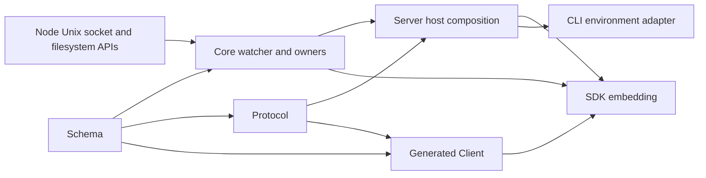

# Watchman v2 re-add — owned sessions and authoritative rescans

## 1. Decision and status

**Add one deep, opt-in recursive-watch adapter behind `Watcher.Native`: it owns terminal, socket-only JSON-line sessions, publishes directory-inclusive path invalidations, and restores owner state through ordered authoritative rescans rather than reconstructing an exact filesystem history.**

This is an independent first architecture draft by **OpenAI GPT-6 Astra, xhigh**. Research is complete; this document selects policy, not implementation. It does not authorize source edits, revise either v4 candidate or an execution prompt, or claim that the proposed implementation has passed tests. No GX first-draft output was read.

The design deliberately spends complexity on observed failures: physical release, acquisition storms, daemon protocol differences, path topology, and owner attachment gaps. It removes complexity that has no current consumer: file-identity baselines, a third root namespace, redundant callback wrappers, and generic daemon command support.

**Release caution:** independent source review also found a read/open-notification feedback risk in the deployed daemon (§10). Watchwoman is the mandatory intended compatibility target, not a composition this draft declares releasable today. If the required real-owner quietness gate reproduces the predicted loop, this design selects a separately authorized daemon correction and a new pin as prerequisites—not a lossy client workaround or silent stock substitution.

### Evidence language

- **Observed**: established by the accepted source-pinned or executable corpus, qualified by its validations.
- **Selected**: policy proposed here for human acceptance.
- **Required proof**: an executable obligation for the eventual implementation, not a result of this writing session.

The canonical implementation base is OpenCode `4306c07b340b9a0504e65785f366d2793cd1b169`, with Effect `4.0.0-rc.112`. The dirty carrier is audited user work, not the destination or an accepted implementation. Both historical candidates were read as inputs: [v4 evidence brief](file:///home/rektide/src/opencode-watchman-v2-readd/.design/watchman/v2-readd/v2-readd4.gpt56solxh.md) and [dirty v4](file:///home/rektide/src/opencode-watchman-v2-readd/.design/watchman/v2-readd/v2-readd4-dirty.gpt56solxh.md).

### Twelve decisions at a glance

| Question | Selected answer |
| --- | --- |
| Daemon and platform scope | Watchwoman `a1e16cbf` is mandatory; installed stock `54602bca` is a second compatibility target. First release is experimental, Linux x86-64, validated on glibc; other hosts cannot select this backend yet. |
| Transport | Replace the JS `Client`, not wrap it. A narrow Core-owned JSON-line Unix session owns its socket and termination. No locator process, BSER dependency, daemon spawn, or binary option. |
| Startup and permanent failure | Invalid configuration/platform fails construction; absent daemon does not. Known incompatibility parks observation with a prominent diagnostic until host restart. Unknown root rejections retry slowly; no `undefined`, defect conversion, or Parcel fallback for selected directories. |
| Topology and acquisition | One socket/subscription per upstream physical watch key; four concurrent complete attachment attempts by default; same-canonical-root attachment serialization; a strict-epoch availability circuit. |
| Recovery | Fresh clock and unique name on every connection; serialize installation and publication; account for merged acknowledgements and pre-ack PDUs; in-band freshness invalidates without reconnecting. |
| Events | Keep `Watcher.Update` unchanged. Existing rows become `update`, absent rows `delete`, including directories. Do not claim exact `create`; do not retain inode baselines. |
| Paths and ignores | Two namespaces only: logical `L`, canonical `C`; successful plain `watch C` must return `C`. Publish and filter literals in `L`; compile full Parcel-compatible glob patterns. |
| Symlinks and root topology | Immediate-parent sentinel plus periodic path-identity revalidation, including ancestor retargets; close obsolete sentinel before rearming. Same-canonical-path root inode replacement is explicitly quarantined, not falsely repaired by resubscribe. |
| Owners | Retain W1 and useful W2 mechanics. Change Skill refresh to reconcile retained watch fibers, then make every readiness request a rescan; do not accept the first-call latch as the final gap-closing solution. |
| Options | A discriminated `fs.watcher` startup option, CLI environment adapter, Core-owned runtime decode, no wire schema change. Exported Server/Core/SDK types do change. |
| Carrier | Preserve all existing material; reuse W1 and selected W2 hunks; rewrite the broken supervisor test and replace the actor interface. Historical prompts remain historical. |
| Verification | Real Native-seam tests, deterministic internal fault controls, private JSON socket fixtures, both private daemons, OS resource checks, explicit platform and packaging gates. |

## 2. Product contract and non-goals

### The useful contract

For a demanded recursive root whose daemon observation is healthy, delivered path changes trigger the owning domain's authoritative reread. After a detected connection gap or supported target retarget, readiness is replayed before subsequently published path updates. An owner that subscribes late must do its own readiness reread; a watcher is not a replayable event journal.

`Watcher.Update` remains the type-agnostic `{ path, type }` structure used today. It does **not** imply regular-file-only events or complete operation identity. The selected Watchman adapter supplies invalidation hints at known paths, not a mirror of a filesystem transaction log. Current recursive consumers need this smaller contract; the app file tree is not downstream of these recursive watches at the base pin ([directory-owner evidence](v2-readd4-owner-directory-signal0.gpt56solxh.md)).

### Preserved behavior

- Parcel remains the default recursive backend, unchanged in behavior.
- Node remains the adapter for public `file` and `entries` requests.
- Keep `WatchInput` and `subscribe(input, onReady?)` unchanged.
- Keep `ConfigDiscovery` and `ConfigWatch.plan` unchanged; owners remain responsible for source discovery and desired watches.
- Keep physical sharing in the existing `RcMap`; do not introduce a second desired-interest registry.
- Selection is static per constructed host runtime. Separate SDK runtimes and processes have separate resource budgets.
- No fallback to Parcel after explicit Watchman selection.

### Explicit exclusions

No `watch-project`, `relative_root`, project-root consolidation, persistent cursor, synthetic filesystem update, daemon root deletion/pruning, daemon installation/spawn/restart, VCS expansion, custom metrics subsystem, or public retry-tuning suite. No exact create/recreate/rename identity or child-event completeness is promised. No following arbitrary child symlinks inside a recursive root; owners such as Skill still discover and watch external targets explicitly.

The adapter does not fix Watchwoman's retained daemon sessions, stale child index entries, or root-inode replacement behavior. Those limitations constrain support below rather than disappearing behind a green client test.

## 3. Compatibility and availability policy

### Formal initial scope

| Composition | Product status and gate |
| --- | --- |
| Linux x86-64/glibc, Bun 1.4.2, deployed Watchwoman `a1e16cbf` | Mandatory experimental release gate using the eventual implementation. The old package probe is not that gate. |
| Same host class, installed stock `54602bcad27e0887fd26f77c6747a38f0d701fc7` (`20260708.093114.0`) | Mandatory second-daemon conformance run, explicitly labeled as this older binary. |
| Stock source `923b0935` | Source compatibility target; exact-binary certification requires building and running that pin. It is not proven by the installed fallback. |
| Watchwoman local tip `603f3b5` | Forward-compatibility fixture for cancellation and malformed-frame/overrun handling, not the deployed release target. |
| Node embedding / alternate Node CLI | Require the new transport's Node 26.6.0 conformance run and the actual distributed Node 26.4.0 build/smoke lane before advertising those compositions. |
| macOS, Windows, arm64, musl, other hosts | Not enabled by this first release. Component CI/artifacts do not prove the composition. Existing Parcel/Node paths remain available. |

The platform gate is based on an explicit host classification, not successful package import. The Core construction adapter obtains OS/architecture/libc from the existing build/runtime environment; unknown libc is unsupported for this experimental selector rather than guessed to be glibc. Its host detector is a small internal test seam. No minimum glibc version is inferred from Bun alone: the deployed Watchwoman bytes require newer glibc than Bun, and the external daemon's own loading requirements remain the operator's responsibility ([E17](v2-readd4-e17-platform0.gpt56solxh.md)).

Daemon family is recognized from a decoded `version` response and tested response shapes. `buildinfo: "watchwoman 0.7.0"` identifies a family, **not** the `a1e16cbf` commit. Runtime negotiation checks capabilities; release records pin executable hashes. No runtime claim cryptographically identifies an unstamped Watchwoman binary.

### Fail early only for facts known at construction

Core decodes the new watcher option once while constructing its layer. Invalid backend, missing socket configuration, empty/non-absolute/NUL-containing socket path, invalid numeric limits, unsupported host, or failed selected-module import fails that layer with `WatcherStartupError`. CLI startup and SDK creation surface that error normally. Decode happens even for JavaScript callers; a TypeScript type alone is not validation.

Disabling watchers short-circuits backend loading and host checks after syntactic option validation. Default/explicit Parcel does not load the Watchman implementation. Do not test socket existence or daemon readiness during host construction: daemon downtime is recoverable, and a socket path may be supplied before its listener exists.

### Demand-time failure policy under infallible, Scope-free Native

| Failure | Disposition | Owner-visible behavior |
| --- | --- | --- |
| Connect ENOENT/ECONNREFUSED, socket EOF/error, command timeout during attach | Retire the attempt; availability circuit/backoff; retry while demanded. | Before first attach, `Native.subscribe` stays pending; after first attach, logical streams remain subscribed. |
| Target missing/dangling/not currently a directory | Wait for path revalidation, without constructing a socket on every poll. | On transition from a previously attached target, enqueue one private invalidation so owners can observe absence. |
| Socket access denied or explicit required capability missing/unsupported daemon family | Park backend observation with a classified diagnostic; restart the host after correcting configuration/compatibility. | Do not end streams or invent readiness. Before first attach they remain pending; after attach they remain quiet. |
| Reachable daemon rejects `watch`, `clock`, or `subscribe` | Root-local retry, exponential delay capped at 30 seconds. Do not infer permanent permission/policy categories from error prose. | Repeated failures are rate-limited in logs; eventual successful attachment replays readiness. |
| Malformed command/PDU, impossible response association, oversized frame | Close affected session. Retry at most three consecutive protocol-failing generations for that key, then park it until host restart. | No malformed update escapes; one diagnostic describes exhausted compatibility recovery. |
| Same `C`, changed root `(dev, ino)` after a prior successful observation | Quarantine `C` for this backend lifetime; retire all locally known affected controllers. | One invalidation, then no false successful rearm. Operator must rebuild the daemon root by deliberate means and restart OpenCode. |
| Explicit release / backend shutdown | Absorbing stop, joined local cleanup; never a retry or circuit failure. | No further publication or attachment. |

Three consecutive protocol failures reset only after one successful full attachment followed by a valid heartbeat or data batch; a bare TCP/Unix connect is not success. A protocol failure with the same static root does not become a process startup error retroactively. Backend-global compatibility parking is reserved for explicit handshake facts; malformed traffic parks the affected key after the bounded attempts, not every unrelated root.

This is an explicit **stale-but-running** availability choice, not fail-fast process termination. Current Config/Skill/Plugin watch fibers do not expose typed observation failure; returning `undefined` or dying silently is worse ([E05](v2-readd4-e05-native-failure0.glm53max.md)). Structured errors must identify `observation=parked`, scope, reason, corrective action, and whether the root was ever attached. Logs are the initial operational surface; adding an HTTP health endpoint would be a separate public-contract change.

Ordinary daemon rejection may actually be permanent, but the wire provides no stable taxonomy to prove that. Selected policy therefore uses indefinite **slow** root retries for that class, and indefinite bounded shared retries for genuine availability failure. Known configuration/compatibility failures do not spin forever.

## 4. Deep modules and dependency layout

Use the [deep-module vocabulary](file:///home/rektide/.agents/skills/codebase-design/SKILL.md) literally: the **interface** includes ownership, ordering, errors, and cost, not just methods. The external **seam** is already present at `Watcher.Native`; keep it there.

```text
packages/core/src/filesystem/
  watcher.ts                       existing public seam, RcMap, W1, selection
  watcher/watchman/
    options.ts                     host-independent option schema and error data
    directory.ts                   deep recursive adapter and controller implementation
    session.ts                     deep owned Unix/JSON protocol-session module
    paths.ts                       ignore plan and path-identity observation implementation

packages/core/test/filesystem/
  watchman-directory.test.ts        tests through real Native + Watcher seam
  watchman-session.test.ts          actual private sockets and protocol fixtures
  watchman-paths.test.ts            filesystem topology and Parcel comparison
  fixture/watchman/
    peer.ts                        deterministic protocol-peer adapter
    socket.ts                      private Unix server / relay apparatus

packages/core/src/config/plugin/skill.ts    owner-local watch reconciliation
packages/server/src/options.ts             exported host shape
packages/server/src/routes.ts              one mapping into Core
packages/cli/src/server-process.ts         environment spelling adapter
```

`directory.ts` is not a façade over exported `Generation`, `Root`, `Route`, `Circuit`, `Filter`, and `Controller` services. Those are implementation concepts. Keep the circuit, canonical-path locks/witnesses, finite controller reducer, acknowledgement gate, timers, and publication decisions private to this module. Extract internal functions when they name a real operation, not to manufacture a pass-through stack.

| Module | Small interface | Hidden implementation / depth | Concrete adapters and internal test seams |
| --- | --- | --- | --- |
| Existing Watcher | `subscribe(input, onReady?)` | Structural sharing, reference lifetimes, ordered logical delivery and readiness. | Existing Node/Parcel Native; new Watchman Native; existing test Native. |
| Watchman directory | Scoped construction returning a `NativeInterface` | Acquisition/circuit policy, one controller per demand, path retarget, heartbeat, subscription protocol, event mapping, release. | Production `Session.open` and scripted peer factory; production path observer and controlled topology source. Tests principally exercise Native through Watcher. |
| Owned session | Scoped `open`, serialized `request`, idempotent terminal `close` | JSON framing, correct command/PDU association, deadlines, socket lifecycle, bounded byte retention, close-before-callback settlement. | Actual Unix socket; socket fixture that holds/fragments/reorders permitted protocol frames and closes either end. |
| Paths | Compile one immutable filter; observe current root/parent identity and changes. | Literal/glob parity, canonical/logical mapping, direct sentinel, coalesced rechecks, periodic ancestor checks, close-before-rearm. | Real filesystem; topology adapter for controller interleavings. It does not discover Config/Skill sources. |

Deleting the directory module would move lifecycle, uncertainty, and retarget complexity into Config, Skill, and Plugin Source. It earns its depth. Deleting a hypothetical `backend.ts` that only delegates three request kinds would remove indirection, not behavior; do not add it.

### Interface sketches

These sketches settle the architectural contract; imports and precise schema declarations must be checked by package `bun typecheck` during implementation. They intentionally expose no raw client fields or mutable route map.

```ts
// watcher/watchman/options.ts — Core-owned, off-wire exported types
type DirectoryOptions =
  | { readonly backend: "parcel" }
  | {
      readonly backend: "watchman"
      readonly socket: string
      readonly commandTimeoutMs?: number
      readonly maxConcurrentAcquisitions?: number
    }

// directory.ts — external seam stays Watcher.NativeInterface
declare const make: (
  inherited: Watcher.NativeInterface,
  options: ValidatedWatchmanOptions,
) => Effect.Effect<Watcher.NativeInterface, WatcherStartupError, Scope.Scope>

// session.ts — internal to the Watchman implementation, never Server options
type Command =
  | { readonly type: "version"; readonly required: readonly string[] }
  | { readonly type: "watch"; readonly root: string }
  | { readonly type: "clock"; readonly root: string }
  | {
      readonly type: "subscribe"
      readonly root: string
      readonly name: string
      readonly since: string
      readonly expression: Expression
    }
  | { readonly type: "unsubscribe"; readonly root: string; readonly name: string }

interface Session {
  readonly request: (command: Command) => Effect.Effect<CommandResult, SessionFailure>
  readonly close: () => Effect.Effect<void>
}

declare const open: (
  options: { readonly socket: string; readonly commandTimeoutMs: number },
  receive: (frame: SubscriptionFrame) => void,
  lost: (failure: SessionFailure) => void,
) => Effect.Effect<Session, SessionFailure, Scope.Scope>
```

`CommandResult` is a tagged decoded union, not `unknown` passed repeatedly through the stack. `SubscriptionFrame` is decoded once at the session seam, then checked against the controller's expected name/root/epoch. Production construction injects `Session.open` and the path observer internally; a test-only construction helper supplies deterministic adapters. No public factory option is added to Server or SDK.

### Dependency direction



Arrows mean “provides a dependency to”; no reverse runtime import is permitted. In concrete imports: Core never imports Server/Protocol; Protocol/Client never import Core/Server; Server imports Core's option schema; SDK composes the existing packages. New intra-project TypeScript imports use explicit `.ts` extensions. Host-only networking is dynamically loaded only for the selected backend; workerd stays disabled.

## 5. Replace the transport, and remove discovery ownership entirely

### Why replacement, not wrapping or a small fork

**Observed:** the published `Client` steals any object with a top-level `subscription`/`log` key, strands callbacks on errors, has nonterminal `end()`, and cannot cancel or join its locator child ([E07](v2-readd4-e07-transport-conformance0.glm53max.md), [raw lifecycle](v2-readd4-e12-transport-lifecycle0.glm53max.md)). A wrapper would need to reach inside the socket, decoder, command queue, discovery closure, and listener ordering. That is replacement disguised as adaptation.

**Selected:** implement only the five commands above over newline-delimited compact JSON on an explicit Unix socket. Both daemons already support this wire format; E02, E03 stock-live, E09, and E16 used it. Keep requests in **array wire form**: the older stock binary can abort on object-form requests. JavaScript JSON handles escaped newline characters in paths without changing frame delimitation. Request only string/boolean row fields, avoiding BSER integer/endianness and inode precision concerns.

Do not depend on `@superbfowle/fb-watchman-esm` or its omitted declarations, and do not add a BSER dependency merely because the historical client used one. JSON throughput is a required measurement for the new implementation; the accepted BSER pressure results cannot certify it. A future BSER adapter is justified only by a measured bottleneck, not by the old package's existence.

### Socket selection is deliberately explicit

Core accepts one absolute socket pathname. CLI maps `OPENCODE_WATCHMAN_SOCKET`, otherwise `WATCHMAN_SOCK`, into it. Programmatic callers supply it explicitly; Core does not read ambient environment. A service manager may socket-activate the daemon when OpenCode connects, but that external process is not an OpenCode child.

There is **no binary option or locator subprocess**. This removes an observed unbounded resource owner, not a hypothetical optimization. My primary-source review additionally found that Watchwoman's `connect_or_spawn` unlinks an ECONNREFUSED socket pathname **before checking `no_spawn`** ([`cli.rs` at the deployed pin](https://github.com/rektide/watchwoman/blob/a1e16cbf35b6bb1e4b429af53d65e738f955c32b/crates/watchwoman/src/cli.rs#L1260-L1292)). Merely changing the old locator to `--no-spawn` is therefore not a read-only discovery contract at this pin. OpenCode neither unlinks a daemon socket nor assumes a filesystem location from the daemon brand.

### Request, frame, and termination rules

1. Register socket `connect`, `data`, `error`, `end`, and `close` handlers and its cleanup ownership before initiating connection.
2. Own **one** request queue/permit. There is no second raw FIFO underneath it. Waiting is interruptible; response timeout starts only when the command is written. Connection establishment has its own instance of the same configured deadline.
3. A normal typed daemon rejection consumes the current command and does not imply transport failure.
4. If a submitted request is interrupted, close the whole single-owner session. Do not free its slot and continue using a stream whose next response no longer has an owner. This is cheaper and safer than the donor's uninterruptible response wait because no unrelated root shares the session.
5. `error`, `end`, timeout, parse failure, and explicit close converge on one synchronous terminal latch. Set it **before** rejecting any request or notifying the controller. No later request reconnects this Session object.
6. Call `socket.destroy()`, then await local socket `close`; do not wait for peer FIN. Settle each pending request exactly once, clear queues/decoder retention, and detach listeners once close is observed. No callback or completion after terminal state can write or publish.
7. Scope finalization calls the same close operation. No detached cleanup fiber, ignored unjoined Promise, or late-connect compensator is part of normal ownership.

### Classification, not key guessing

Decode the common object envelope once. Classify in this order:

| Frame | Association |
| --- | --- |
| `unilateral:true` subscription result/state/cancellation | Unsolicited; never consumes the request. Validate the supported tagged shape. |
| `{subscription, canceled:true, clock?}` without `unilateral` | Accept the observed Watchwoman-tip cancellation shape; unsolicited. |
| Current unsubscribe and `{subscription: expectedName, unsubscribed: boolean}` | Watchwoman command acknowledgement, not an unsolicited update. |
| Current command's expected response or `{error:string}` without unsolicited control shape | Complete that command; preserve structured rejection separately from socket loss. |
| Unknown subscription name in an otherwise valid unsolicited frame | Ignore; it may be delayed traffic. |
| Unassociated ordinary response / malformed supported frame | Protocol failure; retire the session. Never advance the FIFO speculatively. |

Merged Watchwoman subscribe acknowledgements retain `files`, `root`, `clock`, and `is_fresh_instance`. Stock acknowledgement and initial PDU remain distinct. Do not expose `get-log`, log subscriptions, state commands, triggers, or arbitrary command passthrough; the historical `get-log` collision is a regression fixture for classification discipline, not a reason to implement that command.

The JSON frame accumulator has a selected **16 MiB per-frame ceiling**, enforced while bytes arrive, and the controller's pending data has a **4 MiB / 4,096-row ceiling**. These are implementation constants initially, not public options. Oversized individual frames are a classified protocol/resource failure. Pending decoded updates overflow by replacement with one ordered invalidation marker, not by growing without limit; ordinary control messages have reserved capacity and release cannot be blocked behind data. Logs contain counts and limits, not full frames or file contents.

## 6. Controller ownership and finite transitions

### One lifetime, three distinct counters

The existing structural key `(directory, L, normalized ignore[])` owns one controller. Two equal-key subscribers share it and release it only when the final reference disappears. Different ignore plans or different logical aliases remain different keys and sessions, even if they resolve to the same `C`; changing that sharing policy would move filtering and subscriber ownership into another registry.

Each controller has:

- a lifetime ID unique in this backend;
- a **target epoch** incremented when a path-identity observation supersedes the current target;
- a **connection generation** incremented for each new session;
- its current finite phase, first-attachment Deferred, child scope, worker handles, and bounded inbox;
- no per-file baseline or saved reconnect cursor.

The acquisition coordinator separately has a **circuit epoch**. A circuit epoch is not a transport generation or daemon incarnation. A decoded daemon clock's `(start, pid, root)` prefix is a daemon-root identity witness only; its numeric tick is used for the immediate subscribe request, never retained for cross-generation recovery.

All installation and publication decisions run through a synchronous, non-yielding transition step in one controller loop. Async work returns messages carrying lifetime/target/generation tokens. Raw socket callbacks enqueue decoded inputs and cannot call `input.publish` directly. A synchronous release fence and session-terminal fence are checked both when accepting a message and immediately before any external publication. This accommodates Effect rc.112's synchronous Deferred resumption rather than assuming a completing callback cannot reenter code ([E04](v2-readd4-e04-interleavings0.gpt56solmax.md)).

### Scope-free Native does not mean unowned work

`make(...)` captures its backend layer scope. On a demanded directory:

1. In a short `uninterruptibleMask`, allocate a child `Scope.Closeable`, controller state, and idempotent `stopAndJoin`; register backend ownership **before** starting path observation or socket work.
2. Start the controller inside that child scope, not as a child of the short-lived Native acquisition fiber. Attach its interruption cleanup to the pending acquisition before restoring interruptibility.
3. Await first valid attachment interruptibly. `onInterrupt` sets the release fence and invokes `stopAndJoin`, even though no `Subscription` has returned.
4. On success, return `{ backend: "watchman", unsubscribe }` under the short transfer mask. `unsubscribe()` runs the captured `stopAndJoin` and returns the same cached Promise on repeats. The upstream acquire/release registration and this interruption cleanup cover opposite sides of the ownership transfer.
5. Backend shutdown first fences the backend and **all** controllers synchronously, then starts their stops concurrently and joins them. Do not rely solely on upstream `RcMap`'s sequential finalization to initiate shutdown of each socket.

The concrete implementation must register its stop finalizer after the resources whose earlier finalizers could otherwise block it. Prefer one backend finalizer that calls the owned registry's stop operation, rather than depending on incidental Layer finalizer order. Scope closure is called by the external owner, not by a worker attempting to join itself. Scope `fork`/removable finalizer registration must prevent completed controllers from accumulating in the backend's ownership set.

The crucial primitive facts were independently reread at Effect rc.112: `acquireRelease({interruptible:true})` installs its finalizer only after success; `RcMap.get` runs lookup under the entry scope; `forkIn` attaches fiber interruption/join; callback interruption fences resumption but does not close external resources. None supplies missing Native pre-return cleanup automatically.

### Finite state model

```ts
type Phase =
  | { readonly type: "resolving" }
  | { readonly type: "waiting"; readonly reason: "target" | "admission" | "backoff" }
  | { readonly type: "attaching"; readonly stage: "connect" | "version" | "watch" | "clock" | "subscribe" }
  | { readonly type: "attached" }
  | { readonly type: "retiring"; readonly next: "retry" | "resolve" | "park" }
  | { readonly type: "parked"; readonly reason: "compatibility" | "protocol" | "root-replaced" }
  | { readonly type: "released" }
```

The loop never blocks on an attach command; its worker does. Release, path changes, socket loss, and cancellation remain processable while a command is held. There is at most one active attach worker and one retiring session for a controller; a successor starts only after the old local session has closed and its attempt has joined.

| Current state | Input | Atomic decision and resulting work/state |
| --- | --- | --- |
| Resolving / target-wait | Current path identity exists and is a directory | Capture `L/C/dev/ino`; check quarantine; request admission → waiting/admission. |
| Resolving / target-wait | Missing, dangling, or non-directory | Retain path observation, no socket; wait for next topology sample. Repeated identical absence does not invalidate repeatedly. |
| Waiting/admission | Valid candidate wins permit and same-`C` lock | Recheck target, backend, and circuit epochs; begin full attach → attaching/connect. |
| Waiting/admission | Stale candidate or removed demand | Release any acquired permit without constructing a socket; reevaluate or release. |
| Attaching | Current connect/version/watch/clock success | Advance exactly one stage. A successful `watch` response must equal captured `C`; clock and subscribe must agree on root incarnation. |
| Attaching/subscribe | Matching ordinary PDU before acknowledgement | Buffer under the current token; do not publish or announce readiness. |
| Attaching/subscribe | Valid acknowledgement and matching current path identity | Install attached state, complete first-attachment barrier if needed; for replacement enqueue invalidation first; then drain accepted response rows and queued PDUs. |
| Attaching | Late/stale completion | Never install it. Its attempt scope closes any produced session and joins the worker before releasing its admission lease. |
| Attached | Matching ordinary batch | Recheck fences; map/filter and publish. A data overflow collapses to a private invalidation before later exact updates. |
| Attaching / attached | `is_fresh_instance:true` or changed daemon clock prefix | Freshness alone requests an authoritative rescan without retiring a surviving subscription. A changed prefix from heartbeat means the old subscription belongs to another root incarnation: retire and reattach. |
| Attaching / attached | Matching `canceled:true` | Retire session; no further rows from that name; retry with fresh watch/clock/name. Cancellation during attach wins over a later acknowledgement. |
| Attaching / attached | Socket terminal / request timeout | Retire once; classify by cause, not stage label; retry under the appropriate admission/backoff path. |
| Attaching / attached | Invalid frame/decode/association | Retire; increment consecutive protocol-failure count; retry or park according to the bounded rule. |
| Any live phase | Changed `C` from path observer | Increment target epoch and discard buffered old-target rows before retirement; resolve/attach the new target. |
| Any live phase | Same `C`, changed root `(dev,ino)` | Mark canonical root quarantined in the backend witness record; fence affected controllers; invalidate once; retire → parked/root-replaced. |
| Any live phase | Target becomes absent | Advance target epoch; invalidate once if previously attached; retire → waiting/target. Retain the topology observer. |
| Retiring | Local session closed and worker joined | Release acquisition/path leases; enter selected next state. Duplicate loss events are inert. |
| Waiting/backoff | Current timer and demand | Reenter resolving/admission. A stale timer cannot create work. |
| Parked | Ordinary event/timer | No new attach. Backend restart is the reset operation; explicit release still works. |
| Any phase | Final demand release or backend shutdown | Set absorbing release fence first; stop observation/timers/requests; joined cleanup → released. |
| Released | Any input, including callback, late connect, timer, or repeated unsubscribe | No publication or new work; return the existing stop/join result. |

Two qualifications make the table implementable:

1. In-band freshness during attachment is folded into that attachment's required readiness, not emitted ahead of acknowledgement. Watchwoman's false freshness bit is not evidence of continuity; **every replacement invalidates regardless of the bit**.
2. Path observations are serialized facts, not omniscient filesystem transactions. Retargets can precede notification; the strongest publication fence begins when the controller accepts the superseding path observation. The periodic bound and unsupported topology cases are specified in §9.

### Attach transcript and acknowledgement ordering

```text
connect explicit socket
["version", {"required": capabilitiesForThisExpression, "optional": []}]
["watch", C]                   => response.watch must equal C
["clock", C]                   => fresh c:<start>:<pid>:<root>:<tick>
install local expected-name gate
["subscribe", C, uniqueName, {
  "since": freshClock,
  "expression": expression,
  "fields": ["name", "exists", "type"]
}]
revalidate logical target identity
acknowledge attachment; readiness/invalidation before accepted data
```

Names include a random backend-run nonce plus controller and generation counters. They are never reused, including across process runs. This avoids Watchwoman's root-global name collision and stock's same-name clobber paths ([E03](v2-readd4-e03-protocol-ordering0.glm53max.md), [stock live](v2-readd4-e03-stock-live0.glm53max.md)).

The required capability set always includes the four command capabilities and `field-name`, `field-exists`, `field-type`. Add only expression terms actually used: `term-not`, `term-match`, `wildmatch` for the cookie exclusion; `term-anyof`, `term-name`, `term-dirname` when literal subtrees are reduced; `term-false` when a literal excludes the whole root. Do not infer capabilities from Watchwoman's impersonated version string and do not synthesize old-server capability support.

Watchwoman may enqueue a delta before its merged acknowledgement. Treat the merged response's rows as the command's observation window, then drain pre-ack unilateral frames in receive order. This is invalidation delivery, not a guarantee of operation chronology; duplicates or overlapping windows do not change owner state because owners reread. Stock may omit an empty initial delta, so never wait for a separate initial PDU as a readiness condition.

My own review of Watchwoman `subscribe.rs` also found that `query::run` precedes `tick_tx.subscribe()` and `start_tick`, despite a comment claiming the opposite ([source](https://github.com/rektide/watchwoman/blob/a1e16cbf35b6bb1e4b429af53d65e738f955c32b/crates/watchwoman/src/commands/subscribe.rs#L26-L41)). This is a source-visible initial-query-to-listener gap, not newly executed evidence. It strengthens the requirement for an authoritative **post-readiness** owner scan; an exact client baseline would not repair it.

First-attachment data can arrive before the generic Watcher has a logical subscriber. W1 does not retain that interval. Therefore first readiness must cause owner convergence, including Skill; §10 closes that owner gap without changing the public watcher interface.

### Quiet loss detection

Every attached session issues `clock C` once per **30 seconds** of controller time, with at most one heartbeat pending. Ordinary result frames update the observed root clock but do not indefinitely postpone this command: quiet root removal must remain detectable. A root-unknown rejection or a changed clock incarnation causes fresh attachment. EOF/error is handled immediately. This detects deployed Watchwoman's silent root drop without any global watch-list mutation or daemon restart.

A clock response proves the named daemon root still exists, not that its filesystem index is complete or that every possible push-loop defect is detectable. No heartbeat cures missing directory descendants. Directory rows and authoritative owner rescans address the observed consumer consequence; arbitrary silent kernel/daemon observation loss remains outside a lossless contract.

## 7. Acquisition, circuit, and resource pressure

### Physical topology

One physical key owns one session and one subscription. This deliberately accepts O(N) sockets for O(N) distinct physical keys. The accepted pressure experiment demonstrated no saturation through 34 clients and exposed independent root and socket costs; it did **not** show that 34 is a universal safe ceiling ([E11/E20](v2-readd4-e11-pressure0.gpt56solxh.md)).

Reject one process-wide multiplexed session for this target: one slow command would block unrelated roots, and Watchwoman's ineffective unsubscribe would leave detached push loops delivering on a session that must remain alive for other roots. Per-key sessions make forced local close a valid cancellation primitive. Do not pretend separate sockets isolate daemon-global roots or daemon death.

A backend-local canonical-path lease serializes **complete attachment attempts for the same `C`**, even across different logical aliases/ignore keys. It is not a daemon-root ownership claim. This prevents this runtime from reproducing Watchwoman's measured concurrent same-path construction race. Other processes may still race. The small per-`C` record holds active lease/waiters and observed root-identity witnesses/quarantine; it does not consolidate projects, cache file trees, or decide desired roots.

### What the acquisition bound covers

`maxConcurrentAcquisitions` bounds connect → version → watch → clock → subscribe → final target check, including failure cleanup until the session closes. It is not merely a bound on constructor calls. Steady heartbeats and normal release on an already-owned session are not new acquisitions.

Take the per-`C` lease before an expensive-work permit, so a same-root queue cannot occupy all global permits while doing no work. Then atomically validate the circuit candidate after admission. Waiting on either lease/gate is interruptible and starts no command deadline. Backend release fences admission before waking/canceling waiters.

### Strict-epoch circuit

```text
Closed(e)
Open(e, attempt, wakeAt)
HalfOpen(e, attempt, owningAttempt)
Stopped
```

| State/input | Transition |
| --- | --- |
| Closed, current availability failure from an admitted attachment | Open at a new epoch, attempt 0. Already-running peers may finish, but their stale results cannot mutate this circuit epoch. |
| Open before deadline | Wait outside global permits. |
| Open deadline reached | Timer only makes admission eligible; it never manufactures a client. One demanded caller claims HalfOpen. |
| HalfOpen, current probe completes the full attach or terminates with a decoded root rejection | Close at a new epoch. A root rejection proves reachability and is then handled locally. An intermediate version success is not completion. A positive result is accepted only for this owning attempt. |
| HalfOpen, current probe availability failure | Open at new epoch, increment attempt. |
| HalfOpen, owning probe interrupted/retargeted/released | After its cleanup, reopen at the same attempt; never count cancellation as success or outage. |
| Any state, stale success/rejection/failure | No circuit mutation and no early wake. A still-current controller may keep a successful attachment; circuit freshness is a separate question. |
| Backend shutdown | Stopped, cancel timer/waiters, join active work; never claim another probe. |

A probe that ends in a protocol failure without establishing a supported terminal result abandons its claim at the same attempt; its key's independent protocol-failure counter still advances. A claim made before waiting for a permit has an exit finalizer, so interrupting that narrow wait cannot strand HalfOpen. The coordinator mutates state before waking Deferred waiters, since those waiters may resume synchronously.

Availability failures are socket connection/transport loss and command deadlines **anywhere in the admitted sequence**. A stalled daemon that never answers `watch` is not magically root-local just because that was the pending command. Decoded daemon rejections and schema/protocol failures are not availability trips. Already-attached socket loss retires its controller; the next failed attachment supplies admission evidence rather than allowing every transient stream close to trip a shared circuit immediately.

The shared backoff is selected as `min(2000, 100 * 2^attempt)` milliseconds, with **no jitter** in this first implementation. Root-local rejection retries use the same base but a **30,000 ms cap**. Reset root retry after healthy attachment plus a valid heartbeat/data batch. These are independent timers; a root waits until both its local eligibility and shared availability eligibility permit work.

No jitter is a conscious initial tradeoff: one backend already has bounded admission and a single probe; the record contains no measured multi-process storm requiring another randomized control. It is not a claim that deterministic tests forbid jitter. Add injected randomness later if multi-process measurements justify it. Counters clamp once the cap is reached instead of evaluating unbounded exponentials.

This strict stale-result rule intentionally rejects donor behavior in which an older success closes a newer open circuit ([circuit race execution](v2-readd4-e11-circuit-races0.glm53max.md)). A successful root may remain attached while admission stays open for others; that is coherent and avoids disposing useful work merely to align two unrelated epochs.

## 8. Event/path mapping and ignore algebra

### Two namespaces, one validated suffix

`L = path.resolve(input.target)` is stable for a physical key. `C = realpath(L)` is captured for the current target epoch. Plain `watch C` returns exactly `C` on every successful observed response; `D` is not a third routing concept ([E02](v2-readd4-e02-watch-roots0.glm53max.md)). A different `watch` path or a contradictory `relative_path` is an incompatible response, not an invitation to adopt an ancestor.

Validate row names as relative POSIX paths. Reject absolute names, NUL, and escaping `..` components before resolution. Keep lexical names lexical; never realpath an event path, since it may be a tombstone. On Linux, backslash is a legal filename character, not a separator to rewrite. Normalize the accepted suffix once, verify component containment under `C`, then publish `path.join(L, suffix)`. Empty/root-name rows, if a future dialect emits them, require an explicit schema decision; this initial dialect admits non-empty entry names rather than silently treating them as synthetic root events.

### Mapping table

| Input / situation | Owner output | Reason |
| --- | --- | --- |
| Existing regular file, symlink, or directory | `{path: L/suffix, type: "update"}` | Its existence/change is known; exact creation identity is not. |
| Non-existing row, including `type:"d"` | `{path: L/suffix, type: "delete"}` | Directory deletion is a legitimate public path event. |
| `new:true` or `new:false` | Not requested; no mapping branch. | Neither flag supplies portable identity. |
| Directory rename supplies only old/new directory paths | Old `delete`, new `update`. | Preserve the broad rescan trigger; do not synthesize absent child rows. |
| Existing child under a symlink inside the root | Only if the daemon actually observes it under an admitted path. | No recursive traversal of arbitrary child symlink targets is promised. |
| Cookie basename starts `.watchman-cookie-` | Nothing. | Backend infrastructure suppression at every depth. |
| Literal or glob ignore matches logical path | Nothing, regardless of type or existence. | Match Parcel's namespace/type-agnostic contract. |
| Outside/escaping path or invalid required field | No update; classified invalid input retires the session. | Do not publish data whose namespace cannot be trusted. |
| Matching root freshness / successful replacement / pending-buffer overflow | Private invalidation, before later accepted rows. | Owners reread; no fake `Watcher.Update` is created. |
| Unknown/retired subscription name | Nothing. | Unique routing plus generation fence. |
| `L != C`, ordinary row `x/y` | `L/x/y`, never `C/x/y`. | Logical names are consumer-visible identity. |

There is deliberately **no Watchman `create` output** in this version. The public type still permits `create` because Parcel supplies it. This is no stranger than today's Node file adapter emitting only `update`; it must be documented as a per-adapter precision limit, not described as exact Parcel event identity. If recursive watches later feed a listing consumer that requires add/change distinction, that consumer must either rescan on `update` or obtain a separately designed stronger interface. Do not smuggle an unreliable inode model into this implementation to satisfy a hypothetical future caller ([create evidence](v2-readd4-e09-create-evidence0.glm53max.md)).

### Literal ignores

For each non-glob value, calculate `I = path.resolve(L, value)`. An event is ignored iff its **logical** absolute path equals `I` or is component-below it. No stat, realpath, existence, file-kind, or symlink-target query participates.

- `node_modules` excludes only that logical root-relative subtree.
- `node_modules/` has the same result after lexical resolution.
- A literal pointing to an unrelated sibling is inert.
- A literal equal to `L`, or an **ancestor containing `L`**, excludes the whole watch. Thus `..` is not universally inert; the equal-or-below algebra decides. The accepted sibling-escape experiment must not be generalized into “all outside-root literals are inert.”
- An absolute canonical spelling usually does not match logical events when `L != C`; do not silently realpath it to make it match.

Safe daemon traffic reduction follows the same algebra. A proper contained literal suffix `s` becomes `anyof(name(s,"wholename"), dirname(s))`; a containing-root literal becomes `false`; unrelated literals contribute nothing. Never send empty `dirname`, whose meaning differs between daemons. General globs are not translated into a reduced daemon glob dialect.

### Full glob compatibility

Use `is-glob@4.0.3` to classify values and `micromatch@4.0.8` to compile **each** glob with `{ dot: true, lookbehinds: false }`, matching Parcel 2.5.1's wrapper. Test each resulting anchored regex against the `L`-relative POSIX suffix. Do not substitute `micromatch.isMatch(relative, allPatterns)` without proving equivalence: independent ignore regexes and an ordered include/exclude pattern list are different interfaces.

The Config plan `['node_modules', '.git', '**/{node_modules,.git}/**']` is a required exact parity fixture. Compile once per immutable physical key; no regex compilation or filesystem lookup per row. Dependencies and type declarations are added deliberately through the repository package-management workflow when implementation is authorized, never as hand-edited generated files.

### Cookies and daemon pruning limits

Use `['not', ['match', '.watchman-cookie-*', 'basename']]`, combined with safe literal exclusions. Client-side basename filtering remains authoritative. `name` is literal equality and cannot implement this glob ([E06](v2-readd4-e06-expression0.glm53max.md)). Watchwoman already removes every cookie-prefixed basename; stock hides its own cookies but can expose other clients' cookie files.

Daemon-configured `ignore_dirs` and Watchwoman-tip global pruning can remove paths before OpenCode sees them. The adapter cannot reconstruct those rows or promise visibility contradictory to external daemon policy. This is distinct from preserving the semantics of the **caller-provided** ignore list.

## 9. Root topology, symlinks, and the Bun rearm constraint

### Selected generic directory policy

Every demanded `L`, not just one initially detected as a final-component symlink, gets a backend-owned path observer. It observes:

```ts
type RootObservation =
  | { readonly type: "absent" }
  | {
      readonly type: "directory"
      readonly canonical: string
      readonly dev: bigint
      readonly ino: bigint
    }
```

The observer also tracks the immediate parent's canonical path and `(dev,ino)` for sentinel ownership. It performs async filesystem operations, coalesces concurrent requests into one in-flight recheck plus one dirty bit, and emits a new observation only when identity changes. Treat unreadable/non-directory states distinctly in diagnostics even when both prevent attachment.

1. Install an immediate-parent `fs.watch` when that parent exists. A matching basename, absent filename, self-event, or watcher error requests a recheck; event count is not interpreted as create/delete count.
2. Independently revalidate the complete logical root and parent **once per second while demanded**. This is path-identity polling, not content scanning or an alternate filesystem event backend. It closes the measured ancestor-symlink blindness and silent parent-death gap.
3. On a changed/missing parent, close the old `FSWatcher` **before** arming its successor. Register its close ownership before any callback can run. If the parent does not exist, keep no stale watcher and use the periodic probe until it does.
4. Recheck target identity after subscribe acknowledgement before installation. A topology event accepted while attachment was in flight invalidates its token; its worker owns stale-session disposal.
5. On release, fence the observer, close the sentinel, cancel/join the periodic timer and in-flight async observation, and drop queued notifications. Ordinary filesystem operations that cannot be canceled are awaited for physical completion; no new observation is emitted after the fence.

The periodic probe is intentional complexity justified by 2,400 repetitions of the primitive and the exact Bun 1.4.2 follow-up, not an attempt to perfect a theoretical race. It gives eventual target detection after a stable retarget in approximately one poll interval **plus filesystem/scheduler latency**; it is not a hard one-second wall-clock guarantee. The direct sentinel usually reduces latency. A deaf replacement sentinel does not defeat the independent periodic revalidation.

### Coverage and limits

| Topology case | Selected behavior |
| --- | --- |
| Final-component symlink `L → A`, then `L → B`, stable target directories | Preserve `L`, retire old session, attach `realpath(B)`, invalidate. This deliberately improves on Parcel's Linux final-component rejection. |
| Ancestor symlink retarget with a logical `L` retained by the owner | Complete-realpath polling discovers it even when the immediate-parent watcher stays pinned to the old inode. Same retarget protocol. |
| Root disappears or becomes dangling | Invalidate once, retire session, keep path observation but no invalid socket attempt. Resume when a supported target appears. |
| Immediate parent is deleted/recreated | Close-before-rearm; polling is independent of the dying watch's missing `error` event. If the recursive root's own inode also changed at the same `C`, quarantine applies. |
| Same `C`, root inode replaced | Do **not** claim re-`watch` recrawls the daemon root. Quarantine this canonical path until deliberate daemon repair and host restart. |
| Child symlink points outside the root | Link-path changes may be delivered; target contents require an owner-discovered explicit watch. |
| Rapid retarget A→B→A before any observation | Intermediate states can be coalesced away. Contract is eventual observation of stable current state, not every topology transition. |
| Mount replacement, inaccessible network filesystem, arbitrary inode reuse | No extra correctness promise; no hard timing or lossless identity claim. |

Same-canonical-path replacement deserves a firm policy: deployed Watchwoman can return an existing root without recrawling, so a new client and fresh clock can still observe an old inode/index ([owner-directory evidence, baseline discussion](v2-readd4-owner-directory-signal0.gpt56solxh.md#per-path-prior-state-baselines)). Keep a small backend-lifetime witness/quarantine record per previously observed canonical root so Config removing and readding its watch key does not erase this known failure. Initial attachment to a root already stale **before this runtime existed** cannot be proven healthy from this protocol; operators must provide a correctly registered daemon root. No automatic `watch-del`, probe-file writes, or root mutation is hidden in recovery.

The Bun close-before-rearm constraint is required for backend-owned sentinels. Mixed live tests must also exercise coexisting inherited Node file/entries watchers on the same parent; the evidence establishes the stale-handle ordering hazard, not universal isolation among independent handles. Correctness of generic logical-root retarget detection does not rely solely on that native sentinel because the periodic path probe remains active.

### Owner topology is not erased

Config and configured Plugin Source pass logical roots, so they receive the generic ancestor coverage above. Skill currently canonicalizes directory roots and separately watches the logical spelling as a Node file. The backend cannot recover an alias that was never passed to it. **Ancestor retarget of a Skill source hidden by that canonicalization remains outside this first version's guarantee**; direct logical-entry retarget remains covered by Skill's auxiliary watch when its parent is live. Supporting the hidden ancestor case requires a separate generic path-identity subscription or a deliberate Skill topology change, not Watchman placement metadata.

This scope limit is preferable to claiming that a backend sentinel on canonical `C` fixes every owner symlink. The Skill convergence changes in §10 address readiness, not this hidden-path issue. Config/Plugin canonical-path root replacement and Skill's hidden ancestor cases must appear in release documentation as limitations.

Primary-source correction to E10's Config discussion: at the exact canonical pin, `ConfigWatch.plan` explicitly keeps a parent watch for each root; its filter excludes descendants only when `file !== directory` ([`config/watch.ts`](https://github.com/anomalyco/opencode/blob/4306c07b340b9a0504e65785f366d2793cd1b169/packages/core/src/config/watch.ts#L8-L38)). Thus it is inaccurate to say the root entry is never monitored. That does **not** solve a coalesced delete/recreate with unchanged plan key or a stale daemon root; do not modify the planner to compensate for a misread predicate.

## 10. Owner convergence is part of the implementation

### W1 remains the logical ordering seam

Retain the committed generic `NativeSignal` mechanism. For each logical subscriber:

```text
physical acquisition
→ logical PubSub subscription
→ initial onReady
→ sequential signals: invalidation runs onReady, update yields Update
```

A readiness effect completes before a later update is delivered **to that subscriber**. This does not mean every owner has completed its disk scan: Config's readiness enqueues a debounced reload. The required end-to-end property is that uncertainty has scheduled an authoritative rescan before later path events reach that owner, and its existing serialized reload mechanism eventually commits current state. Do not overstate W1 as a global all-owners scan barrier.

### Config, Agent, Command, and Plugin Source

Reuse the W2 Core-local union:

```ts
type Change = Watcher.Update | { readonly type: "invalidation"; readonly path: string }
```

For each Config plan key, readiness first publishes `Change.invalidation` at the logical target and then requests the existing reload. Exact recursive directory rows remain ordinary `Change` values. Agent, Command, and auto Plugin Source branch on invalidation **before** applying source-family containment predicates; otherwise a root invalidation outside `agents/` or `commands/` would be ignored. Keep broad, directory-inclusive exact predicates and the existing eager-subscription/sliding/debounce arrangements.

Direct configured Plugin Source watches publish their existing `configuredChanges` signal from readiness as well as path events. Retain the current append-only watched-target set for this feature: it prevents activation-induced reattachment loops, and changing its ownership policy is not required to add the backend. Its cost is lifetime-distinct configured targets until source-layer shutdown, not just currently declared plugins. No backend import enters an owner.

### Skill: retain watches, then treat first readiness as useful

**Selected departure from both v4 candidates:** do not keep `FiberMap.clear(watches)` at the beginning of every Skill refresh. Reconcile the existing map against the desired keys discovered during that refresh, retaining unchanged watch fibers. Preserve all source discovery, URL pulls, canonical directory selection, auxiliary logical file watches, and external-skill-file adoption.

The first-call latch is sound for the particular W1 ordering tested in E14, but it suppresses the exact readiness event needed to repair a slow initial attachment. It also leaves one teardown/reattach cycle for every external refresh when Skill is the sole subscriber—costly against Watchwoman's daemon-side retention. Retaining watch fibers removes the reason for suppressing first readiness and avoids the steady clear-to-resubscribe gap.

An owner-local refresh does:

1. Acquire the existing refresh semaphore. Create a fresh desired-key set for this refresh.
2. Each existing `watch(directory,type)` call records its normalized key. If that key already has a live FiberMap fiber, leave it alone. Otherwise start a watcher whose **every** readiness invocation publishes to the already-attached, sliding Skill refresh queue.
3. Perform the existing authoritative source scan and build the next skill list. Newly discovered external directories join the same desired set.
4. After a successful discovery/scan cycle, remove obsolete watch keys and await their releases; do not drop all keys in advance. Failed/interrupted refresh does not prune watchers based on an incomplete desired set.
5. Commit the new skill list and invoke the existing state reload path. Readiness and path events arriving during the scan remain queued and cause a later serialized refresh.

Initially the plugin can still serve its authoritative scan without waiting indefinitely for daemon availability. If physical attachment completes later, first readiness schedules another scan. If attachment completed before the initial scan, there may be one extra coalesced scan; no unchanged key reattaches in that scan, so readiness does not cause an endless chain.

```ts
// Owner-local shape, not a new public watcher abstraction.
const notify = (target: string) => PubSub.publish(changes, target).pipe(Effect.asVoid)

// Inside a refresh: desired.add(key), then only create missing fibers.
const updates = yield* watcher.subscribe({ path: target, type }, notify(target))
yield* FiberMap.run(
  watches,
  key,
  updates.pipe(Stream.runForEach((update) => notify(update.path))),
  { onlyIfMissing: true, startImmediately: true },
)
```

The implementation must avoid constructing redundant streams/callback captures for keys already known live; the sketch shows the existing seam, not the full reconciliation body. Keep the desired set local to the serialized refresh, not mutable global context shared with watcher callbacks.

**Required proof:** under stable source discovery and an event source that does not report reads as mutations, an initial attachment plus later recovery reaches a fixed point: retained physical subscription count stays constant; readiness-induced reload count stops increasing. Test a slow first attach after the initial scan, a recovery while scanning, shared and sole ownership, discovered external watch additions, removed sources, interruption, and direct symlink retarget. Do not reuse E14's 15/15 count as proof of this different owner algorithm.

### Additional source challenge: read-triggered invalidation feedback

My primary review found a concrete risk not closed by the accepted owner-predicate/latch experiments:

- Watchwoman uses `notify::recommended_watcher` without an access-event filter; `collect_event` maps **every non-Remove event** into an upsert ([`watcher.rs`](https://github.com/rektide/watchwoman/blob/a1e16cbf35b6bb1e4b429af53d65e738f955c32b/crates/watchwoman/src/daemon/watcher.rs#L45-L63), [collection](https://github.com/rektide/watchwoman/blob/a1e16cbf35b6bb1e4b429af53d65e738f955c32b/crates/watchwoman/src/daemon/watcher.rs#L115-L155)).
- Its locked notify 8.2.0 Linux implementation registers `WatchMask::OPEN` and emits `EventKind::Access(AccessKind::Open(...))` for it ([local dependency source](file:///home/rektide/.cargo/registry/src/index.crates.io-1949cf8c6b5b557f/notify-8.2.0/src/inotify.rs#L349-L355), [mask](file:///home/rektide/.cargo/registry/src/index.crates.io-1949cf8c6b5b557f/notify-8.2.0/src/inotify.rs#L418-L432)). E09 already observed directory-open upserts caused by watch registration.
- `Root.apply_changes` bumps the clock and publishes changed paths without rejecting metadata-identical upserts ([source](https://github.com/rektide/watchwoman/blob/a1e16cbf35b6bb1e4b429af53d65e738f955c32b/crates/watchwoman/src/daemon/root.rs#L298-L342)). The relevant collection code is also present at local tip `603f3b5`.

Thus an authoritative read can plausibly produce another matching invalidation, independently of any first-readiness loop. This is **source-supported, not an end-to-end experiment performed by this draft**. E14's scripted event source and O5's predicate replay cannot disprove it.

**Selected release policy:** the real-owner read/quietness test is a hard gate for the named Watchwoman target. Do not release that composition merely because transport and deterministic owner tests pass. If the source-predicted loop is reproduced, require a separately authorized daemon correction that excludes read/open-only notifications while retaining actual mutation signals, pin that corrected build, and rerun the full target suite. Current `a1e16cbf` remains the mandatory characterization target, but is then **not a supported enabled release composition**. Stock may pass independently; do not silently substitute it for the intended Watchwoman deployment.

This choice intentionally rejects suppressing directory rows, ignoring all events during a rescan, sleeping away feedback, or adding a metadata fingerprint cache that discards legitimate equal-metadata writes. Those would obscure the evidence or weaken observation to compensate for a daemon defect. No daemon patch is authorized or made by this document. Research sufficiency permits architecture design; it is not proof of product releasability.

## 11. Release: precise local guarantees, honest daemon limits

### Release procedure

On final demand removal, set `Released` synchronously before any async action. Stop publication and path/heartbeat/retry admission immediately. If the session is healthy, the subscription is acknowledged, and **no request is active**, make at most one best-effort unsubscribe attempt with an absolute **500 ms cleanup budget**. If a command is already in flight, do not queue cleanup behind its 60-second response deadline: immediately close the session. In every case, finish by terminal session close and await local socket `close`, then join all owned work and resolve the cached unsubscribe Promise.

The cleanup unsubscribe is the only permitted request after controller release fencing; its response can settle cleanup but cannot publish, reattach, or affect the circuit. It uses the session's correct Watchwoman/stock acknowledgement decoder. Failure is recorded as unacknowledged daemon cleanup, not converted into fake success. Repeated calls join the same cleanup.

Backend shutdown initiates all controller stops before joining them, so the optional 500 ms graceful budgets overlap rather than accumulating across upstream sequential RcMap closes. Normal release of unrelated keys need not be globally serialized. No resource scope waits for a command whose only possible response deadline is still 60 seconds away: submitted request cancellation terminally destroys its single-owner session.

### Resource ownership and release table

| Resource | Owner / creation | Stop and join | What completion proves |
| --- | --- | --- | --- |
| Logical subscriber queue/reference | Existing Watcher stream scope | Stream finalizer releases RcMap ref. | This subscriber is detached; other refs may intentionally retain physical work. |
| Physical key / private signal PubSub | Existing RcMap entry scope | Final ref or layer shutdown closes entry; W1 finalization awaits Native unsubscribe. | Logical entry ownership is released; no promise about daemon internals. |
| Controller child scope and workers | Backend, registered before first async resource | `stopAndJoin`, callable before Native return and afterward. | No owned controller/attach/retire fiber survives. |
| Acquisition permit / same-`C` lease | Current attempt | Interrupt wait or finish physical attempt cleanup, then release. | No stale candidate can hold/reuse admission after completion. |
| Shared circuit timer | Backend coordinator | Backend stop cancels/joins it. With no demand, expiry cannot construct a client. | No future probe after backend stop. A root release need not stop a timer useful to another root. |
| Local root retry / heartbeat timer | Controller child scope | Cancel and join on retirement/release as appropriate. | No queued timer can reattach after release. |
| Parent sentinel | Path observer | Fence callback, close before replacement, await close ownership/observer termination. | No backend-owned watcher handle or later observation remains. |
| In-flight async path read | Path observer | Fence result and await operation/worker completion. | No late result can change state; slow filesystem completion can delay join. |
| Unix client socket and decoder | Session, from pre-connect bracket | Terminal latch, destroy, await local close, detach handlers, clear retention. | Local socket FD and session callback/queue ownership are gone; no reconnect of the object. |
| Current command / queued waiters / deadline | Session | Exactly-once settlement on response or terminal close; cancel timer and queue waiters. | No stranded callback or request permit. |
| Locator / spawned daemon | **None** | Not applicable. | No child process can survive because none was created. |
| Subscription route | Controller expected-name gate | Release/retire fence removes it before daemon cleanup. | Delayed daemon frames cannot publish even if the daemon keeps sending. |
| Best-effort unsubscribe | Controller cleanup | At most 500 ms before session destruction; joined, never detached. | An ack means only what that daemon's ack means. |
| Daemon subscription/push loop/socket | External daemon | Stock disconnect usually releases; Watchwoman requires its own observed release boundary. | **Not joined by local unsubscribe or socket close.** |
| Daemon root/index/kernel watch | External daemon policy | Explicit operator action, daemon GC/root drop, or daemon exit. OpenCode never prunes it. | Retention is not a local leak and is not silently cleaned up. |
| Canonical identity witness/quarantine map | Backend lifetime | Drop at backend shutdown. | Retains O(lifetime-distinct canonical roots), no file tree. |

### Latency statement

The selected release bound is **up to 500 ms of optional daemon-ack waiting, plus local socket-close, filesystem-operation, and scheduler completion**. It is not a hard wall-clock upper bound under a stalled event loop, blocked filesystem, or broken runtime close implementation. In the ordinary local-socket case, no incumbent command timeout is on the critical path. Deterministic tests must prove this distinction with a held command and advancing TestClock; live tests measure actual release latency and resource disappearance.

Never “prove” bounded release by racing a timeout and abandoning a still-owned socket or worker. If a local close/join does not finish under the supported runtime, the test fails; a watchdog may terminate the private test process after recording residue, but that is not a successful finalizer.

### What cannot be promised for deployed Watchwoman

An acknowledged unsubscribe removes its registry entry but does not stop its push loop. A closed subscribed client may leave a daemon socket until a matching result attempts a write; a later root tick lets the loop observe closure. A root drop can release it; stale GC can be blocked by retained subscription records and configured thresholds. These are proven on deployed and local-tip daemons ([daemon release](v2-readd4-e12-daemon-session-release0.glm53max.md)).

Consequently local release **does not promise zero daemon survivors**. Best-effort unsubscribe improves stale-GC eligibility when it can be acknowledged, but is not a guarantee. No writes are generated in user roots to cause the two-tick release sequence. Unique names prevent zombie-name collisions, but do not reduce daemon memory by themselves. Skill's retained watches reduce avoidable churn; fixed backoff and per-key sessions limit active local work, not total external retention after repeated outages.

For a production-grade zero-retained-session promise, a Watchwoman lifecycle fix is a separate prerequisite; local-tip bounded queues do not fix quiescent retention. This draft accepts that limitation only in the explicitly experimental daemon compatibility scope, never as an invisible reinterpretation of “no leaks.”

## 12. Static options and the generation seam

Use one discriminated directory option rather than independent backend and binary bags:

```ts
// Core Watcher.Options
type Options = {
  readonly enabled?: boolean
  readonly directory?: DirectoryOptions
}

// Exported ServerOptions.fs extends the existing shape.
type FsOptions = {
  readonly filewatcher?: boolean
  readonly fff?: boolean
  readonly watcher?: DirectoryOptions
}

// The only Server-to-Core mapping:
Watcher.configured({
  enabled: options.fs?.filewatcher,
  directory: options.fs?.watcher,
})
```

| Setting | CLI environment mapping | Default / validation |
| --- | --- | --- |
| Existing global enabled flag | Existing `OPENCODE_FILEWATCHER_DISABLE` / `OPENCODE_DISABLE_FILEWATCHER` behavior | Preserve existing precedence. False skips all selected-backend loading and host checks. |
| `fs.watcher.backend` | `OPENCODE_WATCHER_BACKEND` | Absent → Parcel; exact `parcel` or `watchman`, no silent unknown-value default. |
| `fs.watcher.socket` in Watchman variant | `OPENCODE_WATCHMAN_SOCKET`, otherwise `WATCHMAN_SOCK` | Required when selected; nonempty absolute Unix path without NUL; no existence check. Explicit OpenCode value wins. |
| `fs.watcher.commandTimeoutMs` | `OPENCODE_WATCHMAN_COMMAND_TIMEOUT_MS` | `60_000`; integer from 1 through 600,000. CLI strings must be complete decimal integers, not `parseInt` prefixes. |
| `fs.watcher.maxConcurrentAcquisitions` | `OPENCODE_WATCHMAN_MAX_CONCURRENT_ACQUISITIONS` | `4`; integer from 1 through 64. Bounds are selected operational limits, not measured saturation thresholds. |
| Binary/discovery option | No supported mapping | Historical `OPENCODE_WATCHMAN_BINARY` was never shipped here. If supplied with Watchman selection, fail with guidance to configure the socket; do not pretend it takes effect. |
| Retry base/caps, heartbeat, path poll, cleanup grace, buffer limits | No environment variables | Internal constants described above; test adapters use the Effect clock, not user timing controls. |

CLI owns string-to-number/environment spelling conversion; Core owns the semantic option decode and default expansion at layer construction, covering Server, fetch, embedded SDK, and direct Core callers. The same Core schema is referenced by exported Server options. Server must not implement a second competing validator, and placing a schema in `ServerOptions` without invoking Core's decode is not sufficient ([E18](v2-readd4-e18-server-options0.gpt56solxh.md)). Reject unknown fields in the new Watchman option object; do not broaden validation of unrelated historical Server options in this feature.

A valid disabled selection does no host/socket/transport work, even on Windows or workerd. Syntactically malformed explicitly supplied new options remain errors; disabled is not a typo-hiding parser mode. In the CLI's unselected/default Parcel branch, unrelated ambient `WATCHMAN_SOCK` is ignored and does not accidentally select Watchman.

The feature changes **public programmatic types** in Core, Server, and inherited SDK create options. It does not change Protocol `HttpApi`, Server concrete `Api`, OpenAPI, `/api/config`, `/api/server`, or generated Client. Therefore the selected implementation requires **no client generation**. If implementation expands those wire surfaces, that is a scope change and must run `bun run generate` from `packages/client`; never hand-edit generated files.

Static environment changes affect a newly started server, not an already elected background service. CLI managed-service `service.json.env` already carries these values; Desktop's direct ensure path inherits ambient environment but does not supply that CLI-specific persisted overlay. Document that existing distinction rather than silently adding Desktop behavior here. SDK callers use explicit options and do not inherit CLI environment parsing. Workerd's restricted profile remains watcher-disabled.

## 13. Carrier disposition and rejected alternatives

No existing carrier file is edited or deleted by this draft. The destination's pre-existing README/link changes are also left untouched.

| Material | Selected disposition |
| --- | --- |
| W1 `620fc620` source and its ordered two-subscriber test | Retain unchanged as an independently useful generic commit. Re-run on the implementation base and exact runtime. |
| W2 Config union/readiness, Agent/Command invalidation bypass, auto/direct Plugin Source hunks | Reuse the audited production mechanics, with missing end-to-end tests. Do not label the whole W2 slice green. |
| W2 Watcher/Test invalidation controls and Agent/Command tests | Retain as generic fixtures; add target-specific controls only when needed by a real test. |
| W2 supervisor test | Rewrite its TestClock advancement and stale-command expectation; keep the intended actual Plugin Supervisor behavior as the test surface. |
| Missing Skill work | Implement retained-watch reconciliation and unconditional readiness notification as one separately reviewable owner change. Do not merely add the old latch. |
| Existing 499-line actor and three self-tests | Preserve as historical fixture material. Extract useful payload/barrier/late-event diagnostics into a new peer adapter that satisfies the **selected** Session seam. Do not preserve an inaccurate raw `Client` interface just to reuse the fixture. |
| Historical W0/v3/v4/dirty-v4, owner/protocol journals, prompt0 | Evidence and lineage only. No rewrite, deletion, promotion, prompt1, or execution authority in this assignment. |
| Old donor controller, circuit, route and filter modules | Mechanism references, not a merge source. Strict epochs, two namespaces, terminal socket ownership, and event policy differ. |

The audit's W1 64/64, W2 55 pass plus one timeout, and actor 3/3 are historical observed counts, not test results of this architecture ([E19](v2-readd4-e19-carrier-audit0.gpt56solxh.md)).

### Important rejected alternatives

| Alternative | Why rejected |
| --- | --- |
| Wrap unmodified npm Client | Cannot own hidden locator child, terminality, or callback-before-end ordering through its interface. |
| Fork the entire fb-watchman Client | Preserves a generic command/log/discovery surface we do not need; most lifecycle code still needs replacement. A small owned session has better locality. |
| Keep BSER by default | No measured requirement outweighs the codec/declaration/framing surface for three row fields. JSON performance remains a gate rather than an unsupported speed claim. |
| Auto-locate via `--no-spawn get-sockname` | Still owns a child; Watchwoman can unlink a refused socket before honoring `no_spawn`. Explicit socket selection is a smaller, auditable interface. |
| One process-wide socket | Head-of-line coupling and ineffective Watchwoman unsubscribe defeat independent release. |
| One socket shared by canonical root and all logical aliases | Requires a second filter/fan-out/reference topology beyond RcMap. The observed scale does not justify it yet. |
| Exact create/update via baseline plus inode | Current recursive consumers do not require it; daemon child omissions leave ghosts and missing descendants; another unreliable tree is not useful depth. |
| Drop all directory rows | Erases the only immediate signal in measured Watchwoman subtree operations and violates Parcel's type-agnostic path contract. |
| Emit one fake root `update` on recovery | Overloads data with control, fails path predicates, and weakens the explicit W1 invalidation seam. |
| Retry every incompatibility forever | Hides known permanent configuration/protocol failures and creates avoidable daemon churn. |
| End the stream / defect on demand-time failure | Current owners can silently lose observation without recovery or joined failure handling. |
| First-call Skill gate as the final solution | Fixes one loop but loses late first-readiness repair and keeps physical churn. Retained reconciliation fixes the reason for the latch. |
| Full recursive ancestor sentinel graph | Adds many inode/watch lifetimes. One immediate sentinel plus bounded path-identity polling gives explicit stable-target convergence with fewer resources and handles parent loss. |
| Claim same-path rewatch repairs root replacement | Contradicted by retained Watchwoman root behavior. Quarantine is explicit and conservative. |
| “No daemon survivors after local close” | Impossible to guarantee through the deployed daemon interface; do not implement hidden file writes, root deletion, or process killing to simulate it. |

## 14. Implementation sequence after design acceptance

These are small logical commits, not instructions to execute now. No time estimates. Preserve unrelated user work, explicitly scope each eventual commit, and do not push.

1. **`refactor(core): retain ordered watcher readiness signals`** — carry W1 with its existing tests if not already present on the chosen base.
2. **`refactor(core): propagate config watch invalidations`** — selected W2 Config/Agent/Command/Source changes and missing real Config fan-out/coalescing test.
3. **`fix(core): settle configured plugin readiness tests`** — repair the existing supervisor test with explicit barriers/TestClock and correct old-generation disappearance.
4. **`refactor(core): retain skill watches across rescans`** — owner-local desired-key reconciliation, first-readiness repair, and deterministic fixed-point/slow-attach tests. No Watchman imports.
5. **`feat(core): own terminal watchman socket sessions`** — narrow JSON transport, typed protocol association, bounded framing, actual Unix socket conformance and release tests. It is not selected by production options yet.
6. **`feat(core): map logical watchman paths and ignores`** — compile ignore algebra and directory-inclusive update/delete mapping; run Parcel comparison fixtures.
7. **`feat(core): supervise exact watchman directory demand`** — scoped controller, fresh attach, ack buffering, invalidation ordering, heartbeat, absorbing release; tests at the real Native/Watcher seam.
8. **`feat(core): bound watchman attachment admission`** — same-`C` serialization, strict circuit epochs, exact cause taxonomy, interruption/stale-result tests and root witnesses.
9. **`feat(core): observe watchman root topology`** — periodic identity check, immediate sentinel, Bun close-before-rearm, retarget fencing and root-replacement quarantine.
10. **`feat(core): validate static directory watcher selection`** — Core schema/defaults/host gate, lazy selection, disabled and explicit Parcel parity.
11. **`feat(server): expose static directory watcher options`** — exported Server option schema and shared route mapping; embedded/fetch/process forwarding tests. No wire change.
12. **`feat(cli): configure watchman through an explicit socket`** — environment spelling/precedence/error messages, managed-service documentation; verify inherited SDK options and workerd disabling.
13. **`test(core): verify watchman owners and resource release`** — private-daemon release matrix, real-owner quietness, lost-window convergence, and pressure/JSON throughput records. This commit may expose a hard daemon prerequisite rather than declare success.
14. **`docs: document experimental watchman compatibility limits`** — exact tested identities, root quarantine, retained daemon resources, platform matrix and carry audit. Promote only after all mandatory gates pass or scope is explicitly amended by a human.

The read/open feedback and zero-retained-daemon-session issues are external prerequisites when those stronger support claims are sought. They are not hidden extra commits in the OpenCode implementation sequence. A corrected Watchwoman pin needs its own authorization and conformance run.

## 15. Acceptance tests and verification gates

### Deterministic tests: exercise the implementation, not a duplicate design

Use the actual Watcher layer and actual directory implementation with a scripted Session/path adapter at their internal seams. Use Effect rc.112 `TestClock` for controller timers and explicit Deferred barriers for callbacks. Do not claim a hand-transcribed reducer or the old actor proves the production composition.

| Group | Required assertions |
| --- | --- |
| Sharing / W1 | Equal keys share one controller; first logical readiness follows queue attachment; each subscriber finishes its own readiness before later data; final ref releases once. |
| Protocol transcript | Full array requests and capability set; `watch` exact `C`; fresh clock; unique name; three explicit row fields; no forbidden commands. |
| Ack permutations | Stock separate initial PDU and no-empty-initial case; Watchwoman merged rows; delta-before-ack; cancellation-before-ack; target change immediately before ack; overflow during ack gate. |
| Terminal session | Remote EOF and error with active/queued requests; malformed JSON; fragmented UTF-8 and escaped newlines; combined frames; oversize frame; ordinary daemon rejection; repeated close; request after close cannot reconnect. |
| Timeout / interruption | Permit wait has no response timer; submitted interruption destroys the session; late response cannot consume another request; release during connect/version/watch/clock/subscribe does not wait the incumbent command deadline. |
| Stale results | Callback, path-read result, retry, heartbeat, data batch, and acquisition result from every old token cannot install or publish. Stale produced sockets are closed and joined, not just ignored. |
| Circuit | Four-permit bound (also 1 and 64 options); one probe; stale ordinary success/rejection cannot close newer Open/HalfOpen; stale failure cannot trip; interrupt a claimed probe before and after submission; backend shutdown creates no probe. |
| Classification | Identical socket cause during version/watch/subscribe has the same availability meaning; typed rejection remains local; protocol-failure exhaustion parks; cancellation never increments outage attempts. |
| Path / ignore | `L != C`, absolute canonical ignore inert, logical literal active, parent-containing literal excludes all, unrelated escape inert, full Config glob, glob metacharacters/dotfiles, cookie basenames at depth, directory-only visible rename side retained. |
| Topology | Direct/ancestor retarget, unchanged target, dangling target materialization, parent death, same-`C` inode quarantine across controller recreation, released observer receives stale callbacks, close-before-rearm. |
| Owners | Real Config invalidation reaches Agent/Command/Plugin even with no matching file path; directory-only moves update registries; Skill slow first attach repairs unseen change; retained watches remain constant across refresh; disposal during scan releases all refs. |
| Options | Absent/explicit Parcel equality, Node file/entries forwarding, invalid unknown/backend/socket/numeric fields, no import when disabled/unselected, unsupported host fail, CLI precedence, JS caller runtime decode, SDK forwarding, workerd disabled. |

Mutation checks should demonstrate that removing the publish-time fence, using the old key-based response classifier, suppressing directory rows, unconditionally clearing Skill watches, or allowing stale circuit positives causes a targeted failure. Keep fixture self-tests only for behavior the fixture actually models.

### Live protocol and owner gates

Run the **new JSON transport**, not the old BSER client, against private installed Watchwoman and stock daemons on isolated socket/state/log/HOME/XDG paths. Retain process handles and exact executable hashes. Never build into a deployment-linked `target/` directory or contact the shared daemon implicitly.

1. Basic file create/modify/delete produces update/update/delete hints. Directory create/rename/delete and ignored-boundary movement remain owner-visible; no exact-create assertion is used.
2. Hold an acknowledgement while producing changes; verify merged/separate protocol differences and actual post-readiness Config/Skill/Plugin state.
3. Close one client's private relay, with a direct same-root control and unrelated-root control still receiving changes. Recovery uses a new session/name/fresh clock and an authoritative owner reread, never an old cursor.
4. Separately terminate/restart a wholly private daemon, proving changed incarnation and recovery. Never use daemon death as “shared-safe” loss injection.
5. Test silent root disappearance without deletion commands from OpenCode: use private fixture lifecycle/daemon controls explicitly owned by the test, verify heartbeat detects the loss and does not fabricate data.
6. Real-owner **read/quietness gate**: after one external mutation and all owner rescans settle, stop writes but leave Config, Agent, Command, Skill, and configured Plugin Source running. Assert scan/reload counts and transport traffic become stable; retain a transcript linking any further PDUs to read/open operations. This must run on the exact Watchwoman pin and is not satisfied by scripted invalidations.
7. Actual Bun 1.4.2 topology matrix: direct retarget, ancestor retarget, parent recreation, stale-handle-before/after rearm sensitivity, and coexistence with Node file/entries watchers. Polling must independently restore stable-target observation if sentinel delivery is absent.
8. Root inode replacement at the same `C` must visibly quarantine and never announce a false healthy rearm; record the deliberate daemon repair/reset procedure without automating it in production.

For shared-daemon-safe relay apparatus, use unique test-owned root/name identities and the [E16 procedure](v2-readd4-e16-safe-loss0.gpt56solxh.md). In Watchwoman cleanup fixtures, the first tick must produce a matching result/write; the second need only be a later root tick. Those writes are **test-only**, not the production release algorithm. Shared daemon testing is optional after private composition gates; no automatic root pruning is allowed.

### Local resource and external-retention gates

- End every controller state with release, including a held connect, command, path observation, circuit probe and late completion. Record no remaining owned fibers/timers, command waiters, routes, client FDs, or sentinel handles.
- Validate before-Native-return cancellation through the actual upstream RcMap lookup path, not only calling the returned `unsubscribe`.
- On Linux use `/proc` FD/process inspection and natural process exit. Bun's empty active-handle APIs are not sufficient evidence ([raw lifecycle](v2-readd4-e12-transport-lifecycle0.glm53max.md)). No locator child should ever exist.
- Compare 1, 4, 13, and 34 same/distinct keys and repeated reconnect cohorts. Record OpenCode and daemon FD/RSS/CPU, socket counts, daemon root/subscription counts, latency percentiles, and local cleanup separately.
- Verify same-`C` cold attempts from this backend do not overlap; do not claim it prevents other clients' registration races.
- Measure JSON bytes/CPU and frame high-water on representative Config/Skill trees and large mutation bursts. Test explicit 16 MiB rejection and bounded pending-buffer invalidation. Do not tune the limit solely to make one stress fixture green.
- After local release, record Watchwoman's retained daemon work honestly, then finish private-daemon cleanup by its owned handle. “Test cleanup killed the daemon” must not be reported as “client unsubscribe freed every daemon resource.”

### Package and platform gates

From package directories, run the existing package commands; never root `bun test` or direct `tsc`:

```text
packages/core:
  bun test test/filesystem/watcher.test.ts test/config/watch.test.ts test/config/reload.test.ts test/config/skill.test.ts test/location-layer.test.ts
  bun test test/config/agent.test.ts test/config/command.test.ts test/plugin/supervisor-reload.test.ts
  bun test test/filesystem/watchman-directory.test.ts test/filesystem/watchman-session.test.ts test/filesystem/watchman-paths.test.ts
  bun typecheck

packages/server:
  bun test test/options.test.ts test/fetch.test.ts test/process.test.ts
  bun typecheck

packages/cli:
  bun typecheck
  targeted new environment/startup tests using its existing bun test runner

packages/sdk:
  bun test
  bun typecheck
  bun run verify:package
```

The new filenames above are proposed acceptance surfaces, not files already created. Use `it.live`/the repository Effect fixtures for real sockets/filesystems and `it.effect` with TestClock for timer-only tests. Run the full affected package suites after focused tests. Run the repository's existing format/lint workflow on changed files; do not replace its tooling in this feature.

Verify actual distributed CLI/SDK artifacts, including lazy socket/JSON loading and complete glob runtime/types. Development examples run `.ts` entrypoints directly; artifact builds are distribution verification only. Default/disabled cross-platform builds must continue to pass. New off-host Watchman support requires that host's real daemon/transport/topology/release suite before relaxing the gate; adjacent release archives and cross-builds alone are insufficient.

No client generation is expected for this selected scope. Check Protocol/Server `HttpApi` and generated files stayed unchanged. If that assertion fails because scope intentionally changed, regenerate from `packages/client` and review the generated diff instead of editing outputs.

## 16. Performance and assurance boundaries

| Dimension | Selected characteristic |
| --- | --- |
| Steady local sockets | One per attached physical key; no hidden locator/control socket per heartbeat. |
| Concurrent expensive attachment | Configured bound, default four; same-`C` work serial. |
| Daemon roots | One per distinct exact `C` as admitted by the external daemon; nested roots remain separate. No project consolidation. |
| Path checks | O(number of demanded physical keys) async identity checks per second; no recursive content polling. Sentinel callbacks coalesce into that same recheck machinery. |
| Event mapping | O(rows × compiled ignore predicates), no per-row filesystem calls or identity lookup. |
| Backend buffering | 16 MiB frame cap; pending decoded data bounded by 4 MiB/4,096 rows and collapsed to invalidation on overflow. |
| Upstream subscriber buffering | W1's PubSub remains unbounded. A pathological slow logical consumer can retain arbitrary history; this draft does not claim a global process-memory bound or silently redesign W1 overflow semantics. |
| Controller/witness storage | O(active keys + backend-lifetime canonical witnesses/quarantines), no per-file baseline. |
| Rescan cost | Owner-authoritative scans remain proportional to the owner's source tree. Readiness coalesces with normal owner queues; retained Skill fibers avoid per-refresh physical teardown. |
| Release cost | Optional 500 ms ack grace plus actual local close/join work; no incumbent command deadline. External daemon retention is a separate axis. |

The design is intentionally not lossless and not universally supported. Its strongest promise is **local ownership plus explicit eventual owner convergence at documented observation/readiness points**, under the supported daemon's event semantics. Source-level challenges and required live gates prevent that promise from being overstated for a daemon that turns rereads into more updates or retains a stale root.

## 17. Evidence index and cross-references

All 29 accepted `v2-readd4-*` records in the research directory were read: four validations and the 25 reports below. E13 is carried by the circuit-races record, E15 by transport conformance, and E20 by pressure; those IDs do not imply missing standalone files.

| Evidence | Relationship to this design |
| --- | --- |
| [Validation0](v2-readd4-validation0.gpt56solxh.md), [validation1](v2-readd4-validation1.gpt56solxh.md), [validation2](v2-readd4-validation2.gpt56solxh.md), [validation3](v2-readd4-validation3.gpt56solxh.md) | Controlling cross-report corrections and complete design decision list. |
| [E01 daemon identity](v2-readd4-e01-daemon0.glm53max.md) | Named deployed target and stock fallback; root-policy statements qualified by later validation. |
| [E02 exact watch roots](v2-readd4-e02-watch-roots0.glm53max.md) | Removes the fictitious ancestor-routing `D` namespace and motivates canonical request paths. |
| [E03 protocol ordering](v2-readd4-e03-protocol-ordering0.glm53max.md) | Merged/separate acknowledgement, pre-ack race, cancellation and freshness policies. |
| [E03 stock live](v2-readd4-e03-stock-live0.glm53max.md) | Installed-binary distinction, array wire requirement, same-name clobber, direct JSON protocol precedent. |
| [Watchwoman deployed-to-tip delta](v2-readd4-watchwoman-delta0.glm53max.md) | Prevents attributing nondeployed queue/cancellation improvements to the target or assuming they fix unsubscribe. |
| [E04 interleavings](v2-readd4-e04-interleavings0.gpt56solmax.md) | Pre-return ownership, callback fencing, synchronous completion, and missing-close critiques answered by terminal owned sessions. |
| [E05 Native failure](v2-readd4-e05-native-failure0.glm53max.md) | Why demand-time `undefined`/defect is not recovery and startup validation is distinct from lazy observation. |
| [E06 expressions](v2-readd4-e06-expression0.glm53max.md) | Correct cookie glob, required capabilities, literal subtree terms, empty-dirname prohibition. |
| [E07/E15 transport conformance](v2-readd4-e07-transport-conformance0.glm53max.md) | Rejects wrapping the old client and treating its actor as a transport oracle. |
| [E08 Parcel ignore parity](v2-readd4-e08-ignore-parity0.glm53max.md) | Logical namespace, existence-free literal algebra, individual micromatch regex compilation. |
| [E09 row shapes](v2-readd4-e09-row-shapes0.glm53max.md) | Directory tombstones, nonportable `new`, explicit row fields, observed open-event upserts. |
| [E09 create evidence](v2-readd4-e09-create-evidence0.glm53max.md) | Rejects identity reconstruction as unnecessary and incomplete for current recursive consumers. |
| [E10 symlink sentinel](v2-readd4-e10-symlink-sentinel0.glm53max.md) | Direct signal, ancestor blindness, parent death, Bun rearm hazard; Config parent-plan reading corrected by primary source above. |
| [E11 acquisition audit](v2-readd4-e11-acquisition0.gpt56solmax.md) | Physical topology, per-process limits, same-root races and phase-based classification flaws. |
| [E11/E13 circuit races](v2-readd4-e11-circuit-races0.glm53max.md) | Executable stale-positive and interrupted-probe counterexamples; exact donor schedule distinguished from selected policy. |
| [E11/E20 pressure](v2-readd4-e11-pressure0.gpt56solxh.md) | Tens-of-roots scale, resource arithmetic, synchronized registration and retained reconnect cohorts. |
| [E12 lifecycle audit](v2-readd4-e12-lifecycle0.gpt56solmax.md) | Scope tree, sequential RcMap finalizers, unjoined cleanup and invalid single-timeout bound. |
| [E12 raw transport lifecycle](v2-readd4-e12-transport-lifecycle0.glm53max.md) | Local socket/child survivors, terminality failure, and Linux resource-observation method. |
| [E12 daemon session release](v2-readd4-e12-daemon-session-release0.glm53max.md) | Precise external release boundary and why local cleanup cannot promise daemon quiescence. |
| [E14 Skill lifecycle](v2-readd4-e14-skill-lifecycle0.glm53max.md) | Validates the latch narrowly; exposes detached gaps and sole-owner churn motivating retained reconciliation. |
| [E16 safe loss](v2-readd4-e16-safe-loss0.gpt56solxh.md) | Relay versus private-daemon loss, controls, cleanup, and false cross-incarnation freshness. |
| [E17 platforms/runtime](v2-readd4-e17-platform0.gpt56solxh.md) | Exact Bun 1.4.2, actual artifact matrix, libc and unavailable-host limits. |
| [E18 options/generation](v2-readd4-e18-server-options0.gpt56solxh.md) | Core decode owner, Server/SDK public types, CLI/desktop distinctions, off-wire generation seam. |
| [E19 carrier disposition](v2-readd4-e19-carrier-audit0.gpt56solxh.md) | Per-hunk reuse and preservation, incomplete/red W2, actor limits. |
| [Owner directory signal](v2-readd4-owner-directory-signal0.gpt56solxh.md) | Mandatory directory path preservation; owner scans versus daemon/client baseline repair; predicate replay is not a real-owner fixed-point test. |

### Independent primary checks performed for this draft

I read the exact Git objects for the canonical Watcher, Config, Skill, Plugin Source, Agent, Config plan, Server options/routes, CLI process construction, SDK host, and Plugin Supervisor; Effect rc.112 callback/acquire-release/fork/RcMap internals; deployed Watchwoman subscribe/watch/GC/CLI/field capabilities/watcher/root code plus relevant local-tip code; stock subscribe/watch/command registration/JSON framing; and the actual JS transport source. I read the carrier W1/W2 watcher as audited user work, without editing it.

Three source-level reconciliations are original to this draft's review and must not be mislabeled as accepted live results: Watchwoman's initial-query-to-tick-registration gap, refused-socket unlink before its no-spawn check, and access/open-to-upsert feedback risk. The Config parent-entry predicate correction is likewise tied to the exact canonical source rather than a new experiment.

**Independence and preservation:** no `v2-readd5-draft0` output from GX or any other same-wave first draft was read. This document is new, model-suffixed, and written only in the old research workspace. No existing design, execution prompt, production source, carrier source, or generated file was edited; no commit or push was made. The architecture and all required executable proofs remain proposals for the subsequent independent comparison and human acceptance.
