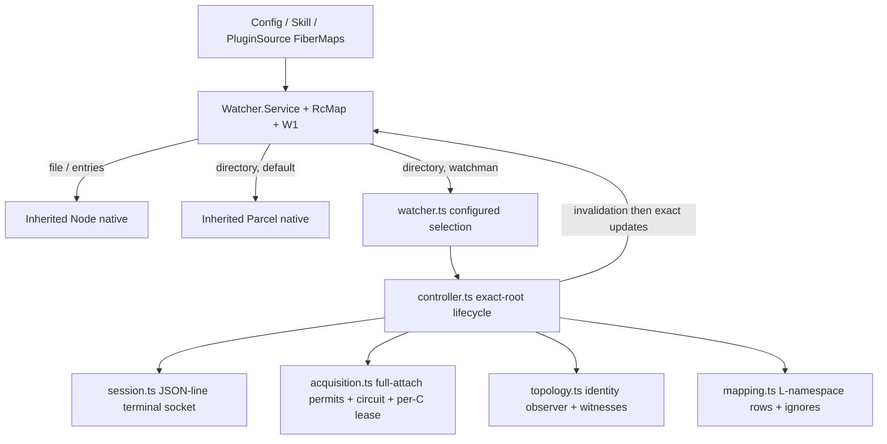

# Watchman v2 re-add — second architecture draft (GX, cross-informed)

## 0. Status and method

This is the GX second draft of the round-5 design challenge. It was written
after reading the completed Astra first draft
([`v2-readd5-draft0.gpt6astra.md`](v2-readd5-draft0.gpt6astra.md)) in full,
re-reading my own
([`v2-readd5-draft0.glm53max.md`](v2-readd5-draft0.glm53max.md)), and
**independently verifying Astra's three novel source-level claims** against
the exact deployed Watchwoman pin, its locked notify dependency, the stock
watcher mask, and the canonical OpenCode sources — rather than trusting either
prose. Nothing else was edited; no commit or push was made; production,
carrier, prompts, and all prior drafts are untouched.

Claim vocabulary: **[F]** observed fact (pinned to corpus or to a source line
I re-read this round), **[P]** selected policy, **[V]** required future
executable proof.

## 1. Verification of Astra's three source-level claims

Each claim is classified as fact / source-supported hypothesis / required live
gate / invalid, with my own verification trail. None of these were prior
executed corpus evidence, and none are treated as such.

### Claim A — initial query runs before tick-receiver registration

**Verdict: fact [F], design-consequential.**

At `a1e16cbf`, `crates/watchwoman/src/commands/subscribe.rs` executes:

```rust
let initial = query::run(&root, &parsed);      // tree read at T0
root.add_subscription(...);
// comment: "The starting tick fence is also captured here,
//           BEFORE WE RUN THE INITIAL QUERY, for the same reason."
let rx = root.tick_tx.subscribe();             // T1 > T0
let start_tick = root.clock.current_tick();    // T2 ≥ T1
```

The comment asserts the fence precedes the initial query; the code does the
reverse. A mutation applied to the tree between T0 and T2 is in neither the
initial result (too late for the T0 read) nor later tick deltas (its tick is
≤ the captured `start_tick`, and the push loop reports only ticks strictly
greater). I confirmed the surrounding push-loop fence semantics against E03's
independent line reading. This is adjacent to, but distinct from, E03's
PDU-before-ack race (U3): that race is about wire ordering; this is a
**lost-update window at subscribe time**.

Design consequence: the merged-ack `files` (Watchwoman) and the separate
initial PDU (stock) are **not a complete snapshot of any instant**, so (a)
discarding initial rows on first attach costs nothing that was reliable, and
(b) recovery convergence must come from the owner's authoritative reread,
never from client-side reconstruction. Both were already my draft-0 policy;
the claim upgrades their justification from "rows are redundant with the
onReady reread" to "rows are provably incomplete". A focused live gate racing
writes against subscribe is **optional [V]** — the design response is
identical whether or not the window fires.

### Claim B — locator unlinks a refused socket before honoring `no_spawn`

**Verdict: fact [F], design-decisive.**

At `a1e16cbf`, `crates/watchwoman/src/cli.rs::connect_or_spawn` (verified at
lines ~1261–1292):

```rust
Err(e) if e.kind() == ConnectionRefused => {
    let _ = std::fs::remove_file(sock_path);   // unlink FIRST
}
...
if no_spawn { bail!("daemon not running ... and --no-spawn was set") }
```

An ECONNREFUSED socket file is deleted **before** the `no_spawn` check, so
even a `--no-spawn` locator mutates host state, and a plain locator can
auto-spawn a daemon. This is the Watchwoman analogue of the accidental
stock-daemon spawn E02 recorded at default paths. Consequence: **any**
discovery-by-locator design is not a read-only operation at this pin, no
matter how well the child is owned. This decides the transport question
(§4/T1): explicit socket only; no locator child exists to own. Nothing
further needs a live gate — the design simply never executes a locator.

### Claim C — open/access events become upserts (read→rescan feedback risk)

**Verdict: every mechanism step is a fact [F]; the end-to-end owner livelock
is a source-supported hypothesis requiring a mandatory live gate [V].**

I re-verified each link in the chain myself:

1. notify 8.2.0 (Watchwoman's locked watcher dependency, from its Cargo.lock)
   registers `WatchMask::OPEN` in `add_single_watch`
   (`notify-8.2.0/src/inotify.rs`, mask block verified this round), and maps
   `EventMask::OPEN` → `EventKind::Access(AccessKind::Open(Any))`
   (`inotify.rs` OPEN branch verified this round).
2. Watchwoman `daemon/watcher.rs::collect_event` maps **every non-`Remove`
   event kind** — including `Access(_)` — to a stat + `Upsert`
   (verified this round; `recommended_watcher` is used unfiltered).
3. `daemon/root.rs::apply_changes` upserts unconditionally — no
   metadata-identity dedup — pushes every path into `changed_paths`, bumps
   the tick, and broadcasts (verified this round).
4. `daemon/tree.rs::upsert` overwrites `oclock = tick` for every upsert
   (verified this round), and the push-loop query returns entries with
   `oclock > since` (corpus: E03/E09-create `run.rs:104-110`).
5. Therefore **every `open()` of a file inside a watched root produces a
   subscription row** on the deployed daemon. One instance is already
   live-confirmed in the corpus: E09's extra unilateral PDU carrying an
   unchanged `d0` row, strace-attributed to notify's own `WalkDir` opening a
   new directory (`IN_OPEN|IN_ISDIR`).
6. **This is Watchwoman-specific**: stock's registration mask is
   `IN_ATTRIB | IN_CREATE | IN_DELETE | IN_DELETE_SELF | IN_MODIFY |
   IN_MOVE_SELF | IN_MOVED_FROM | IN_MOVED_TO | IN_DONT_FOLLOW | IN_ONLYDIR |
   IN_EXCL_UNLINK` (`watchman/watcher/inotify.cpp:38-40`, re-verified this
   round) — **no `IN_OPEN`, no `IN_ACCESS`**. (The `IN_OPEN`/`IN_ACCESS`
   entries in stock's table a few lines below are debug names, not the
   registration mask.)

The unproven step is amplification through a real owner: Config's reload
reads files inside watched roots, every delivered update requests a debounced
reload (o5: Config fires on every update regardless of type), and reads would
regenerate rows — a self-sustaining reload cycle at the debounce cadence
(livelock, not corruption). E14's scripted event source and o5's predicate
replay cannot confirm or refute it. **Policy [P]: a real-owner read/quietness
gate is a hard release gate; if the loop reproduces, the prerequisite is a
separately authorized Watchwoman correction (do not turn `Access` events into
upserts, or drop `OPEN` from the mask) and a new pin — not a client-side
workaround.** Row suppression, scan-window event dropping, or
metadata-fingerprint caches are rejected: rows are byte-indistinguishable
from legitimate writes (E09-create's stat-equalized pair proves the shape
collision), so any client filter would drop real mutations too.

### Bonus verification — Config parent-watch correction

Astra corrects E10's Config reading: at the pin, `config/watch.ts` keeps a
parent `entries` watch per root ("Keep a parent watch for each root so
deletion/recreation is observable"), and the exclusion filter
(`file !== directory && contains(...)`) **keeps** the root's own entry, so
recreation of `.opencode` is observable. Verified [F]. The deeper defect
stands: the *directory* watch's fiber stays occupied in the FiberMap when a
Parcel/daemon watch goes deaf, so the reload signal cannot re-arm it — the
correction changes the diagnosis, not the repair. Adopted with attribution.

Also independently noted this round (small, adopted): `watcher.rs` proceeds
without a working kernel watch if `notify` registration fails — "the warn
above being the only signal" (verified). Observation can silently not exist
for reasons no client PDU reveals; this joins root-drop as motivation for the
heartbeat below.

## 2. Common ground between the first drafts

Both drafts independently converged on: replace (not wrap) the fb-watchman
client; one session per physical key with per-generation unique subscription
names; fresh clock every generation, no cursors, `is_fresh_instance` never
trusted as continuity; merged-ack/pre-ack handling by buffer-until-ack plus
post-ack target revalidation; publish type-agnostic logical-namespace updates
**including directory rows** (the o5 fix); no create/update classification,
no inode baselines; Parcel-exact ignore algebra in the `L` namespace with
`D == C` asserted; W1 unchanged, W2 A-class hunks carried, supervisor test
rewritten; static selection, no fallback, no `undefined` on demand-time
failure, construction-time validation failures fail startup; E16
relay/procedure-based live gates; close-before-rearm sentinels on Bun;
blanket stale-result circuit fencing (rejecting the donor's unguarded stale
close); and rejection/timeout/decode never opening the shared circuit while
transport loss does.

## 3. Tension and decision matrix

| # | Tension | Astra draft0 | GX draft0 | Draft-1 decision |
| --- | --- | --- | --- | --- |
| T1 | Wire: JSON explicit-socket vs BSER + owned discovery | JSON-line session, explicit socket, no locator, no BSER | Owned wire, BSER codec, `WATCHMAN_SOCK`/cancellable locator child | **Adopt Astra**, strengthened by verified claim B (locator is non-read-only). JSON proven for the exact command surface on both daemons by E02/E03-stock/E06/E09/E16 live probes; array-form always (object form kills the old stock binary [F, e03-stock]); JSON throughput becomes a [V] gate |
| T2 | Formal daemon/platform scope | Watchwoman mandatory + stock second mandatory conformance run; experimental Linux x86-64 glibc; unknown-unsupported | Watchwoman-only formal; stock informational; `process.platform` gate | **Converge**: Watchwoman = sole release gate; stock binary = required conformance run (guards daemon-neutrality; costs little since the protocol subset is shared); Linux x86-64 glibc allowlist, everything else refused until platform [V] obligations pass |
| T3 | Acquisition bound: full attach vs connect→watch prefix | Full attach (connect…subscribe + final check) inside permits; timeout-anywhere = availability; per-`C` lease | Prefix `connect→version→watch` admitted; timeout root-local | **Adopt Astra**: whole-attach admission is one coherent "expensive operation"; a daemon that stalls mid-attach is an availability fact, not a root quirk; per-`C` lease prevents this process from feeding the measured same-root construction race [F, e11-pressure] |
| T4 | Parked compatibility/protocol failures vs retry-forever | Park on explicit compat facts, EACCES, capability gap, unknown family; 3 consecutive protocol failures park per key; rejections retry at 30 s cap | Everything retries at 2 s cap | **Adopt Astra's taxonomy, renamed**: park only on *structurally decidable* facts (capability negotiation failure, undecodable `version`, socket EACCES) and on per-key protocol-failure exhaustion (3 consecutive, reset by clean attach + heartbeat); rejection-class backoff cap raised 2 s → 30 s; availability-class stays 2 s. No prose-based permanence [F: daemon error text is not a stable taxonomy] |
| T5 | Freshness | Ignore as continuity; in-band `fresh:true` → invalidate in place; clock-prefix witness; heartbeat 30 s | Ignore entirely; socket loss is the only incarnation signal | **Adopt Astra**: on stock a fresh-instance PDU is a *complete set* and silently omits recrawl deletions [F, e03] — publishing its rows alone would miss deletes, so invalidate-before-rows is required, not optional; heartbeat detects Watchwoman's silent root drop (dead-reap ignores live subscribers [F, e12-release x8]) and retained-root staleness |
| T6 | Root identity: periodic poll + quarantine vs final-component-only Parcel parity | 1 s path-identity polling for every root + immediate sentinel + `(dev,ino)` witness + same-`C` quarantine | Final-component sentinel only; ancestors unsupported (Parcel parity) | **Adopt Astra's observer, with a refinement**: 1 `stat`/s/root is invisible to inotify and closes ancestor blindness, parent death, and deaf-sentinel cases [F, e10]; quarantine decides via a **root-number witness** — on detected `C` inode change, reattach once; if the daemon returns the *same* clock root-number the root was retained-stale → park; a new root number means the daemon rebuilt it → continue healthy (root number is the clock's 4th field and increments per `register_root` [F, e11-pressure, state.rs]) |
| T7 | Skill: retained watches vs first-call gate | Reconcile FiberMap across refresh; every readiness publishes | First-`onReady`-call gate (E14-proven) | **Adopt Astra's retention** — it removes the loop *cause* (watch recreation) rather than suppressing its signal, makes late first-attach readiness *useful* (E14 test 7's miss window), and avoids per-refresh daemon-session churn against Watchwoman retention [F, e12-release]. **With the E14 gate named as the proven fallback** if the required fixed-point proof [V] fails; E14's 15/15 does not cover the new owner algorithm |
| T8 | Unsubscribe: bounded best-effort vs never | One best-effort unsubscribe, 500 ms budget, only when healthy + idle | Never (classifier stall + registry-only semantics) | **Adopt Astra**: the stall rationale evaporates under an owned classifier (we decode the ack by command correlation; both ack shapes handled); the benefit is honest daemon `status` counts and stale-GC eligibility [F, e12-release x5/x6]; bounded, skipped when a command is in flight |
| T9 | Module depth/interface size | 4 modules; no facade; circuit/leases/reducer private to one big `directory.ts`; ignores and topology together in `paths.ts` | 7 modules incl. a small `backend.ts` | **Middle**: adopt "no pass-through facade" (selection folds into `watcher.ts configured()` + one construction function); keep `mapping.ts` pure and separate from `topology.ts` (ignore algebra and path-identity observation are unrelated responsibilities — separate test surfaces, same interface count as Astra by merging schema→protocol and sentinel→topology) |
| T10 | Buffer/resource limits | 16 MiB frame cap; 4 MiB/4 096-row pending cap; overflow collapses to one invalidation; W1 unboundedness acknowledged | Nothing explicit | **Adopt Astra's constants and overflow semantics** verbatim; add the reserved-capacity rule for control messages so release never queues behind data |

Additional adoptions from Astra: discriminated option union with **required**
socket (eliminates selected-but-unconfigured states); rejection of
`OPENCODE_WATCHMAN_BINARY` with guidance; version **capability negotiation**
with the E06-verified required set; random run-nonce in subscription names
(guards cross-restart zombie collisions under Watchwoman's retained-session
release chain [F, e12-release, e16]); connect carries its own deadline;
**submitted-request interruption destroys the session** (single-owner sessions
make FIFO preservation-by-masking unnecessary); terminal latch set before
rejecting requests; `socket.destroy()` + await *local* close (never peer
FIN); backend shutdown starts all controller stops concurrently then joins
(avoids serial 500 ms budgets through upstream RcMap's sequential closes
[F, e12]); literal-ignore algebra corrected (a literal equal to `L` or an
ancestor of `L` excludes the whole watch — my draft-0 table said
outside-root literals are inert, wrong per [F, e08 A6–A8]); daemon-side
cookie `match` term added (term-match + wildmatch verified both daemons
[F, e06]); honest non-guarantee of wall-clock bounds.

## 4. Change log from GX draft 0

| Area | Draft 0 | Draft 1 | Driver |
| --- | --- | --- | --- |
| Transport | owned BSER wire + cancellable locator | **JSON-line session, explicit socket, no locator, no BSER dep** | claim B verified; corpus JSON precedent |
| Discovery | `WATCHMAN_SOCK` short-circuit else owned child | CLI maps `OPENCODE_WATCHMAN_SOCKET ?? WATCHMAN_SOCK` into an explicit socket option; Core never spawns | claim B |
| Platform gate | `process.platform === "linux"` | Linux x86-64 glibc allowlist; stock = required conformance run; musl/arm64/macOS/Windows refused pending [V] | Astra + E17 layering |
| Acquisition | prefix admission; timeout root-local | **full-attach admission incl. failure cleanup; timeout = availability; per-`C` lease** | Astra T3 |
| Failure policy | retry-forever everything at 2 s | **parked classes** (compat facts, EACCES, capability gap, protocol exhaustion); rejection cap 30 s | Astra T4 |
| Freshness | ignore bit entirely | bit ignored as continuity; **in-band `fresh:true` → invalidate-before-rows**; clock-prefix + root-number witnesses; 30 s heartbeat | Astra T5 + stock full-set semantics |
| Topology | final-component sentinel only | **generic identity observer**: immediate parent sentinel + 1 s periodic realpath/stat; `(dev,ino)` + root-# witnesses; quarantine | Astra T6 + my root-# refinement |
| Skill | first-call gate | **retained-watch reconciliation**, gate as fallback; new fixed-point proof | Astra T7 + E14 churn/miss analysis |
| Unsubscribe | never sent | **bounded best-effort** (500 ms, healthy+idle only) | T8; owned classifier |
| Options | flat optional bag + binary | **discriminated union, socket required**, binary rejected | Astra |
| Version cmd | bare | capability negotiation (required set checked; miss = park) | Astra/E06 |
| Names | `opencode-<controller>-<generation>` | run **nonce** + counters, never reused across runs | Astra/retained-session hazard |
| Release | close-only | optional unsubscribe budget; **parallel** backend shutdown joins | Astra |
| Buffers | unbounded framing/pending | 16 MiB frame / 4 MiB + 4 096-row pending; overflow → single invalidation marker | Astra T10 |
| Modules | 7 incl. `backend.ts` facade | 6: `session`/`protocol`/`controller`/`acquisition`/`topology`/`mapping`; selection in `watcher.ts` | T9 |
| Command interruption | uninterruptible-until-settle mask | interruption **destroys the session** (single-owner) | Astra |
| Claim handling | n/a | A/B/C verified and integrated; Config parent-watch correction adopted; read-feedback quietness gate mandatory | §1 |

Retained from draft 0 against Astra where justified: pure `mapping.ts`
separate from topology (T9); the O5-driven directory-row worked examples and
the release-latency analysis; the quarantine root-# refinement (T6); the
named Skill fallback (T7); the explicit "no prose-based failure permanence"
rule; and this draft's overall tighter module-responsibility split.

## 5. Revised executive architecture

One sentence: **a statically selected, directory-only Watchman backend whose
deep modules are — a terminal JSON-line Unix session over an explicit socket
(no locator, no BSER), an epoch-fenced full-attach admission coordinator with
per-canonical-root leases, a mailbox-serialized controller with fresh-clock
generations, heartbeat, and root-identity witnesses, a generic path-identity
observer (sentinel + 1 s revalidation, close-before-rearm), and a pure
logical-namespace mapper that publishes type-agnostic updates including
directory rows — converging owners through W1 invalidation and retained-watch
Skill reconciliation, with parked compatibility states, bounded buffers, and
a mandatory real-owner quietness gate before any Watchwoman release.**



## 6. Modules and interfaces

Domain-grouped under `packages/core/src/filesystem/watcher/watchman/`; no
pass-through facade; selection lives in the existing
`Watcher.configured(...)` seam.

| Module | Interface | Hidden depth |
| --- | --- | --- |
| `session.ts` | `open(socket, timeoutMs, receive, lost) → Session{request, close}` | JSON framing + 16 MiB cap, FIFO + per-command deadline from write, terminal latch, destroy+await-local-close, classification |
| `protocol.ts` | `Command`, decoded result unions, `Failure` taxonomy, codec functions | Schema decoding, error-PDU separation, both ack dialects |
| `acquisition.ts` | `acquire(C, work) → Effect<A, Failure>` | Permits, per-`C` lease queue, strict-epoch circuit, backoff constants |
| `controller.ts` | `makeController(input) → {attach}` (external seam stays `NativeInterface`) | Phase reducer, mailbox, epochs/generations/nonce, buffering, heartbeat, quarantine, release |
| `topology.ts` | `observe(L) → {sample, changes, close}` | Parent sentinel + 1 s revalidation, coalescing, `(dev,ino)`/root-# witnesses, close-before-rearm |
| `mapping.ts` | `compileIgnores(L, ignore)`, `mapRow(ctx, row)` | Literal algebra, glob compilation, cookie filter, expression build (pure) |

```ts
// session.ts
export interface Session {
  /** FIFO; deadline starts when written. Interruption of a submitted
      request destroys the session (single-owner). */
  readonly request: (command: Command) => Effect.Effect<Result, SessionFailure>
  /** Idempotent terminal: latch → settle requests → socket.destroy() →
      await local close. No reconnect of this object. */
  readonly close: () => Effect.Effect<void>
}
export declare const open: (options: {
  readonly socket: string
  readonly commandTimeoutMs: number
}, receive: (frame: PduFrame) => void, lost: (failure: SessionFailure) => void) =>
  Effect.Effect<Session, SessionFailure, Scope.Scope>

// controller.ts — external shape unchanged from draft 0 (Target & publish/invalidate)
export interface Controller {
  /** Pends until first attach; interruption at any point runs the same
      release path as stop (pre-return bracket). */
  readonly attach: Effect.Effect<Watcher.Subscription>
}

// acquisition.ts
export interface Acquisition {
  readonly acquire: <A>(canonicalRoot: string, work: Effect.Effect<A, Failure>) =>
    Effect.Effect<A, Failure>
}
```

## 7. Session design (JSON, explicit socket)

- **Wire**: newline-delimited compact JSON, requests always in **array form**
  (`["version", {...}]`, `["watch", C]`, …). Both daemons auto-detect
  JSON-line input and reply in kind [F, e02 `PDU.cpp:80-87`; e07
  `server.rs:110-117`]; the older stock binary aborts the whole daemon on
  object-form requests [F, e03-stock]. JSON strings escape interior
  newlines, so filenames cannot break framing. No BSER dependency, no
  declaration vendoring; the only requested row fields are
  `name/exists/type` — strings and booleans.
- **Socket**: one absolute pathname, explicit. CLI maps
  `OPENCODE_WATCHMAN_SOCKET` else `WATCHMAN_SOCK` (the deployment exports the
  latter host-wide [F, e01]); Core never reads ambient environment and never
  spawns (claim B). Non-empty absolute path without NUL; existence is not
  checked at construction (a socket may precede its listener).
- **Classification** (decode once, then order — no key-presence guessing):

| Frame | Association |
| --- | --- |
| `unilateral:true` + `subscription` (result PDU) | Unsolicited push; validate shape; never consumes the request |
| `{subscription, canceled:true, clock?}` without `unilateral` | Watchwoman-tip/root-drop cancellation; unsolicited |
| Current `unsubscribe` command | `{unsubscribe, deleted}` (stock) or `{unsubscribed, subscription}` (Watchwoman) both settle it — correlated by pending command, never by key presence |
| Expected response of the current command, or `{error}` without unsolicited shape | Settle the command; rejection kept separate from transport loss |
| Unknown `subscription` name | Drop (delayed traffic) |
| Unassociated response / malformed / oversize | Protocol failure; retire the session; never advance the FIFO speculatively |

- **Termination**: register all handlers pre-connect; one request queue with
  its own deadline-from-write; `error`/`end`/timeout/parse/close converge on
  one synchronous terminal latch set **before** settling requests;
  `socket.destroy()` then await local `close`; scope finalization is the same
  close; a closed Session rejects requests immediately.
- **Limits**: 16 MiB per-frame ceiling enforced while bytes arrive; pending
  decoded data capped at 4 MiB / 4 096 rows per controller, overflow replaced
  by one ordered invalidation marker; control messages reserve capacity so
  release never queues behind data. Constants, not options.

## 8. Controller: phases and transitions

Phases: `resolving` · `waiting{reason: target|admission|backoff}` ·
`attaching{stage: connect|version|watch|clock|subscribe}` · `attached` ·
`retiring{next: retry|resolve|park}` · `parked{reason: compatibility|protocol|
root-retained}` · `released` (absorbing). One supervisor consumes a mailbox;
socket callbacks enqueue decoded frames; control signals enqueue; **no state
mutation from callback context**; fences checked at message acceptance and
again immediately before every publish [F, e04's synchronous-resumption
caution]. Counters: lifetime id, target epoch, connection generation (nonce
names), consecutive protocol failures.

| State | Input | Decision → next |
| --- | --- | --- |
| resolving | identity sample: existing directory | capture `L/C/(dev,ino)`; quarantine check; admission → waiting/admission |
| resolving | absent/dangling/non-directory | no socket; keep observer; wait for next sample (repeated identical absence does not re-invalidate) |
| waiting/admission | permit + per-`C` lease won; epochs revalidated | full attach begins → attaching/connect |
| waiting/admission | stale candidate / demand removed | release lease/permit without socket work |
| attaching | connect/version(+caps)/watch/clock success | advance one stage; `watch` must return exactly `C`; record clock prefix + root number |
| attaching/subscribe | PDU before ack | buffer under current token; never publish or signal readiness |
| attaching/subscribe | valid ack + identity recheck passes | initial: discard buffered+ack rows, complete barrier; replacement: `invalidate()` then drain → attached |
| attaching/subscribe | ack after epoch superseded | never install; close produced session (await); worker joins; loop |
| attaching/subscribe | cancellation frame wins over late ack | retire → retry |
| attached | result frame, current name | fences → map/filter → publish; overflow → invalidation marker first |
| attached | `is_fresh_instance:true` in a delivered batch | `invalidate()` before that batch's rows; stay attached [stock full-set omits recrawl deletions, F/e03] |
| attached | heartbeat clock: changed prefix/root number | old subscription belongs to another incarnation → retire → retry |
| attached | heartbeat clock: unknown-root rejection | daemon dropped the root (dead-reap is subscriber-blind, F/e12-release) → retire → retry (fresh watch re-registers) |
| attaching/attached | socket terminal / timeout | retire; classify availability; circuit governs |
| attaching/attached | malformed/association/oversize | retire; protocol-failure count++; 3 consecutive → parked/protocol |
| any live | identity change at `C` (`dev,ino`) | epoch++; invalidate once; retire → **reattach once**; same root number returned → parked/root-retained; new root number → healthy attach |
| any live | retarget (new `C`) | epoch++; discard old-target buffers; retire → resolve; invalidate after new ack |
| any live | target absent | epoch++; invalidate once if previously attached; retire → waiting/target |
| waiting/backoff | timer + demand (and circuit eligibility) | → resolving/admission |
| parked | anything ordinary | no attach; diagnostics; backend restart resets; explicit release still works |
| any | release / external interruption | absorbing fence first; stop observer/heartbeat/timers; optional bounded unsubscribe; destroy session; join all → released |
| released | any | drop; return cached stop result |

Attach transcript:

```text
connect explicit socket (own deadline)
["version", { required: [cmd-watch, cmd-clock, cmd-subscribe, cmd-unsubscribe,
                         field-name, field-exists, field-type,
                         term-not, term-anyof, term-name, term-dirname,
                         term-match, wildmatch, term-false?] }]
   → all required true else parked/compatibility   [F, e06 capability mechanics]
["watch", C]        → response.watch === C (else protocol failure)
["clock", C]        → fresh c:<start>:<pid>:<root#>:<tick>; record prefix+root#
install expected-name gate (nonce-run-<controller>-<generation>)
["subscribe", C, name, { since: freshClock, expression, fields: [name, exists, type] }]
revalidate target identity → ack → (initial: discard | replacement: invalidate) → drain → live
```

Initial rows are discarded on first attach — provably incomplete per claim A
and redundant with the owner's post-attachment `onReady` reread. Heartbeat:
`["clock", C]` every 30 s while attached, one outstanding, ordinary frames do
not indefinitely postpone it (quiet-root drop must stay detectable); warm
clock RTT is sub-millisecond [F, e11-pressure], so traffic is negligible.

## 9. Acquisition, circuit, leases

`maxConcurrentAcquisitions` (default 4) bounds the **entire** attach
sequence — connect through the post-ack identity recheck, including failure
cleanup — acquired under a per-`C` lease taken **before** the global permit
(a same-root queue cannot starve other roots' permits). Waiting on either is
interruptible and starts no deadline. Availability failures (socket
transport loss, command deadline anywhere in the admitted sequence) trip the
shared circuit; decoded rejections, decodes, and protocol failures never do.
Circuit states `Closed/Open/HalfOpen/Stopped` with **strict epoch fencing**:
any stale completion — success, rejection, or failure — mutates nothing and
never wakes waiters early (rejecting the donor behavior executable in
[F, e11-races]); HalfOpen closes only on a **full** attach completion or a
decoded root rejection (reachability proof); probe interruption/abandonment
reopens at the same attempt; backend stop enters `Stopped` (no timer, no
probe). Backoff `min(2000, 100·2^attempt)` ms, no jitter, clamped exponent;
root-local rejection backoff `min(30000, 100·2^attempt)` ms, reset by a clean
attach + heartbeat. The coordinator mutates state before completing Deferreds
(waiters may resume synchronously [F, e04]).

## 10. Topology: generic identity observation

Every demanded `L` gets an observer — not only detected final-component
symlinks (draft 0's rule; Astra's generalization adopted):

- `sample()` returns `absent` or `{canonical C, dev, ino}` via
  `realpath`+`stat`; async, coalesced (one in-flight + dirty bit), emits only
  on identity change. `stat` does not generate inotify events, so the probe
  is invisible to the daemon (and cannot feed the claim-C loop).
- Immediate-parent `fs.watch` sentinel whenever the parent exists
  (`dirname(L)`, basename filter, self-events and errors all just request a
  recheck; counts are never semantics [F, e10]).
- **Periodic revalidation every 1 s while demanded** — closes ancestor
  retarget blindness and silent parent death, both proven on both runtimes
  [F, e10 probes B/C], and backstops a deaf re-armed sentinel [F, e17 Bun
  1.4.2].
- Re-arm discipline: close the old watcher **before** arming its successor;
  single sentinel instance per controller.
- Witnesses: attach-time `(dev, ino)` of `C` plus the daemon clock's root
  number feed the quarantine rule in §8. Same-`C` inode replacement with a
  retained daemon root cannot be repaired client-side (no re-crawl on
  re-`watch` [F, o5]; no permitted root-deletion command) — park with an
  operator diagnostic rather than publish from a provably stale index.
- Coverage limits documented: child symlinks are not followed (owner
  discovers targets); Skill's canonicalization hides its ancestors from us
  (Astra's honest limit, adopted); rapid A→B→A coalesces to the stable
  final state; no hard timing bound.

## 11. Events, paths, ignores

`D == C` is asserted per attach (plain `watch` returns exactly `realpath(C)`
on both daemons, never `relative_path`, never an ancestor [F, e02]); a
violation is a protocol failure. Row pipeline (pure, in `mapping.ts`):

```text
abs = path.resolve(C, name)                    // name validated: relative, no NUL, no escaping ..
drop unless contained in C
drop if basename starts ".watchman-cookie-"
logical = path.join(L, relative(C, abs))
drop if any literal I = path.resolve(L, v) matches logical equal-or-component-below (byte-exact)
drop if any compiled glob (micromatch {dot:true, lookbehinds:false}, per-pattern regex) matches relative(L, logical) POSIX
publish { path: logical, type: exists ? "update" : "delete" }   // directories included
```

Corrected literal algebra (draft-0 table fixed per [F, e08 A6–A8]): a literal
equal to `L` or an **ancestor** of `L` excludes the entire watch; `.` is not
inert; unrelated escapes are inert; canonical-namespace spellings are inert
when `L != C` — which is exactly why the pipeline is logical-first. Globs
compile per-pattern (Parcel wrapper parity [F, e08]); the Config plan trio is
a mandatory parity fixture. Daemon expression (traffic only, never
authority): negated `anyof` of `name`(wholename) + `dirname` terms for
contained literal suffixes, `false` for whole-root literals, plus the cookie
exclusion `["match", ".watchman-cookie-*", "basename"]` (term-match +
wildmatch verified on both daemons [F, e06]); never `dirname ""`; no depth
operand; no glob translation; no expression at all when no literals.

There is no `create` output and no baseline — no current recursive consumer
discriminates create/update [F, e09-create inventory, o5], no portable signal
exists [F, e09-create], and claim A makes even initial snapshots unreliable
for reconstruction. The adapter documents this precision limit exactly as the
Node adapter's update-only behavior is documented.

## 12. Failure and availability taxonomy

| Failure | Class | Disposition |
| --- | --- | --- |
| Option decode invalid; unsupported host; selected-module import/validate failure | startup | Construction fails; process startup fails |
| Capability negotiation miss; undecodable `version`; socket `EACCES` | compatibility | Park backend observation (all controllers) with corrective diagnostic until restart |
| 3 consecutive protocol failures on one key (reset by clean attach + heartbeat) | protocol exhaustion | Park that key with diagnostic |
| Root rejection (`watch`/`clock`/`subscribe` error PDU) | rejection | Root-local retry, `min(30000, 100·2^n)`; no permanence inferred from prose |
| Transport loss / deadline in admitted attach | availability | Circuit + shared backoff |
| Same-`C` retained root after inode replacement | root-retained | Park with operator diagnostic (daemon restart is the repair) |
| Demand release / backend shutdown | release | Absorbing; joined cleanup; never a failure |

Demand-time failures never end streams, never return `undefined`, never
defect, never fall back — the stale-but-running posture, with parked states
making "known-broken, loudly diagnosed" distinct from "retrying" [F, e05:
silent death is the worst owner outcome].

## 13. Owner convergence

1. W1 verbatim; W2 A-class hunks carried (Config `Change` union, Agent/
   Command/Source invalidation bypass, configured-source readiness,
   test-layer `Watcher.Test.invalidate()`); supervisor test rewritten;
   missing Config end-to-end coalescing test added [F, e19].
2. Directory rows published — the o5 fix; owner predicates already consume
   them.
3. **Skill: retained-watch reconciliation** (adopted from Astra): refresh
   builds a desired key set, leaves live fibers untouched, adds only missing
   watches, removes obsolete keys after a successful scan, and **every**
   readiness invocation publishes to the refresh queue:

```ts
const notify = (target: string) => PubSub.publish(changes, target).pipe(Effect.asVoid)
// during refresh: desired.add(key); only create missing fibers
const updates = yield* watcher.subscribe({ path: target, type }, notify(target))
yield* FiberMap.run(watches, key,
  updates.pipe(Stream.runForEach((update) => notify(update.path))),
  { onlyIfMissing: true, startImmediately: true })
```

   Retention removes the refresh→recreate→initial-readiness loop *cause*,
   so no latch is needed; late first-attach readiness now repairs E14
   test 7's miss window instead of being suppressed; and per-refresh
   unsubscribe/subscribe churn against Watchwoman's retained sessions
   [F, e12-release] disappears. **Required proof [V]** (extends E14's
   harness to the new owner algorithm — E14's 15/15 covers the *gate*, not
   this): fixed-point under stable sources (retained fiber count constant,
   reload count stops growing), slow first attach after initial scan,
   recovery during scan, shared/sole ownership, external-watch additions and
   removals, interruption, direct retarget. **Fallback**: if the
   fixed-point proof fails, ship the E14-proven first-call gate and file the
   retention as a follow-up.
4. Detached-subscriber gaps remain bounded by authoritative scans (E14's
   subscribe-gap property; closing them needs owner scan-after-readiness
   reordering — future option, not taken).

## 14. Options, platform, and API boundary

```ts
// Core Watcher.Options (additive; discriminated)
type DirectoryOptions =
  | { readonly backend: "parcel" }
  | { readonly backend: "watchman"; readonly socket: string
      readonly commandTimeoutMs?: number        // 60 000; 1..600 000
      readonly maxConcurrentAcquisitions?: number } // 4; 1..64
type Options = { readonly enabled?: boolean; readonly directory?: DirectoryOptions }
```

CLI env: `OPENCODE_WATCHER_BACKEND` (exact `parcel`|`watchman`),
`OPENCODE_WATCHMAN_SOCKET` (else `WATCHMAN_SOCK`) — required when watchman is
selected, absolute, NUL-free; `OPENCODE_WATCHMAN_COMMAND_TIMEOUT_MS`;
`OPENCODE_WATCHMAN_ACQUISITION_LIMIT`. `OPENCODE_WATCHMAN_BINARY` supplied
with watchman selection **fails with guidance** (there is no locator);
unknown backend values fail rather than defaulting. CLI owns string
conversion; Core owns semantic decode at layer construction (covers
Server/fetch/embedded/direct callers — today `ServerOptions` is accepted
undecoded [F, e18]); Server mirrors the shape; no Protocol/`HttpApi`/OpenAPI/
generated-client change; SDK types widen (off-wire, public — documented);
workerd stays disabled; disabled short-circuits before any host check.

Platform: selection allowed only on Linux x86-64 glibc for this experimental
phase (detection uses the process platform plus the packaging layer's
existing libc knowledge; musl detection precedent exists in OpenCode's
postinstall [F, e17]); all other hosts refuse with a clear message.
Watchwoman `a1e16cbf` is the release gate; the installed stock binary runs
as a **required conformance pass** (not a gate); the Watchwoman tip is a
cancellation/queue fixture only. Widening requires the platform [V] suite.

## 15. Ownership, release, and honest limits

| Resource | Owner | Stop/join | Proof boundary |
| --- | --- | --- | --- |
| Session socket + queues + deadline timers | session | terminal latch → settle → destroy → await local close | no fd/callback survives; object never reconnects |
| Discovery child | **none exists** | n/a | claim B makes this the only safe answer |
| Controller supervisor + child scope | backend (registered before first async resource) | `stopAndJoin`, callable pre- and post-Native-return | pre-return interruption bracket closes [F, e04 gap 7] |
| Heartbeat / backoff / path timers | controller scope | cancel + join | no post-release wake |
| Circuit timer + waiters | backend layer scope | stop → `Stopped`; join | no post-shutdown probe |
| Sentinel + in-flight path read | topology | fence callback, close-before-rearm, await observation | no late observation mutates state |
| Acquisition permit + per-`C` lease | current attempt | interrupt wait / finish cleanup then release | stale candidates hold nothing |
| Best-effort unsubscribe | controller cleanup | ≤ 500 ms, only when healthy + idle, joined | ack means only what that daemon's ack means |
| Daemon session/push loop/root | external daemon | never pruned by us | retention documented, not "cleaned" [F, e12-release] |

Release on final demand: absorbing fence → stop observer/timers → optional
bounded unsubscribe → destroy session → join supervisor → resolve cached
promise. Backend shutdown fences all controllers, starts stops concurrently,
joins (avoids serial 500 ms budgets through upstream sequential RcMap closes
[F, e12]). Latency: ≤ 500 ms optional grace + local close/join; **not** a
hard wall-clock bound under a stalled loop — tests prove the distinction
(TestClock + live measurement) and may only fail, never "prove" bounded
release by abandoning owned work.

## 16. Invariants (draft-1 set)

1–9: unchanged from draft 0 (public shapes; directory rows published with
update/delete only; Node owns file/entries; Parcel default, never fallback;
one controller per key; handlers before commands; fresh clock per
generation, no cursors, freshness never continuity; retired work cannot
publish; `D == C` asserted). Updates:

10. `is_fresh_instance:true` in a delivered batch emits invalidation before
    that batch's rows, without reconnecting.
11. A heartbeat clock whose incarnation prefix or root number differs from
    the attached generation retires it.
12. `wire`→`session`: no locator exists; termination is destroy + local
    close await; a closed session never reconnects; submitted-request
    interruption destroys the session.
13. Frame ≥ 16 MiB or pending > 4 MiB/4 096 rows is a classified failure or
    collapse-to-invalidation, never unbounded growth.
14. Acquisition bounds the full attach under a per-`C` lease; strict epoch
    fencing on every stale completion; only availability failures trip the
    circuit.
15. Parked states are absorbing for ordinary inputs; only backend restart
    (or explicit release) exits them.
16. Never send `watch-project`, `watch-del`, `relative_root`, cursors, or
    any command outside the negotiated five; array form only.
17. Same-`C` inode replacement with a retained daemon root parks (root-#
    witness) instead of publishing from a stale index.
18. Release is final from every state, including pre-return interruption;
    bounded by cleanup work, not `commandTimeoutMs`.
19. Owner convergence flows only through W1 invalidation + exact rows; Skill
    converges via retained-watch reconciliation (gate fallback) and its
    fixed point must be proven, not assumed.

## 17. Performance

Steady state per attached key: one socket, one supervisor, one observer
(1 stat/s + one parent watch), O(1) memory; heartbeat 1 clock/30 s
(sub-ms warm [F, e11-pressure]). Row cost: one join + containment + prefix
checks + (Config) one compiled glob match. Admission default 4 full attaches;
JSON throughput is a [V] measurement (BSER numbers do not transfer);
16 MiB/4 MiB bounds cap per-frame and pending memory; W1's unbounded PubSub
is acknowledged as the upstream boundary, not silently fixed here. Daemon
pressure arithmetic (1 socket + 3 root FDs per distinct root, 34-client
envelope, transient same-root constructions) unchanged from [F, e11-pressure]
and now additionally bounded by the per-`C` lease on our side.

## 18. Carrier disposition

Identical to draft 0 except: the actor is rewritten against the **session**
seam (JSON framing, classification table, terminal-latch semantics — not the
fb-watchman `Client` interface); W2's Skill work becomes the retained-watch
reconciliation (the missing piece E19 flagged), not the gate. W1 kept
verbatim; W2 A-hunks carried; broken supervisor test rewritten; historical
docs remain evidence.

## 19. Implementation sequence (logical commits)

1. `refactor(core): retain ordered watcher readiness signals` — W1 carry.
2. `refactor(core): propagate config watch invalidations` — W2 A-hunks +
   missing Config coalescing test.
3. `fix(core): settle configured plugin readiness tests` — supervisor test.
4. `refactor(core): retain skill watches across rescans` — reconciliation +
   fixed-point/slow-attach proofs (fallback gate decision recorded here).
5. `feat(core): own terminal watchman json sessions` — session + protocol +
   framing/caps/classification/release tests (not yet selectable).
6. `feat(core): map logical watchman paths and ignores` — pure mapping +
   Parcel parity fixtures.
7. `feat(core): supervise exact watchman directory demand` — controller
   phases, buffering, invalidation ordering, heartbeat, pre-return bracket.
8. `feat(core): bound watchman attachment admission` — permits, per-`C`
   lease, strict circuit, taxonomy, witnesses.
9. `feat(core): observe watchman root topology` — identity observer,
   close-before-rearm, quarantine.
10. `feat(core): validate static directory watcher selection` — options
    schema, host gate, lazy selection, parity tests.
11. `feat(server)`: mirror options; `feat(cli)`: env adapter + socket
    precedence + binary-rejection message.
12. `test(core)`: live matrix + quietness gate + JSON throughput + release
    proofs (may surface the daemon prerequisite rather than success).
13. `docs`: experimental compatibility limits, quarantine, daemon retention,
    platform matrix, carry audit.

## 20. Verification gates

Deterministic (real `Watcher` + real modules; scripted session/topology
adapters; TestClock): everything from draft 0, plus — session classification
table row coverage incl. both unsubscribe dialects and oversize frames;
heartbeat incarnation/root-# transitions; parked-class entry/absorption;
overflow→invalidation collapse; per-`C` lease serialization; stale results
never mutate circuit (E11-races counterexamples as fixtures); mutation
checks (drop publish-time fence / restore key-presence classifier / suppress
directory rows / clear Skill watches each fail a targeted test).

Live (private daemons, exact pins, `env -u WATCHMAN_SOCK`): the draft-0
matrix (attach transcript, L-namespace delivery incl. directory rows, ignore
and cookie negatives, relay-FIN loss with fresh-clock recovery and
Watchwoman two-tick cleanup, owner convergence, final release) **plus**:

- **Read/quietness gate (mandatory, claim C)**: stage 1 — scripted-reader
  baseline against a private daemon: open a file inside a watched root,
  assert a PDU row arrives (confirms the daemon-side fact on the release
  pin); stage 2 — real owners: one external mutation, let all owners
  settle, stop writing, assert reload counts and transport traffic go quiet;
  retain a transcript attributing any further PDUs. Failure blocks the
  Watchwoman release and invokes the daemon-correction prerequisite.
- **JSON throughput**: bytes/CPU/latency on representative trees and burst
  mutation, frame high-water; compare against the recorded BSER envelope.
- **Heartbeat/root lifecycle**: private root removal (fixture-owned),
  retained-root same-`C` replacement → quarantine visible, never a false
  healthy rearm.
- **Platform probes** before any scope widening; **release/resource
  proofs** (no fd/child/timer/fiber at every barrier; `/proc`-based, since
  Bun's handle APIs are blind [F, e12-transport]).

## 21. Rejected alternatives (draft-1 additions)

Everything rejected in draft 0 stands, plus:

- **BSER + cancellable locator (my draft 0)** — the locator is non-read-only
  at this pin (claim B); JSON avoids the codec dependency and its missing
  declarations entirely; corpus JSON probes already cover the exact command
  surface on both daemons.
- **Retry-forever for compatibility facts** — parks make known-broken states
  loud instead of churning the daemon at 2 s forever.
- **Client-side read-feedback filters** — rows from opens are
  byte-indistinguishable from writes [F, e09-create]; any filter drops real
  mutations; the fix belongs in the daemon.
- **Immediate quarantine on same-`C` inode change** — the root-# witness
  reattach probe avoids false parks when the daemon legitimately rebuilt the
  root (e.g., after dead-reap).
- **First-call gate as final Skill answer** — suppresses exactly the late
  readiness that repairs slow attaches; retention is the structural fix, with
  the gate retained as a proven fallback.
- **Never-unsubscribe absolutism (my draft 0)** — justified only under the
  old classifier; with owned correlation, the bounded ack improves daemon
  `status` honesty and stale-GC eligibility at trivial cost.
- **Astra's 4-module merge of ignores+topology** — unrelated
  responsibilities; the pure mapper and the effectful observer stay separate
  for independent fixture coverage at the same interface count.

## 22. Fact / policy / proof ledger

- **Facts**: all [F] marks; claims A/B/C verifications in §1 with my own
  pins (`subscribe.rs`, `cli.rs::connect_or_spawn`, `watcher.rs::
  collect_event`, `root.rs::apply_changes`, `tree.rs::upsert`, notify
  `inotify.rs` mask+OPEN mapping, stock `watcher/inotify.cpp:38-40` mask,
  `config/watch.ts` parent plan).
- **Policies**: every [P] and §3 decision; human-acceptable, each argued.
- **Required proofs**: fixed-point Skill reconciliation; real-owner
  quietness (blocking); JSON throughput; platform suites before widening;
  tip canceled-PDU cell; live release/resource proofs; the optional
  claim-A subscribe-race characterization.

## 23. Cross-references

- [`v2-readd5-draft0.gpt6astra.md`](v2-readd5-draft0.gpt6astra.md) — compared
  first draft; adoptions and differences are itemized in §3–§4.
- [`v2-readd5-draft0.glm53max.md`](v2-readd5-draft0.glm53max.md) — my first
  draft; superseded by this document's change log.
- [`v2-readd4-validation3.gpt56solxh.md`](v2-readd4-validation3.gpt56solxh.md)
  and the corpus index — evidence grounding for every [F].
- [`v2-readd4-e12-daemon-session-release0.glm53max.md`](v2-readd4-e12-daemon-session-release0.glm53max.md),
  [`v2-readd4-e11-pressure0.gpt56solxh.md`](v2-readd4-e11-pressure0.gpt56solxh.md)
  — retention, root-number encoding, pressure envelope.
- [`v2-readd4-e14-skill-lifecycle0.glm53max.md`](v2-readd4-e14-skill-lifecycle0.glm53max.md)
  — gate proof retained as fallback; new owner algorithm requires its own
  fixed-point extension.
- [`v2-readd4-owner-directory-signal0.gpt56solxh.md`](v2-readd4-owner-directory-signal0.gpt56solxh.md)
  — directory-row contract and retained-root staleness behind quarantine.
- Deployed source pins re-read this round: Watchwoman `a1e16cbf`
  (`subscribe.rs`, `cli.rs`, `watcher.rs`, `root.rs`, `tree.rs`), notify
  8.2.0 `inotify.rs`, stock `watcher/inotify.cpp`, OpenCode `4306c07b`
  (`filesystem/watcher.ts`, `config/watch.ts`).
