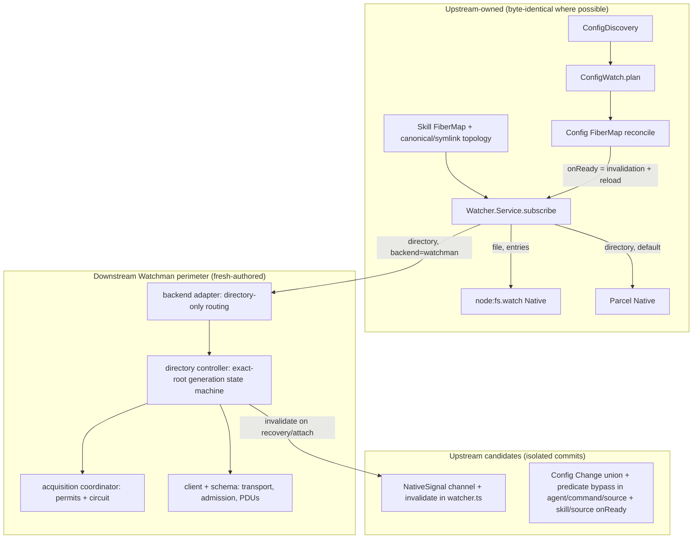

# Watchman v2 re-add research journal — round 0

Durable journal for the research/discovery agent supporting the Watchman
v2 re-add build. This round: validate the
[`v2-readd3`](/.design/watchman/v2-readd/v2-readd3.gpt56solxh.md) work plan
against the actual upstream tree in this workspace and the actual donor tree,
classify what is reusable, and correct the plan where reality disagrees.
**Later rounds append dated addenda at the bottom; nothing above is rewritten.**

## 0. Path corrections (read first)

The spawning prompt's paths were wrong in two ways; both are corrected here so
later rounds don't repeat the search:

1. **The plan was not at `/home/rektide/src/opencode-watchman/.design/...`.**
   That workspace is a *clean* jj working copy sitting directly on upstream
   `4306c07b` (`v2@origin`) with an empty `@` — no watchman code, no design
   corpus (its `.design/watchman/` holds only a stale nvim socket). The parent
   session has since copied the plan into this workspace at
   [`.design/watchman/v2-readd/v2-readd3.gpt56solxh.md`](/.design/watchman/v2-readd/v2-readd3.gpt56solxh.md)
   (937 lines, identical to the donor copy).
2. **The "-old path does not exist" claim is false.**
   `/home/rektide/src/opencode-watchman-old` exists and is the real donor: a jj
   workspace of the same colocated repo whose working-copy parent is
   `1b95fb3b` (bookmark `watchman-20260905`), containing the full
   implementation and the whole `.design/watchman/` corpus. The floating
   `watchman` bookmark is at `594bac08`; the implementation history runs 94+
   commits back from the dated snapshots. (`/home/rektide/src/opencode-watchman`
   itself is a *separate* sibling workspace of the same repo, parked empty on
   upstream.)

Environment snapshot (verified 2026-09-05):

| Thing | Value |
| --- | --- |
| This workspace | `opencode-watchman-v2-readd`, jj `@` parent `4306c07b` = `v2@origin` |
| Upstream effect | `effect 4.0.0-rc.112` (root `package.json` catalog) |
| Donor tree | working copy clean at parent `1b95fb3b` (`watchman-20260905`) |
| Donor transport dep | `@superbfowle/fb-watchman-esm` `3.0.0` (`packages/core/package.json:130`) |
| Donor filter deps | `is-glob` `4.0.3`, `micromatch` `4.0.8` + types (`:89-90,145,147`) |
| Upstream filter deps | **none** — `packages/core/package.json` has no micromatch/is-glob |

**Concurrent implementer notice:** while this audit ran, another agent began
landing W1 in *this* workspace (working copy gained `watcher.ts` +
`watcher.test.ts` changes introducing `NativeSignal` and an optional
`invalidate?()` — matching the plan's W1 shape; see §5.1). All "upstream" line
references below are pinned to `@-` (`4306c07b`) and were verified against
`jj file show -r @-` where the working copy had drifted. Later rounds must
re-pin line numbers after W1 lands.

## 1. Current upstream architecture (v2@origin 4306c07b) — verified

Everything in the plan's "Upstream contract we build against" section checks
out against the actual tree, with only cosmetic line drift:

### 1.1 Watcher substrate — `packages/core/src/filesystem/watcher.ts` (273 lines, pristine at `@-`)

| Plan claim | Verified at | Notes |
| --- | --- | --- |
| `WatchInput` = `file` \| `entries{names}` \| `directory{ignore?}` union | `watcher.ts:35-38` | exact |
| `Interface.subscribe(input, onReady?) -> Effect<Stream<Update>>` | `watcher.ts:63-66` | `onReady?: Effect.Effect<void>`; doc comment: runs "after native acquisition and listener registration, when the stream is consumed" |
| `Options = { enabled? }` | `watcher.ts:68-71` | Schema struct; the only knob |
| Physical `RcMap` acquires Native before logical subscribe | `watcher.ts:94-127` | structural keys via effect `Equal`; `acquireRelease(pubsub)` + `acquireRelease(native.subscribe(...))` with `{ interruptible: true }` so scope shutdown can't hang behind a pending native subscribe |
| Logical ordering: PubSub subscribe → shutdown check → `onReady` → stream | `watcher.ts:139-146` | the ordering W1 must extend, not replace |
| `file`/`entries` both via one non-recursive `node:fs.watch` with name filtering | `watcher.ts:207-223` | single parent watch, `names` Set filter; `Subscription.backend = "node"` |
| `Target` internal key + `NativeInterface` with `publish` callback | `watcher.ts:46-58` | no error channel, no Scope in R, no invalidation — this is the seam W1 widens |
| Parcel directory path with 10s subscribe timeout, ignore-copy, onInterrupt cleanup | `watcher.ts:237-273` | `SUBSCRIBE_TIMEOUT_MS = 10_000` constant (not configurable) |

Other upstream facts worth recording:

- `Watcher.Update` is `ParcelWatcher.Event` (`watcher.ts:33`) —
  `{ path, type: "create"|"update"|"delete" }`. The plan's Config-local
  `Change` union member `{ type: "invalidation" }` is distinguishable from
  these literals. ✓
- `testLayer` (`watcher.ts:154-202`) is path-filtered per-active-watch, much
  richer than the donor's broadcast test layer — W1's stream-level signal
  filtering must keep this test layer compiling (it routes through the real
  `layer()` with an in-memory `Native`).
- Node graph: `nativeNode` = `makeGlobalNode({ service: Native, layer: nativeLayer })`
  (`watcher.ts:229`); `configured(options)` / `node` (`watcher.ts:231-235`).
  Replacement idiom: `Watcher.node.replace(Watcher.configured({...}))` in
  server routes (see §1.4). `makeGlobalNode` is `LayerNode.tags` from
  `packages/util/src/effect/app-node.ts:3-12`; `replace` enforces
  same-tag/same-graph in `packages/util/src/effect/layer-node.ts:81-86`.

### 1.2 Config desired state — `packages/core/src/config/watch.ts` (39 lines) and `packages/core/src/config.ts` (337 lines)

| Plan claim | Verified at |
| --- | --- |
| `ConfigWatch.plan` derives directory roots + parent-`entries` groups for uncovered files | `config/watch.ts:8-38` |
| Directory ignore list `["node_modules", ".git", "**/{node_modules,.git}/**"]` | `config/watch.ts:30` |
| Config reconciles plan via `FiberMap` keyed by JSON string, removes stale keys, `onReady = requestReload` | `config.ts:242-258` |
| Eager sliding(1) reload feed + 100ms debounce closes the synchronous readiness window | `config.ts:239,272-280` (eager `PubSub.subscribe` at `:273` before the debounce stream) |
| Initial reconcile runs under the reload lock at layer init | `config.ts:318` |

`changes(): Stream<Watcher.Update>` is the raw feed
(`config.ts:35-44`, PubSub at `:238`, published in reconcile's
`Stream.runForEach` at `:253`). Its **complete** consumer list (verified by
grep over `src/`) is exactly what W2 edits:

- `config/plugin/agent.ts:69-73` — `Stream.filterEffect` exact-path predicate (`isAgentSource`)
- `config/plugin/command.ts:55-59` — same pattern (`isCommandSource`)
- `config/plugin/source.ts:81-90` — merged with direct-watch `configuredChanges`
- `plugin/supervisor.ts:205,209` consumes **PluginSource.Service.changes**
  (`Stream<void>`), *not* `config.changes()` — unaffected by the W2 union. ✓

Two more direct `Watcher.Service` consumers the plan doesn't need to touch but
a reviewer should know about:

- `config/plugin/instruction.ts:29,52` — `file` watches only.
- `filesystem/location-watcher.ts:23,69` — `file` watches only.

Both stay on Node under the plan's backend matrix, so W1's `invalidate`
default (never called by Node/Parcel) covers them with zero edits. ✓ W2's
file list is complete and minimal.

### 1.3 Skill desired state — `packages/core/src/config/plugin/skill.ts` (198 lines)

| Plan claim | Verified at |
| --- | --- |
| Skill owns its `FiberMap` (`watches`) + sliding(1) `changes` PubSub + semaphore | `skill.ts:32-34` |
| `watch` helper omits `onReady` | `skill.ts:36-45` (`watcher.subscribe({ path: target, type })` at `:38`) |
| `firstMissing` ancestor climb | `skill.ts:47-51` |
| `watchDirectory`: realpath-canonical directory watch + separate symlink-spelling `file` watch + missing-ancestor retry | `skill.ts:53-75` |
| Nested skill files outside roots get their own parent-directory watch | `skill.ts:122-130` |
| Refresh queue eagerly subscribed then 100ms-debounced | `skill.ts:174-181` |
| `refresh` clears all watches and rescans authoritative state | `skill.ts:154-172` |

Tests pinning this topology exist where the plan says:
`test/config/skill.test.ts:318-384` (canonical-directory-behind-symlink) and
`:345-407` (symlink retarget) — both `it.live`. ✓

### 1.4 Server/CLI surface

- `packages/server/src/options.ts:40-45` — `fs: { filewatcher?, fff? }` only.
- `packages/server/src/routes.ts:117` —
  `Watcher.node.replace(Watcher.configured({ enabled: options.fs?.filewatcher }))`
  inside the standard `LayerNode.Replacements` array (`:111-124` region). ✓
- `packages/cli/src/server-process.ts:121-127` — the narrow `fs` env block. ✓
- Verification targets named by the plan all exist:
  `test/config/reload.test.ts`, `test/config/watch.test.ts:16-42`
  (plan grouping + parent-entries coverage tests),
  `test/filesystem/watcher.test.ts:55-95` (readiness-after-acquisition +
  buffers-updates-published-by-ready-callback — the exact test W1 extends),
  `:112-150` (named entries incl. missing dirs, direct `Native` — the
  optional-`invalidate` compatibility case), `:183-223` (RcMap sharing +
  release-exactly-once), `test/location-layer.test.ts`. ✓
- Core scripts: `test` runs `script/test.ts`, `typecheck` is
  `tsgo -b tsconfig.json tsconfig.tests.json` (`packages/core/package.json:28-29`).
  Direct `bun test test/filesystem/...` from `packages/core` is the correct
  focused-invocation form (repo-root `test` is guarded).

**Verdict:** the plan's upstream picture is accurate. Line cites drifted by
≤2 lines in a handful of places (agent/command predicate ranges, source
ranges) — immaterial.

## 2. Donor implementation dissection (`opencode-watchman-old`)

### 2.1 Module inventory

`packages/core/src/filesystem/watcher/` in the donor:

| File | Lines | Role | Carrier disposition (per plan) |
| --- | --- | --- | --- |
| `watchman/schema.ts` | 76 | Effect Schemas for watch/clock/subscribe/unsubscribe PDUs + `WatchmanError{stage}` + `GenerationClosed` | reference for W4 (fresh-author) |
| `watchman/client.ts` | 160 | transport load (`@superbfowle/fb-watchman-esm`), raw-client validation, generation = {client, command semaphore, closed Deferred, subscription routes}, command admission with timeout/closed racing | reference for W4; admission mechanics cited by plan at `client.ts:38-65,68-149` ✓ verified |
| `watchman/route.ts` | 40 | `RootIntent` (project/exact), plain `["watch", requested]`, `relative_root` computation | superseded by exact-root `directory.ts`; plain-`watch` precedent survives |
| `watchman/root.ts` | 492 | per-root connection: generation lifecycle, establish/subscribe, recovery loop, cursor-compatible resubscribe, file→update mapping | superseded by W4/W5 controller; `publishFiles` mapping logic is the seed |
| `watchman/acquisition.ts` | 199 | process-wide admission semaphore + circuit (Closed/Open/HalfOpen) with epoch fencing, half-open probe, interruptible wait, retry loop | W6 re-author with same invariants |
| `watchman/backend.ts` | 26 | `Native` composite: file→fallback, else registry by placement intent | superseded by W4 adapter (file+entries→Node, directory→Watchman) |
| `watchman/metrics.ts` | 550 | counters/gauges, wide/lines console dumps | dropped (vision0 knob-trim) |
| `watcher/internal.ts` | 34 | symbol metadata `attach/read/normalize` — hidden `ready`/`placement` on WatchInput | **banned** by W10 carry audit |
| `watcher/interests.ts` | 82 | `WatchInterests` desired-state reconcile w/ placement + synthetic ready updates | **banned** (not to be inserted under the planner) |

Plus a **forked `watcher.ts` (318 lines vs upstream 273)** — see §2.2.

Tests: `watchman-root.test.ts` (782), `watchman-metrics.test.ts` (366),
`watcher-interests.test.ts` (122), `watchman-live.test.ts` (38),
`watcher.test.ts` (570). The plan's W6 citation
(`watchman-root.test.ts:184-514`) is exactly the acquisition-scenario block:
bounds-across-roots (184), one shared half-open probe (240), capability-loss
circuit sharing (282), drain-through-admission (322), root-specific watch
failure outside circuit (390), decode failure handling (422), waiter removal
on cancel (448), no probe after final cancel (490). ✓

### 2.2 The donor forked the substrate — this is the core legacy coupling

Donor `watcher.ts` vs upstream (the reason readd2/readd3 exist):

1. **`WatchInput` lost `entries`** (donor `watcher.ts:35-37` has only
   `file | directory`). Upstream added the `entries` kind later; the donor
   predates it. Consequently donor `backend.ts:17-23` routes *everything
   non-file* — including what upstream now calls `entries` — into the Watchman
   registry via placement intent. The plan's W4 matrix (file+entries → Node,
   directory → Watchman) is a **design change relative to the donor**, not a
   carry; copying `backend.ts` routing verbatim would be wrong.
2. **`NativeInterface` was reshaped**: donor adds `placement` +
   `fail(error)` callbacks and an error channel
   `Effect<Subscription | undefined, Error, Scope.Scope>`
   (donor `watcher.ts:45-55`). Upstream's contract has none of these. W1
   instead adds only an optional `invalidate?()`.
3. **Readiness became hidden metadata**: donor `Interface.subscribe` has no
   `onReady`; instead `WatcherInternal.attach(input, { ready, placement })`
   stamps a symbol (`watcher/internal.ts:6-27`), the RcMap entry fires
   `ready?.()` once on acquisition (donor `watcher.ts:176-184`), and failures
   surface via a per-entry `Deferred` wired into
   `Stream.interruptWhen` (donor `watcher.ts:125,133,183`). Upstream's
   explicit-callback + infallible-stream shape is strictly cleaner; W1/W5
   replace this with the signal channel + recoverable stream.
4. **Options ballooned**: `backend`, `subscribeTimeoutMs`,
   `watchman.{commandTimeoutMs,maxConcurrentAcquisitions,retryBaseMs,retryCapMs,binary,metricsIntervalMs,metricsMode}`
   (donor `watcher.ts:68-85`). W8 keeps only
   backend/binary/commandTimeoutMs/maxConcurrentAcquisitions.
5. **`nativeLayer` became parameterized** (`nativeLayer(subscribeTimeoutMs)`,
   donor `:230-268`) — dropped by the plan (Parcel timeout stays a constant).
6. **The one piece genuinely close to the plan**: dynamic backend composition
   inside `layer()` — donor `watcher.ts:105-112`:
   `options?.backend === "watchman"` → dynamic `import("./watcher/watchman/backend.js")`
   → `make(fallback, options?.watchman)` → `Effect.orDie`. W8's composite
   construction is this pattern, re-pointed at the new adapter and the
   upstream options names.

### 2.3 Donor root controller — behaviors to keep, behaviors the plan deletes

`watchman/root.ts`, verified in detail:

**Keep (as behavior references):**

- Generation lifecycle: `close()` idempotent via `Deferred.isDoneUnsafe`
  guard, `client.end()`, route-map clear, active-slot clear
  (`root.ts:134-152`); finalizer closes all generations at scope end
  (`:439-443`).
- Command admission (client.ts): serialize per generation with a semaphore;
  race the submitted callback against generation-closed; timeout *closes the
  generation* rather than leaking a zombie (`client.ts:127-133`); the
  uninterruptible-shell-around-interruptible-fiber idiom
  (`client.ts:142-148`) that makes post-admission timeout not consume the
  waiter's deadline — exactly what W5's test list describes.
- Per-subscription loop: `Queue` for unilateral PDUs + race against
  generation-closed and stop-Deferred (`root.ts:356-360`); `unsubscribe`
  resolves stop then joins the fiber (`:422-428`) — the encapsulation that
  keeps `NativeInterface` Scope-free on the wire.
- PDU→update mapping (`publishFiles`, `root.ts:466-492`): `new && exists →
  create`, `exists && type!=="d" → update`, `!new && !exists → delete`,
  directories never masquerade as file updates — matches W4's test claims.
- Expression building (`root.ts:453-464`): literal ignores become
  `["name", rel, "wholename"]` + `["dirname", rel]` terms under
  `["not", ["anyof", ...]]`; glob ignores are filtered client-side with
  micromatch (`:472-479`).
- Subscription naming `opencode-<generation>-<sub>` and detach's best-effort
  `unsubscribe` (`root.ts:275-290`).

**Delete (plan-mandated, all confirmed present in donor):**

- Cursor retention & compatible-resubscribe branch — `item.clock` capture
  (`root.ts:387`), `since: item.clock` on resubscribe, compatibility check on
  root/relativeRoot (`:206-216`), clock-refresh fallback (`:241-251`).
- Synthetic updates — `input.publish({ path: target, type: "update" })` on
  incompatible resubscribe (`:217`), on clock refresh (`:248`), on canceled
  PDU (`:381`), on `is_fresh_instance` PDU (`:390`). Four distinct sites.
- `relative_root` capability requirement (`client.ts:89`) and
  `SubscriptionRoute.relativeRoot` routing (`route.ts:26-40`,
  `root.ts:229`).
- Placement/project intents (`RootIntent` project mode,
  `subTarget` project-relative naming `root.ts:447-451`).
- Metrics coupling threaded through client/root/acquisition
  (`ChannelMetrics`, `observe` callbacks).
- Fatal decode classification (`root.ts:306-309` `state.fatal`) — W5 makes
  decode/malformed recoverable under bounded backoff instead.

**Gap the plan inherits silently (see §4 risk #1):** the donor resolves
`route.root` from `WatchResponse.watch` — i.e. it *expects* the daemon's
reported root can differ from the requested path — and scopes events with
`relative_root`. The exact-root carrier drops `relative_root`, so the
ancestor-root case needs the W7 path-mapping/containment treatment instead.

### 2.4 Donor acquisition coordinator — W6's reference

`acquisition.ts` implements precisely the invariant list the plan restates:
`Semaphore.makeUnsafe(limit)` admission (`:54`); circuit states
Closed/Open/HalfOpen with monotonic `epoch` fencing (`:19-42`); stale-epoch
guards on close/trip/abandon (`:86-114`); open schedules a capped
exponential-backoff wake fiber in the layer scope (`:63-84`); half-open
promotes exactly one prober via a fresh `changed` Deferred (`:116-124`);
connection-stage failures (`error.stage === "connect"`) trip the circuit
while root-specific watch/subscribe failures close admission and propagate
(`:146-150`); waiting is a plain interruptible `Deferred.await` consuming no
permit (`:170-176`); `acquire` retries by recursion after Wait/Retry outcomes
(`:178-196`). The deep interface is one method:
`acquire(work) -> Effect<A, WatchmanError, R>` (`:45-49`) — matching
`shared-acquisition-spec0`'s "callers do not manipulate permits or circuit
state".

Note the type-level coupling: stage-based classification depends on
`WatchmanError.stage` being "connect" for transport-level failures. The
re-authored schema must preserve that classification boundary or the circuit
logic breaks.

### 2.5 Donor tests — the W3 actor seed and the live-gate precedent

- `watchman-root.test.ts:13-68` defines an inline `TestClient` actor: recorded
  `commands`, `emit(event, value)` for unilateral PDUs, `ended()` counter,
  pluggable `respond` callback, `controlAt(controls, i)` for held responses.
  This is the seed W3 promotes to
  `test/filesystem/fixture/watchman/client.ts` with named controls +
  Deferred/TestClock synchronization.
- The donor's timing-bound tests use `it.live` with real delays
  (`watchman-root.test.ts:102,134,155,515,586,614,654,675,707,742` — e.g.
  `commandTimeoutMs: 100` + real socket-cut sleeps), confirming the plan's
  critique and the deterministic re-authoring requirement.
- `watchman-live.test.ts` (38 lines) is the opt-in live gate:
  `OPENCODE_WATCHMAN_LIVE === "1"` gate, `loadFactory()` → `makeRegistry` →
  subscribe → write → assert update → unsubscribe. W9's live evidence format
  extends this. Note its import shape (`@opencode-ai/core/filesystem/watcher/watchman/...`)
  and its donor-only input shape (`placement`/`fail`) — the re-authored live
  test must use the new exact-root surface.
- Test infra conventions: `test/lib/effect.ts` provides `it.effect`
  (TestClock-driven, via `effect/testing`) vs `it.live`, both wrapping
  `Effect.scoped` + failure pretty-printing; `tmpdir` fixture under
  `test/fixture/tmpdir`; `Effect.acquireDisposable(Effect.promise(() => tmpdir()))`
  is the standard temp-dir pattern. Donor has **no**
  `test/filesystem/fixture/watchman/` yet — W3 creates it.

### 2.6 Donor server/CLI wiring — W8's reference (trimmed)

Donor `server/options.ts:43,45` — `fs.watcherBackend` +
`fs.watchman.{commandTimeoutMs, maxConcurrentAcquisitions, retryBaseMs,
retryCapMs, binary, metricsIntervalMs, metricsMode}`;
`server/routes.ts:117` forwards `watchman: options.fs?.watchman` into
`Watcher.configured`. CLI `server-process.ts:124-141` decodes
`OPENCODE_WATCHER_BACKEND` with a literal-validation error, plus
`positiveIntEnv`/`nonNegativeIntEnv` helpers for the numeric knobs. W8 keeps
backend/binary/timeout/acquisitions and drops retry/metrics — consistent with
the plan table (which also renames nothing upstream already owns). The donor
CLI helper functions are directly reusable in shape.

## 3. Effect v4 (rc.112) idioms observed — the house style this build must match

From upstream + donor code that compiles in this monorepo family:

- **Services/layers**: `class X extends Context.Service<X, Interface>()(tag)`
  (no `Effect.Service` legacy shape); `Layer.effect`, `Layer.effectContext`,
  `Layer.succeed`; test layers via `Layer.effectContext` + `Context.add`.
- **Node graph**: `makeGlobalNode`/`makeLocationNode`
  (`packages/util/src/effect/app-node.ts:11-12`), runtime replacement via
  `node.replace(configured(...))` in server routes
  (`packages/server/src/routes.ts:111-124`); `replace` enforces tag/graph
  compatibility (`packages/util/src/effect/layer-node.ts:81-86`).
- **Resource sharing**: `RcMap.make({ lookup })` with structurally-equal keys;
  `Effect.acquireRelease` pairs; `{ interruptible: true }` acquisition option
  (upstream `watcher.ts:94-127`).
- **Keyed fibers**: `FiberMap.make/run/remove/clear` with
  `{ onlyIfMissing: true, startImmediately: true }` (config `:242-258`,
  skill `:32-45`).
- **Streams**: `Stream.unwrap(effect)` for effectful stream construction;
  `Stream.fromSubscription`, `Stream.fromPubSub`, `Stream.runForEach`,
  `Stream.debounce`, `Stream.filterEffect`, `Stream.merge`,
  `Stream.interruptWhen`. Eager-subscribe-before-debounce discipline is a
  documented upstream invariant (config `:272-280`, agent `:62-66`,
  skill `:174-175`).
- **Deferred/Semaphore unsafe constructors in non-Effect field initializers**:
  `Deferred.makeUnsafe`, `Deferred.doneUnsafe`, `Deferred.isDoneUnsafe`,
  `Semaphore.makeUnsafe` — used pervasively in the donor watchman modules; the
  only way to embed these in plain object state inside generators.
- **Callback bridging**: `Effect.callback<A, E>((resume) => ...)` (donor
  `client.ts:116`); `Effect.raceFirst` for deadline-vs-closed racing;
  `Effect.timeoutOrElse({ duration, orElse })`; uninterruptible shell around
  an interruptible `Effect.forkDetach({ startImmediately: true,
  uninterruptible: false })` + `Fiber.join` (donor `client.ts:142-148`).
- **Effectful functions**: `Effect.fn("Namespace.name")` / `Effect.fnUntraced`
  wrappers with span names; side-effect wrappers via
  `Effect.tap`/`Effect.ensuring`.
- **Schemas**: `Schema.Struct({...})` + `Schema.optional`, decoded with
  `Schema.decodeUnknownEffect` / `decodeUnknownOption`; error classes as
  plain `Error` subclasses with `stage` discriminants (donor schema.ts).
- **Testing**: `it.effect` (virtual time, `TestClock` from `effect/testing`)
  vs `it.live` (real time) from `test/lib/effect.ts`; `bun:test` `expect`;
  Deferred-based handshakes instead of sleeps; tmpdir via
  `Effect.acquireDisposable`.
- **Imports per house rules**: explicit `.js` extensions; module namespaces
  via the self-export pattern (`export * as Watcher from "./watcher.js"`).

## 4. Plan validation — corrections and risks, ranked

The plan is overall **sound and unusually well-anchored**: every upstream
file:line claim I checked resolved within ±2 lines, the donor citations are
accurate, and the W0–W10 graph is internally consistent. Corrections follow,
highest risk first.

### R1 — Exact-root `watch` can return an ancestor root; the plan has no scoping fallback (correctness, high)

`WatchResponse.watch` is the daemon's *reported* root, and the donor's entire
`relative_root` mechanism exists because the reported root can differ from
the requested path (shared/climbed watches; the corpus's `$HOME` crawl
evidence). W4's claim "Because it subscribes at the exact watched root, it
does not require the `relative_root` capability" is only true when
`response.watch === canonicalTarget`. If the daemon reports an ancestor (a
prior client's watch, or `watch_root`-style dedup), subscribing at
`response.watch` without `relative_root` delivers events for the *whole*
ancestor subtree, filtered only by the ignore expression.

**Correction (recommended):** treat `response.watch` as the event-namespace
root and make W7's path mapping do double duty:

1. resolve PDU `name` fields against `response.watch` (the actual watched
   root), not against the requested target;
2. map resolved paths back beneath the *logical* target and **drop events
   outside it** (containment filter — this is the same mapping W7 already
   needs for symlinked canonical targets); and
3. optionally add a `["dirname", "<logical-target-rel>"]` term to the
   expression to cut protocol traffic, not correctness.

This preserves "no `relative_root` capability required" while being safe
when the daemon coalesces roots. Without it, W4/W7 as written can spam config
reloads from unrelated project activity — exactly the failure mode the
corpus's cookie-clash work fought. Alternatively keep `relative_root` as a
capability *when offered* — but that reopens the donor coupling the plan
deletes. The containment-filter route is cleaner and should be written into
W7's tests ("ancestor-root coexistence produces no owner update outside the
logical target").

### R2 — W5's loss-trigger list omits two PDU-borne loss signals (correctness, medium)

Watchman reports state loss in-band, not only via socket/timeout/malformed:

- `is_fresh_instance: true` PDUs (daemon recrawled / state reset) — donor
  handled at `root.ts:389-392` with a synthetic publish; the carrier must map
  it to `invalidate()` (owner reread) and continue, not synthesize.
- `SubscriptionCanceled` PDUs (`schema.ts:50-55`) — donor detaches and
  reattaches (`root.ts:380-385`); the carrier should treat it as "reported
  loss" in the W5 state machine: close the generation's subscription route,
  re-subscribe from a fresh clock, then invalidate.

Both belong in W5's trigger enumeration and test list; the schemas already
exist in the donor to copy from.

### R3 — Native contract shape: keep it Scope-free and infallible on the wire (interface, medium)

The donor's `NativeInterface.subscribe` demands `Scope.Scope` and an error
channel (donor `watcher.ts:45-55`). Upstream's has neither. W4's new
`directory.ts` controller must encapsulate its loop fiber the way the donor's
*subscription object* already does (`root.ts:422-428`: unsubscribe =
resolve stop-Deferred + join fiber) so the exported Native signature stays
`Effect<Subscription | undefined>` with only the W1 `invalidate?()` addition.
Watch out: the donor's internals lean on `Effect.forkScoped`/`Effect.scope`
inside subscribe (`root.ts:123,420`), which is what pulled Scope into the
interface. Inside the RcMap lookup, `Effect.acquireRelease` provides release
semantics; anything needing a real scope should hang off the acquireRelease
chain, not the interface's R channel. If Scope genuinely is needed, that's a
W1-scope decision to make *once*, explicitly — not something W4 should
discover late.

### R4 — W7 file list omits `package.json`/`bun.lock` (mechanical, low)

Upstream core has no `micromatch`/`is-glob`; the donor's expression/filter
logic depends on both (donor `root.ts:1-2,453-479`, deps at donor
`package.json:89-90,145,147`). W7's file list names only `directory.ts`, a
helper module, and tests. Either add the dependency commits to W7's list or
inline minimal glob detection (upstream's ignore vocabulary is small:
`node_modules`, `.git`, `**/{node_modules,.git}/**` — a tiny matcher might
suffice, but donor parity argues for micromatch). Decide before W4 lands its
own package.json/bun.lock commit so the lockfile churn stays attributable
(W10's audit class).

### R5 — Core `Watcher.Options` naming is unpinned (mechanical, low)

W8 pins the *ServerOptions* names (`fs.watcherBackend`, `fs.watchman.*`) but
only gestures at the core surface ("a static directory backend and a minimal
Watchman sub-structure"). The donor used `Watcher.Options.backend` +
`.watchman{...}` (donor `watcher.ts:68-85`). Recommend fixing the carrier to
`backend: "parcel" | "watchman"` + `watchman: { binary, commandTimeoutMs,
maxConcurrentAcquisitions }` in core, mapped in `routes.ts:117` — and
recording it in W10's docs so the two surfaces don't drift.

### R6 — W1/W2 readiness re-run safety (already handled upstream, verify in tests)

Invalidation turns `onReady` from a once-at-attach effect into a re-runnable
one. All current `onReady` payloads are idempotent PubSub publishes
(config `requestReload` `config.ts:241`; skill's planned refresh publication;
source's `configuredChanges`), and the sliding(1)+debounce queues coalesce.
The W1 test "both readiness effects complete before a later exact update"
plus W2's coalescing tests pin this — just make sure the ordering test
exercises two subscribers *and* an invalidation interleaved with an exact
update, since per-subscriber stream processing is what provides the
sequencing guarantee.

### R7 — Minor factual notes

- Plan says upstream test "named-entries test at watcher.test.ts:112-150" —
  correct, and it calls `Native.subscribe` **directly** with a literal input
  (no `invalidate` field), which is exactly why W1 keeps `invalidate`
  optional on the Native input. ✓
- Plan's verification command list is accurate (all named test files exist;
  `reload.test.ts` included). `location-layer.test.ts` exists at
  `test/location-layer.test.ts`. Note the AGENTS.md-corrected invocation:
  run from `packages/core`; direct `bun test <paths>` is fine.
- The donor's `testLayer` broadcast-emit differs from upstream's
  path-filtered emit; if any donor watcher test is carried as reference,
  re-author against upstream's semantics.
- `v2-readd3` line-cites into `vision0`/`draft2`/etc. were not re-verified
  this round (design-corpus internals); treat as plan-internal lineage.

## 5. Recommended current architecture (carrier shape)

Endorses the plan's architecture with the R1–R3 amendments folded in:



Module layout (mirrors plan W4-W6 with donor lineage noted):

| Carrier module | Donor seed | Key changes from donor |
| --- | --- | --- |
| `filesystem/watcher/watchman/schema.ts` | schema.ts | drop `SubscriptionCanceled`? no — keep (R2); drop nothing else; stages preserved for circuit classification |
| `filesystem/watcher/watchman/client.ts` | client.ts | drop metrics hooks; keep admission/timeout/generation mechanics (`client.ts:38-149`) |
| `filesystem/watcher/watchman/directory.ts` | root.ts + route.ts merged | exact roots only; fresh clock every attach; invalidate instead of synthetic publish; PDU-name resolution against `response.watch` + logical-target containment (R1); handle fresh-instance/canceled PDUs as loss (R2); Scope-free Subscription (R3) |
| `filesystem/watcher/watchman/backend.ts` | backend.ts | route file+**entries**→inherited Node Native, directory→controller; no placement |
| `filesystem/watcher/watchman/acquisition.ts` | acquisition.ts | same invariants, metrics `observe` removed or reduced to logs |
| ~~metrics.ts / interests.ts / internal.ts~~ | — | not carried |

Sequencing: W0 → (W1, W3) → W2 → W4 → (W5, W8) → (W6, W7) → W9 → W10,
respecting the plan's dependency edges (W2 after W1; W4 after W1+W3; W9 after
2,6,7,8). The in-flight W1 in this workspace matches the plan's shape
(`NativeSignal` union + optional `invalidate?()` + stream-level filtering);
validate its tests against W1's six-point list when it lands.

## 6. What is reusable vs legacy-coupled — quick table

| Donor piece | Verdict |
| --- | --- |
| client admission/generation mechanics (`client.ts:38-149`) | reusable as reference; fresh-author minus metrics |
| schema codecs incl. `WatchmanError.stage`, `GenerationClosed` | reusable nearly verbatim |
| acquisition coordinator invariants (`acquisition.ts`) | reusable as spec; re-author without observe/metrics |
| `publishFiles` update mapping (`root.ts:466-492`) | reusable logic; re-anchor name resolution (R1) |
| expression builder (`root.ts:453-464`) | reusable; add dirname-prefix term (R1) |
| dynamic backend composition in `layer()` (donor `watcher.ts:105-112`) | pattern survives into W8 |
| CLI env decoding helpers (`positiveIntEnv` etc.) | pattern survives |
| `TestClient` actor (root.test.ts:13-68) | promote to fixture per W3, add named barriers |
| live-gate opt-in pattern (`watchman-live.test.ts`) | survives into W9 |
| cursor/compatible-resubscribe, synthetic publishes, `relative_root` routing, placement intents, `WatchInterests`, `internal.ts` metadata, metrics.ts, `subscribeTimeoutMs`, forked discovery in donor config.ts | **not carried** — all confirmed present in donor and all correctly banned by the plan |

## 7. Open threads for later rounds

- After W1 lands in this workspace: re-pin watcher.ts line numbers; verify
  the six W1 acceptance tests exist and the named-entries direct-Native test
  still compiles unchanged.
- Watchman `watch` semantics on the *target deployment daemon* (stock
  Watchman vs Watchwoman revision): does plain `watch` ever return an
  ancestor? Record in W9's live evidence; R1's containment filter makes the
  answer non-blocking either way.
- Confirm `@superbfowle/fb-watchman-esm@3.0.0` installs cleanly under Bun
  1.4.2 in this workspace's lockfile (W4's bun.lock churn).
- Decide micromatch/is-glob vs inlined matcher (R4) before W7.
- Effect rc drift: if upstream bumps `effect` past rc.112, re-check
  `Deferred.*Unsafe`, `Effect.callback`, `RcMap` option names used by the
  donor-derived code.

## Cross-references

- [`v2-readd3.gpt56solxh.md`](/.design/watchman/v2-readd/v2-readd3.gpt56solxh.md) —
  the work plan this journal validates; corrections R1–R7 amend it.
- Donor corpus root: `file:///home/rektide/src/opencode-watchman-old/.design/watchman/README.md`
  (index) and its `v2-readd/README.md` (lineage + compose-process readiness).
- Donor implementation: `file:///home/rektide/src/opencode-watchman-old/packages/core/src/filesystem/watcher/`.
- Upstream seam: `packages/core/src/filesystem/watcher.ts`,
  `packages/core/src/config.ts`, `packages/core/src/config/watch.ts`,
  `packages/core/src/config/plugin/{skill,agent,command,source}.ts` (this
  workspace, `@-` = 4306c07b).

---

# Addendum — 2026-09-05 (round 0b): W6–W9 deepening

Scope of this addendum: W6 (acquisition coordinator), W7 (topology/mapping/
filtering), W8 (options + import seam), W9 (acceptance), with round-0
corrections R1–R7 folded in. W0–W5 architecture stands as validated in round 0
except where amended below.

## A. Coordination notes

- **Journal relocated.** Per coordination directive, this journal and the
  directory README now live in the donor repo
  (`~/src/opencode-watchman-old/.test-agent/watchman-v2-readd/`); the rebuild
  workspace (`~/src/opencode-watchman-v2-readd`) holds no journals. Later
  rounds append here only.
- **W1 has landed in the rebuild workspace.** Working-copy parent is now
  `620fc620` `refactor(core): make watcher readiness generation-aware`
  (working copy clean on top). Post-W1 pins in
  `packages/core/src/filesystem/watcher.ts`: `NativeInterface` at `:54-58`
  now takes `Target & { publish; invalidate?: () => void }`; `NativeSignal`
  union at `:60`; `Interface` at `:67`; `Options` at `:72` still
  `{ enabled? }` (W8 widens it); the service supplies `invalidate` to acquired
  Natives at `:108`. All pre-addendum upstream cites remain 4306c07b-pinned;
  re-pin per-file before citing watcher.ts again.

## B. W6 — acquisition coordinator: simplest correct API and Effect shape

### B.1 API

```ts
// packages/core/src/filesystem/watcher/watchman/acquisition.ts
export const DEFAULT_MAX_CONCURRENT_ACQUISITIONS = 4

export interface Acquisition {
  /** Runs work under bounded admission with shared connection-failure isolation. */
  readonly acquire: <A, R>(
    work: Effect.Effect<A, WatchmanError, R>,
  ) => Effect.Effect<A, WatchmanError, R>
}

export const makeAcquisition = (options: {
  readonly limit: number
  readonly retryBaseMs: number // constant 100 in the carrier; not a knob
  readonly retryCapMs: number // constant 2000 in the carrier; not a knob
}) => Effect.Effect<Acquisition, never, Scope.Scope>
```

Design decisions (each the *simplest correct* option, R3-compatible):

- **`E` fixed to `WatchmanError`.** The circuit classifies on
  `error.stage === "connect"`; a generic `E` cannot classify. The new
  `schema.ts` must mint `"connect"` **only** for transport-level failure
  (client construction, capability check, socket-level loss) — never for
  command decode or subscription errors. This is the load-bearing boundary
  the whole circuit depends on.
- **`R` preserved generically** so callers' contexts flow through untouched
  (donor `acquisition.ts:45-49` shape).
- **`Scope.Scope` in the constructor's R** — the open-circuit backoff wake
  timer must be `Effect.forkIn(scope)` so coordinator shutdown leaves no
  timer capable of promoting a probe (plan W6 acceptance). This scope is
  backend-internal (the registry's layer scope) and does **not** leak into
  `NativeInterface` (R3).
- **Constructed once per backend layer**, shared across all exact-root
  controllers (donor `root.ts:77-82` precedent). Not per-subscription.
- **One method.** Callers never touch permits, epochs, or circuit state —
  the deep interface of `shared-acquisition-spec0`.

### B.2 Implementation shape (donor-faithful, metricless)

Plain closure state inside `Effect.gen` — the house style (upstream
`config.ts` uses bare `let configs`):

```ts
const scope = yield* Effect.scope
const admission = Semaphore.makeUnsafe(options.limit)
let epoch = 0
let circuit: Circuit = { _tag: "Closed", epoch }
```

with `Circuit = Closed{epoch} | Open{epoch, attempt, ready: Deferred<void>} |
HalfOpen{epoch, attempt, changed: Deferred<void>}`, and the donor's function
set intact: `wake`, `open` (uninterruptible shell: bump epoch, wake previous,
`Effect.sleep(capped backoff)` → resolve `ready`, `forkIn(scope)`),
`close(candidate)` / `trip(candidate, error)` / `abandon(candidate)` (each
epoch-guarded so stale admissions can't corrupt newer state), `decide`
(HalfOpen promotion mints exactly one prober via a fresh `changed` Deferred),
`valid(candidate)` re-checked **after** permit acquisition, `run` (permit
wraps work only; `onExit(abandon)` for Probe-tagged candidates), and
`acquire` as a recursive `Effect.suspend` looping on Wait/Retry outcomes
(donor `acquisition.ts:51-199` minus `observe`).

**Deletions from donor:** the `observe` metrics callback (all of it);
nothing else changes. Transition logs stay (they are donor
`logWarning`/`logInfo` at open/close/half-open, already present).

### B.3 Invariants — the must-ship list

1. At most `limit` concurrent executions; the permit wraps `work` only.
2. Waiting is an interruptible `Deferred.await`; consumes no permit and no
   command timeout.
3. Only `stage === "connect"` trips the circuit; every transition is
   epoch-fenced against stale admitted success/failure.
4. Exactly one half-open prober at a time (fresh `changed` Deferred per
   promotion).
5. Probe interruption re-opens (`abandon`); probe failure re-opens with
   attempt+1; probe success closes and wakes waiters.
6. Woken waiters re-earn permits — drain goes through admission, never
   around it.
7. Post-permit `valid(candidate)` re-check before running work (a permit
   freed during a circuit transition must not run a stale epoch).
8. Root-specific failure (watch/subscribe/decode) closes its admission slot,
   propagates, and never touches the circuit.
9. No probe after final demand cancellation (scoped wake timers die with the
   layer scope; released waiters are gone from `awaitCircuit`).

### B.4 Retry topology — simplification vs donor

The donor runs **two** retry layers: the coordinator's Retry recursion for
connect-class failures *plus* `acquireRoot`'s own capped-exponential sleep
loop (`root.ts:299-317`) for everything recoverable. The carrier keeps
exactly **one** retry site: the directory controller's attach loop. The
coordinator's Retry recursion supplies connect-stage looping; the controller's
backoff covers all other recoverable failure. Relatedly, **no terminal
daemon-error classification exists at all**: the donor's `state.fatal`
decode-fatal path (`root.ts:306-309`) is deleted per plan W5 ("no permanent
policy from prose") — decode failures retry under the same bounded backoff.

Consequence for the upstream failure surface (R3): initial attach never
fails the `RcMap` lookup for daemon-side reasons; daemon-down means the
subscription stream stays *pending* (not ended) until the daemon returns or
demand is released (which interrupts the retry). The upstream `undefined`
Native return remains reserved for unsupported-platform parity, exactly as
upstream `watcher.ts:114-118` uses it.

## C. W7 — path namespaces, sentinel lifecycle, filtering

### C.1 The path triple (formalizes R1)

| Symbol | Name | Definition | Role |
| --- | --- | --- | --- |
| `L` | logical | `path.resolve(input.path)` | RcMap key and Config/Skill plan-key vocabulary; the namespace consumers compare against |
| `C` | canonical | `realpath(L)` at attach time | the directory we send `["watch", C]` for |
| `D` | daemon root | `WatchResponse.watch` | the namespace PDU `name` fields resolve against; `D === C` normally, `D` ⊇ `C` (ancestor) possible when the daemon shares/climbs watches |

Per-PDU pipeline (each file row):

```text
abs      = path.resolve(D, name)                    // resolve against D, never C (R1)
keep     = FSUtil.contains(C, abs)                  // containment: ancestor roots + sibling noise
cookie   = drop if basename(abs) starts ".watchman-cookie-"
literal  = drop if under any resolved literal ignore rooted at C
glob     = drop if posix-rel path matches a glob ignore
type     = new&&exists → create | exists&&type!=="d" → update | !new&&!exists → delete | else drop
emitted  = C === L ? abs : path.join(L, path.relative(C, abs))   // symlink spelling stability
```

String containment (not per-event realpath) is deliberate: it matches the
donor's pragmatic semantics (`root.ts:474-478`), and per-event realpath is
too costly for PDU fan-out. The containment filter is the **correctness**
boundary; the daemon-side expression is traffic reduction only.

One basename rule replaces the donor's two cookie globs: donor
`filesystem/ignore.ts:43-47` needed both `**/.watchman-cookie-*` and
`.watchman-cookie-*` because micromatch `**/` doesn't match root-level names;
a basename match is depth-independent and covers both. (Donor `ignore.ts`
itself is a shared ignore-policy module wired into its forked config — not
carried; cookie suppression moves into the backend per plan W7.)

### C.2 Expression construction (server-side, optimization only)

- Literal ignore `v`: `rel = relative(C, resolve(C, v))`; if `rel` stays
  inside, emit terms `["name", rel, "wholename"]` and `["dirname", rel]`
  (donor `root.ts:453-464` verbatim logic, re-anchored to `C`).
- Cookie term: `["name", ".watchman-cookie-*"]` (basename glob, any depth),
  added unconditionally.
- `expression = terms.length ? ["not", ["anyof", ...terms]] : ["true"]`.
- **Deferred (scope reduction #2):** a `["dirname", rel(C)]` prefix term to
  cut ancestor-root traffic, and any glob terms server-side. Globs stay
  client-side, exactly as the donor did (`root.ts:472-479`).

### C.3 Filter dependencies — decision (resolves R4 without new deps)

Verified: upstream core has **no** micromatch/is-glob/tinyglobby; the
in-repo glob engine is `glob@13.0.5` in `packages/util`
(`fs-util.ts:7,51,155-157`, `util/package.json:53`) and is scan-oriented
with no bare matcher. The in-tree directory-ignore vocabulary is exactly one
list — `config/watch.ts:30` `["node_modules", ".git",
"**/{node_modules,.git}/**"]` — because Skill (`skill.ts:38`) and plugin
Source (`source.ts:60-63`) subscribe with no ignore at all.

**Recommendation: add no dependencies.** Hand-roll a ~15-line matcher that
covers literals, `**/{a,b}/**`-style segment-set globs, and
`**/prefix-*`-style globs, with a conservative fallback: an unrecognized
pattern filters nothing (worst case: an extra debounced owner reload —
harmless; never a missed change). Escalate to `micromatch` + `is-glob`
(donor pins `4.0.3`/`4.0.8` compile in-family) only if general ignore
inputs ever become a requirement. Under this route W7's file list needs no
`package.json`/`bun.lock` entry — R4 dissolves.

### C.4 Symlink sentinel lifecycle

- **Attach(L):** `C = realpath(L)`. If realpath fails (raced deletion —
  config normally groups absent roots into parent-entries watches per
  `watch.ts:20-24`, but the race exists), retry under bounded backoff until
  present or released. Never fails the lookup (§B.4).
- **Daemon watch** on `C`; fresh-clock subscribe; routes keyed by generation
  id so late PDUs from a retired generation are dropped.
- **Sentinel:** forwarded to the inherited Node Native as
  `{ path: dirname(L), type: "entries", names: [basename(L)] }` — reusing
  upstream's entries machinery verbatim (post-W1 `nativeLayer` unchanged in
  that region). The backend therefore holds the fallback `Native` reference
  (donor `backend.make(fallback)` seam supplies it).
- **Sentinel event for `basename(L)`:** `C' = realpath(L)`; if `C' === C`
  ignore (churn under the link is the daemon's business); else retire the
  old generation (route removal, close, fence), acquire/watch `C'`,
  fresh-clock subscribe, then `invalidate()`.
- **Deletion** (`realpath` fails): retire generation, `invalidate()` (the
  owner reread observes absence), sentinel persists.
- **Release ordering:** flip controller state to `Released` *first* (the
  fence), then close the generation, then stop the sentinel; late sentinel
  events check `Released` before retargeting.
- **RcMap stability:** the service key stays `(directory, L, ignore)` —
  retarget swaps only the controller-internal generation; no RcMap churn.
- This **complements** upstream Skill's own file watch on the `L` spelling
  (`skill.ts:53-75`): Skill's watch notifies Skill; the sentinel makes the
  *watch itself* follow the link. Both exist; neither replaces the other
  (plan W7 wording confirmed).

## D. W8 — static options surface and dynamic import seam (resolves R5)

### D.1 Core `Watcher.Options` (widens post-W1 `watcher.ts:72`)

```ts
export const Options = Schema.Struct({
  enabled: Schema.optional(Schema.Boolean),
  backend: Schema.optional(Schema.Literals(["parcel", "watchman"])),
  watchman: Schema.optional(
    Schema.Struct({
      binary: Schema.optional(Schema.String),
      commandTimeoutMs: Schema.optional(Schema.Number),
      maxConcurrentAcquisitions: Schema.optional(Schema.Int),
    }),
  ),
})
```

### D.2 Server `fs` block (extends `server/options.ts:40-45`) and CLI env

```ts
fs: Schema.optional(
  Schema.Struct({
    filewatcher: Schema.optional(Schema.Boolean),
    fff: Schema.optional(Schema.Boolean),
    watcherBackend: Schema.optional(Schema.Literals(["parcel", "watchman"])),
    watchman: Schema.optional(
      Schema.Struct({
        binary: Schema.optional(Schema.String),
        commandTimeoutMs: Schema.optional(Schema.Int.check(Schema.isGreaterThan(0))),
        maxConcurrentAcquisitions: Schema.optional(Schema.Int.check(Schema.isGreaterThan(0))),
      }),
    ),
  }),
),
```

`routes.ts:117` becomes
`Watcher.node.replace(Watcher.configured({ enabled: options.fs?.filewatcher, backend: options.fs?.watcherBackend, watchman: options.fs?.watchman }))`.
CLI `server-process.ts:121-127` envs: `OPENCODE_WATCHER_BACKEND`
(validated literal, mapError to a startup error), `OPENCODE_WATCHMAN_BINARY`,
`OPENCODE_WATCHMAN_COMMAND_TIMEOUT_MS` (positive int),
`OPENCODE_WATCHMAN_MAX_CONCURRENT_ACQUISITIONS` (positive int) — donor
`server-process.ts:124-141` helper pattern (`positiveIntEnv`) is the
precedent to re-author against.

### D.3 Dynamic import seam (inside `layer()`)

```ts
const fallback = yield* Native
const native =
  options?.backend === "watchman"
    ? yield* Effect.promise(() => import("./watcher/watchman/backend.js")).pipe(
        Effect.flatMap((module) => module.make(fallback, options?.watchman)),
        Effect.orDie,
      )
    : fallback
```

- The `enabled === false` early-return (upstream order) **precedes** the
  import, so the Watchman module never loads when the watcher is disabled.
- `Effect.orDie` makes selected module-construction failure a startup defect
  (plan W8); daemon socket absence is *not* construction failure — it is
  asynchronous, owned by W5/W6 recovery.
- Default (`backend` undefined) selects Parcel with zero startup cost.
- House precedents: donor `watcher.ts:105-112` (this exact seam), the
  `fff.{bun,node,workerd}.ts` platform variants, and `watcher-binding.ts`
  lazy loading.

## E. W9 — deterministic/live acceptance matrix

### E.1 Deterministic (protocol actor + TestClock, `it.effect`)

| Area | Cases (each a named test) |
| --- | --- |
| W4 commands | exact transcript + full payloads for one exact root (`watch`→capability→`clock`→`subscribe` with expression/fields/since); PDU name→logical path for create/update/delete; directory rows produce no update; ignore inputs reach expression+filter; unsubscribe removes local route before best-effort daemon `unsubscribe`; `file`/`entries` instantiate only inherited Node Native; selected Watchman directory never invokes Parcel |
| W5 loss | socket `error` and `end` coalesce to one close+replacement; submitted timeout retires only its generation (permit-wait consumes no deadline); replacement issues a **new** clock and never sends an old cursor; `invalidate` fires after subscribe-ack and before later exact updates; subscribe-response rows and queued unilateral PDUs cannot precede invalidation; canceled PDU → detach, fresh re-subscribe, invalidate (R2); fresh-instance PDU → invalidate, no synthetic update (R2); release during any held step leaves no resurrectable work; canceled subscription replaces only its exact target; command admission held after submitted caller interruption |
| W6 acquisition | limit never exceeded across roots; one shared half-open probe during outage; probe failure reopens / success drains through admission; stale admitted success/failure cannot overwrite newer epoch; waiter removal on final-demand cancel; no probe after final cancel while open; root-specific `watch` rejection leaves circuit + siblings usable; decode failure stays out of circuit and retries bounded |
| W7 topology | logical paths stable across canonical-root change; ancestor-root coexistence: `D ≠ C` events outside `C` dropped, inside mapped to `L` (R1); cookie suppression at root level and nested; literal + segment-set glob ignores; symlink retarget → exactly one replacement + one invalidation; retarget during acquisition cannot publish the abandoned target; release during retarget leaves no sentinel or controller; upstream Skill symlink/missing-root tests remain green unchanged |
| W8 options | missing backend → exact upstream Parcel layer; explicit `parcel` same; `watchman` builds composite, never routes directory to Parcel; `enabled:false` prevents both; invalid backend / non-positive numerics fail startup validation; binary override reaches transport construction; route composition forwards all and only declared fields |
| W1/W2 regressions | two logical subscribers share one physical Native; per-subscriber initial readiness; one native invalidation runs both readiness effects before later exact updates; invalidation absent from `Watcher.Update`; release-exactly-once (upstream `watcher.test.ts:183-223` semantics preserved); Config invalidation bypasses agent/command/source predicates; readiness bursts coalesce |

### E.2 Live (opt-in `OPENCODE_WATCHMAN_LIVE=1`, `it.live`)

Stock Watchman run is **evidence-optional**; the intended Watchwoman
revision is **mandatory** (plan W9). Both record daemon identity (binary
path, version, socket selection, OS/backend). Per run: create/update/delete
delivery; forced socket loss → reconnect → fresh-clock invalidation
observable through owner state (not synthetic events); release/cleanup
assertions; root list before/after (never `watch-del`); bounded negative
window for cookies and unrelated paths. No fixed sleeps where a named
condition is available; the donor's live-suite gate shape
(`watchman-live.test.ts:10-12`) is the opt-in precedent.

## F. Donor test dispositions — `watchman-root.test.ts` by exact line

| Donor line | Donor case | Carrier disposition |
| --- | --- | --- |
| `:77` | shares one route/raw client across nested project interests | superseded (project intents deleted); replace with: one connection per exact root, subscriptions multiplexed on its generation |
| `:102` (live) | pending route doesn't block another root | carry, deterministic re-author |
| `:134` (live) | retries initial acquisition until available | carry, TestClock |
| `:155` (live) | shares initial-acquisition retries across interests on one root | carry analog: identical targets share the pending RcMap lookup |
| `:184` | bounds acquisition across distinct roots | carry (W6) |
| `:240` | one shared half-open probe during outage | carry (W6) |
| `:282` | circuit shared when connections close during capability checks | carry (W6) |
| `:322` | drains waiters only through bounded admission after probe success | carry (W6) |
| `:390` | root-specific watch failure out of circuit | carry (W6) |
| `:422` | structural decode failure out of circuit | carry **modified**: decode no longer terminal (`state.fatal` deleted); must also assert bounded retry |
| `:448` | removes acquisition waiter when final demand canceled | carry (W6) |
| `:490` | no probe after final demand canceled while circuit open | carry (W6) |
| `:515` (live) | never falls back a selected Watchman directory | carry (W4/W8) |
| `:540` | keeps selected Watchman files on Node | carry **extended** with `entries` (kind didn't exist in donor) |
| `:563` | surfaces terminal acquisition failure without Parcel | **replace**: no terminal daemon failure remains; becomes daemon-down → attach retries bounded, stream pending not ended, recovery completes on daemon return |
| `:586` (live) | submitted timeout closes only its root generation | carry (W5), deterministic |
| `:614` (live) | resumes each subscription from cursor after restart | **delete** (cursor removed); replaced by fresh-clock / never-sends-old-cursor assertion |
| `:654` (live) | doesn't resurrect subscription removed during outage | carry (W5 release fencing) |
| `:675` (live) | one reconnect attempt sequence per root | carry analog per exact root |
| `:707` (live) | holds command admission after submitted caller interrupted | carry (client admission, W5) |
| `:742` (live) | recovers canceled subscription without disturbing sibling | carry via `SubscriptionCanceled` PDU (R2) |
| `watcher-interests.test.ts` (whole) | interests layer | drop (module not carried) |
| `watchman-metrics.test.ts` (whole) | metrics | drop (module not carried) |

## G. Must-ship vs deferrable, and recommended scope reductions

**Must-ship** (plan acceptance depends on them): the E.1 deterministic matrix
rows for W4 commands, W5 loss (incl. the two R2 PDU cases), W6 invariants
§B.3, W7 mapping/cookie/literal/retarget, W8 options; E.2 live run on the
intended daemon; W10's fork audit unchanged.

**Deferrable without breaking acceptance:**

1. Ancestor-root expression prefix term (containment filter is
   correctness-complete; the term is traffic polish).
2. General glob support beyond the config vocabulary (conservative
   no-op fallback suffices; revisit iff callers grow ignore inputs).
3. Stock-Watchman live evidence (record identity when convenient; the
   intended-daemon run is the gate).
4. Actor self-tests beyond what the harness itself exercises.
5. W10 operational doc polish beyond the audit table + selection/env docs.

**Scope reductions recommended (round-0b):**

- **SR-1** Correctness lives in the client-side pipeline (§C.1); the daemon
  expression is optimization only. This single framing resolves R1 without
  `relative_root` and shrinks W7's expression surface.
- **SR-2** No new filter dependencies (§C.3) — hand-rolled matcher with
  conservative fallback; R4 dissolves.
- **SR-3** One retry site (controller attach loop) + no terminal daemon-error
  classes at all (§B.4) — deletes `state.fatal` and the donor's second retry
  layer.
- **SR-4** Confirmed knob set stays minimal: no retry/metrics/timeout-Public
  knobs beyond the four W8 fields (plan already says this; record it as
  settled so later commits don't "helpfully" add them).

## H. Module/API map (carrier, consolidated)

| Module | Exports | Depends on |
| --- | --- | --- |
| `watcher/watchman/schema.ts` | response codecs, `WatchmanError{stage}`, `GenerationClosed` | effect only |
| `watcher/watchman/client.ts` | `loadFactory(binary?)`, `makeGeneration`, `command`, `capabilities` (no `relative_root` requirement), admission internals | schema |
| `watcher/watchman/acquisition.ts` | `DEFAULT_MAX_CONCURRENT_ACQUISITIONS`, `Acquisition`, `makeAcquisition` (§B.1) | schema |
| `watcher/watchman/directory.ts` | `make(input, deps)` → `Effect<Subscription>` — exact-root controller: attach/recover loop, L/C/D mapping (§C.1), sentinel (§C.4), invalidate-on-recovery | client, acquisition, schema |
| `watcher/watchman/backend.ts` | `make(fallback, options)` → `Native` composite: file+entries→fallback, directory→controller | directory |
| `test/filesystem/fixture/watchman/client.ts` | scripted actor: named controls (construct, command arrival/ordered replies, capability, unilateral PDU, callback error, socket error/end, held response, late response after close, terminate) | donor `TestClient` seed (`watchman-root.test.ts:13-68`) |

The watcher service seam (post-W1): `NativeInterface.subscribe` takes
`Target & { publish; invalidate? }` (`watcher.ts:54-58`); the composite
Native returned by `backend.make` is what `layer()` installs when
`backend === "watchman"`; `Watcher.Options` widens per §D.1.

---

# Addendum — 2026-09-05 (round 0c): correction to R4/SR-2 — glob support is must-ship; use is-glob + micromatch

**What was wrong.** Round-0b §C.3/SR-2 recommended a hand-rolled matcher with
a conservative no-op fallback for unrecognized glob ignores, and listed
"general glob support beyond the config vocabulary" as deferrable. Two
errors: (1) the plan's W7 acceptance explicitly requires glob ignores
([`v2-readd3`, line 678](/.design/watchman/v2-readd/v2-readd3.gpt56solxh.md):
"Literal and glob ignores preserve expected Config/Skill filtering") — a
no-op fallback for unrecognized patterns is untestable against that
acceptance and silently under-filters; (2) the dependency premise.
Re-verified now: the donor's core carries runtime `is-glob 4.0.3` +
`micromatch 4.0.8` (donor `packages/core/package.json:145,147`, types at
`:89-90`) with exactly three usage sites, all in the filter path
(`watchman/root.ts:1-2` imports; `isGlob` at `:455` and `:472`;
`micromatch.isMatch(relative, globs, { dot: true })` at `:479`). In my local
upstream mirrors (archive v2 `@4306c07b`, rebuild workspace `@620fc620`)
core's package.json does not list them — if current upstream has since added
them the premise correction stands as given; either way the recommendation
below is identical. **SR-2 is retracted and replaced.**

## Corrected filter specification (supersedes §C.1 steps 4–5 and §C.2)

**Daemon expression (traffic reduction only; literals + cookie):**

- For each ignore entry `v` with `!isGlob(v)`: `rel = relative(C,
  resolve(C, v))`; skip if `rel` is `..`-prefixed; emit terms
  `["name", rel, "wholename"]` and `["dirname", rel]` — **basis C**, the
  canonical root the daemon watches (donor `root.ts:453-464` logic, basis
  unchanged from donor since donor's `eventRoot` was its watch basis too).
- Cookie term: `["name", ".watchman-cookie-*"]` — basename mode (no
  `"wholename"` third arg), so the glob matches at **any depth** in one term.
- Combine `["not", ["anyof", ...terms]]`, else `["true"]`.
- No glob terms server-side (glob semantics stay client-side, where
  micromatch is authoritative).

**Client-side pipeline (authoritative; every stage's path basis explicit):**

| Step | Rule | Basis |
| --- | --- | --- |
| 1 | `abs = path.resolve(D, name)` | PDU `name` is **daemon-relative** (vs `D = WatchResponse.watch`) — this re-basing replaces what donor got from `relative_root` |
| 2 | keep iff `FSUtil.contains(C, abs)` | **canonical** |
| 3 | drop iff `basename(abs)` matches `.watchman-cookie-*` | **canonical**, any depth |
| 4 | literal ignores: resolve each entry against **L** (upstream `WatchInput` semantics, matching upstream testLayer `watcher.ts:170-178`), realpath each resolved prefix best-effort into canonical space, then prefix-containment vs `abs` | **L-defined, matched canonical** |
| 5 | `logicalAbs = C === L ? abs : path.join(L, path.relative(C, abs))` | canonical → **logical** |
| 6 | glob ignores: `micromatch.isMatch(posix(relative(L, logicalAbs)), globs, { dot: true })` → drop on match | **logical** (consumer vocabulary; donor `root.ts:479` shape, basis re-pinned from donor's `eventRoot`) |
| 7 | type mapping (`new&&exists→create`, `exists&&type!=="d"→update`, `!new&&!exists→delete`, else drop); emit `logicalAbs` | PDU fields + **logical** |

The donor's client filter resolved names against `route.eventRoot` — valid
only because `relative_root` subscriptions re-base reported names to the
target. Dropping `relative_root` makes step 1's `D`-basis resolution
mandatory; steps 4/6's split (literals canonical-matched, globs
logical-matched) keeps upstream input semantics intact for symlinked targets
(`L ≠ C`) without per-event realpath calls.

## Disposition updates

- **R4 (resolved, reversed):** W7's file list *does* need `package.json` +
  `bun.lock` — `is-glob@4.0.3`, `micromatch@4.0.8` (+ `@types/*`) — unless
  current upstream already ships them, in which case only usage code lands.
  Fold into W4's dependency commit or W7's own; attribute lockfile churn per
  W10's audit classes either way.
- **SR-2 (retracted):** replaced by the spec above. General glob support is
  must-ship; the hand-rolled matcher and no-op fallback are both withdrawn.
- **§E.1 W7 matrix row amended:** "literal + segment-set glob ignores"
  becomes "literal ignores and micromatch glob ignores (incl.
  `**/{node_modules,.git}/**`)" — must-ship, not deferrable; remove
  "General glob support" from §G's deferrable list.
