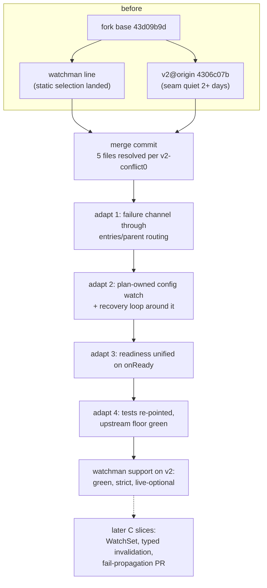

# Re-adding Watchman support on v2@origin

## What this is for

[`v2-conflict0`](/.design/watchman/v2-conflict0.glm53h.md) mapped the
divergence: our 94-commit watchman line and upstream `v2` both rewrote the
watcher seam after the shared base `43d09b9d`, five files conflict in a
three-way merge, and three strategies (A freshen now, B finish static
selection first, C split upstreamable substrate from downstream backend) were
laid out without deciding. No design work has happened since. The task now is
the one the user named: **get Watchman support running again, based on
`v2@origin`, on this feature branch.**

This document is the decision and the execution plan. It is written to be
picked up cold: every phase names its commands, its resolution rules, and its
verification. It stays inside the guardrails of the current execution
authority — no carrier rebuild, no VCS/Profile R/G5 imports, no new
architecture wave — and it records the decision the merge forces so the
executor is never blocked on taste.

It is a draft until the human blesses the strategy and the five
recommendations below; then record the acceptance against
[`vision0`](/.design/watchman/vision0.gpt56s.md), as `v2-conflict0` asks.

## What changed since v2-conflict0

Two facts moved since the conflict map was written this morning. Both make
the merge cheaper:

1. **`v2@origin` advanced five commits** (`21adcb49` →
   [`4306c07b`](https://github.com/anomalyco/opencode/commit/4306c07b340b)):
   GPT prompt update, nix hashes, Bun 1.4.2 bump, TUI home notices, worktree
   inventory. **None touch the seam.** The conflict map's hunks and per-file
   rules are still exact; only the tip pointer moved. The seam has now been
   quiet for two-plus days through two tips — still the cheapest freshen
   window since the branch diverged.
2. **Static selection has substantially landed.** Verified in the working
   tree: the whole-adapter construction fallback named by
   [`static-selection-handoff`](/.design/watchman/static-selection-handoff.unknown.md)
   is gone (`backend === "watchman"` now imports the Watchman adapter and
   `orDie`s on construction failure), and `watchman/backend.ts` routes
   directories strictly to the registry with files statically partitioned to
   Node — the per-directory acquisition fallback is gone too. What remains of
   the authority sequence (step 4 fresh-clock recovery, step 5 metrics/option
   trimming) lives inside `watcher/` and does not overlap any upstream file.

The second fact collapses `v2-conflict0`'s A-vs-B tension: option B said
"finish static selection first" because the merge would interrupt a mid-flight
line, but the heavy part of that line is done and the rest is seam-free. The
remaining choice is only *when* to pay the merge, and every day of delay grows
exactly the riskiest part — the textually-clean, semantically-loaded files
(`server/routes.ts`, `config.test.ts`) that upstream keeps editing.

## The decision this plan recommends

**Land the watchman line onto `v2@origin` now as a single merge commit,
resolve per `v2-conflict0`'s rules, then adapt in a short ordered stack —
A's mechanics with C's shapes.**

- **Merge, not rebase.** Rebasing replays ~94 commits, and every commit that
  touched `watcher.ts`/`config.ts` conflicts individually against upstream's
  rewrite of the same regions — dozens of small pays instead of one
  deliberate 23-hunk pay. A two-parent merge (`jj new <ours> v2@origin`)
  resolves the whole collision once, keeps both proven histories, and is cheap
  to redo if the seam heats up: rebase the merge commit onto the new tip and
  re-resolve only what changed. The corpus's refresh convention
  (`watchman-<date>` bookmarks) already records composed lines
  (e.g. `vcs-core-20260904` "compose jj-vcs and Watchman lines").
- **Adopt upstream's substrate, keep our backend.** Upstream's
  `ConfigDiscovery`/`ConfigWatch.plan`/FiberMap reconcile, the `entries`
  kind, `names` in the RcMap key, and parent-directory routing for files
  become the substrate. Our failure channel, Watchman registry/acquisition/
  recovery stack, options surface, and process-global sharing stay downstream
  of it. This is `v2-conflict0`'s recommended composition, and it matches
  where upstream is investing — which is what makes the eventual C slices
  (upstreamable substrate work) small.
- **What this is not:** a carrier rebuild (`rebuild-assessment0` parks it), a
  VCS/Profile R/G5 import (B2 boundary stays), or a new design wave (the
  handoff forbids it). This plan executes an already-mapped merge.



## Phase 0 — pre-flight on the old base

Goal: merge from a described, green tip. None of this touches the seam.

1. **Commit the stray contract.** The working copy holds the uncommitted
   `contract0.glm53max.md` (present since 09-04; the handoff scoped its
   "don't commit" guardrail to the static-selection work). Commit it as its
   own docs commit so the merge starts from a clean, described tip:

   ```sh
   jj commit -m "docs(watchman): record watcher contract" .design/watchman/contract0.glm53max.md
   ```

2. **Bookmark the tip** per the corpus convention:

   ```sh
   jj bookmark set watchman-20260905 -r @
   ```

3. **Green check on the old base.** If anything below is red, fix it *before*
   merging — seam-free fixes on the old base attribute cleanly; fixes through
   a merge do not.

   ```sh
   cd packages/core
   bun typecheck
   bun test test/filesystem/watchman-root.test.ts \
     test/filesystem/watcher.test.ts \
     test/filesystem/watcher-interests.test.ts \
     test/filesystem/watchman-metrics.test.ts
   ```

   (Never run the repo-root `test` script; it deliberately errors.)

4. **Re-probe the merge** if more than a day has passed since
   2026-09-05, using `v2-conflict0`'s scratch-workspace recipe, and re-check
   that `watcher.ts`, `config.ts`, `config/discovery.ts`, `config/watch.ts`,
   `config/plugin/skill.ts` are still untouched on the new tip.

## Phase 1 — the merge commit

```sh
jj new watchman-20260905 v2@origin -m "chore(core): compose Watchman and v2 lines"
jj resolve --list
```

Expect the mapped five conflicted files (8+7+1+2+1 hunks). Resolve per the
rules below — these are `v2-conflict0`'s table, restated with what this
morning's verification adds:

| File | Resolution rule |
| --- | --- |
| `filesystem/watcher.ts` | Union contract. Input `{type, target, ignore, names, placement, publish, fail}` → `Effect<Subscription \| undefined, Error, Scope>`. Adopt upstream's `entries` kind, `names` in the RcMap key (`{type, target, ignore, names, placement}`), and one non-recursive `fs.watch` on the parent for both `file` and `entries` — **with our `fail` propagation threaded through that watcher's `error` events**, and directories staying on the Watchman-or-Parcel path with timeout + interrupt cleanup. Keep our `Scope`, error channel, and `Options` (`backend`, `subscribeTimeoutMs`, `watchman` sub-struct) — upstream never touched them. |
| `config.ts` | Take upstream's `ConfigDiscovery.discover → Sources`, `load(sources)`, `ConfigWatch.plan`, and FiberMap reconcile as the substrate. Re-attach our pieces mechanically: widened ignores inside the plan's directory targets, and our failure-recovery loop (`catch → log → reload → resubscribe`) wrapping their sliding debounced reloads. Deeper executor unification is Phase 2, not this commit. |
| `config/plugin/skill.ts` | Take upstream's narrower shape (`watch(directory, type)`, FiberMap keyed `` `${type}:${target} ``, `onlyIfMissing`, `firstMissing` sentinel). Port our snapshot bookkeeping onto it in Phase 2 if still needed. |
| `test/location-layer.test.ts` | Union — keep both suites (our process-global watcher counting test; their location repair/retry tests). |
| `AGENTS.md` | Keep our deletion (deliberate contamination fix; their edit is cosmetic). |

Then the textually-clean-but-loaded set, in order of risk:

- `server/routes.ts` — our watchman options wiring sits inside their reworked
  handlers. Read the hunk, not just the merge result; run the server route
  tests before trusting it.
- `test/config/config.test.ts` — same treatment; upstream's config tests are
  part of the keep-green floor.
- `packages/core/package.json` + `bun.lock` — our
  `@superbfowle/fb-watchman-esm` must survive; upstream bumped Bun to 1.4.2
  in the meantime, so if the lockfile looks mangled, regenerate with
  `bun install` rather than hand-editing.
- `cli/src/server-process.ts` — our env plumbing; expected to survive.

The merge commit's tree must typecheck (`bun typecheck` in `packages/core`)
before Phase 2 starts. Tests may legitimately fail here — that is what Phase
2 is for — but the tree must compile.

## Phase 2 — the adaptation stack

Four ordered commits after the merge. Each is independently verifiable; do
not batch them.

1. **`feat(core): thread failure channel through v2 watcher substrate`** —
   the `watcher.ts` union contract made real: `Scope` requirement and error
   channel on `NativeInterface.subscribe` adapted to upstream's
   entries/parent routing; `placement` flowing into Watchman root intents;
   `Options`/server-route/CLI surface re-verified. Check upstream's callers
   of the native layer (their service now calls `native.subscribe` without a
   `Scope` — our service must supply it so callers don't).
2. **`refactor(core): adopt config watch plan ownership`** — Config keeps a
   pure plan function (upstream's `ConfigWatch.plan` shape); `WatchInterests`
   moves underneath as the executor for it (the `WatchSet` direction from
   [`upstream-delta0`](/.design/watchman/upstream-delta0.glm53h.md)
   adaptation 2, done incrementally — do not build the full generic module
   yet). Skill converges on the same executor with plan-derived parent
   `entries` watches replacing per-file interests where the parent is
   observable.
3. **`feat(core): route watchman recovery through onReady`** — the readiness
   decision implemented (see decisions below): substrate-level public
   `onReady`, our Watchman recovery/cursor invalidations calling the same
   hook, the metadata-attach path deleted. The pinned outcome both idioms
   must keep: *a write made before attachment is recovered* — upstream's
   `watcher.test.ts` already pins it for the Node path; our recovery tests
   pin it for the Watchman path.
4. **`test(core): re-point watcher suites at union contract`** — our suites
   re-targeted at the union input (placement-bearing inputs recorded by
   `Test.subscriptions()` still assertable; upstream's plain-input assertions
   unaffected). Both suites green.

## Phase 3 — verification ladder

Run from `packages/core` unless noted:

1. `bun typecheck` — tree compiles.
2. Our four suites (Phase 0 list) — strict selection, acquisition sharing,
   recovery, metrics still hold on the new substrate.
3. Upstream's pinned floor — `test/filesystem/watcher.test.ts` (~249 lines
   pinning `onReady`/`entries` behavior), the config suites
   (`test/config/config.test.ts`, any `reload` scenario tests upstream
   added), and `test/location-layer.test.ts` (union).
4. Server/CLI: the acquisition-limit route tests in `packages/server`, the
   env plumbing test in `packages/cli` if present.
5. Optional, with a compatible daemon:
   `OPENCODE_WATCHMAN_LIVE=1 bun test test/filesystem/watchman-live.test.ts`.
6. Behavior acceptance seeds (from `upstream-delta0` adaptation 3 — these are
   the convergence scenarios both sides solved independently):
   - write-before-attach is recovered (Config reload observes it);
   - deletion/recreation of a watched root is observed (parent `entries` +
     Watchman root recovery both paths);
   - stale watches are removed after a config change (FiberMap/interests
     reconcile);
   - reload storms stay debounced (their sliding-1 + 100 ms, our failure
     loop not amplifying it).

## Phase 4 — after green

- Resume the authority sequence on the merged tree: step 4 (fresh-clock
  recovery with explicit invalidation) and step 5 (metrics/option trimming)
  per [`static-selection-handoff`](/.design/watchman/static-selection-handoff.unknown.md).
- Open the C slices only then, each as its own small line: the `WatchSet`
  extraction, the typed-invalidation replacement of `onReady`
  ([`typed-watcher0`](/.design/watchman/typed-watcher0.glm53.md) end-state),
  and a fail-propagation-through-parent-watches proposal. These are what
  shrink every *future* freshen toward zero.

## The five forced decisions, with recommendations

`v2-conflict0` lists five open questions the merge forces. Deciding them up
front is what keeps Phase 2 mechanical:

1. **Readiness contract.** *Recommendation: adopt upstream's public `onReady`
   parameter at the substrate for this merge; route our Watchman recovery
   invalidations through it; keep typed invalidation as the later C slice.*
   Upstream's freshly-pinned tests enforce `onReady` outcomes — fighting
   them in the merge doubles the work for no behavioral gain, and our
   synthetic-update path translates to an `onReady` effect without loss.
2. **Desired-state ownership.** *Recommendation: owners keep pure plan
   functions (upstream's `ConfigWatch.plan` survives as Config's); the
   executor underneath becomes the shared, failure-aware component (our
   `WatchInterests`, generalized).* Same shape pointed at different owners —
   the convergence `v2-conflict0` already identified.
3. **`entries` vs per-file for non-Config owners.** *Recommendation: converge
   Skill and entrypoint files on plan-derived parent `entries` watches*
   (upstream already routes them that way); keep per-file interests only
   where an owner needs exact-file semantics a parent watch cannot give.
4. **`placement` in the RcMap key.** *Recommendation: keep it there for this
   merge.* Different placement is a different routing intent (which Watchman
   root owns the watch), so distinct subscriptions are semantically right
   today; moving it into a backend routing table is a C-slice refinement,
   not a merge blocker.
5. **Ignore vocabulary.** *Recommendation: ours wins for directory watches.*
   The widened `Ignore.PATTERNS` (vcs dirs, venvs, build outputs, logs,
   Watchman cookie files) exists because a daemon touches these roots;
   cookie-file ignores are load-bearing the moment Watchman is enabled and
   harmless when it is not. The upstreamable form — backend-conditional
   ignores — is another C slice.

## Guardrails

- Do not push anything; the human pushes when they choose.
- Do not modify `contract0`'s content — Phase 0 commits it as-is, separately.
- Do not start carrier/VCS/Profile R/G5 work, promote B3, or open a new
  design wave inside this merge. If a Phase 2 step reveals a real design
  question, stop and record it against this doc rather than improvising.
- Keep the old line reachable (`watchman-20260905` bookmark; never abandon
  commits the merge composes).
- Commit each adaptation separately; no squashing (human reviews all
  squashes).

## Definition of done

- A two-parent merge of `watchman-20260905` and `v2@origin` (or a later tip,
  re-probed) exists on this branch, with the five files resolved per the
  table and `AGENTS.md` still deleted.
- `backend: watchman` selection works end-to-end on the v2 tree: strict
  selection preserved (no Watchman→Parcel path anywhere), files statically on
  Node, directories through the root supervisor with acquisition limits,
  circuit breaker, and cursor recovery intact.
- Our four suites, upstream's pinned watcher/config/location suites, and the
  server acquisition-limit tests are green; `bun typecheck` passes; the live
  suite is green when a daemon is available.
- `@superbfowle/fb-watchman-esm` survives in `packages/core/package.json`
  and `bun.lock`.
- The process-global watcher sharing test still pins one Watcher service
  across location graphs.
- The decision and these five recommendations are recorded as accepted
  against [`vision0`](/.design/watchman/vision0.gpt56s.md) (or amended there).

## Risks

| Risk | Mitigation |
| --- | --- |
| `routes.ts`/`config.test.ts` merge textually clean but break semantically (upstream actively editing both) | Run their tests immediately after the merge commit, before Phase 2; read the merged hunks, not just conflict markers |
| Upstream's native callers lack the `Scope` our `NativeInterface` requires | Our service layer supplies the scope; typecheck surfaces every miss |
| `Test.subscriptions()` shape divergence weakens both suites' assertions | Union input keeps both assertable; Phase 2 commit 4 re-points explicitly |
| `bun.lock` damage from the Bun 1.4.2 bump colliding with our dependency | Regenerate with `bun install`; never hand-edit the lock |
| The seam re-heats mid-execution | Re-probe (Phase 0 step 4) before starting; a merge commit rebases onto a new tip cheaply, re-resolving only the delta |
| Static-selection regressions hiding behind substrate changes | The four suites are the floor; any red there stops Phase 2 |

## Cross-references

- [`v2-conflict0.glm53h.md`](/.design/watchman/v2-conflict0.glm53h.md) — the
  direct predecessor and source of the conflict map, per-file rules, and the
  A/B/C framing this plan decides between. This doc implements its "A and C
  compose" lean with concrete mechanics.
- [`upstream-delta0.glm53h.md`](/.design/watchman/upstream-delta0.glm53h.md)
  — the merge doctrine (adaptations 2–4) this plan's Phase 2 and decisions
  encode; its convergence-scenario seeds are the Phase 3 acceptance list.
- [`static-selection-handoff.unknown.md`](/.design/watchman/static-selection-handoff.unknown.md)
  — execution authority. This plan verifies its steps 1–3 substantially
  landed and sequences its steps 4–5 after the merge; its guardrails are
  adopted verbatim above.
- [`vision0.gpt56s.md`](/.design/watchman/vision0.gpt56s.md) — the recorded
  human decisions this plan must not contradict; acceptance of this plan's
  recommendation should be recorded there.
- [`maintenance.glm53.md`](/.design/watchman/maintenance.glm53.md) — the
  implemented-line record for the backend being carried across; its
  follow-ups (subscribe-response publication, metrics export) survive the
  merge unchanged.
- [`typed-watcher0.glm53.md`](/.design/watchman/typed-watcher0.glm53.md) —
  the deferred end-state for the readiness decision; recommendation 1 keeps
  it the destination with `onReady` as the bridge.
- [`rebuild-assessment0.gpt56solxh.md`](/.design/watchman/rebuild-assessment0.gpt56solxh.md)
  — the scope-parking decision this plan respects (substrate + backend only).
- [`README.md`](/.design/watchman/README.md) — corpus index; this file is
  slotted into the chronology and forward-work tables alongside
  `v2-conflict0`.
- Upstream commits:
  [`43d09b9d`](https://github.com/anomalyco/opencode/commit/43d09b9d75ad)
  (fork base) ·
  [`24f6cb51`](https://github.com/anomalyco/opencode/commit/24f6cb51c85139378f3f39688c8596c003da60d4)
  (#46925, the seam rewrite) ·
  [`21adcb49`](https://github.com/anomalyco/opencode/commit/21adcb4969f3)
  (conflict-map tip) ·
  [`4306c07b`](https://github.com/anomalyco/opencode/commit/4306c07b340b)
  (current `v2@origin`, assessed here).
