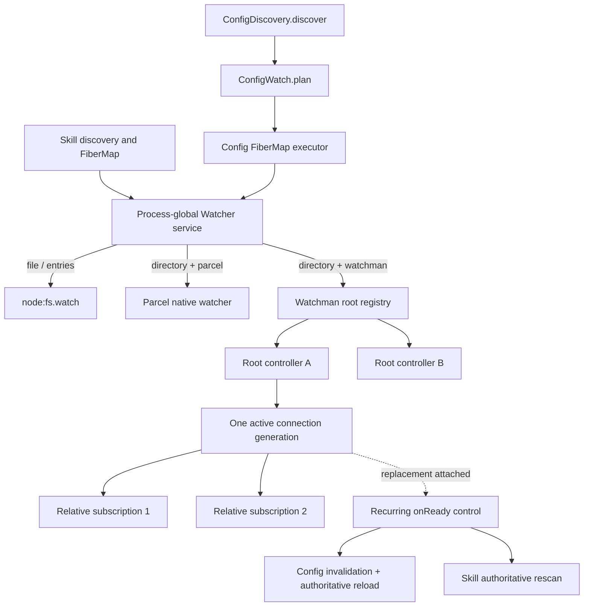

# Reintroducing Watchman from `v2@origin`

## Recommendation

Build a **new implementation line directly from `v2@origin`** and use this
feature branch as a donor and evidence archive. Do not merge or rebase the
94-commit feature stack and then resolve its architecture into upstream. The
textual conflict is small, but resolving it that way would make the old
`Config`/`WatchInterests` architecture the starting point just as upstream has
replaced it with a better discovery-and-plan implementation.

The new line should provide one deliberately narrow product:

> An opt-in Watchman backend for recursive directory interests. `file` and
> `entries` interests remain on `node:fs.watch`; Parcel remains the default
> recursive backend; backend selection is static; a selected Watchman interest
> never falls back to Parcel.

The implementation should retain the feature branch's proven root isolation,
command serialization, acquisition control, and deterministic scenarios, but
rewrite their integration around upstream's current contracts:

- keep `ConfigDiscovery.discover` and `ConfigWatch.plan`;
- keep the `entries` watch kind and its Node parent-directory implementation;
- keep `FiberMap` reconciliation in Config and Skill;
- keep the public readiness outcome: readiness runs after the logical
  subscriber is attached;
- extend readiness to run again after Watchman reattachment, so owners can
  authoritatively reread without fabricated path events; and
- use a fresh clock for every new Watchman delivery generation rather than
  carrying the donor branch's cursor machinery forward.

This is a **re-authoring plan**, not a conflict-resolution plan.

## Baseline and where the conflict note is stale

The assessed `v2@origin` tip is `21adcb4969f3`; the common ancestor with this
branch is `43d09b9d75ad`. The upstream seam has the following shape:

- [`watcher.ts`](https://github.com/anomalyco/opencode/blob/21adcb4969f33bc4125370a0a5cc539f9f33d54c/packages/core/src/filesystem/watcher.ts#L35-L65)
  defines `file`, `entries`, and `directory`, and exposes an `onReady` effect.
- Its subscriber is installed before `onReady` runs
  ([lines 129-145](https://github.com/anomalyco/opencode/blob/21adcb4969f33bc4125370a0a5cc539f9f33d54c/packages/core/src/filesystem/watcher.ts#L129-L145)).
- [`ConfigWatch.plan`](https://github.com/anomalyco/opencode/blob/21adcb4969f33bc4125370a0a5cc539f9f33d54c/packages/core/src/config/watch.ts#L8-L38)
  retains recursive watches for present config roots and Node `entries`
  sentinels for roots and files that may be absent.
- [`Config` reconciliation](https://github.com/anomalyco/opencode/blob/21adcb4969f33bc4125370a0a5cc539f9f33d54c/packages/core/src/config.ts#L236-L280)
  owns discovery, loading, desired watch state, readiness-triggered rereads,
  and debouncing.

[`v2-conflict0`](/.design/watchman/v2-conflict0.glm53h.md) accurately maps the
five textual conflicts and the two architectures. Its option-B framing is now
stale in one important respect: this feature branch has already landed static
selection, one shared initial/replacement acquisition path, bounded acquisition,
and a shared outage circuit. The current
[`backend.ts`](/packages/core/src/filesystem/watcher/watchman/backend.ts#L16-L24)
contains no Watchman-to-Parcel edge, and
[`root.ts`](/packages/core/src/filesystem/watcher/watchman/root.ts#L299-L354)
uses one `acquire` path for initial attachment and recovery.

That does **not** make the branch a clean carrier. Its current recovery still:

- retains and attempts to resume per-subscription cursors;
- publishes fabricated `{ path: target, type: "update" }` values for
  cancellation and fresh-instance control facts
  ([`root.ts`, lines 375-395](/packages/core/src/filesystem/watcher/watchman/root.ts#L375-L395));
- has no upstream `entries` kind;
- replaces upstream's public `onReady` with hidden symbol metadata; and
- replaces upstream Config planning with mutable owner interests.

The new line should take the completed static-selection code as evidence that
the policy is implementable, not as a patch to transplant.

## Decisions made by this plan

These decisions make the implementation sequence executable without importing
the rest of the historical design program.

| Concern | Decision |
| --- | --- |
| Starting point | A fresh jj line rooted at `v2@origin`, with this branch left intact as donor evidence. |
| Default | Parcel remains the default. Watchman is explicit opt-in. |
| Primitive split | Node owns `file` and `entries`; the selected recursive backend owns only `directory`. |
| Backend changes | Static for the lifetime of the Watcher layer. No runtime Parcel↔Watchman migration. |
| Root command | Send plain `watch <known-root>`, never `watch-project`; OpenCode chooses the root instead of allowing daemon marker climbing. |
| Root sharing | One process-global registry, one controller per canonical known root, and multiple relative subscriptions under that root. |
| Readiness | `onReady` means “attached and safe to reread” and may run after initial attachment and every replacement attachment. |
| Recovery state | Every replacement uses a fresh `clock`; no cursor survives a delivery-generation loss. |
| Lost interval | Owners reread authoritative source state after replacement attachment. Exact events remain exact only while delivery is continuous. |
| Failure | Recoverable transport/root loss stays inside the root controller. Structural decode/invariant failure ends the affected root or subscription visibly and is parked by the owner without a retry spin. |
| Config control fact | Config emits its own tagged `invalidation` to indirect config-source consumers. `Watcher.Update` remains exact-only. |
| Daemon artifacts | The Watchman adapter suppresses `.watchman-cookie-*` at the server expression and client filter; generic owner ignore policy is not widened for this purpose. |
| Cleanup | Unsubscribe removes client demand. OpenCode never sends `watch-del`; daemon root retention remains daemon policy. |
| Observability | Structured transition logs and injectable test observations first. Do not port the 550-line console-metrics implementation. |

### Why plain `watch` is intentional

Upstream Watchman documents `watch` as deprecated in favor of
[`watch-project`](https://facebook.github.io/watchman/docs/cmd/watch-project),
because project discovery can consolidate overlapping roots. This integration
already knows its safe project root, however. The donor's live Watchwoman
evidence found that daemon-specific marker climbing could select and crawl
`$HOME` ([`watchwoman0`, lines 203-232](/.design/watchman/watchwoman0.unknown.md#L203-L232)).
Sending plain `watch` for a known root preserves consolidation without handing
root choice back to the daemon. No normal path sends `watch-del`.

## Scope

### Included

1. Opt-in Watchman directory subscriptions against stock Watchman-compatible
   protocol and Watchwoman.
2. Known-root routing and sharing across Config and Skill interests in one
   project.
3. Root-local connection generations and command serialization.
4. Shared, bounded cold-root acquisition and daemon-outage backoff.
5. Initial unavailability, connection loss, command timeout, cancellation PDU,
   replacement, release, and terminal decode behavior.
6. Fresh-clock replacement plus owner reread after attachment.
7. Config-local invalidation for Agent, Command, and Plugin Source consumers.
8. Validated server/CLI opt-in, command timeout, acquisition limit, and binary
   override.
9. Deterministic fake-client tests and an explicitly enabled live-daemon suite.

### Excluded

- Reactive Git/Hg/jj product behavior and the `opwatch-vcs-signals` ticket tree.
- Watchwoman config generations, broad `ViewFilter`, lifecycle reconstruction,
  deployment, or protocol extensions.
- Profile R, G5 leases, hidden-loss detection, active probes, or exactly-once
  claims.
- A public invalidation member in `Watcher.Update` (historical B3).
- A generic `WatchSet`/`WatchInterests` framework.
- Watchman as the default backend.
- Automatic fallback, promotion, pruning, `watch-del`, or stale daemon-root
  reconciliation.
- The donor branch's custom wide-event metrics and tuning surface.
- Unrelated expansion of `Ignore.PATTERNS` (`.jj`, venvs, build output, and so
  on). Those are separate owner-policy decisions.

## Target shape



### Watcher seam

Keep upstream's `WatchInput` union unchanged. Replace the positional callback
with a small subscription-options object:

```ts
export type SubscribeOptions = {
  /** Runs after initial attachment and after each replacement attachment. */
  readonly onReady?: Effect.Effect<void>
  /** Known recursive root; omitted means the directory target itself. */
  readonly root?: string
}

subscribe(input: WatchInput, options?: SubscribeOptions): Effect.Effect<Stream.Stream<Update, Error>>
```

`root` is meaningful only for Watchman directories. It is normalized and
included in the physical `RcMap` key only under that selection; the default
Node/Parcel keys remain unchanged. Keeping it in the call options rather than
`WatchInput` preserves the logical plans and keeps
`Watcher.Test.subscriptions()` assertions about requested interests unchanged.

The native seam gains two private callbacks:

- `publish(update)` for exact filesystem updates; and
- `reacquired()` for a replacement delivery generation that requires owner
  reread.

Both enter one ordered internal channel. Each logical subscriber consumes a
`reacquired` control item by running its own `onReady` effect and filtering that
item from the returned update stream. Initial `onReady` still runs directly
after its `PubSub` subscription is installed, preserving upstream's current
scan-to-subscribe guarantee. The Watchman native calls `reacquired()` only for
replacement attachment, avoiding an initial double signal.

### Static native composition

Do not call the existing Node/Parcel native implementation a “fallback.” Build
one composite selected at Watcher-layer construction:

| Input | Parcel selected | Watchman selected |
| --- | --- | --- |
| `file` | Node | Node |
| `entries` | Node | Node |
| `directory` | Parcel | Watchman registry |

This directly preserves upstream's missing-root and file-recreation behavior.
In particular, Config's parent `entries` sentinels continue to function while
the Watchman daemon is unavailable.

### Physical routing

Config and Skill already have `Location` and `FSUtil`; the global Watcher does
not need location awareness.

Before subscribing a recursive target, each owner prepares:

1. the target's current real path when it exists;
2. the project's current real path; and
3. `root = project` when the physical target is contained by the physical
   project, otherwise `root = target`.

Config keeps `ConfigWatch.plan(sources)` as the logical authority. Its executor
derives an execution key from the logical key plus physical target and root.
This is necessary for a symlink retarget: the parent Node `entries` watch
requests a reload, preparation resolves the new target, and the changed
execution key replaces the old Watchman interest. Do not move physical paths
into `ConfigDiscovery.Sources` or rewrite the planner.

Skill already resolves canonical directory targets and watches the symlink or
first missing ancestor separately. It only needs to supply the known root and
an `onReady` rescan effect.

The root controller sends `watch <root>` once per connection generation. A
subscription under that controller uses
`relative_root = relative(root, target)`, normalized to forward slashes. A
containment violation is a local invariant failure, not a reason to ask the
daemon to discover another root.

### Generation and recovery contract

One root controller owns:

- one active raw-client generation;
- one command semaphore whose timeout starts **after submission**;
- one shared acquisition/replacement effect;
- retained logical subscription demand;
- one capped, jittered retry sequence; and
- terminal structural-failure state at the root or subscription scope where the
  malformed value was proven.

Initial and replacement establishment use the same sequence:

```text
acquire admission
→ create client
→ require relative_root (and match support used by expressions)
→ watch known root
→ install per-subscription PDU route
→ clock
→ subscribe since that fresh clock
→ publish generation
```

On replacement, enqueue `reacquired` before draining queued exact PDUs. This
ensures each owner begins its reread while the new subscription is attached.
Decode any initial change payload returned with the subscribe acknowledgement
and route it through the same PDU path; stock Watchman normally sends initial
matches unilaterally, but the client must not discard a compatible daemon's
payload.

No `SubscriptionState.clock`, compatible-cursor branch, cursor rejection path,
or fabricated root-path update survives. The correctness claim is convergence
to current source state after a reported interruption, not replay of every
intermediate path transition.

### Failure dispositions

| Event | Owner | Disposition |
| --- | --- | --- |
| Watchman binary/socket unavailable | Shared acquisition coordinator + root controller | Retry with bounded admission and capped jitter; do not block unrelated roots and do not call Parcel. |
| Connection `error`/`end` | Root controller | Close the generation once, then share one replacement acquisition across retained subscriptions. |
| Submitted command timeout | Root controller | Close only that generation; replacement uses the same acquisition path. |
| Waiting command sees generation close | Root controller | Retry on replacement; no request was submitted. |
| Root `watch` or subscription command error without structural proof | Root controller | Treat as retryable because stock Watchman provides no stable structured policy code. Log stage/root/attempt. |
| Invalid capability or `watch` response | Root controller | Latch that root terminal, fail its retained subscriptions once, and keep other roots alive. |
| Invalid subscribe response/PDU or containment invariant | Subscription | Fail and park only that logical subscription; keep sibling subscriptions and roots alive. |
| `canceled` PDU | Subscription | Re-establish only that subscription with a fresh clock; emit recurring readiness, not a fake file update. |
| Explicit release during outage | Subscription/root registry | Remove demand before cleanup; late attempts and PDUs cannot resurrect it. |
| Final demand released | Root registry | Interrupt pending acquisition, close the client, and retain no retry fiber. Do not send `watch-del`. |

An owner catches a terminal stream failure, logs it with the logical target,
requests one authoritative reread/invalidation, and then parks that watch fiber
until its desired key changes or its scope closes. This prevents the old
reload/resubscribe whirlpool while making failure visible. A process restart or
Watcher-layer reconstruction is the recovery path for a structural latch.

### Config and Skill convergence

Define a Config-owned change union:

```ts
export type Change =
  | Watcher.Update
  | { readonly type: "invalidation"; readonly path: string }
```

For each Config watch, recurring `onReady` publishes an `invalidation` for that
watch extent and requests the existing debounced reload. Agent, Command, and
Plugin Source test `type === "invalidation"` before applying exact-path
predicates. This closes the indirect-source stale window without changing
`Watcher.Update` or asking the Watchman adapter to invent a path event.

Skill's recurring `onReady` publishes into its existing sliding refresh queue.
The refresh remains an authoritative scan and continues to keep last-good URL
sources on pull failure. Exact updates follow the same queue and debounce.

## Donor disposition

| Donor artifact | Use |
| --- | --- |
| `watchman/schema.ts` | **Salvage.** Recheck every schema against stock Watchman and Watchwoman; allow and process compatible subscribe payload fields rather than dropping them. |
| `watchman/client.ts` | **Salvage carefully.** Keep raw factory validation, per-generation command serialization, generation-close racing, and post-submission timeout. Preserve raw error response data for diagnostics. |
| `watchman/route.ts` | **Rewrite smaller.** Root is supplied explicitly; retain containment checks and forward-slash `relative_root`. |
| `watchman/root.ts` | **Rewrite from scenarios.** Keep root-local generations, shared recovery, release fencing, and sibling isolation; delete cursor compatibility and fabricated updates. |
| `watchman/acquisition.ts` | **Salvage with its deterministic tests.** Keep bounded admission and one half-open daemon probe; verify interruption accounting before reuse. |
| `watchman/backend.ts` | **Rewrite.** It must pass `file` and `entries` to Node and route only `directory` to Watchman. |
| `watchman/metrics.ts` | **Do not port.** Replace with structured transition logs and a small injected observation callback used by tests. Revisit metrics through the host telemetry work. |
| `watcher/interests.ts` / `watcher/internal.ts` | **Do not port.** Upstream's plans, FiberMaps, public readiness, and subscription options replace them. |
| donor `config.ts` / `skill.ts` changes | **Do not port.** Make narrow adaptations to upstream files only. |
| donor tests | **Port scenarios, not APIs or sleeps.** The fake-client controls and failure matrix are more valuable than exact assertions against the old shape. |
| donor ignore widening | **Do not port wholesale.** Implement Watchman-cookie suppression in the adapter; discuss other ignores separately. |
| server/CLI option plumbing | **Port a reduced surface.** Keep backend, binary, command timeout, and acquisition limit; leave retry and metrics tuning internal initially. |

## Implementation sequence

Every step keeps Parcel-default behavior green and is committed separately.

### 1. Freeze the upstream contract and add the backend seam

Files:

- `packages/core/src/filesystem/watcher.ts`
- `packages/core/test/filesystem/watcher.test.ts`

Work:

- Preserve upstream tests for `entries`, attachment-before-readiness, shared
  watch release, pending acquisition interruption, and Node path filtering.
- Introduce `SubscribeOptions`, recurring readiness plumbing, typed native
  failure, and the ordered internal `update | reacquired` channel.
- Keep behavior identical with the default Node/Parcel native.
- Add a fake native test proving replacement readiness reaches every logical
  subscriber after attachment without appearing as a `Watcher.Update`.

Suggested commit: `refactor(core): expose recursive watcher lifecycle seam`

### 2. Add a deterministic protocol actor and happy-path adapter

Files:

- `packages/core/src/filesystem/watcher/watchman/schema.ts`
- `packages/core/src/filesystem/watcher/watchman/client.ts`
- `packages/core/src/filesystem/watcher/watchman/route.ts`
- `packages/core/src/filesystem/watcher/watchman/backend.ts`
- `packages/core/test/filesystem/fixture/watchman/client.ts`
- `packages/core/test/filesystem/watchman-root.test.ts`
- `packages/core/package.json`
- `bun.lock`

Work:

- Add the ESM Watchman transport through the repository package manager.
- Build a scripted raw-client actor with named barriers for command receipt,
  response, unilateral PDU, connection close, timeout, and interruption. Do not
  use fixed sleeps for ordering assertions.
- Implement capability check, plain `watch`, fresh `clock`, `subscribe`, exact
  create/update/delete translation, and release.
- Prove `file` and `entries` never instantiate Watchman and one opted-in
  directory never invokes Parcel.

Suggested commit: `feat(core): add opt-in Watchman directory adapter`

### 3. Add known-root sharing and physical preparation

Files:

- `packages/core/src/filesystem/watcher.ts`
- `packages/core/src/filesystem/watcher/watchman/root.ts`
- `packages/core/src/config.ts`
- `packages/core/src/config/plugin/skill.ts`
- `packages/core/test/config/watch.test.ts`
- `packages/core/test/config/skill.test.ts`
- `packages/core/test/location-layer.test.ts`

Work:

- Key one root controller by canonical known root and share it across nested
  directory interests.
- Derive Config execution keys from logical plan + physical target + root,
  without changing `ConfigWatch.plan`.
- Supply project roots for contained Config/Skill directories and exact roots
  for global/external directories.
- Preserve parent `entries`, missing-ancestor, and symlink sentinels.
- Prove two Location graphs share one process-global registry; distinct roots
  retain independent clients; symlink retargeting replaces the physical watch.

Suggested commit: `feat(core): share Watchman roots across directory interests`

### 4. Add one root supervisor and fresh-clock recovery

Files:

- `packages/core/src/filesystem/watcher/watchman/root.ts`
- `packages/core/test/filesystem/watchman-root.test.ts`

Work:

- Make initial and replacement attachment use one controller path.
- Share one replacement acquisition across every retained subscription on the
  root.
- Always issue a new clock and subscribe from it.
- Emit recurring readiness only after replacement attachment.
- Fence late generations and released demand.
- Handle connection loss, submitted timeout, cancellation, malformed PDU, and
  sibling isolation with named deterministic barriers.

Suggested commit: `fix(core): recover Watchman roots from fresh clocks`

### 5. Bound fleet-wide acquisition

Files:

- `packages/core/src/filesystem/watcher/watchman/acquisition.ts`
- `packages/core/src/filesystem/watcher/watchman/root.ts`
- `packages/core/test/filesystem/watchman-root.test.ts`

Work:

- Port the admission semaphore and closed/open/half-open acquisition circuit.
- Trip the shared circuit only on transport connection failure, not a
  root-specific command or structural decode failure.
- Ensure a canceled final waiter leaves gauges/state balanced and cannot cause
  a later probe.
- Prove the configured limit, one half-open probe, bounded post-recovery drain,
  root isolation, and no Parcel calls.

Suggested commit: `fix(core): bound Watchman root acquisition`

### 6. Propagate owner-local invalidation

Files:

- `packages/core/src/config.ts`
- `packages/core/src/config/plugin/agent.ts`
- `packages/core/src/config/plugin/command.ts`
- `packages/core/src/config/plugin/source.ts`
- `packages/core/src/config/plugin/skill.ts`
- `packages/core/test/config/reload.test.ts`
- focused plugin tests for Agent, Command, Source, and Skill

Work:

- Add Config's exact-update/invalidation union.
- Make indirect consumers bypass exact-path predicates for invalidation.
- Route recurring Config readiness to invalidation + debounced reload.
- Route recurring Skill readiness to its authoritative rescan.
- On terminal physical failure, publish/log once and park rather than spinning.
- Prove a mutation during a forced outage appears in Config-derived domains and
  Skill state after replacement attachment.

Suggested commit: `fix(core): invalidate owners after watcher recovery`

### 7. Expose the reduced opt-in surface

Files:

- `packages/core/src/filesystem/watcher.ts`
- `packages/server/src/options.ts`
- `packages/server/src/routes.ts`
- `packages/server/test/options.test.ts`
- `packages/cli/src/server-process.ts`
- focused CLI tests

Surface:

| Environment | `ServerOptions` | Default |
| --- | --- | --- |
| `OPENCODE_WATCHER_BACKEND` | `fs.watcherBackend: "parcel" | "watchman"` | Parcel |
| `OPENCODE_WATCHMAN_BINARY` | `fs.watchman.binary` | Transport discovery / `WATCHMAN_SOCK` |
| `OPENCODE_WATCHMAN_COMMAND_TIMEOUT_MS` | `fs.watchman.commandTimeoutMs` | 60000 ms |
| `OPENCODE_WATCHMAN_MAX_CONCURRENT_ACQUISITIONS` | `fs.watchman.maxConcurrentAcquisitions` | 4 |

Validate positive integers and enum values at startup. Keep retry base/cap as
internal tested constants until operational evidence requires public tuning.
Do not expose metrics mode/interval or the Parcel-only subscribe timeout as part
of this feature.

Suggested commit: `feat(server): configure the Watchman directory backend`

### 8. Suppress backend artifacts and validate live behavior

Files:

- Watchman expression/filter implementation
- `packages/core/test/filesystem/watchman-root.test.ts`
- `packages/core/test/filesystem/watchman-live.test.ts`
- user-facing Watchman setup/troubleshooting documentation

Work:

- Exclude root-level and nested `.watchman-cookie-*` entries in the server
  expression and client-side defense.
- Verify ignore translation does not change upstream Parcel semantics.
- Run opt-in live tests against the intended daemon(s): stock Watchman if
  supported and the deployed Watchwoman lineage.
- Record binary path/version, daemon socket, root list before/after, commands,
  positive events, bounded negative windows, and cleanup. Do not call
  `watch-del` against pre-existing roots.

Suggested commit: `test(core): validate live Watchman directory observation`

## Required scenarios

The implementation is not complete until these are deterministic or explicitly
live-gated.

### Upstream preservation

- `onReady` occurs after subscriber attachment and can publish an immediately
  observed update.
- An unavailable native watch does not signal readiness.
- `entries` watches match only named immediate children and survive target
  creation/deletion/recreation.
- Equivalent `entries` sets share one physical watch and release once.
- Config discovers roots that appear after startup and catches a write made
  while a directory watch starts.
- Skill missing-root and symlink behavior remains green.

### Watchman contract

- Happy-path create, update, and delete paths are rooted correctly beneath a
  relative subscription.
- Node exclusively handles `file` and `entries` under both backend selections.
- Selected Watchman directory interests never invoke Parcel.
- Nested interests under one known project root share one client/controller;
  distinct roots do not block or fail each other.
- Initial daemon absence retries without blocking server construction.
- Concurrent cold roots respect the acquisition limit and one shared half-open
  probe.
- Connection loss creates one replacement generation for all sibling
  subscriptions.
- Replacement uses a fresh clock, recurring readiness is ordered before queued
  replacement updates, and owners reread current truth.
- Cancellation replaces only the affected subscription.
- Release during outage prevents late acknowledgement, PDU, or retry from
  resurrecting demand.
- A submitted timeout retires one generation; queue residence alone does not
  consume the command deadline.
- Structural decode failure ends/parks one physical watch without a retry loop
  or sibling-root failure.
- Root-level and nested Watchman cookie activity produces no owner update.
- Config invalidation reaches Agent, Command, and Plugin Source regardless of
  exact path predicates; Skill performs one debounced authoritative rescan.

## Verification commands

Run from package directories, never through the repository-root `test` script.
Use the exact scripts present on the fresh implementation line; at the assessed
tip the relevant commands are:

```sh
cd packages/core
bun typecheck
bun test test/filesystem/watcher.test.ts \
  test/filesystem/watchman-root.test.ts \
  test/config/watch.test.ts \
  test/config/reload.test.ts \
  test/config/skill.test.ts \
  test/location-layer.test.ts
OPENCODE_WATCHMAN_LIVE=1 bun test test/filesystem/watchman-live.test.ts

cd ../server
bun typecheck
bun test test/options.test.ts

cd ../cli
bun typecheck
```

Before final review, also run the repository lint/effect-pattern checks over the
changed packages and rerun all Core config/filesystem suites, not only the new
files.

## Completion gates

1. Default `v2@origin` watcher behavior and tests are unchanged when Watchman is
   not selected.
2. The only backend matrix is Node for `file`/`entries` and the statically
   selected implementation for `directory`.
3. No source edge from the Watchman adapter reaches Parcel.
4. Config planning remains `ConfigDiscovery` → `ConfigWatch.plan` → Config's
   FiberMap executor.
5. No hidden-symbol `WatcherInternal`, generic `WatchInterests`, cursor state,
   fabricated path update, custom console metrics, `watch-project`, or
   `watch-del` is present.
6. Every reported recovery path reaches recurring readiness only after
   replacement attachment, and owner state converges through reread.
7. Terminal failure is visible and does not produce a retry/reload spin.
8. Pending acquisition and replacement work is scope-cancelable; final demand
   leaves no client or retry fiber.
9. Focused typechecks/tests pass and live evidence records the intended daemon
   and binary revision.
10. Watchman remains opt-in until a separate rollout decision evaluates cold
    root cost, many-project pressure, daemon compatibility, and rollback.

## Branch procedure

1. Leave the current `watchman` line and dated bookmarks intact.
2. Create a new jj workspace/change directly from the refreshed `v2@origin`.
3. Bring this plan onto that line as the first documentation commit; do not
   bring the rest of `.design/watchman/` unless a specific implementation
   citation is needed.
4. Re-author each implementation step above. Do not cherry-pick the old
   `watcher.ts`, `config.ts`, `skill.ts`, or lockfile commits.
5. Use donor files and tests read-only, copying only small modules after their
   dispositions above are satisfied.
6. Refresh from `v2@origin` before the owner-invalidation and server-wiring
   steps, because Config/plugin and route composition are the nearby churn
   surfaces.
7. Keep each logical step in its own jj commit with explicit file paths. Do not
   push; promotion remains a human action.

## Risks and review focus

- **Recurring-readiness semantics:** upstream currently documents one initial
  callback. Audit every call site and pin repeated invocation explicitly.
- **Owner invalidation:** a Config reload alone is insufficient; Agent,
  Command, and Plugin Source parse files that are not represented by Config's
  document equality. The tagged Config control fact is required.
- **Symlink retargeting:** logical plan equality can hide a changed physical
  target. Execution keys must include prepared physical target/root.
- **Root cost:** plain project-root watches may crawl much more than a nested
  `.opencode` directory. Admission bounds the fleet effect; live evidence must
  record root size and acquisition behavior before default promotion.
- **Unstructured daemon errors:** without stable protocol error codes, command
  errors cannot safely select permanent policy. Retry them with bounded
  pressure; reserve terminal latches for locally proven structural failures.
- **Stream failure parking:** verify `FiberMap` retains the parked effect and
  still removes it when desired state changes or scope closes.
- **Cookie amplification:** client filtering alone prevents owner refreshes but
  not transport traffic. The expression-side exclusion is part of completion.
- **Daemon diversity:** stock Watchman and Watchwoman differ around root policy,
  cancellation, and capability honesty. Claim only behavior tested against the
  selected deployment.

## Cross-references

- [`v2-conflict0.glm53h.md`](/.design/watchman/v2-conflict0.glm53h.md) is the
  three-way conflict map. This plan accepts its upstream-preservation findings
  but chooses re-authoring instead of hunk resolution.
- [`maintenance.glm53.md`](/.design/watchman/maintenance.glm53.md) records the
  running donor backend, option surface, metrics, and historical tests. It is
  evidence for behaviors, not the new module layout.
- [`rebuild-assessment0.gpt56solxh.md`](/.design/watchman/rebuild-assessment0.gpt56solxh.md)
  separates the reliable opt-in backend from VCS, daemon, assurance, and
  Watchment programs. This plan implements only its narrow backend outcome.
- [`review-failure-paths0.gpt56s.md`](/.design/watchman/review-failure-paths0.gpt56s.md)
  provides the response-loss, timeout, completion, and deterministic-test
  evidence behind fresh-clock recovery and visible failure.
- [`review-simplification0.gpt56s.md`](/.design/watchman/review-simplification0.gpt56s.md)
  supplies the static-selection and one-supervisor policy retained here.
- [`vision0.gpt56s.md`, lines 883-929](/.design/watchman/vision0.gpt56s.md#L883-L929)
  records the historical B2/fresh-clock direction. This plan uses only the
  Config-local invalidation and fresh-clock portions needed by the backend; it
  does not import the broader composite program.
- [Watchman `subscribe`](https://facebook.github.io/watchman/docs/cmd/subscribe)
  defines connection-scoped subscriptions, initial unilateral results, and
  `since`; [query synchronization](https://facebook.github.io/watchman/docs/cookies)
  explains the daemon cookie artifacts this adapter must suppress.
