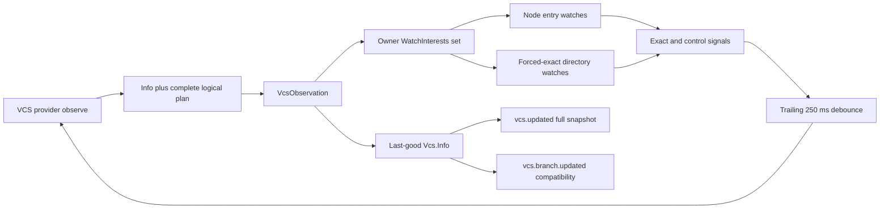

# Topology-correct VCS observation

## Status and implementation question

This specification is the implementation handoff for Beads ticket
`opwatch-vcs-signals-core-observation`. It is written against the accepted
Watchman documentation tip `82079ec5` and the composed jj-vcs tip `5b072651`.
It does not implement TypeScript.

The question is not which raw paths should be added to the broad project
watch. The question is how the selected VCS provider can atomically describe
the physical metadata that makes its complete `Vcs.Info` stale, while Core
owns exact observation, topology replacement, source freshness, and semantic
publication.

Normative words such as MUST, MUST NOT, SHOULD, and MAY describe the intended
implementation.

## Decisions

1. Add an optional provider method named `observe`. One call returns one
   decoded `Vcs.Info` candidate and its complete logical observation plan.
2. Keep provider interests backend-neutral. An `entry` is observed through
   the existing Node file path; a `directory` always carries forced-exact
   placement and an empty ignore list.
3. Put lifecycle and reconciliation in a deep Core module at
   `packages/core/src/vcs/observation.ts`. Providers neither import `Watcher`
   nor subscribe directly.
4. Treat exact create, update, delete, initial-ready, continuity-loss, and
   terminal-interest signals as invalidations. Coalesce them with one
   trailing 250 ms debounce, then call `observe` again.
5. Reconcile a successful plan by retaining all new logical demands before
   releasing obsolete demands. Native acknowledgement is a separate control
   fact; its initial-ready invalidation closes the read-to-observe window.
6. Retain last-good metadata and the prior plan when topology resolution or
   metadata reading fails. Expose separate observation-health and
   source-freshness axes inside Core.
7. Add `vcs.updated` with `{ info: Vcs.Info }`. Publish it after every
   successful invalidation-driven reread, even when the branch and the whole
   value compare equal.
8. Retain `vcs.branch.updated` as branch-only compatibility. Emit it only
   when `branch.current` changes; do not use it as the complete freshness
   event.
9. Compose the accepted Watchman line with the whole refreshed jj-vcs line
   before implementing this ticket. Do not copy only `jjDiscover` or attempt
   jj acceptance on the Watchman-only tip.
10. Keep this lane independent of Watchwoman broad-root filtering. The two
    lanes meet at the later deployed activation gate.

## Scope boundary

### This ticket owns

- The provider observation contract in both Effect and Promise plugin APIs.
- Git, Mercurial, and composed Jujutsu plans.
- Worktree, common-directory, repository-pointer, and missing-target
  sentinels.
- Forced-exact directory placement and Node entry placement.
- Owner-local plan reconciliation, debounce, authoritative reread, last-good
  state, and degraded health.
- The complete `vcs.updated` event definition and Core publication.
- Deterministic plan, placement, lifecycle, failure, and event tests.
- An opt-in isolated exact-root create/delete integration test.

### This ticket does not own

- `opwatch-vcs-signals-core-consumers`: client cache replacement, footer
  labels, conflict presentation, and the already-open move/worktree list.
- Watchwoman's broad-root ordered `ViewFilter`, smart/strict/off profiles, or
  traversal rules.
- Compfuzor revision selection, generated service configuration, or restart.
- The final deployed cross-workspace and product activation record.
- Reconstruction of the clean future Watchman carrier.
- Automatic project reclassification when an already-open Git checkout is
  converted into a colocated jj repository. The composed jj-vcs line owns
  classification on project open; this ticket observes the selected provider.

The split follows the accepted dependency route: exact Core observation can
ship without daemon broad-root allowlisting, while product convergence and
deployed proof remain later gates
([alignment, lines 247-271](/.design/watchman/opwatch-vcs-signals-alignment0.gpt56solmax.md#L247-L271)).

## Source reality and resolved ambiguities

| Question | Source fact | Resolution |
| --- | --- | --- |
| Why not extend the current path predicate? | Core listens to policy-controlled `FileSystem.Event.Changed`, recognizes only Git `HEAD` or Hg `branch`, and writes `{ branch: {} }` on an `info()` failure ([`vcs.ts`, lines 88-142](/packages/core/src/vcs.ts#L88-L142)). | Remove that bus subscription as the VCS refresh owner. Keep LocationWatcher publication only as external compatibility. |
| Where is linked-worktree `HEAD`? | `Git.Repository` separately records `worktree`, `gitDirectory`, and `commonDirectory` ([`git.ts`, lines 13-17](/packages/core/src/git.ts#L13-L17)); `Project` stores only the common directory in `location.vcs.store` ([`project.ts`, lines 325-345](/packages/core/src/project.ts#L325-L345)). | Rediscover Git topology inside the provider observation call. Watch `gitDirectory/HEAD`, not `location.vcs.store/HEAD`. |
| Can a directory inside the project force its own root? | `WatchInterests` currently auto-selects project placement for any contained directory ([`interests.ts`, lines 31-47](/packages/core/src/filesystem/watcher/interests.ts#L31-L47)); the backend already maps explicit exact placement to a plain watch of the target ([`backend.ts`, lines 17-31](/packages/core/src/filesystem/watcher/watchman/backend.ts#L17-L31)). | Add an explicit placement override to owner interests. No daemon exception is needed. |
| Do files use Watchman? | The selected backend sends every file input to the fallback Native and only routes directories through Watchman ([`backend.ts`, lines 17-23](/packages/core/src/filesystem/watcher/watchman/backend.ts#L17-L23)); Node watches the parent entry ([`watcher.ts`, lines 233-263](/packages/core/src/filesystem/watcher.ts#L233-L263)). | Represent metadata files and topology sentinels as `entry`; translate them to the existing file input. |
| Are ready and continuity ordinary file updates? | Current code fabricates root-level `update` rows for readiness, clock discontinuity, cancellation, and fresh instances ([`interests.ts`, lines 36-46](/packages/core/src/filesystem/watcher/interests.ts#L36-L46), [`root.ts`, lines 198-247](/packages/core/src/filesystem/watcher/watchman/root.ts#L198-L247), [`root.ts`, lines 377-395](/packages/core/src/filesystem/watcher/watchman/root.ts#L377-L395)). | Preserve exact `Watcher.Update` values, add internal typed owner-control signals, and let VCS turn every control fact into its own invalidation reason. This remains B2, not generic watcher invalidation. |
| How is a secondary jj workspace resolved? | The jj-vcs line reads `.jj/repo` as either a directory or pointer, resolves the main repository, and stores that repository path in `vcs.store` ([jj-vcs `project.ts`, lines 290-345](file:///home/rektide/src/opencode-jj-vcs/packages/core/src/project.ts#L290-L345)). | Extract or reuse that filesystem-only topology result; never watch a lexical secondary `.jj/repo/op_heads`. |
| Are current jj metadata reads side-effect safe? | The jj command helper adds `--ignore-working-copy` only for `metadata: true`, but the identity query in `info()` omits that option while workspace listing includes it ([jj-vcs `vcs/jj.ts`, lines 208-223](file:///home/rektide/src/opencode-jj-vcs/packages/core/src/vcs/jj.ts#L208-L223)). | Mark the identity query as metadata. Every call reachable from watcher-triggered `observe` MUST use `--ignore-working-copy`. |
| Should the event carry data or ask for a refetch? | Core has already paid for a complete provider read, while the current public event carries only `branch` ([`vcs-event.ts`, lines 7-14](/packages/schema/src/vcs-event.ts#L7-L14)) and the client patches only that field ([`data.ts`, lines 1211-1221](/packages/client/src/solid/data.ts#L1211-L1221)). | Carry complete `Vcs.Info` in `vcs.updated`. This avoids a second request and gives consumers one atomic value. |
| Is `branch.default` fully live? | Git derives it from local heads, remote symbolic `HEAD`, and config including `init.defaultBranch` ([`plugin/vcs/git.ts`, lines 198-253](/packages/core/src/plugin/vcs/git.ts#L198-L253)). | This ticket watches local heads and packed refs. Remote symbolic-HEAD-only and config-only changes are explicitly non-live; they refresh on the next listed invalidation or explicit resource read. Do not claim otherwise. |

## Architecture



The ownership rule is strict:

- A provider knows which topology and metadata inputs make its answer stale.
- `VcsObservation` knows how to normalize, own, replace, and interpret the
  provider's plan.
- `WatchInterests` knows physical placement, shared demand, readiness,
  continuity, terminal attribution, and release.
- The Watchman backend knows routes and daemon lifecycle, not Git or jj.
- Consumers know how a complete VCS value changes product state, not which
  file caused it.

## Provider contract

Add the following backend-neutral types beside `VcsDefinition` in
`packages/plugin/src/effect/vcs.ts` and mirror them in
`packages/plugin/src/promise/vcs.ts`:

```ts
export type VcsObservationInterest =
  | {
      readonly type: "entry"
      readonly path: string
    }
  | {
      readonly type: "directory"
      readonly path: string
      readonly placement: "exact"
    }

export interface VcsObservationSnapshot {
  readonly info: Vcs.Info
  readonly interests: readonly VcsObservationInterest[]
}

export interface VcsDefinition {
  readonly id: string
  readonly name: string
  readonly info: (input: VcsScope) => Effect.Effect<Vcs.Info, unknown>
  readonly observe?: (input: VcsScope) => Effect.Effect<VcsObservationSnapshot, unknown>
  // Existing base, branches, status, and diff members remain unchanged.
}
```

The Promise form takes the same abort context as `info`. Its adapter forwards
`observe` with receiver preservation and interruption, exactly as it forwards
the existing provider methods. `observe` is optional so third-party providers
without a filesystem contract retain pull-only metadata. Absence means
observation state `idle`, not failure.

One result is atomic in the application sense: Core either validates and
commits its complete `info` plus complete `interests`, or commits neither. It
is not a claim that multiple filesystem reads form an operating-system
transaction. Sentinels and the acquisition-ready reread close races that occur
while the provider is reading.

The provider MUST return absolute normalized paths. Core validates once at
this boundary, deduplicates by complete normalized interest, sorts for stable
tests, and rejects a partial or malformed result. A provider MUST NOT return a
Watchman root, ignore patterns, subscription names, or backend choices.

## Core module interface

`packages/core/src/vcs/observation.ts` is a deep, Location-scoped module. Its
small interface is:

```ts
export interface Interface {
  readonly current: () => Vcs.Info
  readonly health: () => Health
  readonly refresh: (reason: Reason) => Effect.Effect<void>
}
```

`make` receives the selected-provider closure, fixed `VcsScope`, decoders,
`Bus`, and one owner-local `WatchInterests` instance. It starts its signal
consumer in the enclosing scope. Plan state, debouncer, selected-provider
generation, last-good value, failure details, and leases remain private.

`Vcs` delegates its cache and automatic refresh to this module. Existing
`base`, `branches`, `status`, and `diff` operations remain direct provider
calls. `Vcs.Interface` MAY forward `health()` for Core tests and diagnostics,
but the health value is not added to Schema, HTTP, SDK, or the public event in
this ticket.

Use explicit reasons internally:

```ts
export type Reason =
  | { readonly type: "initial" }
  | { readonly type: "provider-changed" }
  | { readonly type: "ready"; readonly interest: VcsObservationInterest }
  | { readonly type: "change"; readonly event: "create" | "update" | "delete"; readonly path: string }
  | { readonly type: "continuity"; readonly interest: VcsObservationInterest; readonly cause: string }
  | { readonly type: "interest-failed"; readonly interest: VcsObservationInterest; readonly cause: unknown }
```

Reasons are diagnostic and test data. No consumer derives metadata from them.

## Owner-interest substrate

Deepen the existing `WatchInterests` owner set rather than adding a VCS-only
subscription registry. Its input gains an optional explicit placement, and it
adds a nonterminating, broadcast `signals` stream:

```ts
export type Input = Watcher.WatchInput & {
  readonly placement?: WatcherInternal.Placement
}

export type Signal =
  | { readonly type: "ready"; readonly input: Input }
  | { readonly type: "change"; readonly input: Input; readonly update: Watcher.Update }
  | { readonly type: "invalidation"; readonly input: Input; readonly reason: ContinuityReason }
  | { readonly type: "failure"; readonly input: Input; readonly error: Error }

export interface Interface {
  readonly signals: Stream.Stream<Signal>
  readonly changes: Stream.Stream<Watcher.Update, Error>
  readonly reconcile: (inputs: readonly Input[]) => Effect.Effect<void>
}
```

Preserve `changes` for Config and Skill on this current line. Implement both
surfaces from broadcast state so consumers never compete for one queue row.
VCS consumes `signals`; compatibility `changes` may continue mapping ready and
continuity to synthetic updates and failure to stream failure.

Explicit placement participates in normalization and the owner key. Omitted
placement keeps today's auto-project rule. Explicit exact always wins. Entry
interests translate to the existing file input and therefore remain Node-owned.

Desired state MUST outlive a running interest fiber. Terminal completion stores
an attributed suppression record under the normalized key; an unchanged
reconcile does not redemand it in a yield-only loop. A changed intent or
relevant topology generation may replace it. Sibling interests and the
aggregate signal stream remain live.

Any terminal transition that might hide changes emits `invalidation` before
`failure`. This is the correction required by the continuity review
([`carrier1-review:252-284`](/.design/watchman/carrier1-review0.gpt56sol.md#L252-L284)).

"Acquire new before release old" means that every addition has a retained
logical demand handle before any obsolete handle is released. It does not mean
waiting indefinitely for native acknowledgement. Initial ready is a later
invalidation that closes the read-to-observe window
([`carrier1:478-487`](/.design/watchman/carrier1.gpt56s.md#L478-L487)).

## Interest materialization and sentinels

An `entry` is a logical request to observe one named child through its parent.
It maps to `{ type: "file", path }` even when `path` names a directory or does
not yet exist. This intentionally reuses Node's parent-entry behavior; provider
code MUST NOT call `stat` and drop an absent entry interest.

A `directory` maps to:

```ts
{
  type: "directory",
  path: interest.path,
  ignore: [],
  placement: { type: "exact" },
}
```

The exact directory input is materialized only while that directory exists.
Its entry sentinel and ancestor sentinels remain in the logical plan whether it
exists or not. An exact-root terminal or deletion therefore cannot make
recreation unobservable.

Providers return explicit sentinel chains from a stable location-owned anchor
to each replaceable leaf. Core does not infer VCS path grammar. For a leaf
`A/B/C`, the provider retains entry interests for `A/B` and `A/B/C` when `A`
is the stable anchor. If `B` is absent, only the watch whose parent currently
exists can be acquired; its event causes resolution again, after which Core
acquires the deeper sentinel before releasing the shallower obsolete watch.

The stable anchors for this ticket are:

| Topology | Anchor |
| --- | --- |
| Current Git, Hg, or jj workspace marker | `scope.worktree` |
| Git common metadata | Resolved main worktree/canonical root plus the resolved `commonDirectory` parent entry |
| Secondary jj main repository | Resolved main workspace root derived from the repository path |
| Exact `refs/heads` or `op_heads/heads` | Resolved common or repository directory retained by its own parent-entry sentinel |

The Location instance lifetime is the outer boundary. This module does not try
to follow deletion or movement of `scope.worktree` itself. A location move or
teardown constructs a new Location-scoped VCS service.

All paths are absolute, `path.resolve` normalized, deduplicated by type plus
placement plus path, and sorted before reconciliation. A symlink or pointer is
watched at its lexical entry and its resolved target entry; watching only the
resolved target cannot observe retargeting.

## Git provider plan

Each `observe(scope)` calls `Git.repo.discover(scope.directory)`. The resulting
`Git.Repository` is the authority for current worktree-local and common
topology; `scope.store` is not sufficient because Project persists only the
common directory
([`project.ts:329-345`](/packages/core/src/project.ts#L329-L345)).

For repository `repo`, return this complete logical plan:

| Kind | Path | Purpose |
| --- | --- | --- |
| Entry | `<repo.worktree>/.git` | Main-directory or linked-worktree pointer replacement. |
| Entry | `<scope.canonical>/.git` | Main-worktree anchor when the current worktree is linked. |
| Entry | `<repo.gitDirectory>` | Resolved worktree-local administrative directory deletion or recreation. |
| Entry | `<repo.gitDirectory>/commondir` | Linked-worktree common-directory pointer replacement. |
| Entry | `<repo.gitDirectory>/HEAD` | This worktree's branch switch, detach, deletion, or recreation. |
| Entry | `<repo.commonDirectory>` | Resolved common-directory deletion or recreation. |
| Entry | `<repo.commonDirectory>/packed-refs` | Packed-ref rewrite, creation, or deletion. |
| Entry | `<repo.commonDirectory>/refs` | Stable parent of local heads. |
| Entry | `<repo.commonDirectory>/refs/heads` | Heads-tree creation, deletion, or replacement. |
| Exact directory | `<repo.commonDirectory>/refs/heads` | Recursive local branch create, update, and delete. |

The exact directory is acquired only when it exists. Both parent entries remain
owned. Nested branch names are covered recursively rather than enumerated.

For linked worktrees, `HEAD` MUST come from `gitDirectory`, while
`packed-refs` and `refs/heads` MUST come from `commonDirectory`. A test plan
that uses `<scope.store>/HEAD` is incorrect. The `commondir` entry is a topology
input and cannot be replaced by watching current refs.

Git `observe` resolves topology once, reads complete info through the existing
adapter, and returns both. Metadata commands retain the provider's current
`--no-optional-locks` discipline
([`git provider:143-184`](/packages/core/src/plugin/vcs/git.ts#L143-L184)).

The live guarantee covers current branch, local-head changes, and packed-ref
changes. `branch.default` is still included in every complete result, but a
change made only to Git config or `refs/remotes/<remote>/HEAD` is explicitly
non-live until another listed invalidation or explicit read. The current reader
uses both inputs
([`git provider:198-253`](/packages/core/src/plugin/vcs/git.ts#L198-L253));
observing global/includes/conditional config and remote symbolic refs is a
separate expansion, not an implicit claim of this target matrix.

## Mercurial provider plan

Resolve the active `.hg` store and return three entry interests:

| Path | Purpose |
| --- | --- |
| `<scope.worktree>/.hg` | Administrative marker deletion or replacement. |
| `<resolved .hg store>` | Symlinked or out-of-tree store deletion or recreation. |
| `<resolved .hg store>/branch` | Branch file create, update, delete, and recreation. |

There is no Hg exact directory in this ticket. `branch` remains Node-owned and
may be absent while the default branch is active. The provider's complete read
retains today's constant `default: "default"`
([`hg provider:101-108`](/packages/core/src/plugin/vcs/hg.ts#L101-L108)).

Hg is an explicit provider plan rather than a fallback embedded in
`VcsObservation`. This keeps VCS topology out of the generic owner set and
proves that the provider contract is not jj-specific.

## Jujutsu topology value

Extract the composed jj-vcs filesystem discovery from `Project.resolve` into a
shared Core module such as `packages/core/src/vcs/topology/jj.ts`. Project and
the jj provider consume one result:

```ts
export interface Repository {
  readonly workspace: AbsolutePath
  readonly marker: AbsolutePath
  readonly reference: AbsolutePath
  readonly repository: AbsolutePath
  readonly canonical: AbsolutePath
  readonly gitTarget?: AbsolutePath
  readonly colocatedGit?: Git.Repository
}

export const discover: (
  directory: AbsolutePath,
) => Effect.Effect<Repository | undefined>
```

`reference` is the local `.jj/repo` directory or pointer. `repository` is the
real main-repository directory after resolving that pointer. `canonical` is the
main workspace derived from the resolved repository. This preserves the
filesystem-only rules already exercised by the jj-vcs project tests
([`jj-vcs project.ts:301-345`](file:///home/rektide/src/opencode-jj-vcs/packages/core/src/project.ts#L301-L345)).

Resolve `repository/store/git_target` when present. Populate `colocatedGit`
only when that target identifies the checkout Git directory and
`Git.repo.discover(workspace)` confirms usable worktree/common topology. The
legacy `repository/store/git` directory is a non-colocated backing store; its
presence MUST NOT compose the raw Git metadata plan.

Extraction MUST preserve Project's cached identity, damaged-jj Git fallback,
and canonical-directory behavior. It is a shared topology read, not a rewrite
of project identity
([`jj-vcs project.ts:383-420`](file:///home/rektide/src/opencode-jj-vcs/packages/core/src/project.ts#L383-L420)).

## Jujutsu provider plan

For topology `repo`, return this plan:

| Kind | Path | Purpose |
| --- | --- | --- |
| Entry | `<repo.workspace>/.jj` | Local marker deletion or replacement. |
| Entry | `<repo.reference>` | Main-directory replacement or secondary-pointer retargeting. |
| Entry | `<repo.canonical>/.jj` | Resolved main-workspace anchor. |
| Entry | `<repo.repository>` | Resolved repository deletion or recreation. |
| Entry | `<repo.repository>/store` | Parent for optional Git topology. |
| Entry | `<repo.repository>/store/git_target` | Colocated target create, delete, or retarget. |
| Entry | `<repo.repository>/store/git` | Legacy backing layout replacement, without recursive watching. |
| Entry | `<repo.repository>/op_heads` | Stable parent of operation heads. |
| Entry | `<repo.repository>/op_heads/heads` | Heads-tree creation, deletion, or replacement. |
| Exact directory | `<repo.repository>/op_heads/heads` | Repository-wide operation-head create and delete. |

The exact target is always under the resolved main repository. A lexical
secondary `.jj/repo/op_heads/heads` is never requested. Two locations that
resolve the same repository request the same physical exact key; the
process-global Watcher shares acquisition while each Location-scoped owner
rereads its own workspace metadata.

When `colocatedGit` exists, append the complete Git plan and deduplicate it with
the jj plan. The selected provider remains jj. Raw Git ref activity is only an
invalidation input to one complete jj `Vcs.Info`; it does not select the Git
provider or publish a partial Git snapshot.

Every command reachable from jj `observe` uses `--ignore-working-copy`. The
current command helper already adds it for `metadata: true`, but the identity
query omits that option while workspace listing includes it
([`jj-vcs vcs/jj.ts:208-223`](file:///home/rektide/src/opencode-jj-vcs/packages/core/src/vcs/jj.ts#L208-L223)).
Mark identity as metadata. Nearest-bookmark, workspace-list, conflict, and
trunk metadata retain the same discipline.

`status` and `diff` may intentionally inspect and snapshot unsaved work, but
the observation worker never invokes them. One resulting `op_heads` event
leads only to side-effect-free `observe`, so it cannot form a feedback loop.
The target evidence confirms that state-changing and peer-workspace operations
rewrite `op_heads/heads`, while `--ignore-working-copy` reads do not
([`watches.glm53.md:64-82`](/.design/watchman/watches.glm53.md#L64-L82)).

## Refresh state machine

`VcsObservation` privately retains selected provider ID and generation,
last-good `Info`, last-good logical and materialized plans, one owner-interest
set, one refresh permit, one trailing-debounce channel, and diagnostic causes.
Its health snapshot has two independent axes:

```ts
export type Health = {
  readonly observation: "idle" | "starting" | "ready" | "degraded"
  readonly source: "empty" | "fresh" | "stale" | "degraded"
}
```

No selected provider yields `{ observation: "idle", source: "empty" }` and an
empty plan. A selected provider without `observe` remains pull-only: Core reads
`info`, keeps observation `idle`, and does not infer paths from `scope.store`.

For an observed provider, startup and every refresh use this sequence:

1. Start consuming `WatchInterests.signals` before the first provider read.
2. Run the initial provider observation immediately; do not debounce startup.
3. Capture provider ID/generation, call `observe(scope)`, decode `info`, validate
   absolute interests, normalize the logical plan, and materialize currently
   acquirable inputs.
4. If selection changed during the read, discard the result without publishing
   or changing leases, then enqueue `provider-changed`.
5. Reconcile the complete materialized plan. Retain all additions before
   releasing removals.
6. After successful reconcile, atomically commit logical plan, physical plan,
   metadata, and `source: "fresh"`.
7. Publish semantic events from that committed snapshot.
8. Coalesce all new-interest ready signals and reread after 250 ms. This closes
   the interval between step 3's source read and step 5's acquisition.

Only one provider observation and plan commit runs at once. Invalidations that
arrive during a read set a trailing dirty condition. After that attempt, the
worker waits for the debounce edge and reads again; no signal is discarded
because another refresh was active.

The debounce applies to exact events and lifecycle invalidations alike. It is a
private 250 ms policy, not plugin configuration. Tests use Effect `TestClock`;
production tests MUST NOT sleep to prove coalescing.

`Vcs.info()` returns the module's last-good cache. Once exact jj observation is
active, delete the composed line's special live jj reread
([`jj-vcs vcs.ts:163-174`](file:///home/rektide/src/opencode-jj-vcs/packages/core/src/vcs.ts#L163-L174)).
`base`, `branches`, `status`, and `diff` remain direct provider operations.

## Reconciliation and failure behavior

A sentinel event never patches the current plan. It invalidates the whole
provider observation, which reruns pointer parsing, realpath, repository
discovery, metadata read, and complete-plan derivation.

Successful retargeting from A to B is ordered as follows:

```text
read and validate snapshot B
retain every B addition
release A-only interests
commit snapshot B and plan B
publish complete metadata B
ready(B) -> debounced authoritative reread
```

Interests shared by A and B retain their lease. If B cannot resolve or its
metadata read fails, A's metadata and complete plan remain active. Core does not
release A because a pointer is temporarily empty, malformed, or dangling.

When an exact directory disappears, retain its entry and parent sentinels and
remove only the impossible exact-directory physical input. Recreation triggers
resolution and exact acquisition again. If an exact subscription terminates
before a delete row, its continuity invalidation takes the same reread path.

| Condition | Metadata | Plan | Publication | Health |
| --- | --- | --- | --- | --- |
| Initial success | Replace empty/old with complete result. | Reconcile complete result. | Publish `vcs.updated`; branch compatibility if changed. | Source fresh; observation starting until ready. |
| Exact or ready invalidation success | Replace with complete result even if equal. | Reconcile complete result. | Always publish `vcs.updated`. | Source fresh. |
| Provider, topology, or decode failure | Keep last good. | Keep prior complete plan. | Publish neither VCS event. | Source degraded; observation unchanged. |
| Terminal interest failure | Keep last good until reread. | Keep desired demand and suppression; siblings stay live. | Invalidate first; publish only if reread succeeds. | Observation degraded. |
| Continuity recovery | Keep last good until reread. | Keep or reconcile from reread. | Publish only after successful reread. | Observation ready; source independently stale/fresh. |
| Provider deselected | Reset to `{ branch: {} }`. | Reconcile empty plan. | Publish complete empty metadata if replacing a provider. | Observation idle; source empty. |

A successful source audit can make source fresh while observation remains
degraded. A recovered physical observation can become ready while source stays
degraded until the authoritative read succeeds. Never clear one axis as a side
effect of the other
([`direction0:258-277`](/.design/watchman/direction0.gpt56solmax.md#L258-L277)).

Failures are logged once per failed refresh generation with provider ID, reason
set, old-plan hash, candidate-plan hash when available, and cause. Do not catch
merely to print and rethrow. Interruption remains interruption; ordinary source
failure is converted to last-good/degraded behavior at this owning boundary.

## Exact and continuity signal handling

Every owner signal enters the same semantic invalidation path:

| Signal | VCS reason | Immediate effect |
| --- | --- | --- |
| Watcher `create`, `update`, `delete` | `change` with exact path/type | Mark source stale and debounce. |
| First logical acquisition acknowledgement | `ready` | Mark observation ready and debounce. |
| Watchman incompatible replacement clock | `continuity` | Mark observation degraded and debounce. |
| Subscribe retry after cursor/clock rejection | `continuity` | Mark observation degraded and debounce. |
| Canceled subscription PDU | `continuity` | Mark observation degraded and debounce before reattachment. |
| `is_fresh_instance` PDU | `continuity` | Treat prior extent as unknown and debounce. |
| Terminal native/interest error | `interest-failed` after invalidation | Retain last good and suppression; keep siblings live. |

Current Watchman code emits fabricated `{ type: "update", path: target }` for
the incompatible-clock, retry, canceled, and fresh-instance cases
([`root.ts:198-247`](/packages/core/src/filesystem/watcher/watchman/root.ts#L198-L247),
[`root.ts:353-395`](/packages/core/src/filesystem/watcher/watchman/root.ts#L353-L395)).
Replace those internal calls with an explicit lifecycle callback on the Native
subscription input. Exact rows continue through `publish` unchanged.

`WatcherInternal.Metadata` can carry the owner callbacks without changing the
public `Watcher.WatchInput` union. `Watcher` forwards lifecycle from Native to
the logical owner and still invokes logical ready after the shared `RcMap`
entry is active. Node/Parcel callback or acquisition failure reaches the same
attributed failure path; this ticket does not invent owner retry loops.

Under the accepted B2 boundary, lifecycle facts are not a new member of
`Watcher.Update`. `WatchInterests` exposes them to each owner, and VCS mints its
own invalidation meaning. This avoids the deferred B3 generic-invalidation
decision
([`direction0:230-256`](/.design/watchman/direction0.gpt56solmax.md#L230-L256)).

The owner channel remains unbounded in this ticket. A bounded channel would
need reserved invalidation state so the repair fact cannot itself be dropped;
that is broader carrier work
([`carrier1-review:309-327`](/.design/watchman/carrier1-review0.gpt56sol.md#L309-L327)).

No event path parses `HEAD`, refs, packed refs, or operation heads. The raw path
and reason are tracing attributes only. Metadata comes exclusively from the
successful provider result.

## Public event contract

Add one canonical ephemeral definition in
`packages/schema/src/vcs-event.ts`:

```ts
export const Updated = Event.ephemeral({
  type: "vcs.updated",
  schema: { info: Vcs.Info },
})

export const Definitions = Event.inventory(Updated, BranchUpdated)
```

Use the canonical `Vcs.Info` schema from `@opencode-ai/schema/vcs`; do not
duplicate its fields. Regenerate Protocol/client surfaces through the existing
generator rather than editing generated files by hand.

After every successful invalidation-driven refresh, publish exactly one
location-scoped `Updated` event containing the committed complete snapshot.
Equality is not a suppression condition. Refs can move while a branch label is
unchanged, and jj conflict, workspace, bookmark, change ID, commit ID,
description, or empty state can change independently.

Keep `BranchUpdated` for current SDK/external compatibility. Its rules are:

1. Compare old and newly committed `branch.current`.
2. Publish `BranchUpdated` only when that branch value changed.
3. Publish `Updated` after any branch compatibility event.
4. Preserve its current optional `branch` payload.
5. Never emit it as a stand-in for an unchanged full-metadata refresh.

Publishing full metadata last prevents the partial compatibility event from
becoming the final state in migrated clients. The current client preserves
existing branch fields but reconstructs the outer VCS value and can discard
non-branch fields
([`data.ts:1211-1221`](/packages/client/src/solid/data.ts#L1211-L1221));
`core-consumers` must replace from `Updated` and make its compatibility handler
preserve the outer VCS value until `BranchUpdated` is removed.

Refresh commit and event ordering are generation-fenced. Use one FIFO outbound
snapshot worker without holding the refresh permit across Bus listeners. A
synchronous listener may enqueue a nested refresh, but that refresh's complete
event pair follows the pair already being published; it cannot publish inline
and let either older event become the final announcement. This generalizes the
composed line's latest-branch reannouncement safeguard
([`jj-vcs vcs.ts:122-140`](file:///home/rektide/src/opencode-jj-vcs/packages/core/src/vcs.ts#L122-L140)).

The alternative refetch-only event is rejected for this ticket. Core already
has the complete value; forcing every client to issue `/api/vcs` adds a race,
extra work, and no stronger authority. `core-consumers` owns atomically replacing
its cache from `event.data.info` and proving product convergence.

## Isolated exact-root probe

The prior carrier review found no retained create/delete proof and correctly
limited source inspection to a prediction
([`carrier1-review:438-457`](/.design/watchman/carrier1-review0.gpt56sol.md#L438-L457)).
This specification wave ran an isolated behavioral probe on 2026-09-04.

Probe facts:

| Fact | Value |
| --- | --- |
| Daemon executable | `/usr/local/bin/watchwoman` |
| Daemon version | `watchwoman 0.7.0`, protocol version `2026.03.30.00` |
| Socket | Unique path under `/home/rektide/tmp-opencode/exact-root-probe-*` |
| Client | Direct newline-JSON Watchman protocol over the isolated Unix socket |
| Root 1 | `<tmp>/repo/.git/refs/heads` |
| Root 2 | `<tmp>/repo/.jj/repo/op_heads/heads` |
| Sequence | `watch`, `clock`, `subscribe`, create `signal`, unlink `signal` |

For both roots, the subscription delivered an existing row and then a missing
row:

```text
repo/.git/refs/heads:
  create=[{"name":"signal","exists":true,"new":false,"type":"f"}]
  delete=[{"name":"signal","exists":false,"new":false,"type":"f"}]
repo/.jj/repo/op_heads/heads:
  create=[{"name":"signal","exists":true,"new":false,"type":"f"}]
  delete=[{"name":"signal","exists":false,"new":false,"type":"f"}]
```

The process used `--sockname <unique-socket> --no-pretty`, shut down that
server, and removed its temporary tree. It did not touch the ambient
`WATCHMAN_SOCK`, daemon roots, repository files, or service.

This closes the isolated transport question: exact roots can deliver both
create and delete without broad-root ancestry. It does not prove deployed
policy, selected OpenCode backend, reconnect continuity, cross-workspace
semantic reread, negative churn, or product convergence. Those remain in the
later activation ticket.

Persist the implementation-time version as an opt-in Core live test using a
unique socket and child process so environment mutation cannot race other
tests. Drive the production `loadFactory` and root registry, use `Deferred`
milestones rather than sleeps, assert the daemon watch-list roots are the exact
targets, and require both create and delete `Watcher.Update` values. Gate it
with `OPENCODE_WATCHMAN_LIVE=1` beside the existing live suite
([`watchman-live.test.ts:10-38`](/packages/core/test/filesystem/watchman-live.test.ts#L10-L38)).

## Deterministic test contract

Tests use real module logic with injected filesystem, process, watcher, and
clock boundaries. Avoid global mocks. Existing `Watcher.testLayer` records
inputs but currently discards placement
([`watcher.ts:196-230`](/packages/core/src/filesystem/watcher.ts#L196-L230));
extend its test observation or inspect a scripted Native input so exact routing
is asserted rather than inferred.

### Owner and placement tests

Add or extend `packages/core/test/filesystem/watcher-interests.test.ts` to prove:

- A directory lexically inside `location.project.directory` reaches Native with
  exact placement when the owner explicitly requests it.
- Omitted placement still project-places a contained Config/Skill directory.
- Placement participates in deduplication; exact and project requests for the
  same path are distinct physical keys.
- Equivalent normalized inputs share one lease.
- All additions record `start` before any removal records `stop`.
- Initial acknowledgement emits `ready` without manufacturing an exact change
  on `signals`.
- A continuity fact precedes its attributed terminal failure.
- One failed interest does not terminate sibling delivery or the owner stream.
- Reconcile of an unchanged terminal-suppressed key does not redemand it.

Retain the existing acquire-before-release assertion
([`watcher-interests.test.ts:10-40`](/packages/core/test/filesystem/watcher-interests.test.ts#L10-L40))
and strengthen it to include explicit placement and retained demand state.

### Provider plan tests

Add `packages/core/test/vcs/observation-plan.test.ts` using fabricated on-disk
layouts and the actual plan producers. Assert exact normalized arrays for:

- A main Git checkout where `gitDirectory === commonDirectory`.
- A linked Git worktree with worktree-local `HEAD`, local `.git` pointer,
  `commondir`, common `packed-refs`, and common exact `refs/heads`.
- Missing `refs`, missing `refs/heads`, deletion, and recreation while parent
  sentinels remain.
- Hg default branch with absent `branch`, then branch create/update/delete.
- Main non-colocated jj with legacy `store/git` but no composed Git plan.
- A secondary jj workspace pointer resolving the main repository's
  `op_heads/heads`.
- Pointer retarget from repository A to B.
- Colocated jj with `store/git_target`, one jj exact root, and the complete
  worktree/common Git plan.
- Damaged colocated jj preserving Project's existing Git fallback.

### Observation state tests

Add `packages/core/test/vcs/observation.test.ts` with a scripted provider,
scripted owner signals, and `TestClock`. Prove:

- Observer subscription starts before the first provider read.
- Initial read installs complete metadata and plan; all ready signals coalesce
  into one second authoritative read after exactly 250 ms.
- Bursts containing create, update, delete, and continuity causes produce one
  trailing reread and no path-derived metadata.
- A signal arriving while a read is active schedules a later reread.
- Provider selection changing during an in-flight read fences the stale result.
- Plan B additions are owned before plan A removals, while shared interests are
  retained.
- A malformed/dangling pointer or failed metadata command keeps snapshot A and
  plan A, emits no semantic event, and marks source degraded.
- A later successful signal recovers source freshness and publishes complete
  metadata.
- Terminal interest failure emits invalidation before failure, keeps siblings
  live, retains suppression, and marks observation degraded.
- Successful source reread does not falsely clear degraded observation; ready
  recovery does not falsely clear failed source freshness.
- Missing exact target creation adds the exact interest; deletion removes only
  it; recreation adds it again while sentinels never disappear.
- Two Location observers sharing one resolved jj repository cause one physical
  exact acquisition but two location-scoped authoritative rereads.

### Event and compatibility tests

Extend Schema contract tests and Core VCS tests to prove:

- `VcsEvent.Updated` encodes complete Git and jj `Vcs.Info`, with optional
  fields omitted according to the canonical schema.
- Every successful invalidation reread emits one `vcs.updated` even when deep
  equal and when `branch.current` is equal.
- A failed reread emits neither `Updated` nor `BranchUpdated`.
- A branch transition emits branch-only compatibility before full `Updated`.
- A non-branch jj metadata change emits `Updated` and no `BranchUpdated`.
- Nested/reentrant publication cannot leave an older full or branch snapshot as
  the final value.
- A Promise provider's `observe` receives its abort signal and preserves its
  method receiver, matching existing Promise VCS tests
  ([`promise.test.ts:571-609`](/packages/core/test/plugin/promise.test.ts#L571-L609)).

Add one real-jj command-boundary test that records invoked arguments and proves
every command reachable from `observe` includes `--ignore-working-copy`.
Optionally compare `op_heads/heads` before and after one real metadata read when
`jj` is installed; the deterministic argument assertion remains the required
gate. Do not require status/diff to be write-free.

## Exact implementation seams

| File | Required change |
| --- | --- |
| `packages/plugin/src/effect/vcs.ts` | Add observation interest/snapshot types and optional Effect `observe`. |
| `packages/plugin/src/promise/vcs.ts` | Mirror the types and abort-aware Promise `observe`. |
| `packages/plugin/src/promise/adapter.ts` | Adapt optional `observe` with receiver and interruption preservation. |
| `packages/core/src/filesystem/watcher/internal.ts` | Carry explicit placement and typed internal lifecycle callbacks. |
| `packages/core/src/filesystem/watcher.ts` | Forward ready/continuity/failure without fabricating exact updates; preserve placement in physical keys and test visibility. |
| `packages/core/src/filesystem/watcher/interests.ts` | Add placement override, broadcast owner signals, retained desired/suppressed state, and acquire-before-release reconciliation. |
| `packages/core/src/filesystem/watcher/watchman/root.ts` | Report incompatible clock, retry, cancellation, and fresh instance through lifecycle, leaving exact rows exact. |
| `packages/core/src/vcs/topology/jj.ts` | Extract filesystem-only jj main-repository and colocated-Git topology. |
| `packages/core/src/project.ts` | Consume shared jj topology after composition without changing identity/fallback semantics. |
| `packages/core/src/plugin/vcs/git.ts` | Return complete Git metadata plus the Git plan. |
| `packages/core/src/plugin/vcs/hg.ts` | Return complete Hg metadata plus its entry plan. |
| `packages/core/src/plugin/vcs/jj.ts` | Return complete jj metadata plus jj and conditional colocated-Git plans. |
| `packages/core/src/vcs/jj.ts` | Mark every observation metadata query, including identity, `--ignore-working-copy`. |
| `packages/core/src/vcs/observation.ts` | Own refresh, debounce, atomic plan commit, last-good metadata, health, and events. |
| `packages/core/src/vcs.ts` | Delegate cache/automatic refresh, remove VCS dependence on `FileSystem.Event.Changed`, and remove live-jj bypass. |
| `packages/schema/src/vcs-event.ts` | Add canonical full `Updated`, retain branch compatibility, update inventory. |
| Generated Protocol/client outputs | Regenerate from the canonical event manifest; do not hand-edit. |
| `packages/core/test/filesystem/watcher-interests.test.ts` | Cover exact override, lifecycle order, sibling isolation, suppression, and ownership order. |
| `packages/core/test/vcs/observation-plan.test.ts` | Cover Git/Hg/jj/colocated topology and sentinel matrices. |
| `packages/core/test/vcs/observation.test.ts` | Cover refresh, debounce, failure, health, event, and shared-root behavior. |
| `packages/core/test/vcs.test.ts` | Replace branch-only watch assumptions with Git observation/event compatibility assertions. |
| `packages/core/test/vcs-hg.test.ts` | Preserve Hg branch behavior through the provider plan. |
| `packages/core/test/vcs-jj.test.ts` | Cover side-effect-safe observed metadata on the composed line. |
| `packages/schema/test/contract-hygiene.test.ts` | Prove canonical complete event encoding and optional omission. |
| `packages/core/test/plugin/promise.test.ts` | Cover Promise `observe` adaptation. |
| `packages/core/test/filesystem/watchman-vcs-live.test.ts` | Opt-in isolated production-path exact-root create/delete proof. |

No change is required in Watchman's route selection: exact intent already
rejects serving a different target and uses an empty relative root
([`route.ts:19-39`](/packages/core/src/filesystem/watcher/watchman/route.ts#L19-L39)).
No change is required in LocationWatcher policy. Its current HEAD/Hg publication
may remain for external filesystem-event compatibility, but Core VCS no longer
subscribes to it
([`location-watcher.ts:29-80`](/packages/core/src/filesystem/location-watcher.ts#L29-L80)).

## Small implementation commits

Implement after composition in these dependency-ordered commits. Each commit
must pass its focused tests and leave no split source/generated contract.

### 1. `refactor(core): expose owned watcher lifecycle`

Change watcher internal metadata, Native lifecycle callbacks,
`WatchInterests`, Watchman lifecycle reporting, and focused watcher tests. Add
explicit placement, nonterminating signals, terminal attribution, suppression,
and acquire-before-release. Do not add VCS paths yet.

### 2. `feat(plugin): let VCS providers describe observation`

Add Effect and Promise observation types, optional `observe`, Promise adapter
support, and adapter tests. This commit is compile-safe because omission remains
valid for every provider.

### 3. `refactor(core): share Jujutsu repository topology`

Extract the composed filesystem-only jj topology value and make Project use it.
Preserve all existing project and worktree tests before adding observation.
Correct the jj identity query's metadata flag in this commit because the shared
topology enables the watcher-triggered call path.

### 4. `feat(schema): publish complete VCS metadata updates`

Add `VcsEvent.Updated`, inventory and contract tests, then run the canonical
client generator. Commit generated outputs with the schema change. Do not add a
second event definition for generation convenience.

### 5. `feat(core): observe topology-correct VCS metadata`

Add the deep module and Git/Hg/jj provider plans; delegate Core VCS caching;
remove the Core filesystem-bus subscription and live-jj bypass; implement full
event and compatibility ordering. Add deterministic plan and state tests.

### 6. `test(core): prove exact VCS root delivery`

Add the opt-in isolated Watchwoman test. Keep daemon startup/socket cleanup and
environment isolation in the fixture; do not fold production deployment proof
into this commit.

Run package checks from package directories, never repository root:

```sh
cd packages/plugin && bun typecheck
cd packages/schema && bun typecheck && bun test test/contract-hygiene.test.ts
cd packages/client && bun run generate && bun typecheck
cd packages/core && bun typecheck
cd packages/core && bun test test/filesystem/watcher-interests.test.ts
cd packages/core && bun test test/vcs/observation-plan.test.ts test/vcs/observation.test.ts
cd packages/core && bun test test/vcs.test.ts test/vcs-hg.test.ts test/vcs-jj.test.ts
cd packages/core && OPENCODE_WATCHMAN_LIVE=1 bun test test/filesystem/watchman-vcs-live.test.ts
```

## Carrier and composition decision

Do not implement this ticket directly on the isolated documentation workspace
at `82079ec5`. That line has the accepted Watchman substrate but no jj provider,
jj `Vcs.Info.workingCopy`, secondary-workspace discovery, or workspace metadata.
Conversely, `5b072651` has the refreshed jj-vcs feature but not the accepted
Watchman exact-interest substrate.

The implementation prerequisite is one dedicated current-line composition:

1. Use jj-vcs tip `5b072651` as the semantic base because it owns the newer
   Project/VCS/provider/schema shapes and is already refreshed onto upstream
   `7ba5f3e5`.
2. Reapply or rebase the accepted Watchman current-line changes ending at
   `82079ec5` onto that base in a new isolated implementation workspace.
3. Resolve Project, VCS, provider, and `Vcs.Info` semantics in favor of the
   composed jj-vcs shapes; preserve Watchman ownership, placement, routing, and
   lifecycle behavior in the watcher files.
4. Run the existing focused suites from both lines before the first commit in
   the six-commit ladder above.
5. Lock and record both input commit IDs. If either line moves first, repeat the
   source/diff collision check instead of assuming this specification's file
   map is still current.

The inspected delta sets had only two directly overlapping paths:
`packages/core/src/filesystem/ignore.ts` and
`packages/core/test/filesystem/ignore.test.ts`. Neither owns this VCS observer,
but both require ordinary composition review. The more important semantic
collisions are adjacent rather than textual: `project.ts`, `vcs.ts`, plugin VCS
definitions, schema `Vcs.Info`, and client event handling. This specification
already chooses their composed outcome.

Compose the whole jj-vcs line, not copied fragments of `jjDiscover`. Its
filesystem resolution, Project identity, provider registration, richer
`Vcs.Info`, workspaces, tests, and client surface are one prerequisite. Git/Hg
code could compile without it, but this ticket cannot satisfy jj, colocated, or
cross-workspace acceptance and therefore SHOULD NOT be declared complete in
that partial state.

Carrier0 C5 remains useful as the target matrix
([`carrier0:470-507`](/.design/watchman/carrier0.gpt56s.md#L470-L507)),
but its broad-daemon external gate is superseded. Forced exact roots make Core
implementation independent of broad-root policy
([`alignment:252-271`](/.design/watchman/opwatch-vcs-signals-alignment0.gpt56solmax.md#L252-L271)).

After this full current line and `core-consumers` pass activation, re-author the
minimal behavior on a newly pinned upstream carrier. Do not replay historical
C5 commits or jump directly to the future carrier. The accepted direction is
current-line proof first, clean carrier reconstruction second
([`direction0:63-81`](/.design/watchman/direction0.gpt56solmax.md#L63-L81)).

## Acceptance map

| Ticket acceptance | Implementation proof |
| --- | --- |
| Linked Git worktree and common refs | Exact plan test distinguishes `gitDirectory/HEAD` from common `refs/heads` and `packed-refs`; `commondir` retarget test. |
| Hg branch | Absent/create/update/delete entry tests and existing real-Hg metadata tests. |
| Secondary jj pointer and main operation heads | Fabricated pointer topology test plus real jj main/secondary test on composed source. |
| Colocated repositories | `git_target` topology test proves one jj plan plus complete applicable Git plan; legacy `store/git` negative case. |
| Files use Node | Scripted Native/backend assertion for every metadata file and sentinel entry. |
| Metadata directories force exact | Placement test inside project plus exact route/root assertion for both directory kinds. |
| Missing/create/delete/recreate/retarget | Sentinel-chain state tests and full plan A-to-B ordering trace. |
| Acquire new before release old | Deterministic lifecycle log proves all B starts/retains precede all A-only stops. |
| Initial ready and continuity invalidation | Typed-signal tests plus Watchman cancellation/fresh/incompatible-clock tests. |
| Debounced authoritative reread | `TestClock` burst tests assert one provider `observe`, not path parsing. |
| Publish regardless of branch equality | Full event count/payload tests for equal branch and non-branch jj changes. |
| Failure retains last good and usable plan | Provider/topology/decode failure tests inspect metadata, plan, events, and health independently. |
| Deterministic placement tests | `watcher-interests` and observation-plan suites require no daemon. |
| Isolated exact-root create/delete | Opt-in child-process test on a unique Watchwoman socket; the one-shot 0.7.0 result is recorded above. |

Completion of this ticket means every row except later product/deployment proof
passes on the composed implementation line. It does not mean the epic is
activated. `core-consumers` still proves cache/UI behavior; activation still
proves deployed exact and broad routes together.

## Exit criteria

- No VCS refresh depends on `LocationWatcherPolicy` or
  `FileSystem.Event.Changed`.
- No provider imports Watcher or chooses Watchman/Parcel/Node.
- No exact metadata directory is auto-project-placed.
- No topology failure replaces last-good `Info` with `{ branch: {} }`.
- No watcher callback derives branch, conflict, workspace, or commit data.
- No watcher-triggered jj query can snapshot the working copy.
- No successful invalidation reread is suppressed by equality.
- No terminal interest silently ends sibling observation or immediately spins.
- Complete publication follows branch compatibility; client cache replacement
  remains `core-consumers` acceptance.
- No test claims the isolated probe is the deployed activation artifact.

## Remaining decisions

No implementation-blocking design decision remains for
`opwatch-vcs-signals-core-observation`. The interfaces, target matrix, event
choice, compatibility behavior, health boundary, debounce, composition order,
and failure semantics are closed above.

These are real follow-up decisions, but none belongs in this ticket:

| Decision | Recommendation | Decision owner/trigger |
| --- | --- | --- |
| When to remove `vcs.branch.updated` | Retain it through current-client migration; deprecate after every supported consumer handles `vcs.updated`, then remove in one explicit public-contract change. | Schema/client compatibility after `core-consumers`. |
| Whether observation health needs a wire/API surface | Keep it Core-internal until an operator or UI use case needs it. Do not publish failure causes or invent a public health event speculatively. | Product/operations requirement. |
| Whether Git default-branch-only inputs become live | Add a separate scoped plan covering remote symbolic HEAD and the actual config include graph, or keep the documented non-live boundary. Do not add only `.git/config` and call it complete. | VCS product freshness requirement. |
| Whether creating `.jj` reclassifies an already-open Git instance | Resolve through Project/Location lifecycle rather than making the Git provider watch and select another provider. | Project reclassification design. |
| When to bound owner signal queues | Keep them unbounded until reserved invalidation and slow-subscriber isolation are designed and tested. | Future watcher carrier/resource work. |
| Which newer revisions to compose if implementation starts after these tips move | Rerun ancestry, source-shape, and path-overlap checks; preserve the semantic base decision rather than pinning stale hashes by habit. | Implementation start gate. |

The recommendations are defaults, not hidden acceptance blockers. If a later
owner chooses differently, it must update that later scope rather than weaken
this ticket's exact observation guarantees.

## Rejected approaches

- Broad-project allow exceptions for `.git` or `.jj`: cannot resolve external
  common directories or secondary-workspace repositories and couples Core to
  daemon filtering.
- Hardcoded paths in `VcsObservation`: duplicates provider topology and cannot
  support external providers honestly.
- Plan callback separate from metadata read: permits split topology/results and
  ambiguous last-good commits.
- Watching only currently existing leaves: loses creation and recreation.
- Watching only `HEAD`: misses same-branch ref movement and all richer jj state.
- Reusing `BranchUpdated` for every invalidation: carries insufficient data and
  misstates branch semantics.
- Refetch-only public event: repeats a read and introduces client ordering races.
- Parsing watcher paths as metadata: treats invalidation hints as source truth.
- Catching failed `info()` as `{ branch: {} }`: destroys last-good state and
  publishes false authority.
- Calling plain `jj log` from the observer: can create the event it consumes.

## Cross-references

- [`README.md`](/.design/watchman/README.md) is the corpus entry point and still
  records full metadata versus refetch as open at line 195. This draft resolves
  that choice to full metadata for this ticket; update the index only when the
  specification is accepted, so a draft does not rewrite recorded authority.
- [`opwatch-vcs-signals-alignment0.gpt56solmax.md`](/.design/watchman/opwatch-vcs-signals-alignment0.gpt56solmax.md)
  is the accepted scope authority. It separates exact Core ownership from
  broad-root daemon policy, requires late activation, and names the jj-vcs
  composition prerequisite this specification makes executable.
- [`direction0.gpt56solmax.md`](/.design/watchman/direction0.gpt56solmax.md)
  supplies the deep-module and B2 vocabulary: owner plans, retained demands,
  explicit control facts, authoritative rereads, independent health axes, and
  current-line proof before carrier reconstruction.
- [`watches.glm53.md`](/.design/watchman/watches.glm53.md) is the behavioral
  target evidence. It establishes operation-head create/delete behavior,
  cross-workspace sharing, and `--ignore-working-copy` silence; this spec adds
  topology sentinels and an atomic provider/Core interface around those facts.
- [`carrier0.gpt56s.md` C5](/.design/watchman/carrier0.gpt56s.md#L459-L517)
  is prior art for the minimal Git/Hg/jj target matrix and Node/exact split.
  Its broad-daemon external gate is superseded by the accepted late-join model.
- [`carrier1-review0.gpt56sol.md`](/.design/watchman/carrier1-review0.gpt56sol.md)
  is the corrective source for atomic scope/plan resolution, stable parent
  sentinels, last-good state, terminal invalidation ordering, mutable-input
  coverage, and the formerly missing exact-root evidence. The isolated probe
  above answers EG1 narrowly rather than broadening its claim.
- [`files-too0.glm53.md`](/.design/watchman/files-too0.glm53.md#L182-L205)
  supports the entry abstraction: current file interests watch a parent,
  tolerate an absent target through a sentinel, stay Node-owned, and share
  independently of Location placement. This spec preserves those properties.
- [`upstream-delta0.glm53h.md`](/.design/watchman/upstream-delta0.glm53h.md#L147-L167)
  shows that source-derived plans and missing-entry sentinels already exist in
  Config. `WatchInterests` should generalize only plan execution and lifecycle;
  VCS and Config retain separate discovery policy.
- [`jj-vcs2.glm53.md`](file:///home/rektide/src/opencode-jj-vcs/design/jj-vcs/jj-vcs2.glm53.md)
  and [`refresh-20260903.glm53f.md`](file:///home/rektide/src/opencode-jj-vcs/design/jj-vcs/refresh-20260903.glm53f.md)
  document the filesystem-only resolver, richer `Vcs.Info`, provider-era line,
  and tested `5b072651` composition input. They are prerequisites, not material
  to copy piecemeal.

The earlier Watchman-versus-upstream collision audit in
[`tools0.gpt56s.md`](/.design/watchman/tools0.gpt56s.md#L171-L218) found ten raw
intersections for its own ranges. The two-path statement in this specification
uses different, explicitly narrower sets: Watchman `43d09b9d..82079ec5` versus
jj-vcs `7ba5f3e5..5b072651`. Do not substitute either result for the other.

## Authoritative read outcome

Last-good behavior requires providers to distinguish valid optional absence from
operational failure. The current adapters blur that boundary: Git and Hg command
helpers convert process failure to synthetic exit code 1, and jj `info()` turns
a failed identity read into an absent `workingCopy`
([`git provider:167-185`](/packages/core/src/plugin/vcs/git.ts#L167-L185),
[`hg provider:153-172`](/packages/core/src/plugin/vcs/hg.ts#L153-L172),
[`jj-vcs vcs/jj.ts:208-244`](file:///home/rektide/src/opencode-jj-vcs/packages/core/src/vcs/jj.ts#L208-L244)).

`observe` MUST use a strict metadata-read path:

| Provider result | Observation outcome |
| --- | --- |
| Git symbolic-ref reports detached HEAD | Success with absent `branch.current`. |
| Git has no resolvable default candidate | Success with absent `branch.default`. |
| Hg reports its valid current/default branch | Success. |
| jj returns a decoded identity and workspace listing | Success with complete `workingCopy`. |
| Process cannot start, times out, is interrupted, or exceeds required output | Failure; interruption remains interruption. |
| Repository discovery, pointer resolution, or required command fails operationally | Failure; retain last-good metadata and plan. |
| Schema decoding fails | Failure; retain last-good metadata and plan. |

Implement this with an observation-strict command result or strict adapter
method, not by parsing warning logs after tolerant `info()` returns. Existing
pull-only status/diff fallback policy may remain where its API intentionally
uses empty results. The observed source boundary cannot publish an empty object
as if failure proved absence.

Add deterministic cases for detached Git success, missing Git default success,
Git spawn failure, Hg command failure, jj identity failure, jj workspace-list
failure, and malformed provider output. Each operational failure must leave
both `current()` and the normalized plan byte-for-byte unchanged.

## Non-goals and claim limits

This ticket deliberately does not provide:

- historical event completeness, exactly-once delivery, or reconstruction of
  intermediate VCS states;
- generic watcher-level B3 invalidation, periodic source audits, or a bounded
  freshness lease;
- automatic Project or provider reclassification after `.jj` appears in an
  already-open Git Location;
- reactive `status`, `diff`, branch-list, or worktree-list caches;
- broad-root Watchwoman filtering, daemon deployment, or product UI
  convergence; or
- live tracking for Git default-branch inputs explicitly excluded from the Git
  plan above.

The positive guarantee is current-state convergence after a covered metadata
change or a continuity loss reported to Core, provided the strict provider
reread succeeds. It does not detect loss hidden by the kernel or daemon. Exact
placement bypasses ancestor-sensitive `.git` and `.jj` component filtering; it
does not bypass root admission, size caps, target existence, or native watcher
health. Those limits preserve the review's detected-loss boundary
([`carrier1-review:629-656`](/.design/watchman/carrier1-review0.gpt56sol.md#L629-L656)).

## Publication linearization detail

There is one refresh worker and one FIFO publication worker per Location-scoped
observer. Watcher signals offer reasons without waiting. `State.finalize`,
explicit reload, and `refresh(reason)` may await the refresh attempt through its
metadata-and-plan commit, preserving the current transform/reload guarantee that
a subsequent `info()` sees the result. They do not wait for arbitrary Bus
listeners to finish.

For committed generation `g`, the worker publishes in this order:

```text
if branch.current changed:
  publish BranchUpdated(g)
publish Updated(g) with complete Info
```

The full event is deliberately last because the compatibility reducer can
reconstruct only the branch portion of VCS. If a listener enqueues more work,
the independent refresh worker may commit it while publication of `g` is
paused. Its event pair queues after `g`, so the publication worker finishes
`Updated(g)` and then publishes the newer pair. No successful committed refresh
loses its complete event, and the final event still carries the newest state.

Tests MUST install a reentrant listener that requests another refresh during
`BranchUpdated` and assert that event order ends with the newest complete
`Updated`, never an old full snapshot or a branch-only object. No semaphore is
held across arbitrary listener code.

## Implementation conclusion

Implement this contract only on the composed `5b072651` plus `82079ec5`
current line. The provider returns one strict, decoded metadata snapshot with
its topology-complete logical plan; Core materializes and reconciles exact
interests, rereads on every exact or lifecycle invalidation, retains last-good
state on failure, and publishes the complete result after branch compatibility.

The six commits above are the review units. Deterministic topology, ownership,
failure, debounce, and event tests are the merge floor. The isolated exact-root
test proves the transport assumption, while `core-consumers` and the activation
ticket remain the authorities for client convergence and deployed behavior.
Meeting those boundaries closes `opwatch-vcs-signals-core-observation` without
coupling it to broad-root Watchwoman policy or claiming more freshness than the
covered and observable sources provide.
