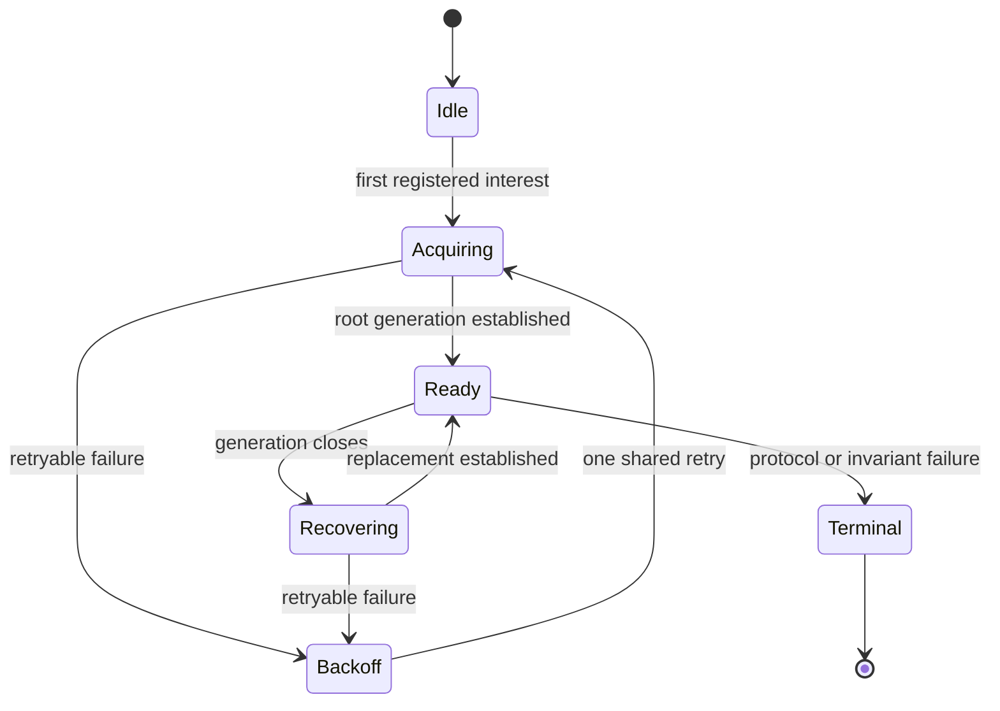
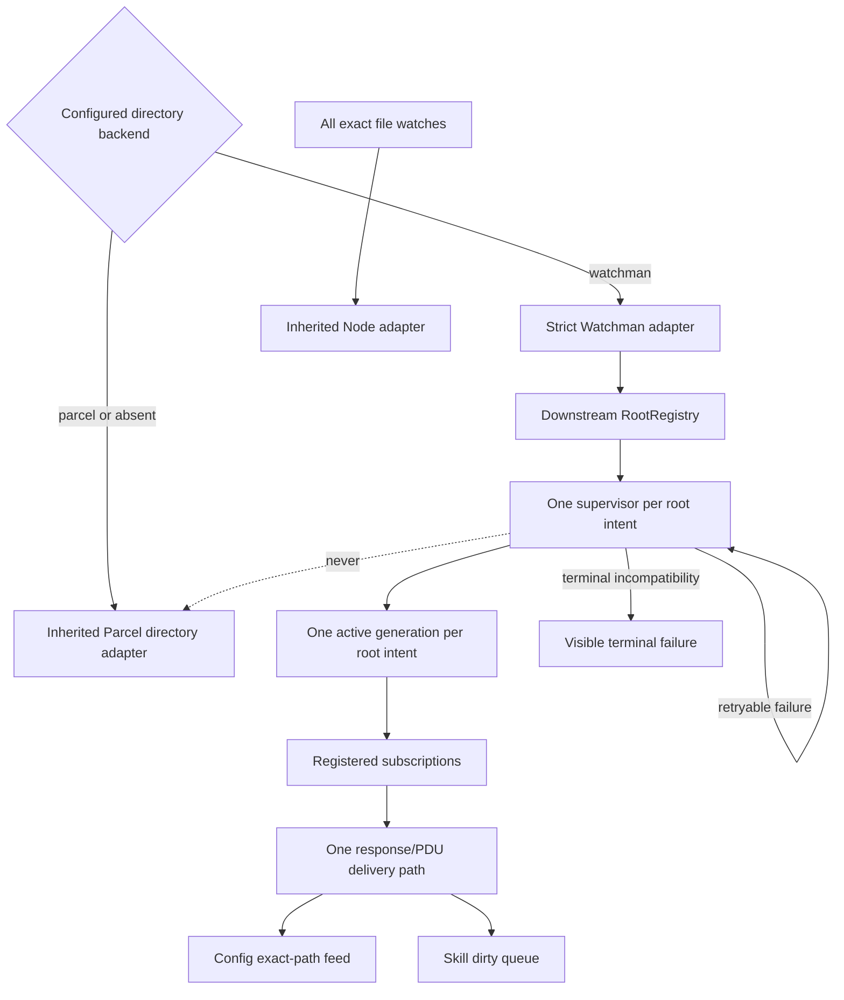

# Watchman consolidation vision

## Status and method

This is an **initial vision, not the next accepted design**. It freezes what is
known now, states the strongest working hypotheses, and marks the decisions
that still need review. New review results should arrive as top-level addenda
at the end rather than silently rewriting the freeze frame. Once the direction
settles, a new total revision can integrate the accepted conclusions and leave
this document as the deliberation record.

The immediate goal is not to preserve current behavior. This is early-alpha
software. The goal is to remove accidental modes, make failure behavior
predictable, and keep the remaining downstream patch narrow enough to carry
over a moving OpenCode upstream.

## User direction

The governing constraints are:

- Too many independent mechanisms currently decide whether watching is live,
  retrying, failed, or running on Parcel.
- Backend selection and failover need one comprehensible policy, ideally one
  implementation boundary.
- Breaking changes and deletion are welcome; legacy compatibility is not a
  goal.
- Carryability matters as much as local elegance. New downstream-only files
  are cheap to carry; invasive edits to active upstream modules are not.
- We need to distinguish inherited behavior from behavior introduced by this
  feature before choosing what to redesign.
- High-yield corrections come before polish or additional modes.

## Freeze frame

### Lineage and patch shape

Verified from `jj`, not from this workspace's unrelated `.git` view:

- The Watchman line branches from OpenCode `v2@origin` at `43d09b9d75ad`.
- Current `v2@origin` is `c80650369432`. Across the Watchman integration
  hotspots, upstream changed only `bun.lock` since the branch point; there is
  no current semantic collision in watcher, Config, Skill, or server-option
  source.
- The working parent is `cccaa88e239d`, 30 feature commits above the declared
  base.
- The floating `watchman` bookmark is four real commits behind the working
  parent: the ignore-pattern code commit and three documentation commits are
  not represented by it. This is carrier debt to repair before any freshen or
  replacement-line work.
- Against the declared base, the line touches 39 files with 7,904 insertions
  and 126 deletions. About 5,242 inserted lines are design documents. The
  runtime and tests are much smaller than the headline diff, but the feature
  still spans generic watcher, source owners, server plumbing, metrics, and the
  daemon backend.

### What is upstream and what is ours

| Area | Ownership | Carry implication |
| --- | --- | --- |
| `watcher/watchman/**` | Entirely downstream | Lowest textual conflict; the right home for root lifecycle and protocol policy |
| `watcher/interests.ts`, `watcher/internal.ts` | Entirely downstream | Cheap files, but their use changes upstream owners and watcher contracts |
| `filesystem/watcher.ts` | Upstream module with substantial downstream edits | High-risk seam: Parcel/Node lifecycle, keys, errors, readiness, selection, and options now meet here |
| `config.ts`, `config/plugin/skill.ts` | Upstream owners substantially rewritten downstream | High carry risk, though source-owned stable interests are independently valuable |
| `server/src/routes.ts` | Upstream assembly hotspot with downstream option plumbing | Proven conflict site during the prior freshen |
| `server/src/options.ts`, `cli/src/server-process.ts` | Upstream option/startup modules with downstream additions | Medium carry cost that grows with every new knob |
| Parcel directory watcher and Node file watcher | Inherited | Not evidence that upstream chose our fallback policy |
| Both Watchman-to-Parcel fallback sites | Downstream | We are free to delete or replace them without preserving upstream intent |

The important correction is that **all Watchman fallback policy is ours**.
Upstream provides the native watcher and exact-interest registry; upstream did
not require a configured Watchman interest to become Parcel after one failed
attempt.

### Current behavior topology

Today policy is distributed across at least five layers:

1. [`Watcher.layer`](/packages/core/src/filesystem/watcher.ts) catches backend
   construction failure and substitutes the inherited native watcher for the
   entire process.
2. [`watchman/backend.ts`](/packages/core/src/filesystem/watcher/watchman/backend.ts)
   catches every error escaping initial directory acquisition and permanently
   substitutes Parcel for that exact physical interest.
3. [`root.ts`](/packages/core/src/filesystem/watcher/watchman/root.ts) gives
   initial acquisition one attempt but retries equivalent errors indefinitely
   after the first subscribe acknowledgement.
4. `root.ts` separately implements root replacement, per-subscription
   reconnect, canceled-subscription re-establishment, sticky fatal state, and
   several direct conservative-update sites.
5. `WatchInterests`, Config, and Skill propagate and then recursively recover
   physical-watch failures at the source-owner layer.

This creates accidental state combinations rather than one policy:

- one transient error before acknowledgement means permanent Parcel;
- the same error after acknowledgement means unbounded Watchman retry;
- one root can have simultaneous Parcel and Watchman interests;
- a decode or route error can poison a retained root while later owner logic
  repeatedly tries to recover above it;
- no mechanism promotes a fell-back interest when Watchman becomes healthy;
- response-file deltas on reconnect are computed and transmitted by the daemon
  but discarded by the client.

### Verified correctness gap

On re-subscribe, watchwoman returns the since-query result in the command
response. `SubscribeResponse` strips the response `files` and clock, while the
push loop starts after the response fence. Changes during the outage can
therefore disappear without any downstream signal.

The first safe correction is broader than merely decoding rows:

- decode and deliver response rows through the same path as live PDU rows;
- retain the response clock when supplied;
- request `always_include_directories: false`;
- emit one conservative target invalidation after every re-establishment,
  including an empty response, so reconnect itself is observable.

The response rows and conservative invalidation serve different contracts.
They are not currently interchangeable.

### Exact-path caveat

A tempting simplification is to discard all response rows and cursors, take a
fresh clock on every establishment, and emit one root-level dirty signal. That
is **not correct under the current Config contract**.

[`Config.Interface.changes`](/packages/core/src/config.ts) explicitly exposes
raw filesystem updates. Agent, Command, and Plugin Source filter that stream by
the exact changed path in these inherited modules:

- [`config/plugin/agent.ts`](/packages/core/src/config/plugin/agent.ts)
- [`config/plugin/command.ts`](/packages/core/src/config/plugin/command.ts)
- [`config/plugin/source.ts`](/packages/core/src/config/plugin/source.ts)

A conservative update at the watched root does not match a nested
`agents/`, `commands/`, or `plugins/` source path. Exact response rows are what
cause those domain owners to reload after a short outage. This also means the
existing route-change, canceled, and fresh-instance target updates do not by
themselves realize the accepted design's broad-invalidation story for these
consumers.

There are two coherent future contracts:

1. Preserve exact-path delivery and complete cursor-response recovery in the
   Watchman backend.
2. Make coarse invalidation first-class in Config and teach every source
   consumer that a watched-root update means "an unknown descendant changed";
   only then can Watchman discard cursor replay safely.

Option 2 may produce a simpler total system, but it expands the patch into
three additional upstream-owned consumers. It is therefore an open
architecture trade, not a free cleanup.

## Working hypotheses

### H1: Backend selection should be authoritative

Strong working hypothesis: **delete cross-backend runtime failover**.

The configuration already has a default and an explicit choice:

| Selection | Files | Directories | Daemon outage |
| --- | --- | --- | --- |
| absent or `parcel` | Node | Parcel | Parcel's own failure behavior |
| `watchman` | Node | Watchman | remain Watchman; retry according to one Watchman policy |

Under this hypothesis:

- a broken Watchman transport fails backend construction visibly;
- daemon unavailability does not silently change adapters;
- files remain deliberately Node-only, not "fallback" watches;
- no interest can become terminal Parcel because of startup timing;
- no hot swap or promotion machinery is needed;
- the fallback counter and mixed-backend state disappear.

This supersedes the accepted design's pre-ack Parcel fallback. That is
intentional. The default remains Parcel, so users who want availability without
a Watchman dependency already have a static choice.

The principal operational question is whether pre-ack daemon unavailability
should leave asynchronous watch acquisition pending with backoff or fail the
server. Pending acquisition currently fits the source-owner design: initial
source scans do not wait for acknowledgement, and the ready callback schedules
a dirty replay when acquisition eventually succeeds. This is the leading
direction, but it still needs a lifecycle test before becoming a decision.

### H2: One root supervisor should own all Watchman recovery

Strong working hypothesis: replace the temporal split among `current`,
`recoverRoot`, `replacement`, `reconnect`, and the canceled-PDU branch with one
scoped root supervisor.



Subscriptions register before acquisition, await their first acknowledgement,
and are replayed by the supervisor after generation replacement. An
unsubscribe removes registration immediately, so neither pending acquisition
nor recovery can resurrect it. Initial and established interests use the same
failure disposition; acknowledgement is a delivery milestone, not a policy
boundary.

This work belongs almost entirely in downstream-only `root.ts` and its tests,
which makes a substantial internal rewrite more carryable than a smaller
generic-watcher orchestration layer.

### H3: Failure disposition should not be inferred from timing

`WatchmanError.stage` currently mixes operation labels with recovery policy,
and three code paths reinterpret those strings. A `route` failure can mean a
transient daemon command error, a policy rejection, an invalid local intent, or
a malformed response; those should not all create the same sticky state.

The root supervisor should consume a small tagged failure model whose
disposition is explicit and phase-independent. The tentative classes are:

- root-retryable transport loss, generation closure, and admitted-command
  timeout;
- subscription-terminal invalid intent or subscription response;
- backend-terminal protocol incompatibility.

The exact classification is unsettled because the transport may not expose
enough structure to distinguish daemon policy errors from connection errors.
If it does not, retrying ambiguous operational errors with bounded backoff is
preferable to silently selecting another backend or poisoning the root for the
process lifetime.

### H4: Resume delivery needs one implementation path

Near-term working hypothesis: share the file-row schema and delivery function
between command responses and unilateral PDUs. Centralize these decisions:

- response clock update;
- exact-row publication and local ignore filtering;
- fresh-instance handling;
- conservative target invalidation after every re-establishment;
- metrics accounting.

This closes the verified gap without first changing Config's inherited
exact-path feed. A later accepted design may replace this with coarse
invalidation, but only together with an explicit Config contract change.

### H5: Do not build reversible Parcel bridging

A bounded Parcel bridge that later swaps back to Watchman looks centralized but
requires the most invasive machinery: an adapter-changing physical `RcMap`
entry, duplicate-delivery rules during handoff, cancellation fencing, and a
new reconciliation loop. It also moves complexity into upstream-owned
`watcher.ts`.

Unless strict selection proves operationally impossible, reversible bridging
is rejected as the worst combination of semantic modes and carry risk.

### H6: Preserve observation while deleting policy modes

The 501-line metrics module and its 244-line test are downstream-only and
therefore textually easy to carry, but its server/CLI knobs enlarge upstream
integration. Metrics should not be removed before the new lifecycle is
verified; they are currently the best way to distinguish acquisition,
reconnect, and delivery behavior on a 30-60-project host.

The tentative direction is:

- keep observation during the state-machine rewrite;
- delete counters and gauges for states that cease to exist (`fallbacks`,
  sticky `fatal`, possibly cursor fields);
- reconsider public metrics mode/interval plumbing after behavior settles;
- prefer a small set of state-transition events over growing another policy
  surface.

## Candidate architecture



The centralization boundary is deliberately narrow:

- static backend selection lives at the adapter boundary;
- same-backend availability and recovery live in downstream `root.ts`;
- source owners retain desired watch plans but do not choose adapters;
- generic watcher hot-swapping is absent.

## High-yield sequence

This ordering is provisional and intentionally stops short of implementation
until the remaining reviews land.

1. **Correct resume delivery.** Decode response rows and clock, share delivery,
   disable directory rows, and emit one conservative update per resume. This is
   the smallest independent correctness repair.
2. **Rewrite root lifecycle and failure disposition together.** A strict
   selector atop today's one-shot initial acquisition would merely turn
   fallback into owner-level retry churn; unify acquisition and recovery first.
3. **Make Watchman selection strict.** Remove both downstream fallback sites,
   rename the inherited adapter's role from fallback to the deliberate file
   adapter, and delete mixed-backend metrics/state.
4. **Decide the event contract.** Either retain exact-path cursor replay or
   explicitly promote coarse Config invalidation. Do not drift into a hybrid
   where target updates are assumed broad but filtered out by consumers.
5. **Trim operational surface.** Reassess timeout/backoff/metrics knobs after
   the policy has one state machine rather than before.
6. **Build a replacement carrier from final state.** Preserve the old line and
   dated bookmarks; create a small, reviewable stack on current `v2@origin`
   rather than carrying 30 historical refinement commits forward unchanged.

## Carrier strategy

A likely final-state carrier has these independently droppable commits:

1. Generic source-owned interest reconciliation (`WatchInterests`, Config,
   Skill), suitable for separate upstream consideration.
2. Generic watcher seam changes needed for placement, readiness, and visible
   physical-watch failure.
3. Strict root-scoped Watchman backend, concentrated in new files plus focused
   tests.
4. One backend selector through CLI/server assembly.
5. Optional diagnostics, if retained.
6. Consolidated documentation.

The current ignore-pattern widening should remain independently droppable; it
is useful to both Parcel and Watchman but is not part of failover policy.

Before rebuilding:

- repair the floating bookmark so it includes the four real commits above it;
- preserve the old tip with an immutable dated bookmark;
- use the declared branch point, not current `v2@origin`, when auditing what
  this feature owns;
- then build or freshen against current upstream, where the relevant source
  currently has no semantic collision.

## Explicitly avoid for now

- Do not implement Parcel-to-Watchman live promotion.
- Do not add another fallback enum or compatibility mode.
- Do not route file watches through Watchman.
- Do not add named-cursor machinery before deciding whether exact-path replay
  remains the contract.
- Do not move root recovery into generic `watcher.ts` while a downstream-only
  supervisor can own it.
- Do not remove metrics before the replacement lifecycle can be observed.
- Do not freshen and polish the 30-commit behavior stack before deciding which
  behavior should be deleted.

## Open decisions

1. Should `watchman` mean retry-forever asynchronous availability, or should a
   daemon-unavailable state fail service startup?
2. Can transport errors be classified structurally, or must ambiguous command
   failures all retry?
3. Is adding first-class coarse invalidation to Config worth touching Agent,
   Command, and Plugin Source, or should exact-path cursor replay remain?
4. If exact-path replay remains, what response fields are portable across
   watchwoman and upstream Watchman, and which must be optional?
5. What should a backend-terminal protocol incompatibility do to source-owner
   layers that currently recursively resubscribe?
6. Which operational knobs have paid for themselves in real incidents, and
   which merely expose implementation details?
7. Can source-owner reconciliation be proposed upstream independently, reducing
   the carried hotspot diff before the Watchman backend is considered?

## Verification targets

The eventual policy should be expressible by a compact test matrix:

- a transient error receives the same disposition immediately before and
  after the first subscribe acknowledgement;
- N initial interests on one root share one acquisition/retry sequence;
- no directory interest invokes Parcel when Watchman is selected;
- file interests remain on Node;
- a reconnect response publishes create/update/delete paths and stores its
  returned clock;
- an empty reconnect response still produces one conservative invalidation;
- Config's Agent, Command, and Plugin Source owners demonstrably react to the
  chosen reconnect contract;
- unsubscribe during initial acquisition and during recovery never resurrects
  an interest;
- one root's command timeout does not delay or retire another root;
- daemon restart plus outage writes/deletes converges every source owner to the
  current filesystem state.

## Cross-references

- [`fallbacks0.glm53.md`](/.design/watchman/fallbacks0.glm53.md) is the static
  map of the two fallback sites, acquisition cliff, sticky fatal state, and
  mixed-backend outcomes this vision seeks to delete.
- [`topic-query0.glm53.md`](/.design/watchman/topic-query0.glm53.md) establishes
  the dropped reconnect response and tombstone-retention edge; this vision adds
  the exact-path Config caveat to its conservative-invalidation option.
- [`draft2.gpt56t.md`](/.design/watchman/draft2.gpt56t.md) is the accepted
  architecture being deliberately reconsidered, especially its pre-ack
  fallback and cursor-resume decisions.
- [`README.md`](/.design/watchman/README.md) records the current stack,
  verification history, and freshen procedure.
- [OpenCode patch policy](file:///home/rektide/a/doc/opencode/patches.md)
  governs independent feature lines, bookmark repair, immutable snapshots, and
  final-state replacement carriers.

# Addendum: Update log

## 2026-09-01 initial freeze

Created after the fallback and since-query documents, direct code inspection,
the first architecture synthesis, and the downstream/upstream ownership audit.
Two independent reviews remain in flight: a failure-path/test audit and a
radical simplification comparison. A follow-up review is also challenging the
coarse-invalidation hypothesis against every current consumer. Their results
will be appended here before a consolidated revision is attempted.

# Addendum: Four-review synthesis

Generated 2026-09-01T21:39:07-04:00 by `model:openai-gpt-5.6-sol`, after all
four independent reviews were written and committed:

- [`review-architecture0.gpt56s.md`](/.design/watchman/review-architecture0.gpt56s.md)
- [`review-ownership0.gpt56s.md`](/.design/watchman/review-ownership0.gpt56s.md)
- [`review-simplification0.gpt56s.md`](/.design/watchman/review-simplification0.gpt56s.md)
- [`review-failure-paths0.gpt56s.md`](/.design/watchman/review-failure-paths0.gpt56s.md)

This addendum supersedes factual errors in the initial freeze and narrows the
working direction. It still does not declare an accepted replacement design.

## Corrections to the initial freeze

The failure-path and ownership audits found several material corrections. Keep
the original text as a freeze frame, but use this table when the two disagree.

| Initial statement or implication | Corrected finding |
| --- | --- |
| The floating bookmark had four commits of debt | It had six at the ownership-review freeze and now has **ten** real commits above it after the four review documents. One of those, `98b4d82fcae6` (`cleanup docs`), carries an unrelated upstream `AGENTS.md` deletion and beads `.gitignore` edits that require a separate carrier decision. |
| Current upstream intersects only `bun.lock` | Watchman runtime integration still intersects only `bun.lock`, but the contaminated feature line also intersects `AGENTS.md` because `cleanup docs` deletes it. There is still no semantic upstream collision in watcher, Config, Skill, Watchman, or server-option source. |
| Root fatality was effectively process-lifetime | `state.fatal` belongs to one `makeConnection` and lasts while a same-root lease retains that connection. Parcel fallback can retain the lease for a long time, making poison appear process-long. After final release, a new connection has clean behavior. The **metric** is separately registry-sticky and can remain `fatal: true` after behavioral recovery. |
| Concurrent acquisitions share one failed creation as a herd | Nonfatal first-contact failures are serialized but not memoized: the next waiter can create a new client and succeed. Herd behavior is real for cached terminal state and for collateral establishments that lose a shared active generation. The desired supervisor would deliberately single-flight retries. |
| Initial acquisition is five daemon round trips | Client construction is not a daemon request. A new root uses four requests: capability, `watch`, `clock`, and `subscribe`. An active root needs `clock` plus `subscribe`; compatible cursor recovery currently needs only `subscribe`. |
| Initial acquisition is uniformly one-shot | A new interest arriving while `state.recovering` exists awaits the shared root recovery. Its later subscription establishment remains one-shot and can still fall to Parcel. |
| The adapter catches "any error" | The relevant `Effect.catch` sites catch typed failures, not interruption or defects. One dynamic import uses `Effect.promise`, so rejection behavior is not identical to the `tryPromise`-wrapped transport load. |
| Directory rows are noise that Parcel does not emit | Parcel and the local mapper both emit new-directory creates. Suppressing directory rows also loses empty-directory create/delete signals. `always_include_directories: false` is an independent semantic choice, not part of the response correctness fix. |

At this synthesis point the parent is `049d732c` and the line is 36 real
commits above the declared `43d09b9d` base. The floating and immutable dated
Watchman bookmarks remain at `4bb2c5d8`; do not advance the floating bookmark
blindly across the unrelated `cleanup docs` content.

## Broader response-delivery finding

The since-query defect affects **every** `establish`, not only socket recovery.
Watchwoman's subscribe response can carry:

```text
subscribe, clock, is_fresh_instance, root, files
```

The current schema strips all but `subscribe`, then the client stores the
requested `since` clock rather than the acknowledged response clock. This
applies to initial acquisition, ordinary reconnect, canceled-subscription
re-establishment, route changes, and fresh-clock retries.

There is a second boundary the initial vision did not capture. During first
acquisition, `native.subscribe()` runs before `Watcher` attaches
`Stream.fromPubSub`. Publishing response rows from `establish` therefore sends
them into a non-replay hub with no subscriber. The same publication works on a
later reconnect because the logical stream is already attached.

Consequently, "decode rows and call `publishFiles`" is not a complete initial
fix. The contract must choose one of these deliberately:

1. Buffer initial exact rows until a logical stream can consume them.
2. Represent initial acknowledgement as a coarse current-state invalidation
   that reaches every final state owner.

The existing private `ready` callback is an instance of option 2 for direct
`WatchInterests` owners. It is not yet a complete implementation because
Config's indirect owners reject its synthetic watched-root path.

## Review consensus

Three design reviews converge strongly, while the policy-neutral failure audit
confirms the required mechanics without choosing the final fallback row.

### Strong consensus

1. **One root supervisor.** Cold acquisition, generation replacement,
   subscription replay, backoff, cancellation requests, and unsubscribe fencing
   belong to one downstream root lifecycle. The first acknowledgement must not
   choose a different recovery algorithm.
2. **Explicit failure scope and disposition.** Operation labels such as
   `route`, `subscribe`, and `decode` are not policy classes. Failures need
   root-retryable, subscription-terminal, and backend/root-terminal meaning at
   creation or one authoritative classifier.
3. **No reversible Parcel bridge.** Live adapter migration requires handoff,
   overlap, duplicate-delivery, cancellation, and promotion machinery in the
   upstream-owned exact-interest registry. It adds the largest state space and
   the worst carrier seam.
4. **Files remain Node-only.** This is a static type partition with no recursive
   crawl to amortize, not a failed Watchman acquisition.
5. **Delivery policy must name exact events versus invalidation.** A watched-root
   path masquerading as an ordinary file update is not a sufficient broad
   invalidation contract.
6. **Keep observation through the rewrite, then trim it.** Existing metrics are
   useful while validating lifecycle changes, but fallback, sticky-fatal, and
   cursor/output fields must not survive with meanings that no longer match the
   implementation.
7. **Build a final-state replacement carrier.** The new Watchman directory is
   cheap to carry; generic watcher, source-owner, server assembly, and graph
   changes are the conflict surface. Preserve the historical line instead of
   carrying add-then-delete refinements forever.

### Leading policy, not yet accepted

The leading backend policy is now:

```text
parcel or absent -> Node files + Parcel directories
watchman          -> Node files + Watchman directories
                     retry availability failures with bounded jitter
                     never switch a directory to Parcel
```

The architecture and simplification reviews recommend this directly. The
failure audit records a competing centralized pre-ack-fallback policy but does
not find a correctness requirement for it. Strict retry-forever remains the
better working hypothesis because:

- it deletes mixed-backend roots and timing-dependent adapter choice;
- the absent/default Parcel selection already serves users who do not want a
  daemon dependency;
- `WatchInterests.ensure` starts acquisition in owner fibers, so a pending
  daemon delays hot reload rather than initial server/config readiness;
- it needs no migration or promotion manager.

Strict selection must land with the root supervisor. Removing fallback while
retaining today's one-shot initial establishment would merely expose the
duplicated source-owner retry loops and their weak backoff.

The unresolved terminal row remains important: a proven protocol
incompatibility should fail visibly without either silently selecting Parcel or
looping forever. Ambiguous operational callback failures should prefer bounded
retry over cached poison.

## The event-contract fork is now the central design decision

The reviews expose two coherent total systems and one incoherent middle.

### Direction A: exact live events plus cursor response replay

- Normal PDUs and reconnect responses deliver exact create/update/delete paths.
- The acknowledged response clock becomes the next cursor.
- Initial exact response rows require buffering or an explicit initial-state
  exception; publishing them before `RcMap.lookup` returns is invalid.
- Existing Agent, Command, and Plugin Source path filters remain selective.
- Most changes stay in downstream-only Watchman files.

This is the lowest carry-risk immediate repair. It fixes ordinary outage gaps,
but it is not total convergence:

- a long same-generation gap can lose all deletion tombstones;
- a target-level conservative update still does not reach Config's indirect
  exact-path owners;
- delayed **first** acknowledgement after those owners already scanned can miss
  changes that happened before the fresh acquisition clock;
- fresh-instance, route-change, and canceled target updates have the same
  indirect-consumer weakness.

Response replay is strongly corrective, but it must not be described as
mathematically lossless for the current consumer graph.

### Direction B: exact live events plus first-class coarse recovery invalidation

- Normal connected PDUs retain exact paths, preserving selective steady-state
  reloads.
- Initial acknowledgement and every loss-of-continuity transition emit a typed
  subtree invalidation, not a fake ordinary update at the watched root.
- Config, Skill, Agent, Command, and Plugin Source treat that invalidation as
  "current descendant state is unknown; rescan your source domain."
- Recovery is based on current state, so response rows, tombstone history, and
  per-subscription resume cursors become optional optimizations and can be
  deleted after the contract is proven.

This is the more compelling total-system simplification. It closes delayed
initial acquisition, daemon restart, route change, cancellation, and pruned
all-deletion gaps with one semantic tool. It also makes the backend's role
honest: exact events while continuity is known, explicit invalidation when it is
not.

Its cost is carryability. A typed invalidation crosses the downstream
`WatchInterests`/Watcher seam into upstream-owned Config plus Agent, Command,
and Plugin Source. It also changes metrics from an exact-update-only model to
separate exact-update and invalidation counts.

### Incoherent middle to avoid

Do not emit `{ path: watchedRoot, type: "update" }`, call it conservative, and
assume all source owners refresh. Config republishes that value as a raw event;
its indirect consumers test whether the path is inside a more specific child
directory and reject it. This is already how several current conservative
signals fail to realize the accepted design.

The next total design should compare Direction A against Direction B explicitly.
The current leading judgment is:

- Direction A is the safest isolated correctness patch.
- Direction B is likely the better final architecture if its small but
  upstream-owned contract expansion proves carryable.
- Pure target coalescing for every live PDU is unnecessary. It would sacrifice
  selective reloads and require metrics and ignore semantics to change in
  steady state as well as recovery.

## Cancellation and readiness are distinct transitions

The state machine cannot reduce every notification to "one update after a
successful establish."

- Initial publication inside `establish` is too early for the generic PubSub;
  owner `ready` is the current safe post-ack path.
- A canceled PDU currently invalidates **before** re-establishment. Moving its
  only signal after success would hide deletion/topology changes while the
  daemon or exact target remains unavailable.
- Resume success may need a separate loss-of-continuity invalidation.
- A fresh-instance PDU is another explicit continuity-loss signal.

The replacement design should name `initial-ready`, `canceled-before-retry`,
`resumed`, and `fresh-instance` outcomes. Coalescing may happen in the source
owner, but the protocol lifecycle must not erase the distinction before
correctness is defined.

## Independent generic watcher defect

Parcel/native acquisition currently converts unsupported, rejected, or timed
out acquisition into `undefined`. `Watcher` shuts down the PubSub and the
logical stream ends successfully without readiness. `WatchInterests` reacts to
errors but not normal EOF, so Config and Skill do not immediately redemand.

This is not a reason to retain Watchman-to-Parcel fallback. It is a separate
generic contract defect: inactive acquisition should fail visibly or have an
explicit unavailable result. A later `ensure` may currently recover only by
accident after unrelated reconciliation.

This correction is a plausible independent upstreamable slice, but it touches
the high-risk generic watcher seam and should not be conflated with the root
supervisor rewrite.

## Revised sequence

The initial sequence said to land response replay immediately. The reviews show
that implementation should wait for one narrower contract decision so we do not
cement another half-solution.

1. **Pin the contract failures first.** Add deterministic tests for response
   clock/rows, pre-ack publication, delayed first acknowledgement, indirect
   Config owners, collateral new interests, cancellation while unavailable,
   and inactive Parcel EOF.
2. **Choose Direction A or B.** If choosing exact replay, define initial batch
   buffering and accept/document the long-gap residual. If choosing coarse
   recovery invalidation, define the typed seam and adapt all final state owners
   together.
3. **Unify root lifecycle and failure disposition.** Build one supervisor in
   downstream-only `root.ts`; initial and established interests share it.
4. **Make backend selection strict.** Remove construction and per-interest
   Watchman-to-Parcel catches, mixed-backend metrics, and fallback logs only
   once initial acquisition has the shared retry path.
5. **Verify live continuity loss.** Exercise delayed daemon start, restart,
   writes and deletions during outage, canceled subscriptions, and many-root
   cold start.
6. **Trim observation and options.** Keep command-timeout configurability, which
   has incident evidence. Reassess public retry, Parcel timeout, metrics mode,
   and metrics interval knobs. Prefer state-transition logs or a much smaller
   observer once the state space is reduced.
7. **Build a clean replacement carrier.** Separate generic source interests,
   generic watcher seam, strict Watchman backend, selector plumbing, optional
   diagnostics, and consolidated docs into independently droppable final-state
   commits.

## Test gates before a total revision

Use scripted callbacks and `Deferred` barriers, not sleeps or randomized
backoff. The minimum gates are:

| Gate | Required proof |
| --- | --- |
| Response batch | A reconnect response with create/update/delete rows and clock `c:3` publishes the selected contract and makes a third reconnect use `c:3` in exact mode |
| Initial attachment | A native publication before acquisition returns is either buffered observably or deliberately represented by one owner-visible coarse invalidation |
| Delayed first ack | Change/delete Agent, Command, and Plugin sources after their initial scans but before Watchman first acknowledges; all derived state must converge |
| Timing symmetry | The same retryable generation failure immediately before and after first acknowledgement receives the same root disposition |
| Collateral interest | A new unacknowledged interest that loses an established root generation follows the shared root recovery and never chooses a different backend |
| Root single-flight | N initial or recovering interests share one intentional acquisition sequence under the new supervisor |
| Terminal scope | Root-terminal failure affects one root; subscription-terminal failure affects one interest; another root and sibling remain live as specified |
| Cancellation | A canceled interest invalidates current state even when re-establishment cannot yet succeed; unsubscribe still prevents resurrection |
| Parcel inactive | Unsupported/timeout acquisition is visible, never false-ready or silent healthy completion, and permits deliberate owner redemand |
| Directory semantics | Keeping or suppressing directory rows is tested with empty-directory create/delete behavior rather than assumed from backend parity |
| Metrics honesty | Runtime and gauge lifetime agree; exact rows, ignored rows, and coarse invalidations are not conflated into a false drop-rate formula |

## Carrier update

The ownership review strengthens the carrier strategy:

- Use `jj`, not the workspace's unrelated beads `.git`, for source history.
- Treat `v2@origin`, not the misleading remote named `upstream`, as Anomaly's
  baseline.
- The Watchman source hotspots have no current semantic upstream collision; a
  replacement can be built now without first polishing the stale behavior.
- Resolve the unrelated `cleanup docs` commit before moving the floating
  bookmark. Do not move `watchman-20260901`.
- Keep source-owned interests independently droppable. They are useful to
  Parcel too, but their adoption in Config and Skill is one of the highest
  carry-risk portions of the feature.
- Freeze the generic `Watcher.Native` contract where possible. Root policy,
  error classification, and subscription replay belong below it in new files.
- If Direction B wins, acknowledge its upstream-owned invalidation hunk as an
  intentional correctness seam rather than allowing broadness to leak through
  fake path events.

## Cross-review comparison

| Review | Particular strength | Relative limitation |
| --- | --- | --- |
| [`review-architecture0.gpt56s.md`](/.design/watchman/review-architecture0.gpt56s.md) | Best total architecture and adversarial comparison of exact replay versus cursorless invalidation; catches readiness, cancellation, ignore, extra-clock, and metrics consequences | Static review; implementation sizes and final preference remain judgments |
| [`review-ownership0.gpt56s.md`](/.design/watchman/review-ownership0.gpt56s.md) | Authoritative downstream/upstream map, repository-lineage warning, current collision check, bookmark debt, and empirically grounded carry-risk map | Does not choose runtime policy and records a moving repository freeze |
| [`review-simplification0.gpt56s.md`](/.design/watchman/review-simplification0.gpt56s.md) | Clearest strict-selection/retry recommendation, deletion inventory, option/metrics trim, and compact replacement-carrier shape | Its original cursorless proposal required the later exact-path limitation; the committed review correctly makes deletion conditional |
| [`review-failure-paths0.gpt56s.md`](/.design/watchman/review-failure-paths0.gpt56s.md) | Strongest verified runtime evidence: focused tests and probes, pre-ack PubSub loss, response clock, fatal lifetime, silent EOF, directory parity, and deterministic matrix | Deliberately leaves strict selection versus centralized pre-ack fallback unresolved; its Candidate A preserves more mixed behavior than the leading simplification |

Together they support a narrower conclusion than any one review alone: strict
selection plus one root supervisor is the leading policy, but the delivery seam
must become honest before cursor machinery can safely be kept or deleted.

## Addendum cross-references

- [`review-architecture0.gpt56s.md`](/.design/watchman/review-architecture0.gpt56s.md)
  supplies the architecture recommendation and conditional invalidation proof.
- [`review-ownership0.gpt56s.md`](/.design/watchman/review-ownership0.gpt56s.md)
  supplies the source-line ownership, repository topology, collision, and
  carrier evidence.
- [`review-simplification0.gpt56s.md`](/.design/watchman/review-simplification0.gpt56s.md)
  supplies the strict retry policy, deletion plan, metrics trim, and final-state
  stack proposal.
- [`review-failure-paths0.gpt56s.md`](/.design/watchman/review-failure-paths0.gpt56s.md)
  supplies the verified corrections and minimum deterministic tests.
