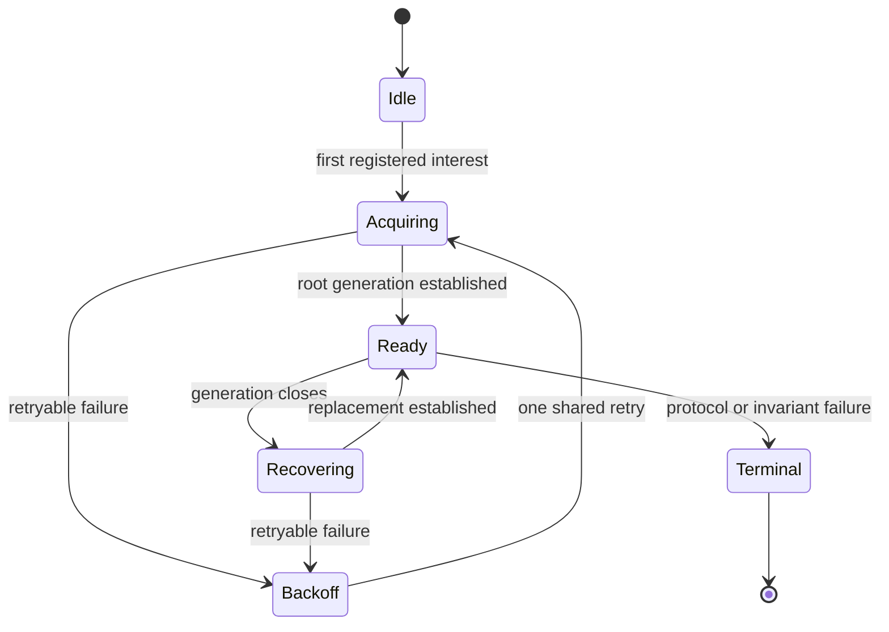
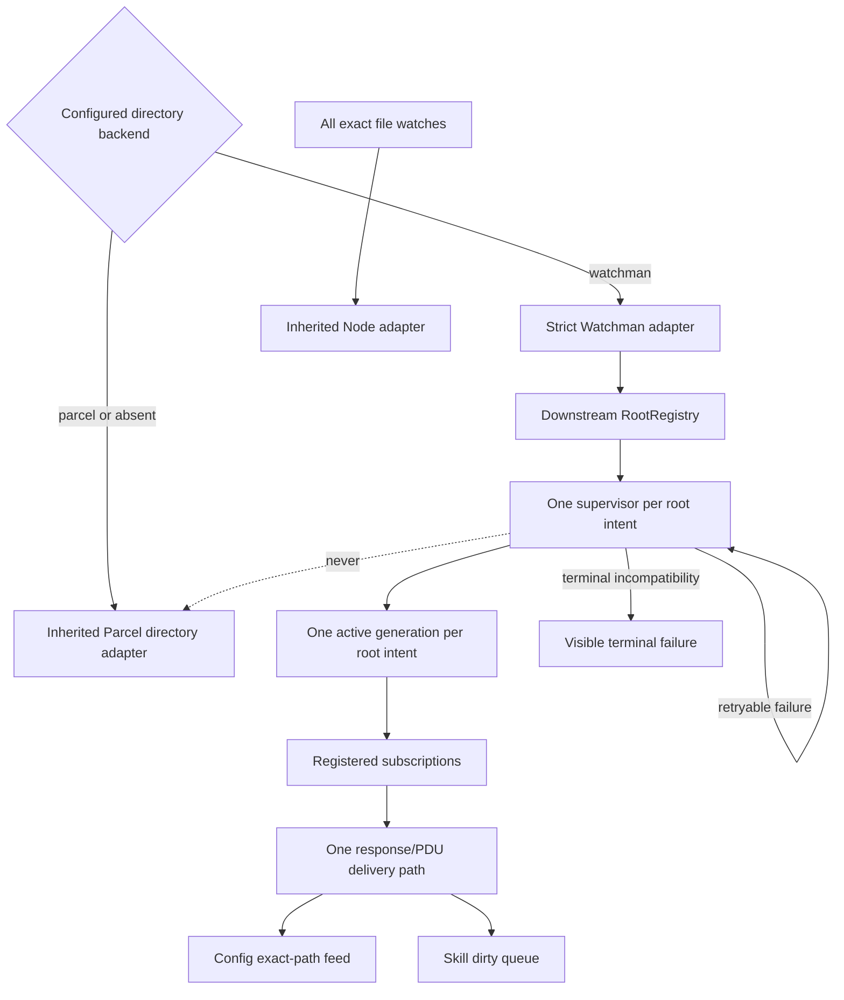

# Watchman consolidation vision

## Status and method

This is an **initial vision, not the next accepted design**. It freezes what is
known now, states the strongest working hypotheses, and marks the decisions
that still need review. New review results should arrive as top-level addenda
at the end rather than silently rewriting the freeze frame. Once the direction
settles, a new total revision can integrate the accepted conclusions and leave
this document as the deliberation record.

The immediate goal is not to preserve current behavior. This is early-alpha
software. The goal is to remove accidental modes, make failure behavior
predictable, and keep the remaining downstream patch narrow enough to carry
over a moving OpenCode upstream.

## User direction

The governing constraints are:

- Too many independent mechanisms currently decide whether watching is live,
  retrying, failed, or running on Parcel.
- Backend selection and failover need one comprehensible policy, ideally one
  implementation boundary.
- Breaking changes and deletion are welcome; legacy compatibility is not a
  goal.
- Carryability matters as much as local elegance. New downstream-only files
  are cheap to carry; invasive edits to active upstream modules are not.
- We need to distinguish inherited behavior from behavior introduced by this
  feature before choosing what to redesign.
- High-yield corrections come before polish or additional modes.

## Freeze frame

### Lineage and patch shape

Verified from `jj`, not from this workspace's unrelated `.git` view:

- The Watchman line branches from OpenCode `v2@origin` at `43d09b9d75ad`.
- Current `v2@origin` is `c80650369432`. Across the Watchman integration
  hotspots, upstream changed only `bun.lock` since the branch point; there is
  no current semantic collision in watcher, Config, Skill, or server-option
  source.
- The working parent is `cccaa88e239d`, 30 feature commits above the declared
  base.
- The floating `watchman` bookmark is four real commits behind the working
  parent: the ignore-pattern code commit and three documentation commits are
  not represented by it. This is carrier debt to repair before any freshen or
  replacement-line work.
- Against the declared base, the line touches 39 files with 7,904 insertions
  and 126 deletions. About 5,242 inserted lines are design documents. The
  runtime and tests are much smaller than the headline diff, but the feature
  still spans generic watcher, source owners, server plumbing, metrics, and the
  daemon backend.

### What is upstream and what is ours

| Area | Ownership | Carry implication |
| --- | --- | --- |
| `watcher/watchman/**` | Entirely downstream | Lowest textual conflict; the right home for root lifecycle and protocol policy |
| `watcher/interests.ts`, `watcher/internal.ts` | Entirely downstream | Cheap files, but their use changes upstream owners and watcher contracts |
| `filesystem/watcher.ts` | Upstream module with substantial downstream edits | High-risk seam: Parcel/Node lifecycle, keys, errors, readiness, selection, and options now meet here |
| `config.ts`, `config/plugin/skill.ts` | Upstream owners substantially rewritten downstream | High carry risk, though source-owned stable interests are independently valuable |
| `server/src/routes.ts` | Upstream assembly hotspot with downstream option plumbing | Proven conflict site during the prior freshen |
| `server/src/options.ts`, `cli/src/server-process.ts` | Upstream option/startup modules with downstream additions | Medium carry cost that grows with every new knob |
| Parcel directory watcher and Node file watcher | Inherited | Not evidence that upstream chose our fallback policy |
| Both Watchman-to-Parcel fallback sites | Downstream | We are free to delete or replace them without preserving upstream intent |

The important correction is that **all Watchman fallback policy is ours**.
Upstream provides the native watcher and exact-interest registry; upstream did
not require a configured Watchman interest to become Parcel after one failed
attempt.

### Current behavior topology

Today policy is distributed across at least five layers:

1. [`Watcher.layer`](/packages/core/src/filesystem/watcher.ts) catches backend
   construction failure and substitutes the inherited native watcher for the
   entire process.
2. [`watchman/backend.ts`](/packages/core/src/filesystem/watcher/watchman/backend.ts)
   catches every error escaping initial directory acquisition and permanently
   substitutes Parcel for that exact physical interest.
3. [`root.ts`](/packages/core/src/filesystem/watcher/watchman/root.ts) gives
   initial acquisition one attempt but retries equivalent errors indefinitely
   after the first subscribe acknowledgement.
4. `root.ts` separately implements root replacement, per-subscription
   reconnect, canceled-subscription re-establishment, sticky fatal state, and
   several direct conservative-update sites.
5. `WatchInterests`, Config, and Skill propagate and then recursively recover
   physical-watch failures at the source-owner layer.

This creates accidental state combinations rather than one policy:

- one transient error before acknowledgement means permanent Parcel;
- the same error after acknowledgement means unbounded Watchman retry;
- one root can have simultaneous Parcel and Watchman interests;
- a decode or route error can poison a retained root while later owner logic
  repeatedly tries to recover above it;
- no mechanism promotes a fell-back interest when Watchman becomes healthy;
- response-file deltas on reconnect are computed and transmitted by the daemon
  but discarded by the client.

### Verified correctness gap

On re-subscribe, watchwoman returns the since-query result in the command
response. `SubscribeResponse` strips the response `files` and clock, while the
push loop starts after the response fence. Changes during the outage can
therefore disappear without any downstream signal.

The first safe correction is broader than merely decoding rows:

- decode and deliver response rows through the same path as live PDU rows;
- retain the response clock when supplied;
- request `always_include_directories: false`;
- emit one conservative target invalidation after every re-establishment,
  including an empty response, so reconnect itself is observable.

The response rows and conservative invalidation serve different contracts.
They are not currently interchangeable.

### Exact-path caveat

A tempting simplification is to discard all response rows and cursors, take a
fresh clock on every establishment, and emit one root-level dirty signal. That
is **not correct under the current Config contract**.

[`Config.Interface.changes`](/packages/core/src/config.ts) explicitly exposes
raw filesystem updates. Agent, Command, and Plugin Source filter that stream by
the exact changed path in these inherited modules:

- [`config/plugin/agent.ts`](/packages/core/src/config/plugin/agent.ts)
- [`config/plugin/command.ts`](/packages/core/src/config/plugin/command.ts)
- [`config/plugin/source.ts`](/packages/core/src/config/plugin/source.ts)

A conservative update at the watched root does not match a nested
`agents/`, `commands/`, or `plugins/` source path. Exact response rows are what
cause those domain owners to reload after a short outage. This also means the
existing route-change, canceled, and fresh-instance target updates do not by
themselves realize the accepted design's broad-invalidation story for these
consumers.

There are two coherent future contracts:

1. Preserve exact-path delivery and complete cursor-response recovery in the
   Watchman backend.
2. Make coarse invalidation first-class in Config and teach every source
   consumer that a watched-root update means "an unknown descendant changed";
   only then can Watchman discard cursor replay safely.

Option 2 may produce a simpler total system, but it expands the patch into
three additional upstream-owned consumers. It is therefore an open
architecture trade, not a free cleanup.

## Working hypotheses

### H1: Backend selection should be authoritative

Strong working hypothesis: **delete cross-backend runtime failover**.

The configuration already has a default and an explicit choice:

| Selection | Files | Directories | Daemon outage |
| --- | --- | --- | --- |
| absent or `parcel` | Node | Parcel | Parcel's own failure behavior |
| `watchman` | Node | Watchman | remain Watchman; retry according to one Watchman policy |

Under this hypothesis:

- a broken Watchman transport fails backend construction visibly;
- daemon unavailability does not silently change adapters;
- files remain deliberately Node-only, not "fallback" watches;
- no interest can become terminal Parcel because of startup timing;
- no hot swap or promotion machinery is needed;
- the fallback counter and mixed-backend state disappear.

This supersedes the accepted design's pre-ack Parcel fallback. That is
intentional. The default remains Parcel, so users who want availability without
a Watchman dependency already have a static choice.

The principal operational question is whether pre-ack daemon unavailability
should leave asynchronous watch acquisition pending with backoff or fail the
server. Pending acquisition currently fits the source-owner design: initial
source scans do not wait for acknowledgement, and the ready callback schedules
a dirty replay when acquisition eventually succeeds. This is the leading
direction, but it still needs a lifecycle test before becoming a decision.

### H2: One root supervisor should own all Watchman recovery

Strong working hypothesis: replace the temporal split among `current`,
`recoverRoot`, `replacement`, `reconnect`, and the canceled-PDU branch with one
scoped root supervisor.

Subscriptions register before acquisition, await their first acknowledgement,
and are replayed by the supervisor after generation replacement. An
unsubscribe removes registration immediately, so neither pending acquisition
nor recovery can resurrect it. Initial and established interests use the same
failure disposition; acknowledgement is a delivery milestone, not a policy
boundary.

This work belongs almost entirely in downstream-only `root.ts` and its tests,
which makes a substantial internal rewrite more carryable than a smaller
generic-watcher orchestration layer.

### H3: Failure disposition should not be inferred from timing

`WatchmanError.stage` currently mixes operation labels with recovery policy,
and three code paths reinterpret those strings. A `route` failure can mean a
transient daemon command error, a policy rejection, an invalid local intent, or
a malformed response; those should not all create the same sticky state.

The root supervisor should consume a small tagged failure model whose
disposition is explicit and phase-independent. The tentative classes are:

- root-retryable transport loss, generation closure, and admitted-command
  timeout;
- subscription-terminal invalid intent or subscription response;
- backend-terminal protocol incompatibility.

The exact classification is unsettled because the transport may not expose
enough structure to distinguish daemon policy errors from connection errors.
If it does not, retrying ambiguous operational errors with bounded backoff is
preferable to silently selecting another backend or poisoning the root for the
process lifetime.

### H4: Resume delivery needs one implementation path

Near-term working hypothesis: share the file-row schema and delivery function
between command responses and unilateral PDUs. Centralize these decisions:

- response clock update;
- exact-row publication and local ignore filtering;
- fresh-instance handling;
- conservative target invalidation after every re-establishment;
- metrics accounting.

This closes the verified gap without first changing Config's inherited
exact-path feed. A later accepted design may replace this with coarse
invalidation, but only together with an explicit Config contract change.

### H5: Do not build reversible Parcel bridging

A bounded Parcel bridge that later swaps back to Watchman looks centralized but
requires the most invasive machinery: an adapter-changing physical `RcMap`
entry, duplicate-delivery rules during handoff, cancellation fencing, and a
new reconciliation loop. It also moves complexity into upstream-owned
`watcher.ts`.

Unless strict selection proves operationally impossible, reversible bridging
is rejected as the worst combination of semantic modes and carry risk.

### H6: Preserve observation while deleting policy modes

The 501-line metrics module and its 244-line test are downstream-only and
therefore textually easy to carry, but its server/CLI knobs enlarge upstream
integration. Metrics should not be removed before the new lifecycle is
verified; they are currently the best way to distinguish acquisition,
reconnect, and delivery behavior on a 30-60-project host.

The tentative direction is:

- keep observation during the state-machine rewrite;
- delete counters and gauges for states that cease to exist (`fallbacks`,
  sticky `fatal`, possibly cursor fields);
- reconsider public metrics mode/interval plumbing after behavior settles;
- prefer a small set of state-transition events over growing another policy
  surface.

## Candidate architecture

The centralization boundary is deliberately narrow:

- static backend selection lives at the adapter boundary;
- same-backend availability and recovery live in downstream `root.ts`;
- source owners retain desired watch plans but do not choose adapters;
- generic watcher hot-swapping is absent.

## High-yield sequence

This ordering is provisional and intentionally stops short of implementation
until the remaining reviews land.

1. **Correct resume delivery.** Decode response rows and clock, share delivery,
   disable directory rows, and emit one conservative update per resume. This is
   the smallest independent correctness repair.
2. **Rewrite root lifecycle and failure disposition together.** A strict
   selector atop today's one-shot initial acquisition would merely turn
   fallback into owner-level retry churn; unify acquisition and recovery first.
3. **Make Watchman selection strict.** Remove both downstream fallback sites,
   rename the inherited adapter's role from fallback to the deliberate file
   adapter, and delete mixed-backend metrics/state.
4. **Decide the event contract.** Either retain exact-path cursor replay or
   explicitly promote coarse Config invalidation. Do not drift into a hybrid
   where target updates are assumed broad but filtered out by consumers.
5. **Trim operational surface.** Reassess timeout/backoff/metrics knobs after
   the policy has one state machine rather than before.
6. **Build a replacement carrier from final state.** Preserve the old line and
   dated bookmarks; create a small, reviewable stack on current `v2@origin`
   rather than carrying 30 historical refinement commits forward unchanged.

## Carrier strategy

A likely final-state carrier has these independently droppable commits:

1. Generic source-owned interest reconciliation (`WatchInterests`, Config,
   Skill), suitable for separate upstream consideration.
2. Generic watcher seam changes needed for placement, readiness, and visible
   physical-watch failure.
3. Strict root-scoped Watchman backend, concentrated in new files plus focused
   tests.
4. One backend selector through CLI/server assembly.
5. Optional diagnostics, if retained.
6. Consolidated documentation.

The current ignore-pattern widening should remain independently droppable; it
is useful to both Parcel and Watchman but is not part of failover policy.

Before rebuilding:

- repair the floating bookmark so it includes the four real commits above it;
- preserve the old tip with an immutable dated bookmark;
- use the declared branch point, not current `v2@origin`, when auditing what
  this feature owns;
- then build or freshen against current upstream, where the relevant source
  currently has no semantic collision.

## Explicitly avoid for now

- Do not implement Parcel-to-Watchman live promotion.
- Do not add another fallback enum or compatibility mode.
- Do not route file watches through Watchman.
- Do not add named-cursor machinery before deciding whether exact-path replay
  remains the contract.
- Do not move root recovery into generic `watcher.ts` while a downstream-only
  supervisor can own it.
- Do not remove metrics before the replacement lifecycle can be observed.
- Do not freshen and polish the 30-commit behavior stack before deciding which
  behavior should be deleted.

## Open decisions

1. Should `watchman` mean retry-forever asynchronous availability, or should a
   daemon-unavailable state fail service startup?
2. Can transport errors be classified structurally, or must ambiguous command
   failures all retry?
3. Is adding first-class coarse invalidation to Config worth touching Agent,
   Command, and Plugin Source, or should exact-path cursor replay remain?
4. If exact-path replay remains, what response fields are portable across
   watchwoman and upstream Watchman, and which must be optional?
5. What should a backend-terminal protocol incompatibility do to source-owner
   layers that currently recursively resubscribe?
6. Which operational knobs have paid for themselves in real incidents, and
   which merely expose implementation details?
7. Can source-owner reconciliation be proposed upstream independently, reducing
   the carried hotspot diff before the Watchman backend is considered?

## Verification targets

The eventual policy should be expressible by a compact test matrix:

- a transient error receives the same disposition immediately before and
  after the first subscribe acknowledgement;
- N initial interests on one root share one acquisition/retry sequence;
- no directory interest invokes Parcel when Watchman is selected;
- file interests remain on Node;
- a reconnect response publishes create/update/delete paths and stores its
  returned clock;
- an empty reconnect response still produces one conservative invalidation;
- Config's Agent, Command, and Plugin Source owners demonstrably react to the
  chosen reconnect contract;
- unsubscribe during initial acquisition and during recovery never resurrects
  an interest;
- one root's command timeout does not delay or retire another root;
- daemon restart plus outage writes/deletes converges every source owner to the
  current filesystem state.

## Cross-references

- [`fallbacks0.glm53.md`](/.design/watchman/fallbacks0.glm53.md) is the static
  map of the two fallback sites, acquisition cliff, sticky fatal state, and
  mixed-backend outcomes this vision seeks to delete.
- [`topic-query0.glm53.md`](/.design/watchman/topic-query0.glm53.md) establishes
  the dropped reconnect response and tombstone-retention edge; this vision adds
  the exact-path Config caveat to its conservative-invalidation option.
- [`draft2.gpt56t.md`](/.design/watchman/draft2.gpt56t.md) is the accepted
  architecture being deliberately reconsidered, especially its pre-ack
  fallback and cursor-resume decisions.
- [`README.md`](/.design/watchman/README.md) records the current stack,
  verification history, and freshen procedure.
- [OpenCode patch policy](file:///home/rektide/a/doc/opencode/patches.md)
  governs independent feature lines, bookmark repair, immutable snapshots, and
  final-state replacement carriers.

# Addendum: Update log

## 2026-09-01 initial freeze

Created after the fallback and since-query documents, direct code inspection,
the first architecture synthesis, and the downstream/upstream ownership audit.
Two independent reviews remain in flight: a failure-path/test audit and a
radical simplification comparison. A follow-up review is also challenging the
coarse-invalidation hypothesis against every current consumer. Their results
will be appended here before a consolidated revision is attempted.
