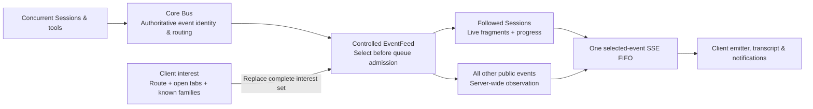

<p align="center">
  <a href="https://opencode.ai">
    <picture>
      <source srcset="packages/console/app/src/asset/logo-ornate-dark.svg" media="(prefers-color-scheme: dark)">
      <source srcset="packages/console/app/src/asset/logo-ornate-light.svg" media="(prefers-color-scheme: light)">
      
    </picture>
  </a>
</p>

<h1 align="center">OpenCode · bus-smart</h1>
<p align="center"><strong>More agents. More terminals. Less wasted work.</strong></p>
<p align="center">Session-aware event delivery for people pushing a shared OpenCode server hard.</p>

<p align="center">
  <a href="#the-numbers">The numbers</a> ·
  <a href="#how-it-works">The architecture</a> ·
  <a href="#try-it">Try it</a> ·
  <a href="#built-to-carry-not-to-fork-the-world">Upstream carry</a> ·
  <a href="/.design/bus-smart/index.md">Research &amp; evidence</a>
</p>

> **32× fewer streaming events per client. Roughly 78% less aggregate CPU time.**
> In our isolated, streaming-heavy eight-client benchmark—not a promise about every workload.
> [See the setup, results, and limits below.](#the-numbers)

**This is an independent, experimental downstream branch of [anomalyco/OpenCode](https://github.com/anomalyco/opencode), built against V2.** It is not an official OpenCode release or an OpenCode-team project. The feature is implemented, independently reviewed, and **off by default**. Standard upstream installers do not install these changes.

---

## Your terminal should follow your work

One shared server. A pile of terminals. Agents building, researching, calling tools, and spawning subagents across the machine.

That is a great way to work—until every client receives every Session’s live stream.

A token generated for one Session becomes queueing, delivery, parsing, event dispatch, and potentially reactive state updates in clients that will never display it. Multiply that by concurrent Sessions and open terminals, and the machine spends its effort distributing work nobody asked those clients to do.

**bus-smart cuts that amplification at the server, before the unwanted fragments enter client queues and parsers.**

Not by sampling tokens. Not by hiding them after they arrive. Not by putting another content-aware proxy in the middle.

By knowing which Sessions a client is following—and sending their live stream where it belongs.

### The important breakthrough: a project is not a Session

Our first design filtered by **Location**: a directory plus its optional workspace identity. That helps when clients work in different places. But ten agents working in the _same repository_ still send their fragments to every client interested in that Location.

The rebuilt design goes one level deeper:

**Follow Sessions for live detail. Keep the wider server observable.**

That means your open tabs and known Session families keep their streaming updates, including hidden tabs and subagents. Other Sessions’ token/progress floods no longer have to reach your client. Execution, permission, form, and other public events remain broadly available so the optimization does not quietly trade away notification eligibility.

## The numbers

The benchmark used **eight separate client processes**, **32 Sessions in one Location**, and **one followed Session per client**. It exercised a real Bus, Server HTTP routes, generated Promise clients, and Solid data—not just a hand-written filter in a loop.

Each of 300 measured rounds published all five gated event types for every Session, plus public RPC traffic. Full-value terminal text followed. Three repetitions produced:

| Delivery mode                | Each streaming type, per client | Aggregate server + client CPU |
| ---------------------------- | ------------------------------: | ----------------------------: |
| Legacy global feed           |                    9,600 events |                 12.19–12.86 s |
| Location-scoped feed         |                    9,600 events |                 11.57–12.95 s |
| **Session-scoped streaming** |                  **300 events** |               **2.70–2.93 s** |

**Exactly 1/32 of each streaming type reached each focused client.** The median aggregate CPU reduction was approximately **78%**. Every mode still delivered all measured RPC and terminal-text events.

The control matters: when every client followed all 32 Sessions, the traffic reduction disappeared. It should. If you actually need everybody’s stream, the server sends it.

> [!IMPORTANT]
> These are synthetic results, not a pristine-upstream comparison or live-user validation. All modes used the then-current client projection, and the measurements predate later read-repair corrections. The measured interval excluded Session creation, terminal-execution, and failure events, so it does not establish final metadata/repair costs. Large completed payloads and chatty plugins can dominate the remaining work.

The [full measurement record](/.design/bus-smart/implementation-report1.gpt6a.md#isolated-many-process-measurement-indexed-before-encode-precheck) includes workload details, CPU, bytes, event-loop delay, request counts, controls, and limitations. The [final closeout](/.design/bus-smart/closeout1.gpt6a.md) distinguishes that evidence from the current candidate’s verification.

## How it works



### A small, explicit filtering contract

The `session-streaming` profile gates exactly five native event types by authoritative Bus Session ID:

| Followed-Session live events | What they carry                |
| ---------------------------- | ------------------------------ |
| `session.text.delta`         | Text fragments                 |
| `session.reasoning.delta`    | Reasoning fragments            |
| `session.tool.input.delta`   | Tool-input fragments           |
| `session.tool.progress`      | Running-tool progress metadata |
| `session.compaction.delta`   | Compaction summary fragments   |

**All other public events remain server-wide in this profile.** That includes structural and completed-value events, execution and inbox lifecycle, permission/form events, and public plugin RPC events. Internal events stay internal.

This is intentionally not a general-purpose filter language. The narrow contract is easier to understand, test, and carry forward—and it attacks the repeated work that Location filtering misses.

The existing `location` profile remains available for clients intentionally requesting that scope. Existing controlled requests that omit a profile keep their old semantics. Legacy `event.subscribe()` stays a global feed.

### One stream. One order. Interests that can change.

A controlled connection starts pending. The client receives a ready frame, checks supported profiles, and installs its complete interest set before the server activates delivery. Interest changes use a serialized replacement on the same connection—not a collection of per-tab sockets to merge.

- **One bounded FIFO per controlled subscriber.** An event matching multiple interests is still admitted once.
- **One in-flight interest PUT.** Rapid changes coalesce; removals have a short grace window.
- **Generation-fenced recovery.** An uncertain update abandons its subscription identity rather than blindly retrying against stale state.
- **Indexed Session recipients.** Hot streaming events visit their focused followers instead of scanning every focused client.
- **No-recipient encoding avoidance.** When no focused follower exists and there are no active Location-profile subscribers, the server can skip encoding the streaming event altogether.

That last optimization is separate from client filtering: if _any_ client follows a Session, its events still need encoding. The big win is not making every _other_ client receive and process them.

### Sharing and filtering cooperate

Upstream **SharedEvents** already shares a lazy legacy connection among readers of one client instance. We keep it.

Sharing avoids duplicate connections inside one client. Filtering avoids irrelevant traffic across many clients. They solve different problems, and neither needs to replace the other.

The TUI connection layer owns reconnection. SharedEvents does not hide another retry loop underneath it. Compatibility fallback joins the shared legacy feed; a newer server can be probed on a subsequent connection attempt. Unsupported profiles and fallback reasons are visible rather than masquerading as successful filtering.

## Fast is good. Correct is non-negotiable.

The interesting engineering is not the five-event predicate. It is keeping the rest of the system honest when interest changes, a Session moves, a response arrives late, or the connection disappears.

The implementation and independent reviews exercised those seams—and found real bugs worth fixing:

- **Adoption before observation.** Both visible transcript reads and hidden-tab prefetch pass through one TUI-owned operation that refreshes desired interest and waits for installation.
- **Move-aware delivery.** Exact Session following survives placement changes. The retained Location profile uses awaited move observation to install destination coverage before causally later publication.
- **Stale snapshots cannot casually win.** Explicit transcript reads have identity and mutation tracking; superseded results do not overwrite newer terminal state.
- **Repair remains owed until it succeeds.** Terminal repair survives discarded reads, with bounded scan jobs and one backoff-controlled trailing timer—not a tight loop seeking a quiet Session.
- **Loaded history means history, not just a count.** Reconnect repair preserves the oldest surviving loaded boundary even when new messages arrived while disconnected.
- **Canonical acknowledgment beats optimistic rollback.** A confirmed server input survives a late failure of its original POST.
- **Lifetime boundaries matter.** Late point reads cannot resurrect evicted/deleted rows or write after disposal. Definitive Session absence ends the automatic repair episode without pruning cached state or preventing explicit retry.

All findings raised during the independent reviews were closed through corrective commits and rechecks. That is evidence of work done, not a claim that every possible race is solved.

### Verification, with receipts

| Verification                         | Recorded result                                                                 |
| ------------------------------------ | ------------------------------------------------------------------------------- |
| Final Client package suite           | **243 passed**, 11 skipped, 0 failed                                            |
| TUI package suite                    | **1,311 passed**, 4 skipped, 0 failed                                           |
| Final independent Client closure run | **109 passed**, 0 skipped, 0 failed—including all nine preserved reviewer cases |
| Affected package typechecks          | Passed; exact runs recorded in the reports                                      |

Two broader browser-data assertions remain baseline-confirmed failures and are **not** claimed green. The final review was a targeted closure check following earlier broader reviews, not a fresh certification of the whole repository.

Read the [standards/upstream-carry closure](/.design/bus-smart/code-review4-standards.gpt6a.md), [spec/correctness closure](/.design/bus-smart/code-review4-spec.gpt6a.md), and [verification summary](/.design/bus-smart/closeout1.gpt6a.md#verification-provenance).

## Try it

> [!NOTE]
> **The experiment is off by default.** You need this branch’s TUI and a server advertising `session-streaming` to get the optimization. An older server falls back to legacy delivery, not pretend filtering. The supporting Client read-repair fixes are not all gated by the experiment.

### Start from this checkout

Use the Bun version declared in [`package.json`](/package.json). From the repository root:

```sh
bun install

# Run this checkout's TUI with a private server from the same source.
bun run dev "$PWD" --standalone
```

The development script runs [`packages/cli/src/index.ts`](/packages/cli/src/index.ts) directly; no distribution build is required. `--standalone` avoids replacing the elected background service. **It isolates the server process, not your account’s configuration, persisted data, or filesystem access.**

Open **Experiments → Session-scoped streaming** and enable it. The toggle replaces the event attachment, not the server or the TUI’s entire data/provider tree.

### Use an intentionally configured shared server

To attach this checkout’s TUI to your installed V2 background service and live Sessions:

```sh
bun run dev:live /absolute/path/to/project
```

This script discovers that service and supplies its local credential. It does **not** install the branch’s server changes. If that server lacks the profile, expect legacy fallback. Prefer this explicit live attachment over an implicit managed-service connection when comparing worktree clients; implicit version negotiation may replace a service.

### Check that it is actually working

In the developer **Server** panel, inspect:

- **Event feed** (`controlled` versus `legacy`) and **Installed** Location/Session counts;
- **Feed fallback** and any feed error;
- events per second, cumulative received events, and reconnects;
- paused retry state, if a requested interest was rejected.

Open a Session in another client and stream there. Then open it in this client too. The difference should follow your declared interest—not whether the Sessions happen to share a directory. Use the counters to distinguish real filtering from a merely quiet terminal.

## Built to carry, not to fork the world

This branch is meant to live on top of upstream OpenCode V2. **Carryability is part of the design.**

| Domain                                                        | Responsibility                                                                                                         |
| ------------------------------------------------------------- | ---------------------------------------------------------------------------------------------------------------------- |
| [Core](/packages/core/src/bus.ts)                             | Authoritative event identity/routing and the existing move publication correction                                      |
| [Protocol](/packages/protocol/src/groups/event.ts)            | Small additive profile/capability contract and canonical event classification                                          |
| [Server](/packages/server/src/controlled-event-feed.ts)       | Controlled admission, recipient index, bounded queues and cleanup                                                      |
| [Client](/packages/client/src/solid/controlled-event-feed.ts) | Negotiation, interest generations and compatibility; [connection](/packages/client/src/solid/connection.ts) owns retry |
| [TUI](/packages/tui/src/context/event-interest.tsx)           | Product interest from routes, tabs and known families                                                                  |

We preserve upstream SharedEvents, public legacy interfaces, and the existing module structure. Generated Promise/Effect clients come from the Protocol contract, not hand-maintained parallel APIs. No proxy, clustering layer, arbitrary filter DSL, or new durable replay system is required.

The largest carry obligation is the Client transcript-repair code and its exhaustive mutation classifier. That cost is documented, tested, and kept with the existing owner—not waved away because the transport patch is small.

For changes, follow [`CONTRIBUTING.md`](/CONTRIBUTING.md) and [`AGENTS.md`](/AGENTS.md). Base upstream work on **`v2`**. Run tests and `bun typecheck` from the affected package; regenerate clients from `packages/client` after public Protocol/HttpApi changes.

## What this does not promise

- **No historical live-prefix replay.** Opening a Session midway through a part can miss its earlier ephemeral fragments. Canonical completed state and live streaming continuity are different guarantees.
- **No exactly-once delivery across disconnects.** The feed is volatile; a bounded slow subscriber can fail and reconnect.
- **No free full firehose.** Following every Session eliminates the filtering benefit. Large completed payloads, RPC floods, and metadata/repair reads still cost work.
- **No authorization through interest.** Scoping is an optimization, not a security boundary.
- **No universal client conversion.** The full TUI is the first adopter; this is not automatic filtering for every app, mini, CLI, SDK, or plugin consumer.
- **No graduation yet.** Representative metadata/repair loads, larger mixed-client stress, remaining lifecycle/move cases, and live-user foreground/CPU acceptance are still open.

## Go deep

There is a substantial design and evidence trail behind this branch. Start with the argument, follow it to the implementation, then inspect the measurements and review counterexamples.

| Read                                                                             | Why                                                                  |
| -------------------------------------------------------------------------------- | -------------------------------------------------------------------- |
| [Final closeout](/.design/bus-smart/closeout1.gpt6a.md)                          | Current status, verification provenance and remaining gates          |
| [draft1 architecture](/.design/bus-smart/draft1.gpt6a.md)                        | Why Session streaming beats Location-only filtering for this problem |
| [Implementation plan](/.design/bus-smart/implementation1.gpt6a.md)               | Ownership, small interfaces, indexing and carry tradeoffs            |
| [Execution and measurements](/.design/bus-smart/implementation-report1.gpt6a.md) | What was built, what was run, and what the numbers actually mean     |
| [Complete research/review index](/.design/bus-smart/index.md)                    | Earlier alternatives, independent findings, corrections and closure  |

---

**Built on [OpenCode](https://github.com/anomalyco/opencode), the open-source AI coding agent.** For the upstream product, see the [V2 documentation](https://opencode.ai/v2/docs/), [CLI guide](https://opencode.ai/v2/docs/cli), [client guide](https://opencode.ai/v2/docs/build/client), and [community](https://opencode.ai/discord). This branch retains the repository’s [MIT license](/LICENSE).

**The ambition is simple: scale the work you can run—not the noise every client has to process.**
