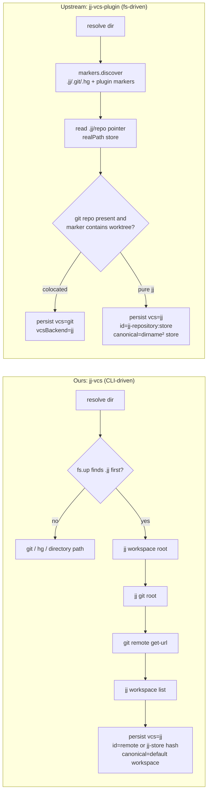

# Jujutsu VCS support: our WIP vs upstream `jj-vcs-plugin`

## Situation

We keep getting burned by opencode not recognizing the project root. Our daily
directories are jj workspaces: this very repo (`~/src/opencode-jj-vcs`) is a
secondary workspace whose `.jj/repo` is a pointer into
`~/archive/anomalyco/opencode/.jj/repo`, and `~/ado` lives inside the colocated
jj repo at `~/archive/doc`. The installed `opencode2` (our `working` build,
currently stopped, `0.0.0-local-202609011923`) has no jj knowledge at all:
`Project.resolve` only walks `.git`/`.hg`, so a workspace directory resolves to
a throwaway `directory:` project — no repo identity, no shared canonical root,
no VCS features. That blocks getting jj-vcs into the `~/ado/patches.md`
`working` stack, because the feature is worthless if the root isn't even
recognized.

There are now two implementations of jj support in flight:

- **Ours**: the `jj-vcs` bookmark, 12 commits by rektide, base
  `c29968bf0850` (~3 weeks old), tip `ca1d2bb5606e`
  `feat(project): select copy strategy from VCS`, plus an empty working `@`.
- **Upstream**: Shoubhit Dash's line on [anomalyco/opencode](https://github.com/anomalyco/opencode),
  visible as the [`jj-vcs-plugin` branch](https://github.com/anomalyco/opencode/commits/jj-vcs-plugin)
  (tip `cc7d4ebb`, base `0f7a76eff031`, ~6 days old). Its history carries the
  original jj-vcs commits `bee852b5cf82` *feat(core): add jujutsu vcs plugin*
  and `46465000a0e0` *fix(core): harden jujutsu repository integration*, plus
  the declarative-markers PR `4eaf533cd03c` (#45192) and the jj adoption
  refactor `cc7d4ebb`. **None of it is merged into `v2@origin` or `dev@origin`
  as of 2026-09-02.** Adjacent upstream branches (`nxl/vcs-plugin-api`,
  `vcs-branch-metadata`, `fix-vcs-diffs`) show this is one piece of an active
  VCS-plugin initiative.

Both stacks share the merge-base `c29968bf0850`; ours grew straight up from it,
upstream's jj commits sit on newer v2 history. Neither is based on the current
`v2@origin` tip (`8d4ef0162181`, hours old), so whichever we take needs
freshening for the `~/ado/patches.md` rebuild process.

Research prompt for follow-ups: *"How do the local jj-vcs stack and anomalyco's
jj-vcs-plugin branch each make Project.resolve recognize Jujutsu repositories
and workspaces, and what would integrating one (or both) into the v2-based
working stack cost?"*

## The comparison

Rows are concerns; cells are each implementation's answer. "Ours" = `jj-vcs`
@ `ca1d2bb5606e`. "Upstream" = the jj line ending at `jj-vcs-plugin` @
`cc7d4ebb` (the fs-only discovery behavior comes from `bee852`/`46465000`;
the declarative-marker shape is the `4eaf533c`+`cc7d4ebb` refactor of the
same semantics).

| Concern | Ours (`jj-vcs`) | Upstream (`jj-vcs-plugin`) |
| --- | --- | --- |
| **Recognizing project root (the core bug)** | Fixed for jj repos, colocated repos, and secondary workspaces. `Project.root` walks `.jj` first, and `jjDiscover` in [project.ts](/packages/core/src/project.ts) walks up for `.jj`, then shells out to `jj workspace root` / `jj git root` to map the directory to its workspace and backing store. A workspace like this repo resolves to a real project with repo-wide identity. | Fixed the same scenarios, purely by filesystem reads. `jjDiscover` walks up for `.jj`, reads the `.jj/repo` pointer (file for secondary workspaces, dir for the main one), and resolves `realPath`s — no jj binary needed ([project/jj.ts](https://github.com/anomalyco/opencode/blob/jj-vcs-plugin/packages/core/src/project/jj.ts)). Both directions are covered by live tests (`jj`-present and pointer-only). |
| **Discovery mechanism & cost** | Subprocess-heavy: every resolve in a jj repo runs 3–4 `jj` commands (`workspace root`, `git root`, `workspace list`) plus a `git remote get-url`. Correct and self-describing, but detection now spawns processes on every project open/refresh. | Filesystem-only for the jj half (marker walk + pointer read + `realPath`); git subprocesses only where a `.git` actually exists. Detection stays cheap and side-effect free, which is why upstream feels comfortable calling it from permission-adjacent paths. |
| **Dependency on the `jj` binary** | Hard dependency: no `jj` on PATH → `jjDiscover` returns `undefined` → a pure-jj directory degrades to a git-less directory project (colocated still works as plain git). Failure is silent and looks exactly like the bug we're fixing. | No dependency for detection. A machine without jj still gets correct project identity, canonical root, and workspace grouping; only jj *operations* (status/diff) need the binary. This is strictly more robust for the server-side use case. |
| **Colocated jj + git semantics** | jj-first: colocated resolves as `vcs: {type: "jj"}` ("prefers jj semantics in colocated git repositories" test), the git identity is preserved via the remote-URL ID, and reclassification after `jj git init --colocate` is tested (`fix(project): refresh VCS classification on open`). Copy strategy becomes `jj_workspace`. | git-first: colocated stays a git project (`vcs.type: "git"`) with a parallel `vcsBackend: "jj"` string; the jj plugin gates on `vcsBackend` and the VCS service selects jj operations via `selection ?? location.vcsBackend ?? vcs?.type`. Project typing and copy strategy stay git; only the diff/status backend flips. This is the less opinionated, more additive design. |
| **Project identity & continuity** | Remote-derived whenever possible: probes `git --git-dir <store> remote get-url origin` even for standalone jj (jj always has a backing git store), so IDs share the exact namespace with git projects — colocating jj onto an existing git project keeps the same project ID, and sessions follow. Fallback: cached, then `jj-store:` hash. | Split namespaces: git projects keep remote/root-commit IDs; standalone jj projects get `jj-repository:<store>` hashes (shared across workspaces via the store path). Identity is stable per store but disjoint from git IDs; an upstream standalone-jj project that later gains a remote/colocation can change ID (cache keyed by store softens but doesn't unify this). Ours is the better continuity story; theirs is simpler and never runs git during jj-only discovery. |
| **Workspace membership & staleness** | Explicitly guarded: `jj workspace list` must contain the resolved directory, so a *forgotten* workspace (pointer still on disk, membership revoked) is rejected and degrades gracefully — there's a dedicated test ("does not accept a forgotten jj workspace as an active working copy"). Boundary fixes are two dedicated commits (`respect Jujutsu workspace boundaries`, `preserve canonical Jujutsu workspace`). | Pointer-file trust: if `.jj/repo` points somewhere, the workspace is believed. A stale pointer to a deleted store fails the `realPath`/`isDir` checks and degrades, but there's no membership cross-check against the main repo's workspace list (forgotten-but-not-cleaned workspaces would still resolve). Slightly more trusting, noticeably cheaper. |
| **Canonical root** | `jj workspace list` drives it: canonical = the `default` workspace root, else alphabetically-first. Canonical is whatever jj itself says, at the cost of a subprocess and requiring the binary. | Derived: `dirname(dirname(store))`. For colocated/main repos that's the repo root; for secondary workspaces the pointer resolves into the main repo's store area so canonical lands on the main root — matching jj's own semantics without asking jj. Clever and dependency-free, but it encodes jj's on-disk layout as an API contract; a future jj layout change breaks it silently. |
| **Nested repo precedence** | Inner wins: the marker walk stops at the first of `.jj`/`.git`/`.hg`, so a nested git repo inside a jj repo (or vice versa) resolves to the inner VCS; tested both ways ("keeps a nested git repository separate from its enclosing jj repository"). | Inner wins too, via explicit precedence rules in resolve (`FSUtil.contains(marker.directory, repo.worktree)` checks) with live tests for both directions ("prefers a nested Jujutsu repository over its parent Git repository" and the inverse). Functionally equivalent; upstream's rule-based version also handles plugin-declared markers (svn/pijul tests). |
| **Working-copy snapshot discipline** | None of our `jj` invocations pass `--ignore-working-copy`, so jj's default auto-snapshot can trigger from *detection and metadata* paths (resolve-time `workspace list`, label refresh). For an agent that edits files, detection mutating the jj working copy (`@` absorbing edits) is a real behavioral side effect — sometimes even desired, but implicit. | Metadata commands (`bookmark list`) pass `--ignore-working-copy`; only diff/status intentionally snapshot. Detection never touches repo state. This is the correct discipline and worth copying regardless of which stack we take. |
| **VCS adapter (status/diff/info)** | Richer jj surface: [`vcs/jj.ts`](/packages/core/src/vcs/jj.ts) reports conflicts (`conflicted_files` template), change ID + commit ID + local bookmarks + description + conflicted/empty flags on the working copy, and supports working vs review (trunk-based) diff modes, with directory-scoped paths (sessions opened in a subdirectory of a workspace get correctly scoped diffs). No bookmark listing API. | Leaner adapter as a plugin ([plugin/vcs/jj.ts](https://github.com/anomalyco/opencode/blob/jj-vcs-plugin/packages/core/src/plugin/vcs/jj.ts)): info/branches/status/diff with `bookmark list`, trunk detection (`trunk()` → `main` → `master`), patch chunking shared with git/hg. Has branches (we don't), lacks conflicts/labels/scoping (we do). Registered through `ctx.vcs` — the extensible path. |
| **Project copies subsystem** | The headline feature upstream lacks: a `jj_workspace` copy strategy (create/remove/list via `jj workspace add`/`forget`) alongside `git_worktree`, with `ProjectCopy.Metadata` persisted per directory (new migration `20260815031744`), schema/protocol/server surfaces, and TUI wiring. This is exactly our `~/src/<repo>-<variant>` workflow productized in-app. | jj projects get `strategy: undefined` — no copies for jj. Their design intent is that copies remain a git-worktree concept for now; jj users manage workspaces outside opencode. If we adopt upstream wholesale, we lose this entirely and would rebuild it on top of the plugin API. |
| **TUI / UX surface** | Working-copy labels in the sidebar footer (bookmark/change-ID), prompt move flow uses the active label, review of working-copy changes. jj feels present in the UI. | No TUI changes for jj (beyond a config-directories tweak in the original commit). UI-neutral; jj only shows up as a VCS backend. |
| **Extension architecture** | Hardcoded: `Project.Vcs` literals grow `"jj"`, selection logic switches on `vcs.type`, `.jj` added to marker arrays by hand. Adding svn/pijul later means touching all the same places. | Declarative markers: plugins declare `vcs: { id, markers: [...] }`, `ProjectMarkers` aggregates them (SDK built-ins + discovered + configured plugins), `Project.Vcs` becomes a validated open string, and `vcsBackend` is a string. Third-party VCS support with zero core changes (svn/pijul covered by tests in `4eaf533c`). This is clearly where upstream is going — our literal-based approach converges with it badly. |
| **Schema / protocol impact** | Additive and small: `Vcs` union + `"jj"`, `Current.vcs` (our base lacked it), `Directory.metadata`, project-copy schema additions; one client regen commit. Contained because our base predates upstream's schema churn. | Bigger conceptual shift: `ProjectVcs` becomes `string` (open union), `vcs.workspace: "jj"` literal replaced by `vcsBackend: string`, plus the whole `ProjectMarkers` service and plugin-loading-during-discovery machinery. More surface, but it deletes the per-VCS literal churn forever. |
| **Test coverage** | Focused live suite (skips without `jj` on PATH): pure-jj identity sharing across workspaces, colocated preference, reclassification on colocate-init, forgotten workspace, nested-git separation — plus 200+ lines of copy-strategy tests and 139 lines of adapter tests. Good coverage of *our* semantics. | Broader live suite including hg and both nested-precedence directions, plus marker-system tests that need no `jj` at all (svn/pijul plugins in temp dirs, nested-plugin-beats-parent-git). The detection layer is testable without any VCS binary — structurally better testability. |
| **Baseline freshness & merge status** | 12 commits on a 3-week-old base (`c29968bf`); not rebased onto current `v2@origin`; local change IDs are divergent against stale pushes on the `rektide` remote (`jj-vcs@rektide` hidden, ahead/behind 10) — needs a cleanup before it can be a clean feature workspace. | Authored on a ~6-day-old base (`0f7a76ef`), itself a jj-conflict-snapshot merge of the jj line into the markers PR; **unmerged into v2/dev**, actively iterated (3 sibling branches in the initiative). Risk: upstream may land a different final shape than the branch tip we port. |
| **Integration cost into `~/ado/patches.md` working stack** | High: rebase 12 intertwined commits across a heavily-churned [project.ts](/packages/core/src/project.ts) (upstream landed project-inventory/worktree changes in between), resolve the remote divergence, and then own permanent rebase friction against upstream's parallel jj work in every `working` rebuild. | Medium: the two original commits (`bee852`+`4646500`) are small, self-contained, and portable to the v2 tip with low conflict risk (they predate the markers refactor). The full branch adds the declarative-marker machinery — larger blast radius, and betting on an unmerged API. Either way we must re-apply our copies/adapter/TUI value on top. |

## How the two resolutions actually flow

## Recommendation

**Don't integrate the upstream branch wholesale, and don't finish ours as-is.
Split the concern: take upstream's detection, keep our product.**

1. **Unblock now** — port `bee852b5cf82` + `46465000a0e0` (detection, identity,
   precedence, tests; fs-only, no jj binary required) onto the current
   `v2@origin` tip as a fresh feature workspace for the `working` stack. That
   alone fixes "opencode doesn't recognize project root" in every directory we
   actually use, including this workspace and `~/archive/doc`, and it's the
   smallest, best-tested delta available.
2. **Layer our value on top as separate features** — the `jj_workspace` copy
   strategy + metadata, the jj adapter's conflicts/labels/scoping, and the TUI
   surface are ours alone. Redo them as commits on top of the ported detection,
   adopting upstream's `--ignore-working-copy` discipline while touching the
   adapter. Our jj-first colocated preference can be expressed on their
   substrate (drive selection off `vcsBackend`) or dropped if git-first grows on
   us — decide when wiring the copy strategy, not now.
3. **Track and adopt `jj-vcs-plugin` when it merges into v2** — declarative
   markers are clearly upstream's destination; keeping a parallel
   literal-based jj implementation in `working` would be permanent rebase
   friction in a process that freshens every feature onto the v2 tip for each
   rebuild. When it lands, rebase the detection port away (it becomes
   upstream's) and move the copies/adapter/TUI commits onto the plugin API.
4. **Hygiene before any of this** — the local `jj-vcs` stack's change IDs are
   divergent against stale `rektide`-remote pushes and it sits on a 3-week-old
   base; rebuild the feature workspace from the chosen commits rather than
   rebasing the existing bookmark, so the `~/ado/patches.md` lineage rules
   (one feature, own commits, declared base) hold from day one.

The direct-integration alternative (take `jj-vcs-plugin` as-is) buys the future
architecture today at the cost of an unmerged-API bet and losing the copies
feature entirely — reasonable only if we're willing to re-scope this effort to
"detection only" and defer the workspace-copy workflow.

## Verification checklist (for whatever lands)

- Opening opencode in `~/src/opencode-jj-vcs` (secondary workspace, pointer
  `.jj/repo`) resolves to the anomalyco/opencode project with the correct
  canonical root — not a `directory:` project.
- Opening `~/ado` resolves to the colocated `~/archive/doc` project with
  git-remote (or cached) identity shared with a plain-git open of the same
  repo.
- `jj git init --colocate` inside an already-open git project reclassifies
  without changing the project ID.
- A forgotten workspace (`jj workspace forget`) no longer claims project
  identity.
- `jj` missing from PATH still yields correct project identity (upstream
  behavior; only operations degrade).

## Cross-references

- [`/AGENTS.md`](/AGENTS.md) — repo conventions; V2 package boundaries that any
  port must respect (`Core`/`Schema`/`Protocol`/`Server` direction).
- [anomalyco/opencode `jj-vcs-plugin`](https://github.com/anomalyco/opencode/commits/jj-vcs-plugin) —
  upstream branch compared here; `4eaf533c` (#45192) is the declarative-markers
  PR to watch for merge into `dev`/`v2`.
- [`packages/core/src/project.ts`](/packages/core/src/project.ts) and
  [`packages/core/src/vcs/jj.ts`](/packages/core/src/vcs/jj.ts) — the two files
  where both stacks' semantics concentrate; expect merge friction here on any
  freshen.
- `~/ado/patches.md` (in the `~/archive/doc` jj repo, not in this repo) — the
  `working` stack composition rules and lineage declaration this
  recommendation is designed to slot into.
- `~/src/opencode-jj-vcs` itself is the living reproduction case: a secondary
  jj workspace via `.jj/repo` pointer; use it as the smoke test directory.
- [`jj-vcs2.glm53.md`](jj-vcs2.glm53.md) — revision 2 of this comparison
  (2026-09-02): adds a stance column, integrates the danger catalog (the
  standalone `upstream-danger0.glm53.md` was dropped and folded in), and
  reflects the filesystem-only resolve, snapshot discipline, and
  bookmark+distance labels that landed the same day. Supersedes this
  document.
- [`jj-vcs-user-impact.glm53.md`](jj-vcs-user-impact.glm53.md) — plain-terms
  analysis of our copies/labels/snapshot surface and what switching to
  upstream costs per area; verdicts feed the recommendation above (copies
  rebuild, labels defer, snapshot drop).
